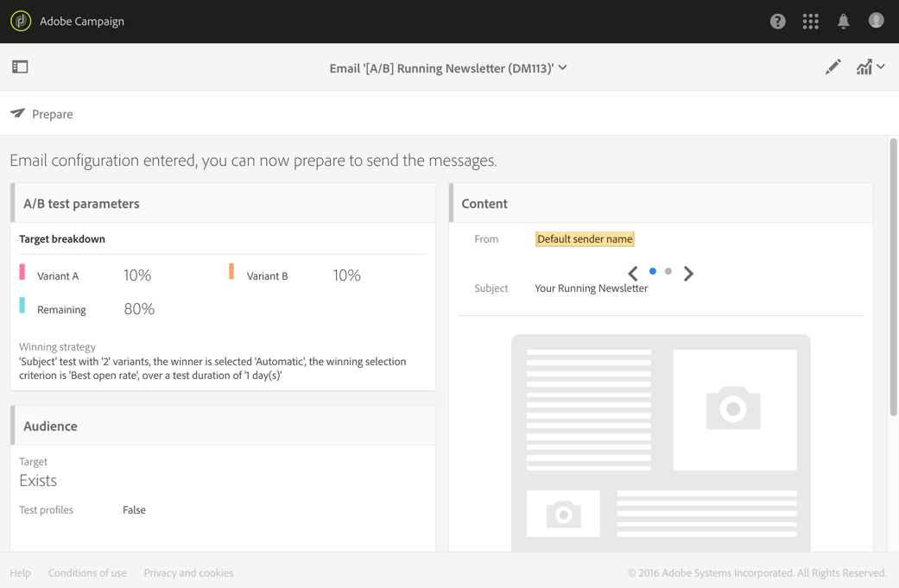

# Designing an A/B test email{#designing-an-a-b-test-email}

La funcionalidad de prueba A/B de Adobe Campaign permite definir dos o tres variantes de correo electrónico. Cada variante se envía a los ejemplos de población para determinar cuál tiene el mejor resultado. Una vez determinado, la variante ganadora se envía a la población restante.

Puede elegir variar el contenido, asunto o remitente del correo electrónico.

>[!NOTE]
>
>No es posible realizar pruebas A/B en correos electrónicos creados en Adobe Experience Manager.

## Creating an A/B test email {#creating-an-a-b-test-email}

Se puede crear una prueba A/B con el asistente para creación de correo electrónico estándar, al que se agrega un paso de configuración de prueba A/B. Creating a standard email is detailed in the [Creating an email](../../channels/using/creating-an-email.md) section.

En el contexto específico de una prueba A/B:

1. Cree un nuevo correo electrónico a partir de una de las tres plantillas A/B específicas, según el elemento que desee variar:

   * Prueba A/B en remitente
   * Prueba A/B sobre contenido
   * Prueba A/B sobre el asunto
   

   >[!NOTE]
   >
   >Las plantillas de prueba A/B están ocultas de forma predeterminada. Check the A/B test box on the left side ( **[!UICONTROL Filter]** lateral panel) to display them.

1. Defina las propiedades generales y la audiencia objetivo del correo electrónico, como para un correo electrónico estándar. Refer to the [Creating audiences](../../audiences/using/creating-audiences.md) section.
1. En el cuarto paso del asistente para creación, defina los parámetros de prueba A/B:

   * **[!UICONTROL Number of variants]**: Puede elegir utilizar dos o tres variantes. Si elige tres variantes, esta opción no se puede modificar después de confirmar este paso en el asistente.
   * **[!UICONTROL Winning strategy]**: Seleccione el criterio que se utilizará para determinar la variante ganadora.
   * **[!UICONTROL Target breakdown]**: Elija qué porcentaje del objetivo recibirá cada variante. El porcentaje restante recibirá la variante ganadora una vez que se haya determinado. Los perfiles de destino se seleccionan de forma aleatoria.
   * **[!UICONTROL Winner sending method]**: Elija si desea que la variante ganadora se envíe automáticamente una vez que se haya determinado o si desea confirmar manualmente el envío a la población restante.
   * **[!UICONTROL Test duration]**: Especifique la duración de la prueba. La variante ganadora se determina automáticamente después de esta duración. Puede elegir manualmente la variante ganadora antes del final de la prueba desde el panel de correo electrónico.

      La prueba debe tener al menos una hora para que todos los datos de seguimiento se recopilen y se tengan en cuenta correctamente para seleccionar la variante ganadora.
   

1. Una vez definidas los parámetros de la prueba A/B, pase al paso siguiente del asistente y defina el contenido de correo electrónico. Según la plantilla elegida, puede definir varios temas, varios nombres de remitente o varios contenidos diferentes. Utilice el carrusel para desplazarse entre las distintas variantes del elemento. For more information, consult the [content editor](../../designing/using/about-email-content-design.md) section.

   

1. Confirme la creación del correo electrónico. Se mostrará el tablero de correo electrónico.
1. Programe el envío. La fecha definida indica el inicio de la prueba A/B.
1. Check the A/B test parameters displayed in the **[!UICONTROL A/B test parameters]** block. Puede modificarlas hasta que confirme el envío de la prueba (paso 9) seleccionando el bloque.

   

1. Prepare el envío de correo electrónico para analizar el objetivo y el número de mensajes que enviar. Consult the [Preparing the send](../../sending/using/preparing-the-send.md) section.
1. Antes de enviar la prueba A/B, compruebe su correo electrónico enviando pruebas.
1. Una vez que finalice la preparación, confirme el envío de la prueba. Una vez confirmados, no se pueden modificar los parámetros de prueba A/B.

   The A/B test starts on the date defined in the **[!UICONTROL Schedule]**.You can track its progress using the **[!UICONTROL A/B test]** and **[!UICONTROL Deployment]** blocks.

   Puede seleccionar manualmente la variante ganadora en cualquier momento si desea reducir la duración de la prueba.

   Once testing has finished, a summary table is displayed in the **[!UICONTROL A/B Test]** block and this allows you to view the various indicators for the different variants that were tested.

1. If you have selected **[!UICONTROL Send after confirmation]** as the sending method, you have to manually select the winning variant to start sending it to the remaining population. If you have selected **[!UICONTROL Automatic]**, the winning variant is automatically sent to the remaining population as soon as it has been determined by the system.

   >[!NOTE]
   >
   >Si hay un empate, la variante ganadora debe seleccionarse manualmente. Puede notificar al creador de correo electrónico y a los modificadores que se ha elegido una variante o que debe seleccionarse. See [Adobe Campaign notifications](../../administration/using/sending-internal-notifications.md).

Ahora se ha definido y enviado su correo electrónico. Puede acceder a sus registros e informes para medir el éxito de la campaña.

**Tema relacionado**:

[Creación de](https://helpx.adobe.com/campaign/kt/acs/using/acs-create-email-from-homepage-feature-video-use.html) un vídeo de correo electrónico

## About A/B test indicators {#about-a-b-test-indicators}

En el panel de correo electrónico, hay varios indicadores disponibles para ayudarle a medir la prueba A/B: número de clics, aperturas, devoluciones, etc.

Note that the **[!UICONTROL Estimated recipient reactivity]** indicator is a rate comparing the number of recipients who clicked against the number of recipients who opened the email. Por ejemplo, si 10 destinatarios abrieron el correo electrónico y 5 destinatarios en él. La tasa de reactividad es 50%.
