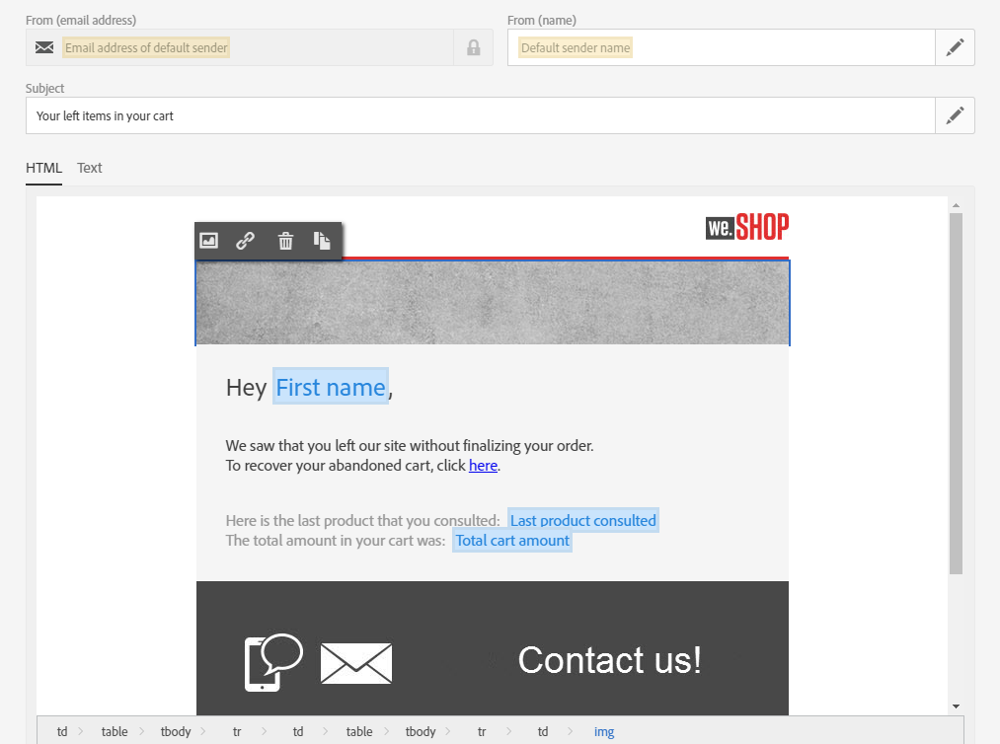
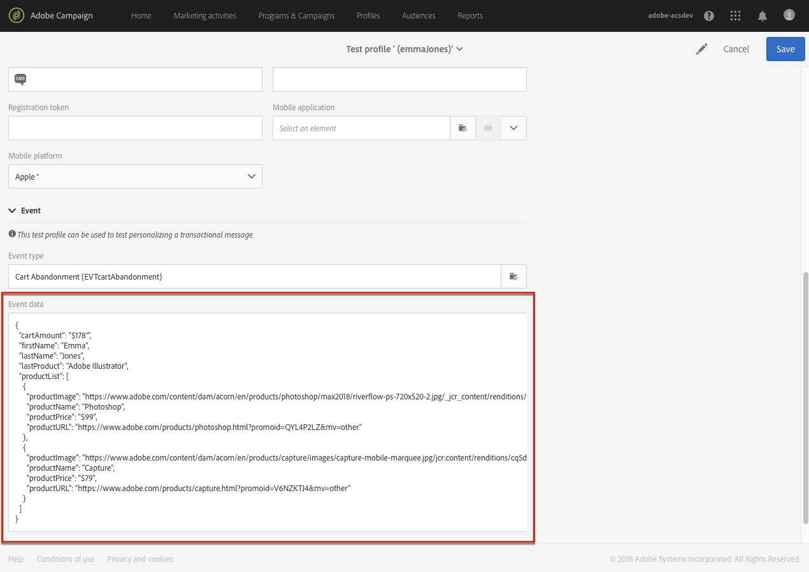

# Edición de un mensaje transaccional {#editing-transactional-message}

Una vez creado y publicado un evento<!--(the cart abandonment example as explained in [this section](../../channels/using/getting-started-with-transactional-msg.md#transactional-messaging-operating-principle))-->, el mensaje transaccional correspondiente se crea automáticamente.

Los pasos para configurar y publicar el evento se presentan en la [Configuración de un evento transaccional](../../channels/using/configuring-transactional-event.md) y [Publicación de un evento transaccional](../../channels/using/publishing-transactional-event.md) sección.

A continuación se describen los pasos para acceder, editar y personalizar este mensaje.

>[!IMPORTANT]
>
>Solo los usuarios con [Administration](../../administration/using/users-management.md#functional-administrators) La función puede acceder y editar mensajes transaccionales.

Una vez que el mensaje esté listo, se puede probar y publicar. Consulte [Prueba de un mensaje transaccional](../../channels/using/testing-transactional-message.md) y [Ciclo de vida del mensaje transaccional](../../channels/using/publishing-transactional-message.md).

## Acceso a mensajes transaccionales {#accessing-transactional-messages}

Para acceder al mensaje transaccional que ha creado:

1. Haga clic en **Adobe** en la esquina superior izquierda.
1. Seleccionar **[!UICONTROL Marketing plans]** > **[!UICONTROL Transactional messages]** > **[!UICONTROL Transactional messages]**.

   

1. Haga clic en el mensaje de su elección para editarlo.

   

También puede acceder directamente a un mensaje transaccional a través del vínculo ubicado en el área del lado izquierdo de la pantalla de configuración de evento correspondiente. Consulte [Previsualización y publicación de un evento](../../channels/using/publishing-transactional-event.md#previewing-and-publishing-the-event)

## Personalizar un mensaje transaccional {#personalizing-a-transactional-message}

Para editar y personalizar un mensaje transaccional, siga los pasos a continuación.

>[!NOTE]
>
>En esta sección se describe cómo editar una **basado en eventos** mensaje transaccional. El **basado en perfiles** se detallan las características específicas del mensaje transaccional [abajo](#profile-transactional-message-specificities).
>
>Los pasos de configuración para crear un mensaje transaccional basado en eventos se presentan en [esta sección](../../channels/using/configuring-transactional-event.md#event-based-transactional-messages).

Por ejemplo, desea enviar una notificación a los usuarios del sitio web que han agregado productos al carro de compras y abandonan el sitio sin comprar. Este ejemplo se presenta en la [Principio operativo de mensajería transaccional](../../channels/using/getting-started-with-transactional-msg.md#transactional-messaging-operating-principle) sección.

1. Haga clic en el bloque **[!UICONTROL Content]** para modificar el asunto y el contenido del mensaje. Para este ejemplo, seleccione cualquier plantilla que contenga imágenes y texto. Para obtener más información sobre las plantillas de contenido de correo electrónico, consulte [Diseño de correos electrónicos con plantillas](../../designing/using/using-reusable-content.md#designing-templates).

   

1. Añada un asunto y edite el contenido del mensaje para adaptarlo a sus necesidades.

   >[!NOTE]
   >
   >El vínculo al carro de compras abandonado es un vínculo a una dirección URL externa que redirecciona a la persona al carro de compras. Este parámetro no se administra en Adobe Campaign.

1. En este ejemplo, desea añadir tres campos que definió al [crear el evento](../../channels/using/configuring-transactional-event.md): nombre, último producto consultado, cantidad total del carro de compras. Para ello, [inserte un campo de personalización](../../designing/using/personalization.md#inserting-a-personalization-field) en el contenido del mensaje.

1. Vaya a esos campos seleccionando **[!UICONTROL Context]** > **[!UICONTROL Real-time event]** > **[!UICONTROL Event context]**.

   

1. También puede enriquecer el contenido del mensaje. Para ello, añada campos de la tabla que vinculó a la configuración de evento (consulte [Enriquecimiento del evento](../../channels/using/configuring-transactional-event.md#enriching-the-transactional-message-content)). En este ejemplo, seleccione **[!UICONTROL Title (salutation)]** del campo **[!UICONTROL Profile]** tabla a través de **[!UICONTROL Context]** > **[!UICONTROL Real-time event]** > **[!UICONTROL Event context]**.

   

1. Inserte todos los campos necesarios.

   

1. Para obtener una vista previa del mensaje, seleccione el perfil que ha definido para este evento.

   Los pasos para obtener una vista previa de un mensaje se detallan en la sección [Vista previa de mensajes](../../sending/using/previewing-messages.md).

   

   Puede comprobar que los campos de personalización coinciden con la información introducida en el perfil de prueba. Para obtener más información, consulte [Definición de un perfil de prueba específico](../../channels/using/testing-transactional-message.md#defining-specific-test-profile).

<!--## Using product listings in a transactional message {#using-product-listings-in-a-transactional-message}

When editing the content of a transactional email, you can create product listings referencing one or more data collections. For example, in a cart abandonment email, you can include a list of all products that were in the users' carts when they left your website, with an image, the price, and a link to each product.

>[!IMPORTANT]
>
>Product listings are only available for the email channel, when editing transactional email content through the [Email Designer](../../designing/using/designing-content-in-adobe-campaign.md#email-designer-interface) interface.

To add a list of abandoned products in a transactional message, follow the steps below.

You can also watch [this set of videos](https://experienceleague.adobe.com/docs/campaign-standard-learn/tutorials/designing-content/product-listings-in-transactional-email.html#configure-product-listings-in-transactional-emails) explaining the steps that are required to configure product listings in a transactional email.

>[!NOTE]
>
>Adobe Campaign does not support nested product listings, meaning that you cannot include a product listing inside another one.

### Defining a product listing {#defining-a-product-listing}

Before being able to use a product listing in a transactional message, you need to define at the event level the list of products and the fields for each product of the list you want to display. For more on this, see [Defining data collections](../../channels/using/configuring-transactional-event.md#defining-data-collections).

1. In the transactional message, click the **[!UICONTROL Content]** block to modify the email content.
1. Drag and drop a structure component to the workspace. For more on this, see [Defining the email structure](../../designing/using/designing-from-scratch.md#defining-the-email-structure).

   For example, select a one-column structure component and add a text component, an image component and a button component. For more on this, see [Using content components](../../designing/using/designing-from-scratch.md#about-content-components).

1. Select the structure component you just created and click the **[!UICONTROL Enable product listing]** icon from the contextual toolbar.

   

   The structure component is highlighted with an orange frame and the **[!UICONTROL Product listing]** settings are displayed in the left palette.

   

1. Select how the elements of the collection will be displayed:

    * **[!UICONTROL Row]**: horizontally, meaning each element on one row under the other.
    * **[!UICONTROL Column]**: vertically, meaning each element next to the other on the same row.

   >[!NOTE]
   >
   >The **[!UICONTROL Column]** option is only available when using a multicolumn structure component ( **[!UICONTROL 2:2 column]**, **[!UICONTROL 3:3 column]** and **[!UICONTROL 4:4 column]** ). When editing the product listing, only fill in the first column: the other columns will not be taken into account. For more on selecting structure components, see [Defining the email structure](../../designing/using/designing-from-scratch.md#defining-the-email-structure).

1. Select the data collection you created when configuring the event related to the transactional message. You can find it under the **[!UICONTROL Context]** > **[!UICONTROL Real-time event]** > **[!UICONTROL Event context]** node.

   

   For more on configuring the event, see [Defining data collections](../../channels/using/configuring-transactional-event.md#defining-data-collections).

1. Use the **[!UICONTROL First item]** drop-down list to select which element will start the list displayed in the email.

   For example, if you select 2, the first item of the collection will not be displayed in the email. The product listing will start on the second item.

1. Select the maximum number of items to display in the list.

   >[!NOTE]
   >
   >If you want the elements of your list to be displayed vertically ( **[!UICONTROL Column]** ), the maximum number of items is limited according to the selected structure component (2, 3 or 4 columns). For more on selecting structure components, see [Editing the email structure](../../designing/using/designing-from-scratch.md#defining-the-email-structure).

### Populating the product listing {#populating-the-product-listing}

To display a list of products coming from the event linked to the transactional email, follow the steps below.

For more on creating a collection and related fields when configuring the event, see [Defining data collections](../../channels/using/configuring-transactional-event.md#defining-data-collections).

1. Select the image component you inserted, select **[!UICONTROL Enable personalization]** and click the pencil in the Settings pane.

   

1. Select **[!UICONTROL Add personalization field]** in the **[!UICONTROL Image source URL]** window that opens.

   From the **[!UICONTROL Context]** > **[!UICONTROL Real-time event]** > **[!UICONTROL Event context]** node, open the node corresponding to the collection that you created (here **[!UICONTROL Product list]** ) and select the image field that you defined (here **[!UICONTROL Product image]** ). Click **[!UICONTROL Save]**.

   

   The personalization field that you selected is now displayed in the Settings pane.

1. At the desired position, select **[!UICONTROL Insert personalization field]** from the contextual toolbar.

   

1. From the **[!UICONTROL Context]** > **[!UICONTROL Real-time event]** > **[!UICONTROL Event context]** node, open the node corresponding to the collection that you created (here **[!UICONTROL Product list]** ) and select the field that you created (here **[!UICONTROL Product name]** ). Click **[!UICONTROL Confirm]**.

   

   The personalization field that you selected is now displayed at the desired position in the email content.

1. Proceed similarly to insert the price.
1. Select some text and select **[!UICONTROL Insert link]** from the contextual toolbar.

   

1. Select **[!UICONTROL Add personalization field]** in the **[!UICONTROL Insert link]** window that opens.

   From the **[!UICONTROL Context]** > **[!UICONTROL Real-time event]** > **[!UICONTROL Event context]** node, open the node corresponding to the collection that you created (here **[!UICONTROL Product list]** ) and select the URL field that you created (here **[!UICONTROL Product URL]** ). Click **[!UICONTROL Save]**.

   >[!IMPORTANT]
   >
   >For security reasons, make sure you insert the personalization field inside a link starting with a proper static domain name.

   

   The personalization field that you selected is now displayed in the Settings pane.

1. Select the structure component on which the product listing is applied and select **[!UICONTROL Show fallback]** to define a default content.

   

1. Drag one or more content components and edit them as needed.

   

   The fallback content will be displayed if the collection is empty when the event is triggered, for example if a customer has nothing in his cart.

1. From the Settings pane, edit the styles for the product listing. For more on this, see [Managing email styles](../../designing/using/styles.md).
1. Preview the email using a test profile linked to the relevant transactional event and for which you defined collection data. For example, add the following information in the **[!UICONTROL Event data]** section for the test profile you want to use:

   

   For more on defining a test profile in a transactional message, see [this section](../../channels/using/testing-transactional-message.md#defining-specific-test-profile).-->

## Especificaciones de mensajes transaccionales basados en perfiles {#profile-transactional-message-specificities}

Puede enviar mensajes transaccionales en función de los perfiles de marketing del cliente, lo que le permite aprovechar toda la información de perfil para personalizar el contenido del mensaje, utilizar el vínculo de baja y aplicar reglas de tipología de marketing como [reglas de fatiga](../../sending/using/fatigue-rules.md).

* Para obtener más información sobre las diferencias entre los mensajes transaccionales basados en eventos y en perfiles, consulte [esta sección](../../channels/using/getting-started-with-transactional-msg.md#transactional-message-types).

* Los pasos de configuración para crear un mensaje transaccional basado en perfiles se detallan en [esta sección](../../channels/using/configuring-transactional-event.md#profile-based-transactional-messages).

Los pasos para crear, editar y personalizar un mensaje transaccional de perfil son principalmente los mismos que para un mensaje transaccional de evento.

Las diferencias se enumeran a continuación.

1. [Ir al mensaje transaccional](#accessing-transactional-messages) que se creó para editarlo.
1. En el mensaje transaccional, haga clic en la sección **[!UICONTROL Content]**. Además de las plantillas de correo electrónico transaccionales, también puede elegir cualquier plantilla de correo electrónico dirigida a **[!UICONTROL Profile]** recurso.

   

1. Seleccione la plantilla de correo electrónico predeterminada. Al igual que todos los correos electrónicos de marketing, incluye un **vínculo de baja**.

   

   Para obtener más información sobre las plantillas, consulte [esta sección](../../designing/using/using-reusable-content.md#content-templates).

1. Además, a diferencia de las configuraciones basadas en eventos en tiempo real, tiene lo siguiente **acceso directo a toda la información de perfil** para personalizar el mensaje. Puede añadir [campos de personalización](../../designing/using/personalization.md#inserting-a-personalization-field) como lo haría para cualquier otro correo electrónico de marketing estándar.

1. Guarde los cambios antes de publicar el mensaje. Para obtener más información, consulte [Publicación de un mensaje transaccional](../../channels/using/publishing-transactional-message.md#publishing-a-transactional-message).

<!--### Monitoring a profile transactional message delivery {#monitoring-a-profile-transactional-message-delivery}

Once the message is published and your site integration is done, you can monitor the delivery.

1. To view the message delivery log, click the icon at the bottom right of the **[!UICONTROL Deployment]** block.

1. Click the **[!UICONTROL Execution list]** tab.

   

1. Select the latest execution delivery.

   An **execution delivery** is a non-actionable and non-functional technical message created once a month for each transactional message, and each time a transactional message is edited and published again

1. Select the **[!UICONTROL Sending logs]** tab. In the **[!UICONTROL Status]** column, **[!UICONTROL Sent]** indicates that a profile has opted in.

   

1. Select the **[!UICONTROL Exclusions logs]** tab to view recipients who have been excluded from the message target, such as addresses on denylist.

   

>[!NOTE]
>
>For more information on accessing and using the logs, see [Monitoring a delivery](../../sending/using/monitoring-a-delivery.md).

For any profile that has opted out, the **[!UICONTROL Address on denylist]** typology rule excluded the corresponding recipient.

This rule is part of a specific typology that applies to all transactional messages based on the **[!UICONTROL Profile]** table.

**Related topics**:

* [Integrate the event triggering](../../channels/using/getting-started-with-transactional-msg.md#integrate-event-trigger)
* [About typologies and typology rules](../../sending/using/about-typology-rules.md)-->
