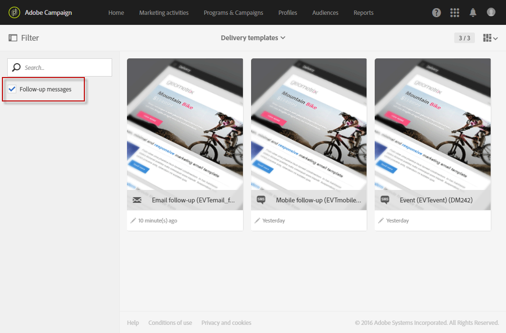

# Mensajes de seguimiento {#follow-up-messages}

Un mensaje de seguimiento es una plantilla de envío de marketing predefinida que se puede utilizar en un flujo de trabajo para enviar otra comunicación a los destinatarios de un mensaje transaccional específico.

Vamos a reutilizar el ejemplo descrito en la sección [Principio operativo de mensajería transaccional](../../channels/using/getting-started-with-transactional-msg.md#transactional-messaging-operating-principle): se envía un correo electrónico de abandono del carro de compras a los usuarios del sitio web que agregaron productos al carro de compras, pero que abandonaron el sitio sin comprar.

Desea enviar un recordatorio descriptivo a todos los clientes que recibieron la notificación de abandono del carro de compras, pero que no la abrieron después de tres días. Recibirán un mensaje de seguimiento basado en los mismos datos que se utilizaron en el primer correo electrónico enviado.

## Configuración de un evento para enviar un mensaje de seguimiento {#configuring-an-event-to-send-a-follow-up-message}

Para enviar un mensaje de seguimiento, primero debe configurar en consecuencia el evento correspondiente al mensaje transaccional ya recibido.

1. Utilice la misma configuración de evento que creó para enviar un mensaje transaccional de evento. Consulte [Configuración de un evento transaccional](../../channels/using/configuring-transactional-event.md).
1. Al configurar el evento, marque la casilla **[!UICONTROL Create follow-up delivery template for this event]** antes de publicar el evento.

   

1. [Previsualizar y publicar el evento](../../channels/using/publishing-transactional-event.md#previewing-and-publishing-the-event).

Una vez publicado el evento, se crea automáticamente un mensaje transaccional y una plantilla de envío de seguimiento vinculada al nuevo evento. Los pasos para enviar el mensaje de seguimiento se detallan en [esta sección](#sending-a-follow-up-message).

## Acceso a los mensajes de seguimiento {#accessing-the-follow-up-messages}

Para gestionar un evento en un flujo de trabajo, se requiere una plantilla de envíos. Sin embargo, al publicar el evento, el [mensaje transaccional](../../channels/using/editing-transactional-message.md) creado no se puede usar como plantilla. Por lo tanto, se debe crear una plantilla de envío de seguimiento específica diseñada para admitir este tipo de evento y utilizarla como plantilla en un flujo de trabajo.

Para acceder a esta plantilla:

1. Haga clic en el logotipo de **Adobe**, en la esquina superior izquierda.
1. Seleccione **[!UICONTROL Resources]** > **[!UICONTROL Templates]** > **[!UICONTROL Delivery templates]**.
1. Marque la casilla **[!UICONTROL Follow-up messages]** en el panel izquierdo.

   

Solo se muestran los mensajes de seguimiento.

>[!IMPORTANT]
>
>Solo los usuarios con el rol [Administration](../../administration/using/users-management.md#functional-administrators) pueden acceder y editar mensajes transaccionales.

## Envío de un mensaje de seguimiento {#sending-a-follow-up-message}

Una vez creada la plantilla de entrega de seguimiento, puede utilizarla en un flujo de trabajo para enviar un mensaje de seguimiento.

<!--You need to set up a workflow targeting the event corresponding to the transactional message that was already received.-->

1. Acceda a la lista de actividad de marketing y cree un nuevo flujo de trabajo.

   Consulte [Creación de un flujo de trabajo](../../automating/using/building-a-workflow.md#creating-a-workflow).

1. Arrastre y suelte una actividad **[!UICONTROL Scheduler]** en el flujo de trabajo y ábrala. Establezca la frecuencia de ejecución en una vez al día.

   La actividad Planificador se presenta en la sección [Planificador](../../automating/using/scheduler.md).

1. Arrastre y suelte una actividad **[!UICONTROL Query]** en el flujo de trabajo y ábrala.

   La actividad Consulta se presenta en la sección [Consulta](../../automating/using/query.md).

1. Para ejecutar la consulta en un recurso que no sea el de perfil, vaya a la ficha **[!UICONTROL Properties]** de la actividad y haga clic en la lista desplegable **[!UICONTROL Resource]**.

   

   >[!NOTE]
   >
   >De forma predeterminada, la actividad está preconfigurada para buscar perfiles.

1. Seleccione el evento al que desee destinarlo para que sólo tenga acceso a los datos de este evento.

   

1. Vaya a la pestaña **[!UICONTROL Target]** de la actividad y arrastre y suelte el elemento **[!UICONTROL Delivery logs (logs)]** de la paleta en el espacio de trabajo.

   

   Seleccione **[!UICONTROL Exists]** para dirigirse a todos los clientes que recibieron el correo electrónico.

   

1. Mueva el elemento **[!UICONTROL Tracking logs (tracking)]** de la paleta al espacio de trabajo y seleccione **[!UICONTROL Does not exist]** para dirigirse a todos los clientes que no hayan abierto el correo electrónico.

   

1. Arrastre y suelte el evento al que está dirigiendo (**Abandono del carro de compras** en este ejemplo) desde la paleta al área de trabajo. A continuación, defina una regla para dirigir todos los mensajes enviados hace tres días.

   

   Esto significa que todos los destinatarios que recibieron el mensaje transaccional tres días antes de la ejecución del flujo de trabajo y que aún no lo han abierto están segmentados.

   Haga clic en **[!UICONTROL Confirm]** para guardar la consulta.

1. Arrastre y suelte una actividad **Email delivery** en su flujo de trabajo.

   La actividad Entregar correo electrónico se presenta en la sección [Entregar correo electrónico](../../automating/using/email-delivery.md).

   

   También puede usar una actividad [envío de SMS](../../automating/using/sms-delivery.md) o [envío de notificaciones push](../../automating/using/push-notification-delivery.md). En este caso, asegúrese de seleccionar el canal **[!UICONTROL Mobile (SMS)]** o **[!UICONTROL Mobile application]** al crear la configuración del evento. Consulte [Creación de un evento](../../channels/using/configuring-transactional-event.md#creating-an-event).

1. Abra la actividad **Entrega de correo electrónico**. En el asistente de creación, marque la casilla **[!UICONTROL Follow-up messages]** y seleccione la plantilla de envío de seguimiento que se creó después de publicar el evento.

   

1. En el contenido del mensaje de seguimiento, puede aprovechar el contenido del evento añadiendo campos de personalización.

   

1. Busque los campos que definió al crear su evento seleccionando **[!UICONTROL Context]** > **[!UICONTROL Real-time event]** > **[!UICONTROL Event context]**. Ver [Personalización de un mensaje transaccional](../../channels/using/editing-transactional-message.md#personalizing-a-transactional-message).

   

   Esto significa que puede aprovechar el mismo contenido, incluidos los datos enriquecidos, que se utilizó la primera vez que se envió el evento para crear un recordatorio personalizado y descriptivo.

1. Guarde la actividad e inicie el flujo de trabajo.

Una vez iniciado el flujo de trabajo, todos los clientes que recibieron la notificación de abandono del carro de compras hace tres días pero que no la abrieron recibirán un mensaje de seguimiento basado en los mismos datos.

>[!NOTE]
>
>Si seleccionó la dimensión de segmentación **[!UICONTROL Profile]** al crear la configuración de evento, el mensaje de seguimiento también aprovechará la base de datos de marketing de Adobe Campaign. Consulte [Mensajes transaccionales de perfil &#x200B;](../../channels/using/editing-transactional-message.md#profile-transactional-message-specificities).
