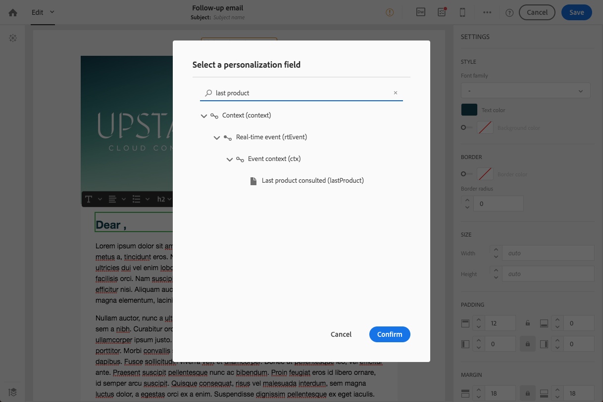

# Mensajes de seguimiento{#follow-up-messages}

Puede enviar un mensaje de seguimiento a los clientes que hayan recibido un mensaje transaccional específico. Para ello, debe configurar un flujo de trabajo dirigido al evento correspondiente.

Vamos a reutilizar el ejemplo descrito en la sección [Principios operativos de mensajería transaccional](../../channels/using/getting-started-with-transactional-msg.md#transactional-messaging-operating-principle): se envía un correo electrónico de abandono del carro de compras a los usuarios del sitio web que han agregado productos al carro de compras, pero que han abandonado el sitio sin pasar por sus compras.

Desea enviar un recordatorio práctico a todos los clientes que recibieron la notificación de abandono del carro de compras pero que no la abrieron después de tres días.

A continuación, cada cliente interesado recibirá un mensaje de seguimiento basado en los mismos datos que se usaron en el primer correo electrónico enviado.

## Acceso a los mensajes de seguimiento {#accessing-the-follow-up-messages}

Una vez creado y publicado un evento (el abandono del carro de compras según el [ejemplo](../../channels/using/getting-started-with-transactional-msg.md#transactional-messaging-operating-principle) anterior), el mensaje transaccional y el mensaje de seguimiento correspondientes se crean automáticamente.

Los pasos de configuración se presentan en la sección [Configuración de un evento para enviar un mensaje de seguimiento](../../administration/using/configuring-transactional-messaging.md#configuring-an-event-to-send-a-follow-up-message).

Para gestionar un evento en un flujo de trabajo, se requiere una Plantilla de envíos. Sin embargo, al publicar el evento, el [mensaje transaccional](../../channels/using/event-transactional-messages.md) que se crea no se puede usar como plantilla. Por lo tanto, debe crear una Plantilla de envíos de seguimiento específica diseñada para admitir este tipo de evento y para utilizarse como plantilla en un flujo de trabajo.

Para acceder a esta plantilla:

1. Haga clic en el logotipo **[!UICONTROL Adobe Campaign]**, en la esquina superior izquierda.
1. Seleccione **[!UICONTROL Resources]** > **[!UICONTROL Templates]** > **[!UICONTROL Delivery templates]**.
1. Marque la casilla **[!UICONTROL Follow-up messages]** en el panel izquierdo.

   

Solo se muestran los mensajes de seguimiento.

>[!NOTE]
>
>Para acceder a mensajes transaccionales, debe formar parte del grupo de seguridad **[!UICONTROL Administrators (all units)]**.

## Envío de un mensaje de seguimiento {#sending-a-follow-up-message}

Una vez creada la Plantilla de envíos de seguimiento, puede utilizarla en un flujo de trabajo para enviar un mensaje de seguimiento.

1. Acceda a la lista de actividad de marketing y cree un nuevo flujo de trabajo.

   Consulte [Creación de un flujo de trabajo](../../automating/using/building-a-workflow.md#creating-a-workflow).

1. Arrastre y suelte una actividad **[!UICONTROL Scheduler]** en el flujo de trabajo y ábrala. Establezca la frecuencia de ejecución en una vez al día.

   La actividad del Planificador se presenta en la sección [Planificador](../../automating/using/scheduler.md).

1. Arrastre y suelte una actividad **[!UICONTROL Query]** en el flujo de trabajo y ábrala.

   La actividad de Consulta se presenta en la sección [Consulta](../../automating/using/query.md).

1. Para ejecutar la consulta en un recurso que no sea el recurso de perfil, vaya a la ficha **[!UICONTROL Properties]** de la actividad y haga clic en la lista desplegable **[!UICONTROL Resource]**.

   

   >[!NOTE]
   >
   >De forma predeterminada, la actividad está preconfigurada para buscar perfiles.

1. Seleccione el evento que desea destinatario para que solo pueda acceder a los datos de este evento.

   

1. Vaya a la ficha **[!UICONTROL Target]** de la actividad y arrastre y suelte el elemento **[!UICONTROL Delivery logs (logs)]** de la paleta en el espacio de trabajo.

   

   Seleccione **[!UICONTROL Exists]** para destinatario a todos los clientes que recibieron el correo electrónico.

   

1. Mueva el elemento **[!UICONTROL Tracking logs (tracking)]** de la paleta al espacio de trabajo y seleccione **[!UICONTROL Does not exist]** para destinatario a todos los clientes que no abrieron el correo electrónico.

   

1. Arrastre y suelte el evento objetivo (**Abandono del carro de compras** en este ejemplo) de la paleta en el espacio de trabajo. A continuación, defina una regla para el destinatario de todos los mensajes enviados hace tres días.

   

   Esto significa que todos los destinatarios que recibieron el mensaje transaccional tres días antes de la ejecución del flujo de trabajo y que aún no lo han abierto están segmentados.

   Haga clic en **[!UICONTROL Confirm]** para guardar la consulta.

1. Arrastre y suelte una actividad **envío de correo electrónico** en el flujo de trabajo.

   La actividad envío de correo electrónico se presenta en la sección [envío de correo electrónico](../../automating/using/email-delivery.md).

   

   También puede utilizar una actividad [SMS envío](../../automating/using/sms-delivery.md) o [envío de aplicaciones móviles](../../automating/using/push-notification-delivery.md). En este caso, asegúrese de seleccionar el canal **[!UICONTROL Mobile (SMS)]** o **[!UICONTROL Mobile application]** al crear la configuración de evento. Consulte [Creación de un evento](../../administration/using/configuring-transactional-messaging.md#creating-an-event).

1. Abra la actividad **envío de correo electrónico**. En el asistente de creación, marque la casilla **[!UICONTROL Follow-up messages]** y seleccione la Plantilla de envíos de seguimiento que se creó después de publicar el evento.

   

1. En el contenido del mensaje de seguimiento, puede aprovechar el contenido del evento agregando campos de personalización.

   

1. Busque los campos que definió al crear el evento seleccionando **[!UICONTROL Context]** > **[!UICONTROL Real-time event]** > **[!UICONTROL Event context]**. Consulte [Personalización de un mensaje transaccional](../../channels/using/event-transactional-messages.md#personalizing-a-transactional-message).

   

   Esto significa que puede aprovechar el mismo contenido, incluidos los datos enriquecidos, que se utilizó la primera vez que se envió el evento, para crear un recordatorio personalizado y sencillo.

1. Guarde la actividad y inicio del flujo de trabajo.

Una vez iniciado el flujo de trabajo, todos los clientes que hayan recibido la notificación de abandono del carro de compras hace tres días pero que no la hayan abierto recibirán un mensaje de seguimiento basado en los mismos datos.

>[!NOTE]
>
>Si seleccionó la dimensión de segmentación **[!UICONTROL Profile]** al crear la configuración de evento, el mensaje de seguimiento también aprovechará la base de datos de mercadotecnia de Adobe Campaign. Consulte [Mensajes transaccionales de perfil ](../../channels/using/profile-transactional-messages.md).
