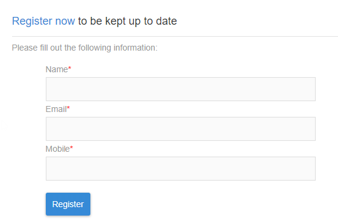
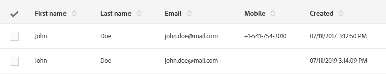
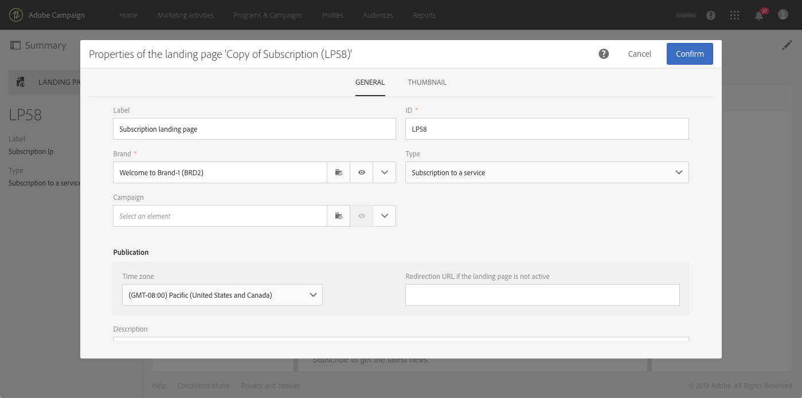
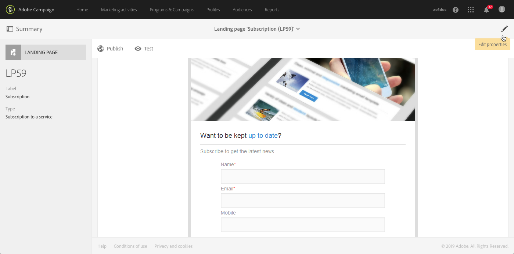
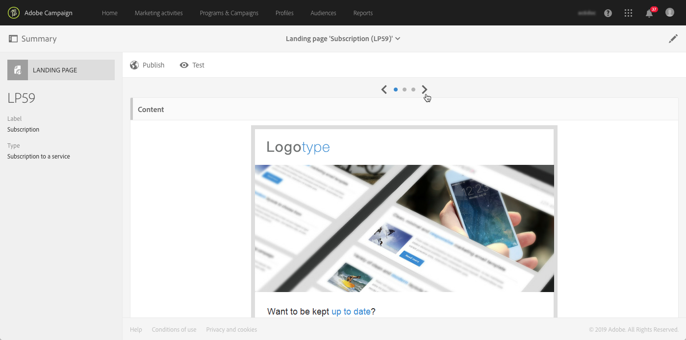
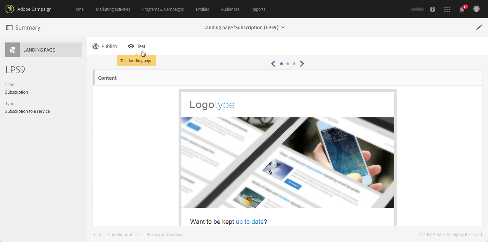
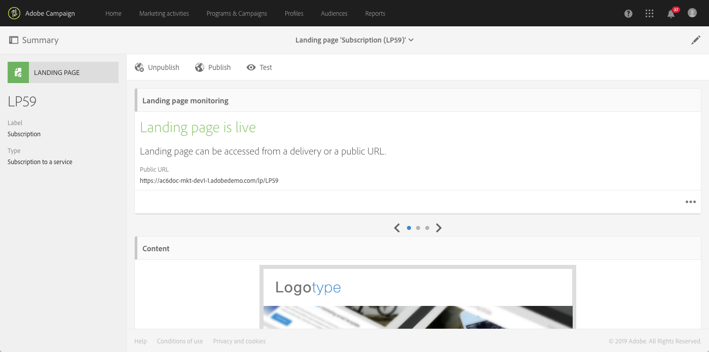

# Introducción a las páginas de destino {#getting-started-with-landing-pages}

Los pasos principales para configurar páginas de destino son los siguientes:

En esta página encontrará información sobre cada uno de estos pasos, así como referencias a la documentación relevante para obtener más detalles.

 [Descubra cómo crear páginas de aterrizaje en vídeo](#video)

**Temas relacionados:**

* [Creación de un servicio](../../audiences/using/creating-a-service.md)
* [Configuración de un proceso de inclusión doble](setting-up-a-double-opt-in-process.md)

## Limitaciones de páginas de aterrizaje{#landing-page-limitations}

La sección siguiente enumera las limitaciones que debe tener en cuenta antes de comenzar a configurar páginas de destino.

**Escritura y actualización de datos**

* Las páginas de destino se limitan a **[!UICONTROL Profile]** y solo a recursos de **[!UICONTROL Subscription]**. El registro se puede guardar y actualizar en **[!UICONTROL Profile]**, así como una suscripción/baja en un **[!UICONTROL Service]**.
Para obtener más información sobre la configuración de recursos, consulte [Configuración de la estructura de datos del recurso](../../developing/using/configuring-the-resource-s-data-structure.md).

>[!IMPORTANT]
>
>Una página de destino no puede mostrar ni actualizar datos de ningún otro recurso que no sea **[!UICONTROL Profile]** y **[!UICONTROL Subscription]**.

**Precarga**

* La página de destino no puede mostrar una lista de registros automáticamente y no puede enumerar a los servicios a los que perfiles ya se han suscrito. Para obtener más información sobre los servicios, consulte esta [página](../../audiences/using/creating-a-service.md).

* Solo se puede acceder a la página de destino con un formulario previamente completado (con datos cargados previamente con la página) desde un correo electrónico de Adobe Campaign. No es posible acceder a este formulario desde una página web.

**Reconciliación**

* El comportamiento de reconciliación es el siguiente: tan pronto como se encuentra una coincidencia, el proceso de reconciliación se detiene. Esto significa que la reconciliación solo se puede realizar en un registro de perfil y no en varios registros cuando hay duplicados.

Por ejemplo, desea enviar la siguiente página de destino de adquisición a sus perfiles para actualizar la base de datos de Campaign con los números móviles de sus perfiles.

Si uno de los perfiles rellena la página de destino con información nueva, pero ya tiene un perfil duplicado, el perfil coincidente con la fecha de creación más temprana se actualizará, ya que los perfiles se priorizan según la fecha de creación.

Aquí solo se actualizó el primer perfil porque era la entrada más antigua.

**Prueba de páginas de destino**

* Las páginas de destino solo funcionan en perfiles y no en perfiles de prueba, lo que significa que las páginas de destino no se pueden probar como parte de una prueba de correo electrónico.

## Paso 1: Configuración de la plantilla de página de aterrizaje {#configure-the-landing-page-template}

Antes de configurar una página de destino, el primer paso es configurar una plantilla de página de destino que se ajuste a sus necesidades. Una vez preparada la plantilla, todas las páginas de destino basadas en ella se preconfigurarán con los parámetros deseados.

1. En el menú avanzado, en el logotipo de Adobe Campaign, seleccione **[!UICONTROL Resources]** / **[!UICONTROL Templates]** / **[!UICONTROL Landing page templates]** y, a continuación, duplique la plantilla que desee utilizar.
1. En las propiedades de la plantilla, especifique todos los parámetros que sus páginas de destino deben tener en común. Por ejemplo: la dimensión de segmentación, los parámetros de acceso a la página para visitantes identificados o no identificados, las acciones específicas para la validación del formulario por parte de un visitante, la marca o el logotipo que se utilizará en el contenido, etc. Para obtener más información sobre las propiedades de las páginas de aterrizaje, consulte [esta sección](../../channels/using/configuring-landing-page.md)
1. Guarde las modificaciones.

Para obtener más información sobre plantillas de páginas de destino, consulte [esta sección](../../channels/using/getting-started-with-landing-pages.md).

## Paso 2: Creación y configuración de la página de aterrizaje {#create-and-configure-the-landing-page}

A partir de la plantilla definida en el paso anterior, cree una nueva página de destino en un programa o una campaña.

1. Cree la página de destino en función de la plantilla deseada.
1. Introduzca los parámetros generales de la página de destino (etiqueta, descripción, etc.).
1. A continuación, accederá al panel de control de página de destino. Si es necesario, edite las propiedades de la página de destino (consulte [Configuración de una página de destino](../../channels/using/configuring-landing-page.md)). De forma predeterminada, las propiedades son las configuradas en la plantilla de página de destino.
Por motivos de seguridad y el rendimiento de la plataforma, le recomendamos encarecidamente que defina una fecha de caducidad en las propiedades de la página de destino. Una vez hecho, la publicación de la página de destino se cancelará automáticamente en la fecha seleccionada. Para obtener más información sobre los parámetros de validez, consulte [esta sección](../../channels/using/testing-publishing-landing-page.md#setting-up-validity-parameters).

   

>[!NOTE]
>
>Las modificaciones solo son efectivas para la página de destino que se está editando. Si desea aplicar estas modificaciones a otras páginas de destino, puede llevarlas a cabo en una plantilla específica y, a continuación, crear otras páginas de destino a partir de esa plantilla.

## Paso 3: Diseño de la página de aterrizaje {#design-the-landing-page}

Ahora puede definir el contenido de la página de destino. De forma predeterminada, la página de destino contiene tres páginas a las que se puede acceder mediante flechas de desplazamiento: la página de contenido principal, una página de confirmación y una página de error.

Hay varios campos configurados de forma predeterminada en cada página. Si es necesario, puede editar las propiedades y la asignación.

También puede configurar la forma en que el botón de confirmación se comporta una vez que un perfil hace clic en él y personalizar el contenido según sus necesidades (imagen, campos de personalización, etc.). Por ejemplo, puede insertar el nombre de un perfil en la página de confirmación de la página de destino, para agradecerles su registro.

Para obtener más información sobre el diseño de la página de destino, consulte [esta sección](../../channels/using/designing-a-landing-page.md).

## Paso 4: Prueba de la página de aterrizaje {#test-the-landing-page}

Una vez definida la página de destino, puede simular la forma en que se ejecutará y comportará cuando esté disponible en línea.

>[!IMPORTANT]
>
>Las pruebas de la página de destino solo pueden realizarse con perfiles, pero no con perfiles de prueba. Cuando se envía el formulario, los datos del perfil seleccionado se actualizarán para que sean reales. Para evitar la modificación de perfiles reales, utilice un perfil de cliente falso.

Si está satisfecho con el comportamiento de la página de destino, puede publicarla para que esté disponible en línea.

Para obtener más información sobre cómo probar una página de destino, consulte [esta sección](../../channels/using/testing-publishing-landing-page.md#testing-the-landing-page-).

## Paso 5: Publicación de la página de aterrizaje {#publish-the-landing-page}

Una vez realizadas las pruebas correctamente, puede publicar la página de destino con el botón **[!UICONTROL Publish]** de la barra de acciones del panel de control. Un bloque de monitorización muestra la progresión y el estado de la publicación.

La publicación de la página de destino la hace accesible en línea. Una vez publicada, siempre puede actualizarla: para ello, debe volver a publicarla después de cada modificación. También puede cancelar la publicación de una página de destino en cualquier momento para que ya no esté disponible.

Una vez publicada, la página de destino estará lista para utilizarse. A continuación, puede establecer diferentes mecanismos que le permitan acceder a ellos para adquirir nuevos perfiles en la base de datos o para obtener información adicional sobre perfiles existentes.

Para obtener más información sobre la publicación de la página de destino, consulte [esta sección](../../channels/using/testing-publishing-landing-page.md#publishing-a-landing-page).

## Tutorial en vídeo {#video}

Este vídeo muestra cómo crear y editar una página de aterrizaje.

>[!VIDEO](https://video.tv.adobe.com/v/36315?captions=spa&quality=12)

Hay disponibles [más vídeos de procedimientos para Campaign Standard aquí](https://experienceleague.adobe.com/docs/campaign-standard-learn/tutorials/overview.html?lang=es).
