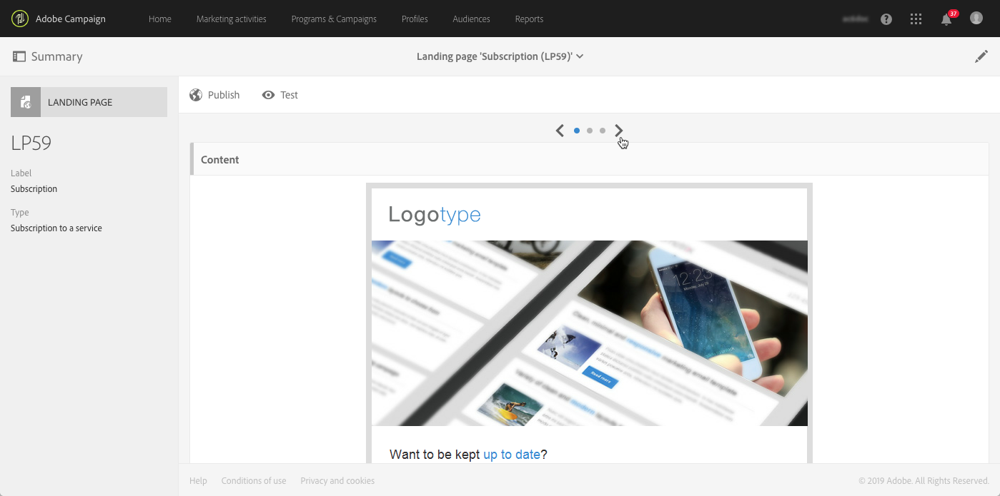

# Introducción a las páginas de aterrizaje {#getting-started-with-landing-pages}

## Acerca de las páginas de aterrizaje {#about-landing-pages}

Campaign viene con páginas de aterrizaje que son formularios web que se pueden utilizar para capturar información sobre las audiencias, ofrecer suscripciones a un servicio, mostrar datos y ampliar la base de datos. Las páginas de aterrizaje también se pueden utilizar para adquirir o actualizar perfiles existentes.

Las páginas de aterrizaje también se pueden utilizar para configurar un mecanismo de doble inclusión, lo que permite proteger la plataforma de direcciones de correo electrónico erróneas o no válidas, o spambots. For more on this, refer to the [dedicated use case](../../channels/using/setting-up-a-double-opt-in-process.md).

Los pasos principales para configurar las páginas de aterrizaje son los siguientes:

En esta página encontrará información sobre cada uno de estos pasos, así como referencias a las documentaciones dedicadas para obtener más detalles.

**Temas relacionados:**

* [Creación de un vídeo](https://helpx.adobe.com/campaign/kt/acs/using/acs-create-edit-landing-page-feature-video-use.html) de tutorial de página de aterrizaje
* [Creación de un servicio](../../audiences/using/creating-a-service.md)
* [Configuración de un proceso de inclusión doble](setting-up-a-double-opt-in-process.md)

## Limitaciones de la página de aterrizaje{#landing-page-limitations}

La sección siguiente enumera las limitaciones que debe tener en cuenta antes de comenzar a configurar las páginas de aterrizaje.

**Escritura y actualización de datos**

* Las páginas de aterrizaje están limitadas a **[!UICONTROL Profile]** y solo a **[!UICONTROL Subscription]** recursos. El registro se puede guardar y actualizar desde **[!UICONTROL Profile]** y una suscripción o cancelación de suscripción a un **[!UICONTROL Service]**.
Para obtener más información sobre la configuración de recursos, consulte [Configuración de la estructura](../../developing/using/configuring-the-resource-s-data-structure.md)de datos del recurso.

>[!CAUTION]
>
>Una página de aterrizaje no puede mostrar ni actualizar datos de ningún otro recurso que no sea **[!UICONTROL Profile]** y **[!UICONTROL Subscription]**.

**Precarga**

* La página de aterrizaje no puede mostrar una lista de registros automáticamente, no puede enumerar los servicios a los que los perfiles ya están suscritos. For more information on services, refer to this [page](../../audiences/using/creating-a-service.md).

* Sólo se puede acceder a la página de aterrizaje con un formulario prerellenado (los datos se cargan previamente con la página) desde un correo electrónico de Adobe Campaign. No es posible acceder a este formulario desde una página web.

**Reconciliación**

* El comportamiento de reconciliación es el siguiente: tan pronto como se encuentra una coincidencia, el proceso de reconciliación se detiene. Esto significa que la reconciliación sólo se puede realizar en un registro de perfil y no en varios registros cuando hay duplicados.

Por ejemplo, si desea enviar la siguiente página de inicio de adquisición a sus perfiles para actualizar la base de datos de Campaign con los números móviles de sus perfiles.

Si uno de sus perfiles rellena su página de aterrizaje con información nueva pero ya tiene un perfil duplicado, el perfil coincidente con la fecha de creación más temprana se actualizará, ya que los perfiles se priorizan según su fecha de creación solamente.

Aquí solo se actualizó el primer perfil porque era la entrada más antigua.

**Prueba de las páginas de aterrizaje**

* Las páginas de aterrizaje solo funcionan en perfiles y no en perfiles de prueba, lo que significa que las páginas de aterrizaje no se pueden probar como parte de una prueba de correo electrónico.

## Paso 1: Configuración de la plantilla de página de aterrizaje {#configure-the-landing-page-template}

Antes de configurar una página de aterrizaje, el primer paso es configurar una plantilla de página de aterrizaje que se ajuste a sus necesidades. Una vez preparada la plantilla, todas las páginas de aterrizaje basadas en ella se preconfigurarán con los parámetros deseados.

1. En el menú avanzado, a través del logotipo de Adobe Campaign, seleccione **[!UICONTROL Resources]** / **[!UICONTROL Templates]** / **[!UICONTROL Landing page templates]** y, a continuación, duplique la plantilla que desee utilizar.
1. En las propiedades de la plantilla, especifique todos los parámetros que las páginas de aterrizaje deben tener en común. Por ejemplo: la dimensión de objetivo, los parámetros de acceso a la página para visitantes identificados o no identificados, las acciones específicas para la validación del formulario por parte de un visitante, la marca o logotipo que se va a utilizar en el contenido, etc. Para obtener más información sobre las propiedades de las páginas de aterrizaje, consulte [esta sección](../../channels/using/configuring-landing-page.md)
1. Guarde las modificaciones.

For more on landing page templates, refer to [this section](../../channels/using/getting-started-with-landing-pages.md).

## Paso 2: Crear y configurar la página de aterrizaje {#create-and-configure-the-landing-page}

A partir de la plantilla definida en el paso anterior, cree una nueva página de aterrizaje en un programa o campaña.

1. Cree la página de aterrizaje según la plantilla deseada.
1. Introduzca los parámetros generales de la página de aterrizaje (etiqueta, descripción, etc.).
1. A continuación, accederá al tablero de la página de aterrizaje. Si es necesario, edite las propiedades de la página de aterrizaje (consulte [Configuración de una página](../../channels/using/configuring-landing-page.md)de aterrizaje). De forma predeterminada, las propiedades son las configuradas en la plantilla de página de aterrizaje.
Por motivos de seguridad y rendimiento de la plataforma, le recomendamos encarecidamente que establezca una fecha de caducidad en las propiedades de la página de aterrizaje. Una vez finalizada, la página de aterrizaje se cancelará automáticamente la publicación en la fecha seleccionada. For more on validity parameters, refer to [this section](../../channels/using/testing-publishing-landing-page.md#setting-up-validity-parameters).

   

   >[!NOTE]
   >
   >Las modificaciones solo son efectivas para la página de aterrizaje que se está editando. Si desea aplicar estas modificaciones a otras páginas de aterrizaje, puede llevarlas a cabo en una plantilla dedicada y luego crear otras páginas de aterrizaje a partir de esa plantilla.

## Paso 3: Diseño de la página de aterrizaje {#design-the-landing-page}

Ahora puede definir el contenido de la página de aterrizaje. De forma predeterminada, la página de aterrizaje contiene tres páginas a las que se puede acceder mediante flechas de desplazamiento: la página de contenido principal, una página de confirmación y una página de error.

Hay varios campos configurados de forma predeterminada en cada página. Si es necesario, puede editar sus propiedades y la asignación.

También puede configurar la forma en que el botón de confirmación se comportará una vez que un perfil haga clic en él y personalizar el contenido según sus necesidades (imagen, campos de personalización, etc.). Por ejemplo, puede insertar el nombre de un perfil en la página de confirmación de la página de aterrizaje para darles las gracias por registrarse.

Para obtener más información sobre el diseño de la página de aterrizaje, consulte [esta sección](../../channels/using/designing-a-landing-page.md).

## Paso 4: Prueba de la página de aterrizaje {#test-the-landing-page}

Una vez definida la página de aterrizaje, puede simular la forma en que se ejecutará y comportará cuando esté disponible en línea.

>[!CAUTION]
>
>Las pruebas de la página de aterrizaje sólo pueden realizarse con perfiles, y no con perfiles de prueba. Cuando se envía el formulario, los datos del perfil seleccionado se actualizarán para que sean reales. Para evitar modificar perfiles reales, utilice un perfil de cliente falso.

Si está satisfecho con el comportamiento de la página de aterrizaje, puede publicarla para que esté disponible en línea.

Para obtener más información sobre cómo probar una página de aterrizaje, consulte [esta sección](../../channels/using/testing-publishing-landing-page.md#testing-the-landing-page-).

## Paso Publicar la página de aterrizaje {#publish-the-landing-page}

Una vez que las pruebas se hayan realizado correctamente, puede publicar la página de aterrizaje con el **[!UICONTROL Publish]** botón de la barra de acciones del tablero. Un bloque de monitoreo muestra la progresión y el estado de la publicación.

Al publicar la página de aterrizaje, se puede acceder a ella en línea. Una vez publicada, siempre puede actualizarla: para ello, debe volver a publicarla después de cada modificación. También puede cancelar la publicación de una página de aterrizaje en cualquier momento para que ya no esté disponible.

Una vez publicada, la página de aterrizaje está lista para utilizarse. A continuación, puede establecer diferentes mecanismos que le permitan acceder a ellos para adquirir nuevos perfiles en la base de datos o para obtener información adicional sobre los perfiles existentes.

Para obtener más información sobre la publicación de la página de aterrizaje, consulte [esta sección](../../channels/using/testing-publishing-landing-page.md#publishing-a-landing-page).
