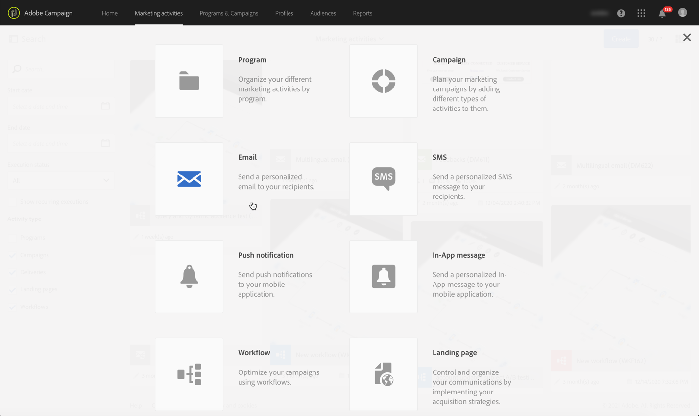
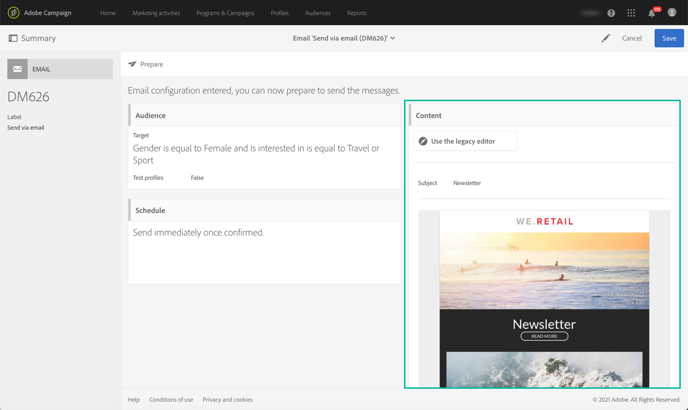
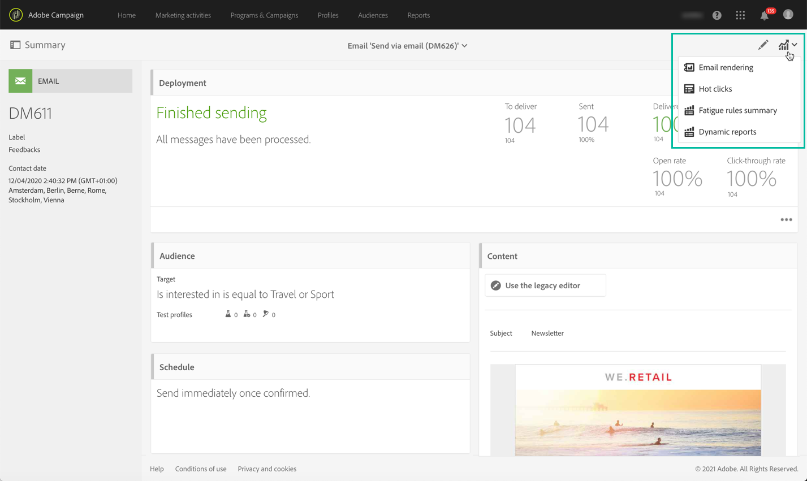

# Pasos clave para enviar un mensaje{#key-steps-to-send-a-message}

En esta sección, aprenderá a crear y enviar mensajes personalizados a una audiencia segmentada mediante Adobe Campaign Standard.

Encontrará información específica sobre cómo crear y configurar cada canal de comunicación en estas secciones:

* [Creación de un correo electrónico](../../channels/using/creating-an-email.md)
* [Creación de un SMS](../../channels/using/creating-an-sms-message.md)
* [Creación de una entrega de correo directo](../../channels/using/creating-the-direct-mail.md)
* [Creando una notificación push](../../channels/using/preparing-and-sending-a-push-notification.md).
* [Preparación y envío de un mensaje en la aplicación](../../channels/using/preparing-and-sending-an-in-app-message.md)

Para conocer las prácticas recomendadas de entrega, consulte la sección [Prácticas recomendadas de entrega](../../sending/using/delivery-best-practices.md).

## Cree su mensaje

Aproveche las [actividades de marketing](../../start/using/marketing-activities.md) de Campaign Standard para crear un mensaje de correo electrónico, SMS, correo directo, notificación push o en la aplicación.

Los mensajes se pueden crear desde la lista de actividades de marketing o desde un flujo de trabajo mediante [actividades dedicadas](../../automating/using/about-channel-activities.md).

## Definición del público

Defina los destinatarios del mensaje. Para ello, use el [editor de consultas](../../automating/using/editing-queries.md) del panel izquierdo para filtrar los datos contenidos en la base de datos y generar reglas para segmentar la audiencia.

Hay varios tipos de audiencias disponibles:

* **[!UICONTROL Target]** es el destinatario principal del correo electrónico,
* **[!UICONTROL Test profiles]** son los perfiles utilizados para probar y validar el correo electrónico (consulte [Administración de perfiles de prueba](../../audiences/using/managing-test-profiles.md)).

## Diseño y personalización del contenido

En el bloque **[!UICONTROL Content]**, diseñe y personalice el contenido del mensaje con campos de la base de datos. Para obtener más información sobre cómo diseñar contenido para un canal específico, consulte las secciones que aparecen en la parte superior de esta página.

## Preparar y probar

[Preparar](../../sending/using/preparing-the-send.md) el mensaje. Este proceso calcula la población objetivo y prepara el mensaje personalizado.

**Compruebe y pruebe su mensaje** antes de enviarlo mediante las funciones de Campaign Standard: vista previa, procesamiento de correo electrónico, revisión, etc. Para obtener más información, consulte [esta sección](../../sending/using/previewing-messages.md).

Use el bloque **[!UICONTROL Schedule]** para definir cuándo se enviarán los mensajes (consulte [Programación de mensajes](../../sending/using/about-scheduling-messages.md)).

## Envío y seguimiento

Una vez que el mensaje esté listo, puede confirmar el envío. El bloque **[!UICONTROL Deployment]** muestra el progreso de envío y el resultado.

Hay varios registros disponibles para ayudarle a supervisar el envío de sus mensajes (consulte [supervisar un envío](../../sending/using/monitoring-a-delivery.md)). También puede rastrear el comportamiento de los destinatarios de la entrega gracias a las [funcionalidades de seguimiento](../../sending/using/tracking-messages.md) de Campaign Standard.

Mida la eficacia de sus mensajes y la evolución de sus envíos y campañas mediante diversos indicadores y gráficos (consulte [Acceso a informes](../../reporting/using/about-dynamic-reports.md)).

