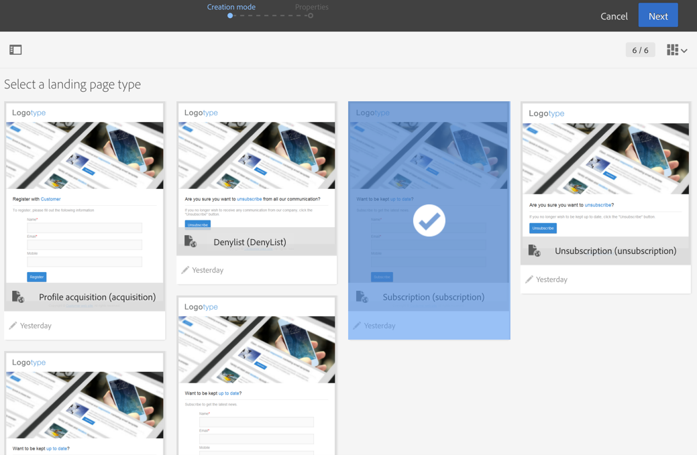

# Acerca de las plantillas de página de aterrizaje {#landing-page-templates}

Campaign incluye un conjunto de plantillas de página de aterrizaje integradas:

* **[!UICONTROL Acquisition]**: esta es la plantilla predeterminada para páginas de aterrizaje, que permite capturar y actualizar datos en la base de datos de Campaign.
* **[!UICONTROL Subscription]**: esta plantilla debe utilizarse para ofrecer suscripciones a un servicio.
* **[!UICONTROL Unsubscription]**: esta plantilla se puede vincular desde un correo electrónico enviado a los suscriptores de un servicio para permitirles cancelar su suscripción.
* **[!UICONTROL Denylist]**: esta plantilla debe utilizarse cuando un perfil ya no quiere que Campaign le siga contactando. Para obtener más información sobre la administración de lista de bloqueados de la, consulte [Acerca de la inclusión y la exclusión en Campaign](../../audiences/using/about-opt-in-and-opt-out-in-campaign.md).

Estas plantillas se proponen de forma predeterminada al crear una nueva página de aterrizaje.



Para acceder a las plantillas de página de aterrizaje, haga clic en el logotipo de Adobe Campaign en la esquina superior izquierda y seleccione **[!UICONTROL Resources]** > **[!UICONTROL Templates]** > **[!UICONTROL Landing page templates]**.

>[!NOTE]
>
>Adobe recomienda crear sus propias plantillas duplicando una plantilla integrada. Algunos parámetros solo se pueden definir en plantillas de página de aterrizaje y no se pueden modificar directamente en páginas de aterrizaje.

Al crear una plantilla, se recomienda añadir un atributo **“type”** a las etiquetas El editor procesa esta información, que ayuda al usuario a vincular un campo de la base de datos al campo del formulario al configurar la aplicación web.

Ejemplo de código HTML en la plantilla:

```
<input id="email" type="email" name="email"/>
```

La lista oficial de los atributos “type” está disponible en la siguiente dirección: [https://www.w3schools.com/tags/att_input_type.asp](https://www.w3schools.com/tags/att_input_type.asp)
