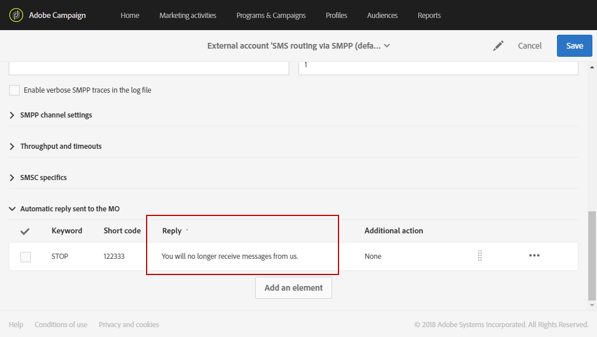
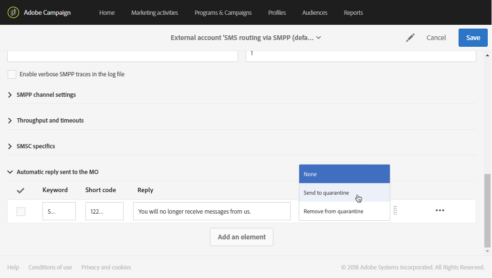
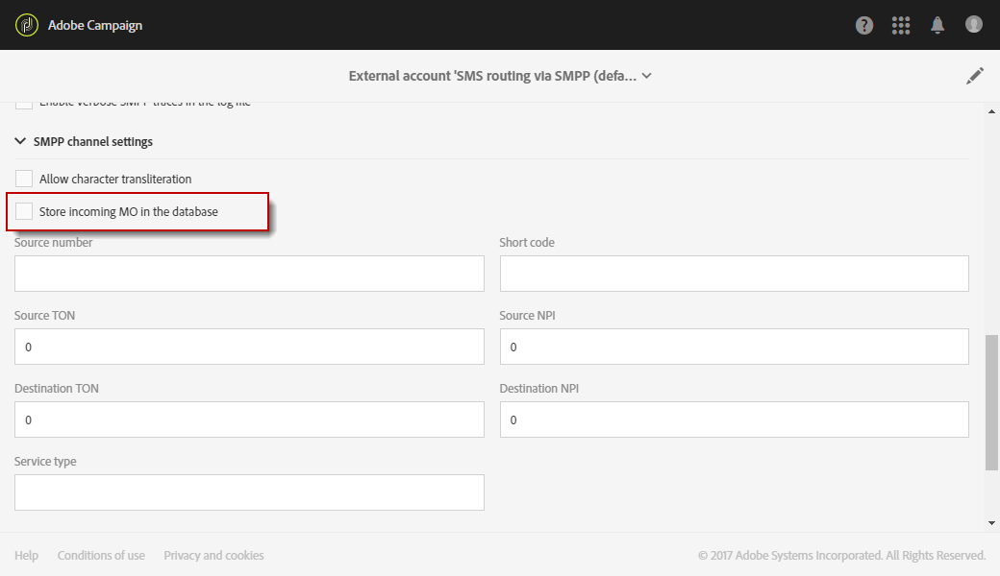
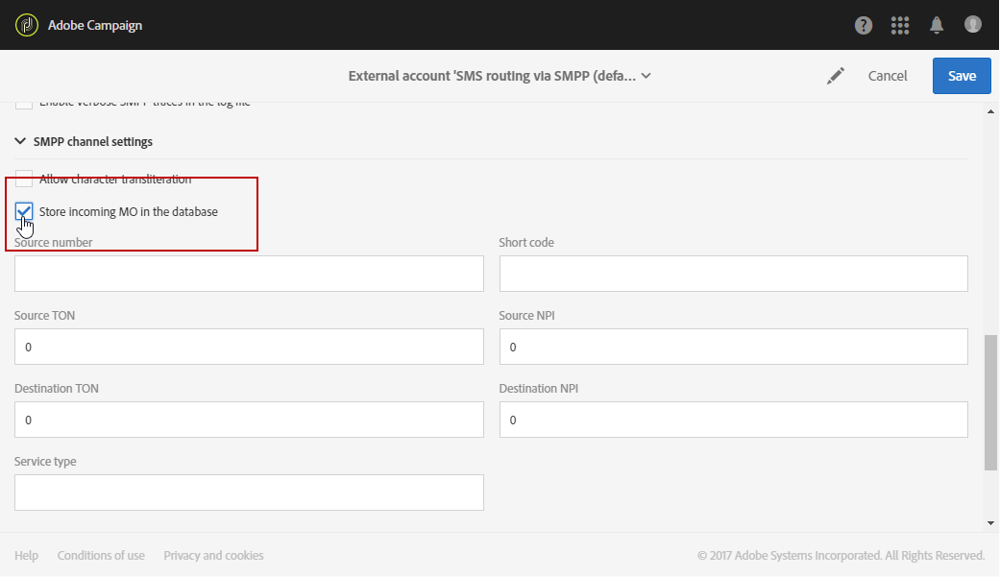
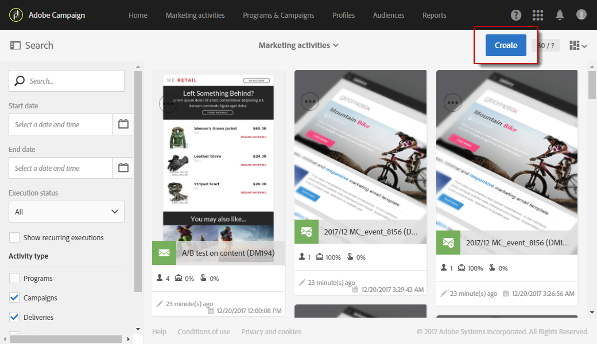

# Administración de SMS entrantes{#managing-incoming-sms}

## Administración de SMS de detención {#managing-stop-sms}

Cuando un perfil responde a un mensaje SMS enviado por Campaign, puede configurar los mensajes que se les envían automáticamente, así como la acción que se va a realizar.

Esta configuración se define en la sección **[!UICONTROL Automatic reply sent to the MO]** de la [cuenta externa de enrutamiento SMS](../../administration/using/configuring-sms-channel.md#defining-an-sms-routing). MO significa &quot;móvil original&quot;, lo que significa que puede configurar una respuesta automática al móvil que envió el SMS.

Para ello:

1. En el menú avanzado, en el logotipo de Adobe Campaign, seleccione **[!UICONTROL Administration > Application settings > External accounts]** y, a continuación, la cuenta externa **[!UICONTROL SMS routing via SMPP]**.
1. En la categoría **[!UICONTROL Automatic reply sent to the MO]**, haga clic en **[!UICONTROL Create element]** para comenzar a configurar la respuesta automática.

   

1. Elija la palabra clave que almacenará en déclencheur esta respuesta automática. Las palabras clave no distinguen entre mayúsculas y minúsculas. Por ejemplo, si los destinatarios envían la palabra clave &quot;STOP&quot;, reciben la respuesta automática.

   Deje esta columna vacía si desea enviar la misma respuesta independientemente de la palabra clave.

   >[!IMPORTANT]
   >
   >Solo se autorizan caracteres alfanuméricos.

   

1. En el campo **[!UICONTROL Short code]**, especifique un número que se utilice normalmente para realizar envíos y sirva como nombre de remitente. También puede dejar vacía la columna **[!UICONTROL Short code]** para enviar la misma respuesta independientemente del código corto.

   

1. Escriba la respuesta que desee enviar a los destinatarios en el campo **[!UICONTROL Reply]**.

   Para realizar una acción sin enviar una respuesta, deje vacía la columna **[!UICONTROL Reply]**. Por ejemplo, esto le permite sacar de cuarentena el número de teléfono de un usuario que responda con un mensaje que no sea &quot;DETENER&quot;.

   

1. En el campo **[!UICONTROL Additional action]**, vincule una acción a su respuesta automática:

   * La acción **[!UICONTROL Send to quarantine]** pone automáticamente en cuarentena el número de teléfono del perfil.
   * La acción **[!UICONTROL Remove from quarantine]** quita el número de teléfono del perfil de la cuarentena.
   * La acción **[!UICONTROL None]** le permite enviar el mensaje únicamente a los destinatarios sin llevar a cabo ninguna acción.

   Por ejemplo, en la configuración siguiente, si los destinatarios envían la palabra clave &quot;STOP&quot;, recibirán automáticamente una confirmación de baja y su número de teléfono se enviará a cuarentena con el estado **[!UICONTROL On denylist]**. Este estado hace referencia únicamente al número de teléfono y el perfil es para que el usuario siga recibiendo mensajes de correo electrónico.

   

1. Haga clic en **[!UICONTROL Save]**.

1. Desde **[!UICONTROL Advanced parameters]** de su envío de SMS **[!UICONTROL Properties]**, puede establecer un **[!UICONTROL Short code]** específico para excluir automáticamente a los destinatarios que se excluyeron. Para obtener más información, consulte [esta sección](../../administration/using/configuring-sms-channel.md#configuring-sms-properties).

Ahora se puede cancelar la suscripción automática de sus destinatarios a sus mensajes y enviarlos a cuarentena con esta respuesta automática. Los destinatarios en cuarentena se enumeran en la tabla **[!UICONTROL Addresses]** disponible a través del menú **[!UICONTROL Administration]** > **[!UICONTROL Channels]** > **[!UICONTROL Quarantines]**. Para obtener más información sobre cuarentenas, consulte esta [sección](../../sending/using/understanding-quarantine-management.md).

Estos SMS entrantes se pueden almacenar si es necesario. Para obtener más información, consulte esta [sección](#storing-incoming-sms).

## Almacenamiento de SMS entrantes {#storing-incoming-sms}

En la cuenta externa **[!UICONTROL SMS routing via SMPP]**, puede elegir almacenar los mensajes entrantes, por ejemplo, cuando un suscriptor responda &quot;DETENER&quot; a un mensaje SMS para que se elimine de las listas de destinatarios.

Si marca **[!UICONTROL Store incoming MO in the database]** en la categoría **[!UICONTROL SMPP channel settings]**, todos los SMS se almacenarán en la tabla de SMS y se podrán recuperar mediante una actividad de consulta en un flujo de trabajo.

Para ello:

1. En el campo **[!UICONTROL SMPP channel settings]**, marque **[!UICONTROL Store incoming MO in the database]**.

   

1. En la ficha **[!UICONTROL Marketing activities]**, haga clic en **[!UICONTROL Create]** y seleccione **[!UICONTROL Workflow]**.

   

1. Seleccione el tipo de flujo de trabajo.
1. Edite las propiedades del flujo de trabajo y haga clic en **[!UICONTROL Create]**. Para obtener más información sobre la creación de flujos de trabajo, consulte esta [sección](../../automating/using/building-a-workflow.md).
1. Arrastre y suelte una actividad **[!UICONTROL Query]** y haga doble clic en la actividad.
1. En la ficha **[!UICONTROL Properties]** de la consulta, elija **[!UICONTROL Incoming SMS (inSMS)]** en el campo **[!UICONTROL Resource]**.

   

1. A continuación, en la ficha **[!UICONTROL Target]**, arrastre y suelte la regla **[!UICONTROL Incoming SMS attributes]**.

   

1. En este caso, queremos dirigir todos los mensajes entrantes del día anterior. En la categoría **[!UICONTROL Field]**, seleccione **[!UICONTROL Creation date (created)]**.
1. En **[!UICONTROL Filter type]**, seleccione **[!UICONTROL Relative]** y luego en **[!UICONTROL Level of precision]**, elija **[!UICONTROL Day]**.

   

1. A continuación, puede elegir recuperar datos de hoy, del día anterior o de los últimos días. Haga clic en **[!UICONTROL Confirm]** cuando la consulta esté configurada.

Esta consulta recupera todos los mensajes STOP recibidos en función del intervalo de tiempo seleccionado.

La actividad le permite, por ejemplo, crear una población y personalizar mejor sus envíos.
