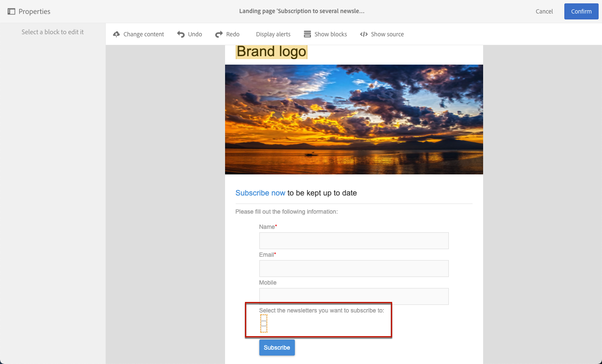

# Administración de datos de formulario de una página de destino{#managing-landing-page-form-data}

En el contenido de la página de aterrizaje, los campos de entrada se utilizan para almacenar o actualizar datos de la base de datos de Campaign.

Para ello, estos campos deben asignarse a los campos de base de datos.

Puede definir y administrar su asignación a través de la variable **[!UICONTROL Form data]** en la paleta izquierda.

## Asignación de campos de formulario {#mapping-form-fields}

Para actualizar la base de datos de Campaign según sus necesidades, vincule los campos de base de datos relevantes a la zona de entrada, el botón de opción o los bloques de tipo casilla de verificación de la página de aterrizaje.

Para realizar esto, siga los pasos a continuación:

1. Seleccione un bloque en el contenido de la página de aterrizaje.

   >[!NOTE]
   >
   >Los campos predeterminados de las páginas de aterrizaje integradas están preconfigurados. Puede modificarlos según sea necesario.

1. Acceda a la **[!UICONTROL Form data]** en la paleta izquierda.

1. Para cambiar el tipo de campo, seleccione un valor de la variable **[!UICONTROL HTML type of the field]** lista desplegable.

   

   >[!NOTE]
   >
   >Para obtener más información sobre el uso del tipo de casilla de verificación en una página de aterrizaje, consulte la [Actualizar varias suscripciones de servicio](#multiple-subscriptions) y [Casilla de verificación Acuerdo](#agreement-checkbox) secciones.

1. Si selecciona un tipo de campo no compatible con el campo de base de datos seleccionado actualmente en la variable **[!UICONTROL Field]** zona, se mostrará un mensaje de advertencia. Para una asignación óptima, seleccione un valor adecuado.

   

1. Utilice la variable **[!UICONTROL Field]** zona para seleccionar un campo de base de datos que se vinculará al campo de formulario.

   

   >[!NOTE]
   >
   >Las páginas de aterrizaje solo se pueden asignar con la variable **[!UICONTROL Profiles]** o **[!UICONTROL Service]** recursos.

   En este ejemplo, asigne la variable **Nombre** del campo de la página de aterrizaje a la variable **[!UICONTROL Last name]** del campo **[!UICONTROL Profiles]** recurso.

   

1. Seleccione la opción **[!UICONTROL Mandatory]** si es necesario. En ese caso, la página de aterrizaje solo se puede enviar si el usuario ha rellenado este campo.

   

   Si no se rellena un campo obligatorio, aparece un mensaje de error cuando el usuario envía la página.

1. Haga clic en **[!UICONTROL Confirm]** para guardar los cambios.

<!--If you choose a mandatory **[!UICONTROL Checkbox]**, make sure that it is of **[!UICONTROL Field]** type.-->

## Almacenamiento y reconciliación de datos{#data-storage-and-reconciliation}

Los parámetros de reconciliación de datos le permiten definir cómo se administran los datos introducidos en la página de aterrizaje una vez que los ha enviado un usuario.

Para ello:

1. Edite las propiedades de página de aterrizaje a las que se accede mediante el icono  del panel de página de aterrizaje y muestre los parámetros de **[!UICONTROL Job]**.

   

1. Seleccione el **[!UICONTROL Reconciliation key]**: este campo de base de datos se utiliza para determinar si el visitante tiene un perfil que ya se conoce en la base de datos de Adobe Campaign. Puede ser, por ejemplo, correo electrónico, nombre o apellidos. La clave de reconciliación le permite actualizar o crear un perfil, según la variable **[!UICONTROL Update strategy]** definido a continuación.

1. Defina el **[!UICONTROL Form parameter mapping]**: esta sección le permite asignar los parámetros del campo de página de aterrizaje y los que se utilizan en la clave de reconciliación.

1. Seleccione el **[!UICONTROL Update strategy]**: si la clave de reconciliación recupera un perfil de base de datos existente, puede elegir que este perfil se actualice con los datos introducidos en el formulario o evitar esta actualización.

   

## Múltiples suscripciones a servicios {#multiple-subscriptions}

Puede utilizar varias casillas de verificación en una sola página de aterrizaje para permitir a los usuarios suscribirse o cancelar la suscripción de varios servicios.

Para realizar esto, siga los pasos a continuación:

1. Al diseñar la página de aterrizaje:

   * Seleccione un bloque y, en el **[!UICONTROL Form data]** , elija **[!UICONTROL Checkbox]** como tipo de campo.

      

   * Si está familiarizado con el HTML, también puede insertar manualmente una casilla de verificación mediante el **[!UICONTROL Show source]** botón.

      

      Esto le permite insertar la casilla de verificación siempre que sea conveniente en la página.

      

1. Asegúrese de que la casilla de verificación esté seleccionada en el contenido. La variable **[!UICONTROL Type]** la lista desplegable se muestra en la **[!UICONTROL Form data]** de la paleta izquierda. Seleccione **[!UICONTROL Service and subscription]** en la lista.

   

1. Elija una opción de la lista **[!UICONTROL Behavior]** lista desplegable.

   

1. Seleccione un [service](../../audiences/using/creating-a-service.md) de la lista correspondiente.

   

1. Asegúrese de que la variable **[!UICONTROL Mandatory]** está desactivada. De lo contrario, los usuarios no tendrán opción.

   

1. Para agregar más casillas de verificación que permitan suscribirse a otros servicios, repita los pasos anteriores tantas veces como sea necesario.

   

Una vez publicada la página de aterrizaje, los usuarios pueden seleccionar varias casillas de verificación para suscribirse a varios boletines desde la misma página.

## Casilla de verificación Acuerdo {#agreement-checkbox}

Puede añadir una casilla de verificación que el perfil debe marcar antes de enviar la página de aterrizaje.

Por ejemplo, esto le permite solicitar el consentimiento de los usuarios para la política de privacidad o hacerlos aceptar sus términos y condiciones antes de que envíen el formulario.

>[!IMPORTANT]
>
>La selección de esta casilla de verificación es obligatoria para los usuarios. Si no se selecciona, no podrán enviar la página de aterrizaje.

Para insertar y configurar esta casilla de verificación, haga lo siguiente:

1. Al diseñar la página de aterrizaje:

   * Seleccione un bloque y, en el **[!UICONTROL Form data]** , elija **[!UICONTROL Checkbox]** como tipo de campo.

      

   * Si está familiarizado con el HTML, también puede insertar manualmente una casilla de verificación mediante el **[!UICONTROL Show source]** botón.

      

      <!--Manually insert a checkbox, such as in the example below:

      <!--Click **[!UICONTROL Hide source]**.-->

1. Asegúrese de que la casilla de verificación esté seleccionada.

   

1. La variable **[!UICONTROL Type]** la lista desplegable se muestra en la **[!UICONTROL Form data]** de la paleta izquierda. Seleccione **[!UICONTROL Agreement]** en la lista.

   

   >[!NOTE]
   >
   >La variable **[!UICONTROL Agreement]** no está asignado a un campo de la base de datos de Campaign.

1. Haga clic en el  junto a **[!UICONTROL Form data]** para acceder a las propiedades avanzadas de la casilla de verificación.

1. Si es necesario, puede editar el mensaje.

   

   Este texto se mostrará como una advertencia si el usuario no selecciona la casilla de verificación antes de enviar el formulario.

   >[!NOTE]
   >
   >Esta acción es obligatoria de forma predeterminada y no se puede cambiar.

1. Haga clic en **[!UICONTROL Confirm]**.

Ahora, cada vez que se muestra la página de aterrizaje, el usuario tendrá que seleccionar esta casilla de verificación antes de enviar el formulario. Si no es así, se mostrará la advertencia y el usuario no podrá enviar el formulario hasta que se active la casilla de verificación.