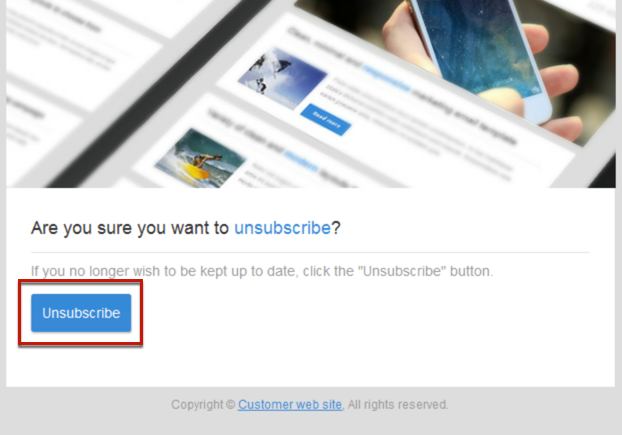

# Administración de datos de formulario de una página de destino{#managing-landing-page-form-data}

## Cambio de las propiedades de datos de un formulario de una página de aterrizaje{#changing-a-landing-page-form-data-properties}

Puede vincular campos de base de datos a la zona de entrada, el botón de opción o los bloques de tipo casilla de verificación. Para ello, seleccione el bloque y acceda a **[!UICONTROL Form data]** en la paleta.

* La zona de entrada de **Campo** permite seleccionar un campo de base de datos para vincularlo al campo de formulario.
* La opción **Obligatorio** le permite autorizar el envío de la página únicamente si el usuario ha rellenado el campo. Si no se rellena un campo obligatorio, aparece un mensaje de error.

## Asignación de campos de formulario {#mapping-form-fields}

Los campos de entrada se utilizan para almacenar o actualizar datos en la base de datos de Campaign. Para esto, debe vincular campos de base de datos con la zona de entrada, el botón de opción o los bloques de tipo casilla de verificación. Para ello:

1. Seleccione un bloque en la página de aterrizaje.
1. Complete la parte **[!UICONTROL Form data]** de la paleta.

   

1. Elija un campo de base de datos para establecer un vínculo con el campo de formulario en la zona de selección **[!UICONTROL Field]**. Las páginas de aterrizaje solo se pueden asignar con **Perfiles**.

1. Seleccione la opción **[!UICONTROL Mandatory]** si es necesario. La página solo se puede enviar si el usuario ha completado este campo. Si no se completa un campo obligatorio, aparecerá un mensaje de error cuando el usuario valida la página.

1. Defina el tipo de campo eligiendo, por ejemplo, **[!UICONTROL Text]**, **[!UICONTROL Number]** o **[!UICONTROL Date]** en el área de selección **[!UICONTROL HTML type of the field]**.
Si elige una **[!UICONTROL Checkbox]** obligatoria, asegúrese de que es del tipo **[!UICONTROL Field]**.

>[!NOTE]
>
>Los campos predeterminados de las páginas de aterrizaje integradas están preconfigurados. Puede modificarlos según sea necesario.

## Almacenamiento y reconciliación de datos{#data-storage-and-reconciliation}

Los parámetros de reconciliación de datos le permiten definir cómo se administran los datos introducidos en la página de aterrizaje una vez que los ha enviado un usuario.

Para ello:

1. Edite las propiedades de página de aterrizaje a las que se accede mediante el icono  del panel de página de aterrizaje y muestre los parámetros de **[!UICONTROL Job]**.

   

1. Seleccione la **[!UICONTROL Reconciliation key]**: estos campos de base de datos como, por ejemplo, correo electrónico, nombre y apellidos, se utilizan para determinar si el visitante tiene un perfil que ya se conoce en la base de datos de Adobe Campaign. Esto le permite actualizar o crear un perfil según los parámetros de la estrategia de actualización definidos.
1. Defina el **[!UICONTROL Form parameter mapping]**: esta sección le permite asignar los parámetros del campo de página de aterrizaje y los que se utilizan en la clave de reconciliación.
1. Seleccione la **[!UICONTROL Update strategy]**: si la clave de reconciliación recupera un perfil existente en la base de datos, puede elegir que este perfil se actualice con los datos introducidos en el formulario o evitar esta actualización.

## Casilla de verificación Acuerdo {#agreement-checkbox}

Puede añadir una casilla de verificación que el perfil debe marcar antes de enviar la página de aterrizaje.

Por ejemplo, esto le permite solicitar el consentimiento de los usuarios para la política de privacidad o hacerlos aceptar sus términos y condiciones antes de que envíen el formulario.

<!--This is particularly useful in the following case:

When a profile opens the landing page from an Outlook.com mailbox, Outlook checks whether the links on the landing page are suspicious. However, this Outlook security feature (called safelinks) has an unwanted effect: it automatically activates the buttons included on the landing page. Consequently, profiles are automatically subscribed or unsubscribed without confirmation when the landing page is displayed after clicking the email link, even if they do not submit the form.

To avoid this, Adobe recommends you always add to your landing page a checkbox which enables the profile to agree before proceeding with subscription or unsubscription.-->

>[!IMPORTANT]
>
>La selección de esta casilla de verificación es obligatoria para los usuarios. Si no se selecciona, no podrán enviar la página de aterrizaje.

Para insertar y configurar esta casilla de verificación, haga lo siguiente:

1. Al diseñar la página de aterrizaje, haga clic en **[!UICONTROL Show source]**.

   

1. Inserte manualmente una casilla de verificación, como en el ejemplo siguiente:

   

   <!--
   
<input type="checkbox" class="nl-dce-todo" data-nl-bindto="agreement" data-nl-agreementmsg="You must agree with the terms and conditions before proceeding" />I agree with the terms and conditions

   -->

1. Haga clic en **[!UICONTROL Hide source]**.

1. Se muestra la nueva casilla de verificación. Selecciónelo.

   

1. La lista desplegable correspondiente se muestra en la sección **[!UICONTROL Form data]** de la paleta. Seleccione **[!UICONTROL Agreement]** en la lista.

   

   >[!NOTE]
   >
   >El elemento **[!UICONTROL Agreement]** no está asignado a un campo de la base de datos de Campaign.

1. Haga clic en el icono  situado junto a **[!UICONTROL Form data]** para acceder a las propiedades avanzadas de la casilla de verificación.

1. Si es necesario, puede editar el mensaje.

   

   Este texto se mostrará como una advertencia si el usuario no selecciona la casilla de verificación antes de enviar el formulario.

   >[!NOTE]
   >
   >Esta acción es obligatoria de forma predeterminada y no se puede cambiar.

1. Haga clic en **[!UICONTROL Confirm]**.

Ahora, cada vez que se muestra la página de aterrizaje, el usuario tendrá que seleccionar esta casilla de verificación antes de enviar el formulario. Si no es así, se mostrará la advertencia y el usuario no podrá enviar el formulario hasta que se active la casilla de verificación.