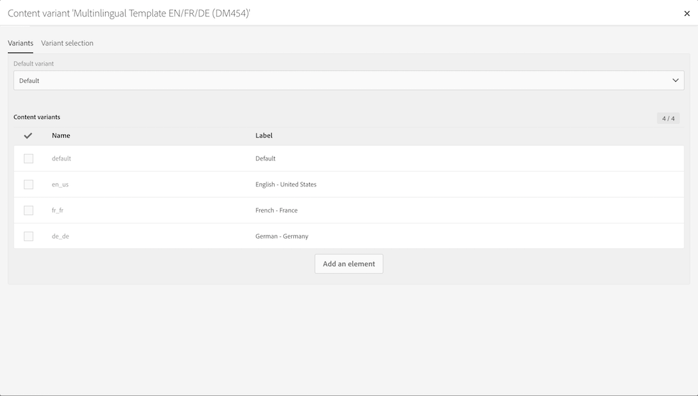

# Plantillas de mensajes multilingües {#multilingual-messages-template}

Una plantilla multilingüe es una plantilla específica para administrar mensajes multilingües. Este tipo de plantilla está disponible para **correos electrónicos** y **SMS**, y se puede utilizar de forma independiente en un flujo de trabajo o envío recurrente.

En las plantillas de funciones multilingües, la administración de idiomas se basa en variantes. **Cada variante representa un idioma**. Adobe Campaign Standard puede configurar un máximo de 40 variantes.

Adobe Campaign viene con un idioma predeterminado definido como **EN**. El idioma predeterminado se puede cambiar a otra variante, pero nunca se debe eliminar.

Durante la creación de la plantilla, puede añadir el número de variantes correspondiente al número de idiomas necesarios en el mensaje.

Para crear plantillas de correo electrónico o SMS, siga estos pasos:

1. Duplique una plantilla multilingüe existente (SMS o correo electrónico).

   

   >[!NOTE]
   >
   >También puede modificar una plantilla estándar existente y convertirla en una plantilla multilingüe haciendo clic en el botón **[!UICONTROL Initialize content variant]** de las propiedades de la plantilla.

1. Modifique las propiedades para personalizar la etiqueta, el seguimiento, etc.
1. Modifique la cantidad de variantes deseadas haciendo clic en el mosaico de variantes. Se muestra la ventana de variantes. 

   

   Puede agregar o quitar variantes. Para agregar una variante, complete la ventana **[!UICONTROL New content variant]**.

   

   >[!NOTE]
   >
   >No elimine la variante predeterminada, ya que es la variante que se envía a perfiles sin parámetro de idioma preferido definido.

1. Personalice la variante de etiqueta si es necesario y haga clic en **[!UICONTROL Confirm]**.
1. También puede añadir directamente el contenido para cada variante.

Ahora, ya puede crear un mensaje de correo electrónico o SMS basado en esta plantilla multilingüe.

**Temas relacionados:**

* [Creación de un correo electrónico multilingüe](../../channels/using/creating-a-multilingual-email.md)
* [Creación de perfiles](../../audiences/using/creating-profiles.md)
