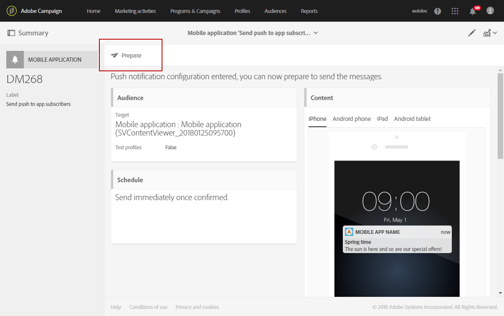

# Preparación y envío de una notificación push{#preparing-and-sending-a-push-notification}

## Preparación de la notificación {#preparing-the-notification}

Los pasos para crear una notificación push con Adobe Campaign son estos:

1. Desde el **[!UICONTROL Marketing activities]** ventana, [crear una nueva actividad de marketing](../../start/using/marketing-activities.md#creating-a-marketing-activity).

   Tenga en cuenta que también se puede crear una sola notificación push a partir de un [campaña](../../start/using/marketing-activities.md#creating-a-marketing-activity) o desde Adobe Campaign [página principal](../../start/using/interface-description.md#home-page).

   También puede utilizar una actividad de envío de notificaciones push en un flujo de trabajo. Esta actividad se presenta en el [Entrega de notificaciones push](../../automating/using/push-notification-delivery.md) sección.

1. Seleccione **[!UICONTROL Push notification]**.
1. Seleccione una plantilla.

   

   De forma predeterminada, puede seleccionar una de las dos plantillas siguientes:

   * **[!UICONTROL Send push to Campaign profiles]**: utilice esta plantilla para dirigirse a los perfiles de CRM de Adobe Campaign que se han suscrito a su aplicación móvil y han elegido recibir notificaciones push. Puede insertar [personalización](../../designing/using/personalization.md#inserting-a-personalization-field) campos en la notificación push, como el nombre del destinatario.
   * **[!UICONTROL Send push to app subscribers]**: utilice esta plantilla para enviar una notificación push a todos los usuarios conocidos y anónimos de aplicaciones móviles que se hayan registrado para recibir notificaciones de su aplicación. Puede personalizar estos mensajes con los datos recopilados de su aplicación móvil.

   También puede seleccionar plantillas multilingües. Para obtener más información, consulte [Creación de una notificación push multilingüe](../../channels/using/creating-a-multilingual-push-notification.md).

   Para obtener más información sobre las plantillas, consulte [Administración de plantillas](../../start/using/marketing-activity-templates.md) sección.

1. Introduzca las propiedades de las notificaciones push y seleccione la aplicación móvil en la **[!UICONTROL Associate a Mobile App to a delivery]** field.

   Tenga en cuenta que la lista desplegable mostrará tanto las aplicaciones de SDK V4 como las de SDK de Experience Platform.

   

   Puede vincular la notificación push a una campaña. Para ello, selecciónelo entre las campañas que ya se han creado.

1. VIP En la siguiente pantalla, puede especificar una audiencia, por ejemplo, todos los clientes de la aplicación móvil que se hayan suscrito a una aplicación móvil específica. Para obtener más información, consulte [Creación de audiencias](../../audiences/using/creating-audiences.md).

   La audiencia se filtrará automáticamente en función de la aplicación móvil seleccionada en el paso anterior.

   

1. Ahora puede personalizar la notificación push. En primer lugar, elija el estilo de mensaje: **[!UICONTROL Alert/Message/Badge]** o **[!UICONTROL Silent push]**. Los tipos de notificaciones push se describen en la [Acerca de las notificaciones push](../../channels/using/about-push-notifications.md) sección.

   Edite el contenido de la notificación push y defina las opciones avanzadas. Consulte [Personalización de una notificación push](../../channels/using/customizing-a-push-notification.md).

   

   El contenido de las notificaciones push y las opciones configuradas aquí se pasan a la aplicación móvil en forma de carga útil. La estructura detallada de la carga útil se describe en la [Explicación de la estructura de carga de notificaciones push de Campaign Standard](../../administration/using/push-payload.md) nota técnica.

1. Haga clic en **[!UICONTROL Create]**.

   

1. Antes de enviar la notificación, puede probarla con perfiles de prueba y luego ver exactamente lo que verán los destinatarios antes de realizar la entrega. Seleccionar **[!UICONTROL Audiences]** en el resumen de envío y haga clic en **[!UICONTROL Test profiles]** pestaña.

   Para obtener más información sobre el envío de pruebas, consulte [Perfiles de prueba](../../sending/using/sending-proofs.md).

1. Seleccione los perfiles de prueba y haga clic en **[!UICONTROL Preview]** para mostrar la notificación: el contenido se personaliza con los datos del perfil de prueba.
1. Compruebe el diseño de las notificaciones push en diferentes dispositivos: seleccione iPhone, teléfono Android, iPad o tableta Android para previsualizar el procesamiento.

   

1. El **[!UICONTROL Estimated Payload Size]** es una estimación basada en los datos del perfil de prueba. El tamaño real de la carga útil puede variar. El límite del mensaje es de 4 KB.

   >[!CAUTION]
   >
   >Si el tamaño de la carga útil supera el límite de 4 KB, el mensaje no se enviará.

Tenga en cuenta que los datos de personalización afectan al tamaño del mensaje.

## Envío de la notificación {#sending-the-notification}

Las notificaciones push se pueden enviar a una audiencia seleccionada en Adobe Campaign definiendo los criterios de audiencia. Para el ejemplo siguiente, la audiencia seleccionada consta de 4 suscriptores de aplicaciones móviles segmentadas.

1. Clic **[!UICONTROL Prepare]** para calcular el objetivo y generar las notificaciones.

   

1. Una vez que la preparación ha finalizado correctamente, la variable **[!UICONTROL Deployment]** presenta los siguientes KPI: **[!UICONTROL Target]** y **[!UICONTROL To deliver]**. Tenga en cuenta que el recuento **[!UICONTROL To deliver]** es menor que el de **[!UICONTROL Targeted]**, debido a exclusiones que se pueden ver haciendo clic en el botón  de la parte inferior de la ventana **[!UICONTROL Deployment]**.

   

1. En el **[!UICONTROL Exclusion logs]** , puede encontrar la lista de todos los mensajes excluidos del destinatario enviado y el motivo de esta exclusión.

   Aquí, podemos ver que uno de nuestros suscriptores de la aplicación móvil se excluyó porque la dirección estaba en la lista de bloqueados y los demás suscriptores porque el perfil era un duplicado.

   

1. Haga clic en **[!UICONTROL Exclusion causes]** para mostrar el volumen de mensajes excluidos.

   

1. Ahora puede hacer clic en **[!UICONTROL Confirm]** para empezar a enviar notificaciones push.
1. Compruebe el estado de la entrega a través del panel de mensajes y los registros. Para obtener más información, consulte [Envío de mensajes](../../sending/using/confirming-the-send.md) y [Registros de envío](../../sending/using/monitoring-a-delivery.md#delivery-logs).

   En este ejemplo, el panel de mensajes muestra que Adobe Campaign intentó enviar dos notificaciones push: una se entregó correctamente al dispositivo y otra falló. Para saber por qué la entrega tiene errores, haga clic en el  botón en la parte inferior de **[!UICONTROL Deployment]** ventana.

   

1. Desde el **[!UICONTROL Deployment]** , haga clic en la **[!UICONTROL Sending logs]** para acceder a la lista de notificaciones push enviadas y sus estados. Para este envío, se envió correctamente una notificación push, mientras que la otra falló debido a un token de dispositivo incorrecto. A continuación, este suscriptor se añade a la lista de bloqueados de la de entregas adicionales.

   >[!NOTE]
   >
   >Las razones pueden ser cualquier error en el flujo descendente a Adobe Campaign. En caso de errores de proveedores como apns y fcm, la razón también reflejará eso. Para obtener más información sobre los errores del proveedor, consulte la [Apple](https://developer.apple.com/library/content/documentation/NetworkingInternet/Conceptual/RemoteNotificationsPG/CommunicatingwithAPNs.html) y [Android](https://firebase.google.com/docs/cloud-messaging/http-server-ref) documentación.

   

Ahora puede medir el impacto del envío de notificaciones push con informes dinámicos.

**Temas relacionados:**

* [Informe de notificaciones push](../../reporting/using/push-notification-report.md)
* [Envío de una notificación push dentro de un flujo de trabajo](../../automating/using/push-notification-delivery.md)
