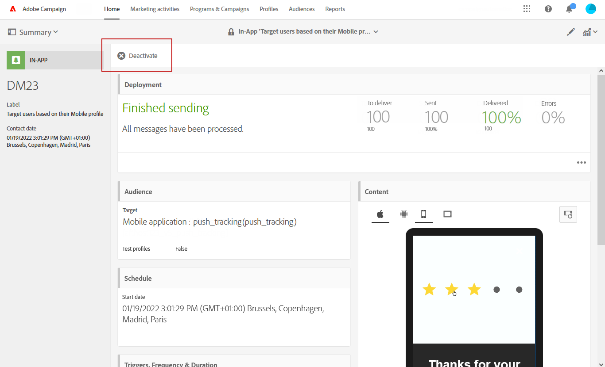
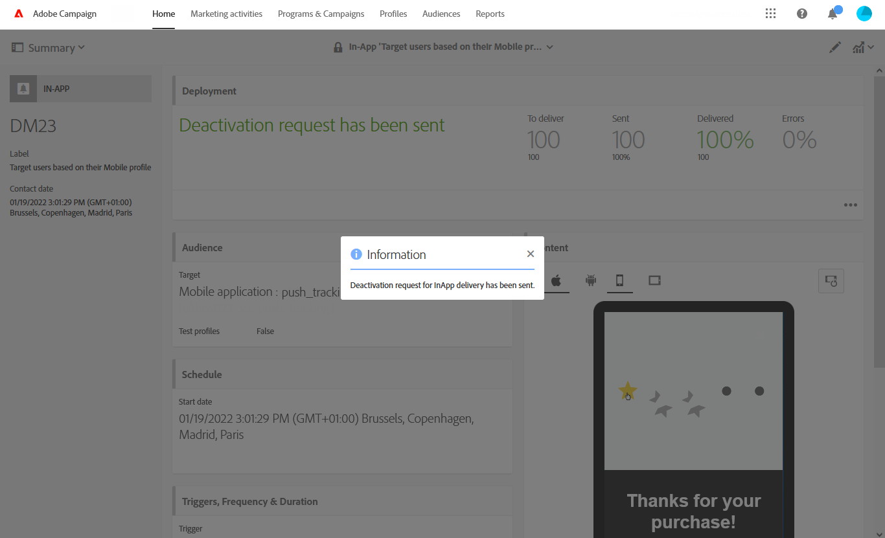

# Preparación y envío de un mensaje en la aplicación{#preparing-and-sending-an-in-app-message}

En Adobe Campaign, hay disponibles tres tipos de mensajes en la aplicación:

* **[!UICONTROL Target users based on their Campaign profile (inAppProfile)]**: Este tipo de mensaje le permite dirigirse a perfiles de Adobe Campaign (perfiles CRM) que se han suscrito a su aplicación móvil. Este tipo de mensaje se puede personalizar con todos los atributos de perfil disponibles en Adobe Campaign, pero requiere un protocolo de autenticación seguro entre el SDK móvil y el servicio de mensajería en la aplicación de Campaign para garantizar que los mensajes con información personal y confidencial sean utilizados únicamente por usuarios autorizados.

   Para descargar este tipo de mensaje en los dispositivos de los usuarios, el SDK móvil debe enviar los campos de vinculación utilizados para conectar un perfil móvil a un perfil CRM en Adobe Campaign. Para obtener más información sobre las API de SDK necesarias para admitir la función en la aplicación, consulte esta [página](https://developer.adobe.com/client-sdks/documentation/adobe-campaign-standard/api-reference/).

* **[!UICONTROL Target all users of a Mobile app (inAppBroadcast)]**: Este tipo de mensaje le permite enviar mensajes a todos los usuarios (actuales o futuros) de la aplicación móvil aunque no tengan un perfil existente en Adobe Campaign. Por lo tanto, la personalización no es posible cuando se personalizan los mensajes, ya que es posible que el perfil del usuario ni siquiera exista en Adobe Campaign.
* **[!UICONTROL Target users based on their Mobile profile (inApp)]**: Este tipo de mensaje le permite dirigirse a todos los usuarios conocidos o anónimos de una aplicación móvil que tengan un perfil móvil en Adobe Campaign. Este tipo de mensajes se puede personalizar utilizando únicamente atributos no personales y no confidenciales y no requiere un protocolo de autenticación seguro entre el SDK móvil y el servicio de mensajería en la aplicación de Adobe Campaign.

   Para obtener más información sobre cómo gestionar los datos personales y confidenciales, consulte [Gestión de campos de perfil móvil con datos personales y confidenciales](../../channels/using/about-in-app-messaging.md#handling-mobile-profile-fields-with-personal-and-sensitive-data).

## Preparación del mensaje en la aplicación {#preparing-your-in-app-message}

>[!CAUTION]
>
>La personalización en la aplicación se basa en un campo de vinculación que suele ser un ID de CRM o un ID de inicio de sesión de la aplicación móvil. Usted es el único responsable de asegurar este campo de vinculación cuando se utiliza en relación con Adobe Campaign. Si no logra mantener los campos de vinculación seguros, su mensaje personalizado puede ser vulnerable. Adobe no se responsabilizará de los daños que se deriven del acceso no autorizado o del uso de cualquier dato de perfil si no se siguen las prácticas de protección, administración y composición del campo de vinculación segura.

Los pasos para crear un mensaje independiente en la aplicación con Adobe Campaign son:

1. En la página de inicio de Adobe Campaign, haga clic en la tarjeta **[!UICONTROL In-App messaging]**.

   También puede crear una aplicación desde la pestaña **Actividades de marketing**, haciendo clic en el botón **[!UICONTROL Create]**.

   Tenga en cuenta que también se puede crear un mensaje en la aplicación desde una campaña, desde la página de inicio de Adobe Campaign o en un flujo de trabajo.

1. Seleccione **Mensaje en la aplicación**.

   

1. Seleccione una plantilla adecuada según sus necesidades de segmentación de audiencias.

   

   De forma predeterminada, puede seleccionar una de las tres siguientes plantillas integradas:

   * **[!UICONTROL Target users based on their Campaign CRM profile (inAppProfile)]**
   * **[!UICONTROL Target all users of a Mobile app (inAppBroadcast)]**
   * **[!UICONTROL Target users based on their Mobile profile (inApp)]**

1. Introduzca las propiedades de los mensajes en la aplicación y seleccione la aplicación móvil en el campo **[!UICONTROL Associate a Mobile App to a delivery]**.

   Si no ve ninguna aplicación en la lista desplegable, asegúrese de que las aplicaciones móviles se encuentren en un **Configurado** estado. Aplicaciones en una **Listo para configurar** El estado de no aparecerá en la lista. Para obtener más información sobre la configuración de la aplicación móvil, consulte esta [página](../../administration/using/configuring-a-mobile-application.md#channel-specific-config).

   

1. Seleccione la audiencia a la que desee dirigirse para el mensaje en la aplicación. La audiencia se filtra previamente según la aplicación móvil asociada a esta entrega.

   Tenga en cuenta que este paso no es necesario con **[!UICONTROL Broadcast an In-App message (inAppBroadcast)]**, ya que se dirige a todos los usuarios de una aplicación móvil.

   

1. En la pestaña **[!UICONTROL Triggers]**, arrastre y suelte el evento que activará el mensaje. Al escoger un activador, elige una acción realizada por los usuarios que hará que se muestre el mensaje en la aplicación.

   Hay cuatro categorías de eventos disponibles:

   * **[!UICONTROL Mobile Application events]**: Eventos personalizados implementados en la aplicación móvil.

      Para obtener más información sobre la creación de eventos, consulte esta [página](../../administration/using/configuring-a-mobile-application.md).

   * **[!UICONTROL Life Cycle events]**: Eventos de ciclo de vida listos para usar compatibles con el SDK móvil de Adobe.

      Para obtener más información sobre los eventos de ciclo de vida, consulte esta [página](https://experienceleague.adobe.com/docs/mobile-services/android/metrics.html).

   * **[!UICONTROL Analytics Events]**: Se admiten las tres categorías siguientes en función de la instrumentación de la aplicación móvil: Adobe Analytics, datos de contexto o estado de vista.

      Tenga en cuenta que estos eventos solo están disponibles si dispone de una licencia de Adobe Analytics.

   * **[!UICONTROL Places]**: Las tres categorías siguientes utilizan los datos de ubicación en tiempo real para ofrecer experiencias móviles relevantes para el contexto: datos de contexto de Places, metadatos personalizados de Places o tipo de evento de Places.

      Para obtener más información sobre Adobe Places, consulte la [documentación de Places](https://experienceleague.adobe.com/docs/places/using/home.html).
   

1. Si utiliza un **[!UICONTROL Analytics Events]** Los eventos de estado, Adobe Analytics y Vista se rellenarán automáticamente en función de los grupos de informes configurados en la extensión de Analytics en la IU de recopilación de datos, mientras que los eventos de datos de contexto deben agregarse manualmente.

   Tenga en cuenta que estos eventos solo están disponibles si dispone de una licencia de Adobe Analytics.

   

1. Si utiliza un activador **[!UICONTROL Places]**, los datos de contexto de Places, los metadatos personalizados de Places o el tipo de evento de Places se rellenarán automáticamente en función de todas las bibliotecas y sus puntos de interés creados en Adobe Places.

   Tenga en cuenta que este déclencheur se aplicará en el dispositivo únicamente para los puntos de interés de las bibliotecas seleccionadas en la extensión Places en la IU de recopilación de datos. Para obtener más información sobre la extensión Places y cómo instalarla, consulte esta [documentación](https://experienceleague.adobe.com/docs/places/using/places-ext-aep-sdks/places-extension/places-extension.html).

1. En la pestaña **[!UICONTROL Frequency & duration]**, elija la frecuencia del activador, la fecha de inicio y final, el día de la semana y la hora del día en que se activará el mensaje en la aplicación.

   

1. Edite el contenido del mensaje y defina las opciones avanzadas. Consulte [Personalización de un mensaje en la aplicación](../../channels/using/customizing-an-in-app-message.md).

   

1. Haga clic en **[!UICONTROL Create]**.

El mensaje en la aplicación ya está listo para enviarse a la audiencia de destino.

**Temas relacionados:**

* [Personalización de un mensaje en la aplicación](../../channels/using/customizing-an-in-app-message.md)
* [Informe en la aplicación](../../reporting/using/in-app-report.md)
* [Envío de un mensaje en la aplicación dentro de un flujo de trabajo](../../automating/using/in-app-delivery.md)

## Vista previa del mensaje en la aplicación {#previewing-the-in-app-message}

Antes de enviar el mensaje en la aplicación, puede realizar pruebas con los perfiles de prueba para comprobar qué verá la audiencia de destino cuando lo reciban.

1. Haga clic en el botón **[!UICONTROL Preview]**.

   

1. Haga clic en el botón **[!UICONTROL Select a test profile]** y seleccione uno de los perfiles de prueba para obtener una vista previa del envío. Para obtener más información sobre los perfiles de prueba, consulte esta [sección](../../audiences/using/managing-test-profiles.md).
1. Pruebe el mensaje en distintos dispositivos, como Android, iPhone o incluso tabletas. También puede comprobar si los campos de personalización recopilan los datos correctamente.

   

1. Ahora puede enviar el mensaje y medir su impacto con informes de envío.

## Envío de un mensaje en la aplicación {#sending-your-in-app-message}

Una vez que haya terminado de preparar la entrega y se hayan realizado los pasos de aprobación, puede enviar su mensaje.

1. Haga clic en **[!UICONTROL Prepare]** para calcular el destinatario y generar los mensajes.

   

1. Una vez que la preparación ha finalizado correctamente, la ventana **Deployment** muestra los siguientes KPI: **Target** y **To deliver**.

   Puede consultar la ventana Implementación haciendo clic en el botón  para detectar posibles exclusiones o errores en la entrega.

   

1. Haga clic en **[!UICONTROL Confirm]** para empezar a enviar el mensaje en la aplicación.

   

1. Compruebe el estado de la entrega a través del panel de mensajes y los registros. Para obtener más información, consulte [esta sección](../../sending/using/monitoring-a-delivery.md).

   Los recuentos de KPI **[!UICONTROL Delivered]** y **[!UICONTROL Sent]** se basan en lo que se envía correctamente desde Campaign al servicio de entrega de mensajes. Tenga en cuenta que estos KPI no indican el recuento de dispositivos móviles que recibieron o descargaron el mensaje correctamente desde el servicio de entrega de mensajes.

   

1. Mida el impacto de los mensajes en la aplicación con informes de entregas. Para obtener más información sobre la creación de informes, consulte [esta sección](../../reporting/using/in-app-report.md).

1. Después de enviar los mensajes en la aplicación, puede optar por desactivar la entrega. Esto puede resultar útil si desea detener una entrega en particular o si desea ejecutar una nueva entrega con el mismo déclencheur, por ejemplo.

   Clic **[!UICONTROL Deactivate]** entonces **[!UICONTROL Ok]** para iniciar la solicitud de desactivación.

   

1. Una vez enviada la solicitud, la entrega se desactiva y no se envía ningún otro mensaje.

   Tenga en cuenta que los informes de este envío seguirán estando accesibles.

   

**Temas relacionados:**

* [Informe en la aplicación](../../reporting/using/in-app-report.md)
* [Envío de un mensaje en la aplicación dentro de un flujo de trabajo](../../automating/using/in-app-delivery.md)
