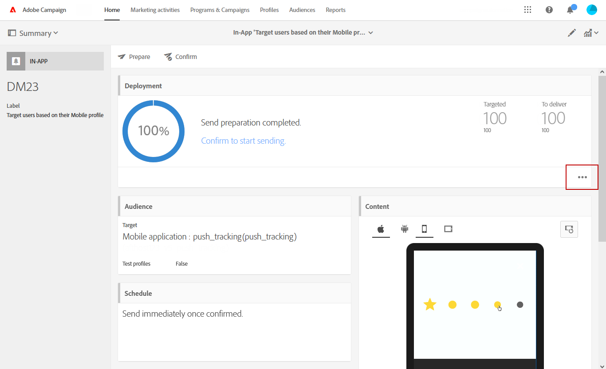

# Preparación y envío de un mensaje en la aplicación{#preparing-and-sending-an-in-app-message}

>[!NOTE]
>
>La personalización en la aplicación se basa en un campo de vinculación que suele ser un ID de CRM o un ID de inicio de sesión de la aplicación móvil. Usted es el único responsable de asegurar este campo de vinculación cuando se utiliza en relación con el Adobe Campaign. Si no logra mantener los campos de vinculación seguros, su mensaje personalizado puede ser vulnerable. Adobe no se responsabilizará de los daños que se deriven del acceso no autorizado o del uso de cualquier dato de perfil si no se siguen las prácticas de protección, administración y composición del campo de vinculación segura.

Hay tres tipos de mensajes en la aplicación disponibles en Adobe Campaign:

* **[!UICONTROL Target users based on their Campaign profile (inAppProfile)]**:: Este tipo de mensaje le permite destinatario de perfiles de Adobe Campaign (perfiles CRM) que se han suscrito a su aplicación móvil. Este tipo de mensaje se puede personalizar con todos los atributos de perfil disponibles en Adobe Campaign, pero requiere un protocolo de enlace seguro entre el SDK móvil y el servicio de mensajería en la aplicación de la Campaña para garantizar que los mensajes con información personal y confidencial sean utilizados únicamente por usuarios autorizados.

   Para descargar este tipo de mensaje en los dispositivos de los usuarios, el SDK de Mobile debe enviar los campos de vinculación utilizados para conectar un perfil móvil a un perfil CRM en Adobe Campaign. Para obtener más información sobre las API de SDK necesarias para admitir In-App, consulte esta [página](https://aep-sdks.gitbook.io/docs/using-mobile-extensions/adobe-campaign-standard/adobe-campaign-standard-api-reference).

* **[!UICONTROL Target all users of a Mobile app (inAppBroadcast)]**:: Este tipo de mensaje le permite enviar mensajes a todos los usuarios (actuales o futuros) de la aplicación móvil aunque no tengan un perfil existente en Adobe Campaign. Por lo tanto, la personalización no es posible cuando se personalizan los mensajes, ya que es posible que el perfil del usuario ni siquiera exista en Adobe Campaign.
* **[!UICONTROL Target users based on their Mobile profile (inApp)]**:: Este tipo de mensaje permite el destinatario de todos los usuarios conocidos o anónimos de una aplicación móvil que tengan un perfil móvil en Adobe Campaign. Este tipo de mensajes se puede personalizar utilizando únicamente atributos no personales y no confidenciales y no requiere un protocolo de enlace seguro entre el SDK móvil y el servicio de mensajería en la aplicación de Adobe Campaign.

   Para obtener más información sobre cómo manejar datos personales y confidenciales, consulte [Gestión de campos de perfil móvil con datos](#handling-mobile-profile-fields-with-personal-and-sensitive-data)personales y confidenciales.

## Gestión de campos de perfil móvil con datos personales y confidenciales {#handling-mobile-profile-fields-with-personal-and-sensitive-data}

In Adobe Campaign, mobile profile attributes data sent from mobile device are stored in **[!UICONTROL Subscriptions to an application (appSubscriptionRcp)]** resource which allows you to define the data that you want to collect from your applications&#39; subscribers.

Este recurso debe ampliarse para recopilar los datos que se van a enviar desde el dispositivo móvil al Adobe Campaign. Para ello, consulte esta [página](../../developing/using/extending-the-subscriptions-to-an-application-resource.md) para conocer los pasos detallados.

Para habilitar la personalización de los mensajes en la aplicación de forma más segura, es necesario configurar los campos de perfil móvil de este recurso. In your **[!UICONTROL Subscriptions to an application (appSubscriptionRcp)]**, when creating your new mobile profiles fields, check **[!UICONTROL Personal and Sensitive]** to make them unavailable during In-App messages personalization.

>[!NOTE]
>
>Si tiene una implementación existente con la extensión de recursos personalizada en esta tabla, le recomendamos que etiquete los campos correctamente antes de utilizarlos para personalizar los mensajes en la aplicación.

Once your **[!UICONTROL Subscriptions to an application]** custom resource is configured and published, you can start preparing your In-App delivery using the **[!UICONTROL Target users based on their Mobile profile (inApp)]** template. Only non-personal and non-sensitive fields will be available from **[!UICONTROL Subscriptions to an application (appSubscriptionRcp)]** resource for personalization.

If you require personalization with **Personal and Sensitive** fields, we recommend using the **[!UICONTROL Target users based on their Campaign profile (inAppProfile)]** template which has additional security mechanism to ensure that your users&#39; PII data remains secure.

## Preparación del mensaje en la aplicación {#preparing-your-in-app-message}

Los pasos para crear un mensaje independiente en la aplicación con Adobe Campaign son:

1. En la página de inicio Adobe Campaign, haga clic en la **[!UICONTROL In-App messaging]** tarjeta.

   También puede crear una aplicación desde la ficha actividades **de** marketing, haciendo clic en el **[!UICONTROL Create]** botón.

   Tenga en cuenta que también se puede crear un mensaje en la aplicación desde una campaña o desde la página de inicio de Adobe Campaign o en un flujo de trabajo.

1. Seleccione un mensaje **en la aplicación**.

   

1. Seleccione una plantilla adecuada según sus necesidades de segmentación de audiencias.

   

   De forma predeterminada, puede seleccionar una de las tres plantillas integradas siguientes:

   * **[!UICONTROL Target users based on their Campaign CRM profile (inAppProfile)]**
   * **[!UICONTROL Target all users of a Mobile app (inAppBroadcast)]**
   * **[!UICONTROL Target users based on their Mobile profile (inApp)]**

1. Introduzca las propiedades de los mensajes en la aplicación y seleccione la aplicación móvil en el **[!UICONTROL Associate a Mobile App to a delivery]** campo. Tenga en cuenta que si no configuró la aplicación móvil con Adobe Campaign Standard, no aparecerá en la lista. For more information on mobile application configuration, refer to this [page](https://helpx.adobe.com/campaign/kb/configuring-app-sdk.html#ChannelspecificapplicationconfigurationinAdobeCampaign).

   

1. Seleccione la audiencia que desea destinatario para el mensaje en la aplicación. La audiencia se prefiltra según la aplicación móvil asociada a este envío.

   Tenga en cuenta que este paso no es necesario con el **[!UICONTROL Broadcast an In-App message (inAppBroadcast)]** , ya que destinatario a todos los usuarios de una aplicación móvil.

   

1. En la **[!UICONTROL Triggers]** ficha, arrastre y suelte el evento que activará el mensaje. Al elegir un activador, elige una acción realizada por los usuarios que hará que se muestre el mensaje en la aplicación.

   Hay cuatro categorías de eventos disponibles:

   * **[!UICONTROL Mobile Application events]**:: eventos personalizados implementados en la aplicación móvil.

      For more on events creations, refer to this [page](https://helpx.adobe.com/campaign/kb/configuring-app-sdk.html).

   * **[!UICONTROL Life Cycle events]**:: eventos de ciclo de vida predeterminados compatibles con el SDK de Adobe Mobile.

      Para obtener más información sobre los eventos del ciclo vital, consulte esta [página](https://docs.adobe.com/content/help/en/mobile-services/android/metrics.html).

   * **[!UICONTROL Analytics Events]**:: Se admiten las tres categorías siguientes en función de la instrumentación de la aplicación móvil: Adobe Analytics, datos de contexto o estado de Vista.

      Tenga en cuenta que estos eventos solo están disponibles si dispone de una licencia de Adobe Analytics.

   * **[!UICONTROL Places]**:: Las tres categorías siguientes aprovechan los datos de ubicación en tiempo real para ofrecer experiencias móviles relevantes para el contexto: Coloca datos de contexto, Coloca metadatos personalizados o Coloca tipo de evento.

      Para obtener más información sobre Adobe Places, consulte la documentación de [Lugares](https://placesdocs.com/).
   

1. Si utiliza un **[!UICONTROL Analytics Events]**, los eventos de estado de Analytics y Vista de Adobe se rellenarán automáticamente en función de los grupos de informes configurados en la extensión de Analytics en Adobe Experience Platform Launch, mientras que los eventos de datos de contexto se deben agregar manualmente.

   Tenga en cuenta que estos eventos solo están disponibles si dispone de una licencia de Adobe Analytics.

   

1. Si utiliza un **[!UICONTROL Places]** activador, los datos de contexto de Lugares, los metadatos personalizados de Lugares o el tipo de evento de Lugares se rellenarán automáticamente en función de todas las bibliotecas y sus puntos de interés creados en Adobe Places.

   Tenga en cuenta que este activador se aplicará en el dispositivo únicamente para los puntos de interés de las bibliotecas seleccionadas en la extensión Lugares en Experience Platform Launch. Para obtener más información sobre la extensión Places y cómo instalarla, consulte esta [documentación](https://docs.adobe.com/content/help/en/places/using/places-ext-aep-sdks/places-extension/places-extension.html).

1. En la **[!UICONTROL Frequency & duration]** ficha, elija la frecuencia del activador, el inicio y la fecha de finalización, el día de la semana y la hora del día en que se activará el mensaje en la aplicación.

   

1. Edite el contenido del mensaje y defina las opciones avanzadas. See [Customizing an In-App message](https://helpx.adobe.com/campaign/standard/channels/using/customizing-a-push-notification.html).

   

1. Haga clic **[!UICONTROL Create]**.

El mensaje en la aplicación ya está listo para enviarse a la audiencia de destino.

**Temas relacionados:**

* [Personalización de un mensaje en la aplicación](../../channels/using/customizing-an-in-app-message.md)
* [Informe en la aplicación](../../reporting/using/in-app-report.md)
* [Envío de un mensaje en la aplicación dentro de un flujo de trabajo](../../automating/using/in-app-delivery.md)

## Envío de un mensaje en la aplicación {#sending-your-in-app-message}

Una vez que haya terminado de preparar el envío y se hayan realizado los pasos de aprobación, puede enviar su mensaje.

1. Haga clic en **[!UICONTROL Prepare]** para calcular el destinatario y generar los mensajes.

   

1. Una vez que la preparación ha finalizado correctamente, la ventana **Deployment** muestra los siguientes KPI: **Target** y **To deliver**.

   Puede consultar la ventana Implementación haciendo clic en el  botón para detectar posibles exclusiones o errores en el envío.

   

1. Haga clic en **[!UICONTROL Confirm]** para enviar el mensaje en la aplicación en inicio.

   

1. Compruebe el estado del envío a través del panel de mensajes y los registros. Para obtener más información, consulte [esta sección](../../sending/using/monitoring-a-delivery.md).

   **[!UICONTROL Delivered]** y **[!UICONTROL Sent]** los recuentos de KPI se basan en lo que se envía correctamente desde la Campaña al servicio de envío de mensajes. Tenga en cuenta que estos KPI no indican el número de dispositivos móviles que recibieron o descargaron el mensaje correctamente desde el servicio envío de mensajes.

   

1. Mida el impacto de los mensajes en la aplicación con informes de envío. For more on reporting, refer to [this section](../../reporting/using/in-app-report.md).

**Temas relacionados:**

* [Informe en la aplicación](../../reporting/using/in-app-report.md)
* [Envío de un mensaje en la aplicación dentro de un flujo de trabajo](../../automating/using/in-app-delivery.md)

