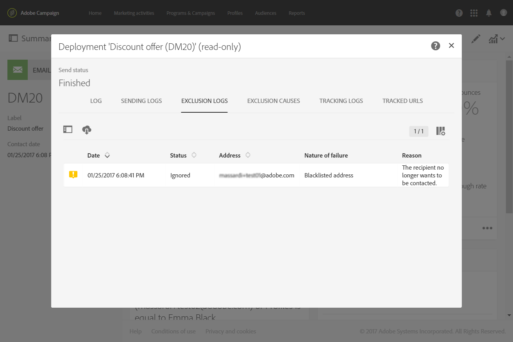

# Profile transactional messages{#profile-transactional-messages}

Puede enviar mensajes transaccionales en función de los perfiles de marketing del cliente, lo que le permite:

* Apply marketing typology rules such as **[!UICONTROL Blacklisted address]** or [fatigue rules](../../administration/using/fatigue-rules.md).
* Incluya el vínculo de cancelación de suscripción dentro de los mensajes.
* Agregue los mensajes transaccionales a los informes de entrega global.
* Aproveche los mensajes transaccionales en el viaje del cliente.

Once you have created and published an event (the cart abandonment as per the [example](../../channels/using/about-transactional-messaging.md#transactional-messaging-operating-principle) above), the corresponding transactional message is created automatically.

The configuration steps are presented in the [Configuring an event to send a profile transactional message](../../administration/using/configuring-transactional-messaging.md#use-case--configuring-an-event-to-send-a-transactional-message) section.

Para que el evento active enviar un mensaje de transacción, debe personalizar el mensaje, luego probarlo y publicarlo.

>[!NOTE]
>
>To access the transactional messages, you must have administration rights or appear in the **[!UICONTROL Message Center agents]** (mcExec) security group. Las reglas de fatiga son compatibles con los mensajes transaccionales de perfil. See [Fatigue rules](../../administration/using/fatigue-rules.md).

## Sending a profile transactional message {#sending-a-profile-transactional-message}

Los pasos para crear, personalizar y publicar un mensaje transaccional de perfil son los mismos que para un mensaje transaccional de eventos. See [Event transactional messages](../../channels/using/event-transactional-messages.md).

Las diferencias se enumeran a continuación.

1. Vaya al mensaje de transacción creado para editarlo.
1. In the transactional message, click the **[!UICONTROL Content]** section. In addition to the transactional template, you can also choose the default email template, which targets **[!UICONTROL Profile]**.

   

1. Seleccione la plantilla de correo electrónico predeterminada.

   Al igual que todos los correos electrónicos de mercadotecnia, incluye un vínculo de cancelación de suscripción.

   

   Además, en oposición a las configuraciones basadas en eventos en tiempo real, tiene acceso directo a toda la información de perfil para personalizar su mensaje. See [Inserting a personalization field](../../designing/using/inserting-a-personalization-field.md).

1. Guarde los cambios y publique el mensaje. See [Publishing a transactional message](../../channels/using/event-transactional-messages.md#publishing-a-transactional-message).

## Monitoring a profile transactional message delivery {#monitoring-a-profile-transactional-message-delivery}

Una vez que se publica el mensaje y se realiza la integración del sitio, puede monitorear la entrega.

1. To view the message delivery log, click the icon at the bottom right of the **[!UICONTROL Deployment]** block.

   For more information on accessing the logs, see [Monitoring the delivery](../../sending/using/monitoring-a-delivery.md).

1. Select the **[!UICONTROL Sending logs]** tab. In the **[!UICONTROL Status]** column, **[!UICONTROL Sent]** indicates that a profile has opted in.

   

1. Select the **[!UICONTROL Exclusions logs]** tab to view recipients who have been excluded from the message target, such as blacklisted addresses.

   

For any profile that has opted out, the **[!UICONTROL Blacklisted address]** typology rule excluded the corresponding recipient.

This rule is part of a specific typology that applies to all transactional messages based on the **[!UICONTROL Profile]** table.

**Temas relacionados**:

* [Integración del sitio](../../administration/using/configuring-transactional-messaging.md#integrating-the-triggering-of-the-event-in-a-website)
* [Tipologies](../../administration/using/about-typology-rules.md)

