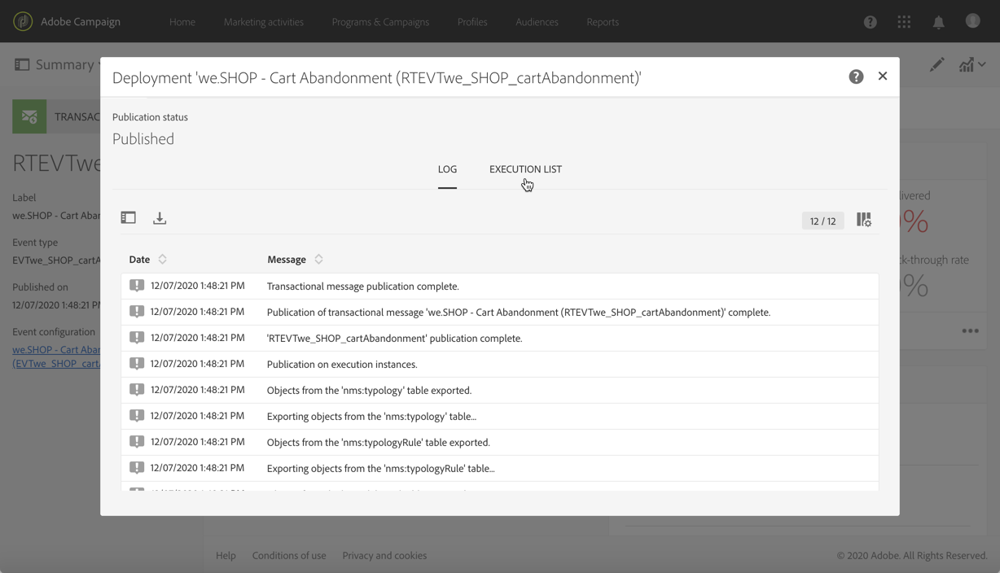

# Ciclo de un mensaje transaccional {#publishing-transactional-message}

Si la variable [mensaje transaccional](../../channels/using/editing-transactional-message.md) está listo para enviarse, se puede publicar.

A continuación se detallan los pasos para publicar, pausar, cancelar la publicación y eliminar un mensaje transaccional.

>[!IMPORTANT]
>
>Solo los usuarios con [Administration](../../administration/using/users-management.md#functional-administrators) La función puede acceder y publicar mensajes transaccionales.

## Proceso de publicación de mensajería transaccional {#transactional-messaging-pub-process}

El gráfico siguiente ilustra el proceso general de publicación de mensajes transaccionales.

**Temas relacionados:**
* [Publicación de un mensaje transaccional](#publishing-a-transactional-message)
* [Pausa de un mensaje transaccional](#suspending-a-transactional-message-publication)
* [Cancelar la publicación de un mensaje transaccional](#unpublishing-a-transactional-message)
* [Publicación de un evento](../../channels/using/publishing-transactional-event.md)

<!--## Testing a transactional message {#testing-a-transactional-message}

You first need to create a specific test profile that will allow you to properly check the transactional message.

### Defining a specific test profile {#defining-specific-test-profile}

Define a test profile that will be linked to your event, which will allow you to preview your message and send a relevant proof.

1. From the transactional message dashboard, click the **[!UICONTROL Create test profile]** button.

   

1. Specify the information to send in JSON format in the **[!UICONTROL Event data used for personalization]** section. This is the content that will be used when previewing the message and when the test profile receives the proof.

   

   >[!NOTE]
   >
   >You can also enter the information relating to the profile table. See [Enriching the event](../../channels/using/configuring-transactional-event.md#enriching-the-transactional-message-content) and [Personalizing a transactional message](../../channels/using/editing-transactional-message.md#personalizing-a-transactional-message).

1. Once created, the test profile will be pre-specified in the transactional message. Click the **[!UICONTROL Test profiles]** block of the message to check the target of your proof.

   

You can also create a new test profile or use one that already exists in the **[!UICONTROL Test profiles]** menu. To do this:

1. Click the **Adobe** logo, in the top-left corner, then select **[!UICONTROL Profiles & audiences]** > **[!UICONTROL Test profiles]**.
1. In the **[!UICONTROL Event]** section, select the event that you have just created. In this example, select "Cart abandonment (EVTcartAbandonment)".
1. Specify the information to send in JSON format in the **[!UICONTROL Event data]** text box.

   

1. Save your changes.
1. Access the message that you created and select the updated test profile.

**Related topics:**

* [Managing test profiles](../../audiences/using/managing-test-profiles.md)
* [Creating audiences](../../audiences/using/creating-audiences.md)

### Sending the proof {#sending-proof}

Once you have created one or more specific test profiles and saved your transactional message, you can send a proof to test it.

The steps for sending a proof are detailed in the [Sending proofs](../../sending/using/sending-proofs.md) section.-->

## Publicación de un mensaje transaccional {#publishing-a-transactional-message}

Una vez que haya editado y probado el mensaje transaccional, puede publicarlo. Simplemente haga clic en **[!UICONTROL Publish]** botón.

Ahora, tan pronto como se activa el evento “Abandono del carro de compras”, se mostrará automáticamente un mensaje que contiene el título y los apellidos del destinatario, la dirección URL del carro de compras, el último producto consultado o una lista de productos, si se ha definido una, y la cantidad total que se va a enviar.

Para acceder a los informes relacionados con su mensaje transaccional, utilice el botón **[!UICONTROL Reports]**. Consulte [Informes dinámicos](../../reporting/using/about-dynamic-reports.md).

**Temas relacionados**:
* [Edición de un mensaje transaccional](../../channels/using/editing-transactional-message.md)
* [Prueba de un mensaje transaccional](../../channels/using/testing-transactional-message.md)
* [Integración del activador del evento](../../channels/using/getting-started-with-transactional-msg.md#integrate-event-trigger)

## Suspender la publicación de un mensaje transaccional {#suspending-a-transactional-message-publication}

Puede suspender la publicación del mensaje transaccional utilizando el botón **[!UICONTROL Pause]**, por ejemplo, para modificar los datos contenidos en el mensaje. Por lo tanto, los eventos ya no se procesan, sino que se mantienen en cola en la base de datos de Adobe Campaign.

Los eventos en cola se mantienen durante un período de tiempo definido en la API de REST (consulte la [Documentación de API de REST](../../api/using/managing-transactional-messages.md)) o en el evento de déclencheur si utiliza el servicio principal de Déclencheur (consulte [Acerca de Adobe Experience Cloud Triggers](../../integrating/using/about-adobe-experience-cloud-triggers.md)).

Al hacer clic en **[!UICONTROL Resume]**, se procesan todos los eventos en cola (siempre que no hayan caducado). Ahora contienen todas las modificaciones realizadas durante la suspensión de la publicación de la plantilla.

## Cancelar la publicación de un mensaje transaccional {#unpublishing-a-transactional-message}

Al hacer clic en **[!UICONTROL Unpublish]** se puede cancelar la publicación del mensaje transaccional, pero también la publicación del evento correspondiente, que elimina de la API de REST el recurso correspondiente al evento que ha creado anteriormente.

Ahora, incluso si el evento se activa a través de su sitio web, los mensajes correspondientes ya no se envían y no se almacenan en la base de datos.

>[!NOTE]
>
>Para volver a publicar el mensaje, debe volver a la configuración del evento correspondiente, [publicación del evento](../../channels/using/publishing-transactional-event.md), y luego [publicación del mensaje](#publishing-a-transactional-message).

Si cancela la publicación de un mensaje transaccional en pausa, es posible que tenga que esperar hasta 24 horas para volver a publicarlo. Esto permite que el flujo de trabajo **[!UICONTROL Database cleanup]** limpie todos los eventos en cola.

Los pasos para pausar un mensaje se detallan en la sección [Suspender la publicación de un mensaje transaccional](#suspending-a-transactional-message-publication).

Se puede acceder al flujo de trabajo **[!UICONTROL Database cleanup]**, que se ejecuta todos los días a las 4 de la mañana, seleccionando **[!UICONTROL Administration]** > **[!UICONTROL Application settings]** > **[!UICONTROL Workflows]**.

## Eliminación de un mensaje transaccional {#deleting-a-transactional-message}

Una vez que se ha cancelado la publicación de un mensaje transaccional, o si todavía no se ha publicado, puede eliminarlo de la lista de mensajes transaccionales. Para ello:

1. Haga clic en **Adobe** , en la esquina superior izquierda, y seleccione **[!UICONTROL Marketing plans]** > **[!UICONTROL Transactional messages]** > **[!UICONTROL Transactional messages]**.
1. Pase el ratón sobre el mensaje que desee.
1. Haga clic en el botón **[!UICONTROL Delete element]**.

Sin embargo, la eliminación de un mensaje transaccional solo se puede realizar bajo determinadas condiciones:

* Asegúrese de que el mensaje transaccional está en estado **[!UICONTROL Draft]**, de lo contrario no podrá eliminarlo. El estado **[!UICONTROL Draft]** se aplica a un mensaje que aún no se ha publicado o cuya [publicación se ha cancelado](#unpublishing-a-transactional-message) (y no se ha [pausado](#suspending-a-transactional-message-publication)).

* **Mensajes transaccionales**: a menos que se vincule otro mensaje transaccional al evento correspondiente, si se cancela la publicación del mensaje, la configuración de evento también debe cancelarse para eliminar correctamente el mensaje transaccional. Para obtener más información, consulte [Cancelación de la publicación de un evento](../../channels/using/publishing-transactional-event.md#unpublishing-an-event).

  >[!IMPORTANT]
  >
  >Al eliminar un mensaje transaccional que ya ha enviado notificaciones, también se eliminan sus registros de seguimiento y envíos.

* **Mensajes transaccionales de una plantilla de evento lista para usar (mensajes transaccionales internos)**: si un mensaje transaccional interno es el único asociado al evento interno correspondiente, no se puede eliminar. Primero debe crear otro mensaje transaccional duplicándolo o en el menú **[!UICONTROL Resources]** > **[!UICONTROL Templates]** > **[!UICONTROL Transactional message templates]**.

<!--## Monitoring transactional message delivery {#monitoring-transactional-message-delivery}

Once the message is published and your site integration is done, you can monitor the delivery.

To monitor transactional messaging, you need to access **execution deliveries**. An execution delivery is a non-actionable and non-functional technical message created once a month for each transactional message, and each time a transactional message is edited and published again.

1. To view the message delivery log, click the icon at the bottom right of the **[!UICONTROL Deployment]** block.

   

1. Click the **[!UICONTROL Execution list]** tab.

   

1. Select the execution delivery of your choice.

   

1. Click again the icon at the bottom right of the **[!UICONTROL Deployment]** block.

   

   For each execution delivery, you can consult the delivery logs as you would do for a standard delivery. For more on accessing and using the logs, see [Monitoring a delivery](../../sending/using/monitoring-a-delivery.md).

**Related topics**:
* [Publishing a transactional message](#publishing-a-transactional-message)
* [Integrate the event triggering](../../channels/using/getting-started-with-transactional-msg.md#integrate-event-trigger)

### Profile-based transactional message specificities {#profile-transactional-message-monitoring}

For profile-based transactional messages, you can monitor the following profile information.

Select the **[!UICONTROL Sending logs]** tab. In the **[!UICONTROL Status]** column, **[!UICONTROL Sent]** indicates that a profile has opted in.

Select the **[!UICONTROL Exclusions logs]** tab to view recipients who have been excluded from the message target, such as addresses on denylist.

For any profile that has opted out, the **[!UICONTROL Address on denylist]** typology rule excluded the corresponding recipient.

This rule is part of a specific typology that applies to all transactional messages based on the **[!UICONTROL Profile]** table.

**Related topics**:

* [About typologies and typology rules](../../sending/using/about-typology-rules.md)
* [Monitoring a delivery](../../sending/using/monitoring-a-delivery.md)

## Transactional message retry process {#transactional-message-retry-process}

A temporarily undelivered transactional message is subject to automatic retries that are performed until the delivery expires. For more on the delivery duration, see [Validity period parameters](../../administration/using/configuring-email-channel.md#validity-period-parameters).

When a transactional message fails to be sent, there are two retry systems:

* At the transactional messaging level, a transactional message can fail before the event is assigned to an execution delivery, meaning between the event reception and the delivery preparation. See [Event processing retry process](#event-processing-retry-process).
* At the sending process level, once the event has been assigned to an execution delivery, the transactional message can fail due to a temporary error. See [Message sending retry process](#message-sending-retry-process).

The definition of **execution delivery** can be found in the [Monitoring transactional message delivery](#monitoring-transactional-message-delivery) section.

### Event processing retry process {#event-processing-retry-process}

When an event is triggered, it is assigned to an execution delivery.

If the event cannot be assigned to an execution delivery, the event processing is postponed. Retries are then performed until it is assigned to a new execution delivery.

>[!NOTE]
>
>A postponed event does not appear in the transactional message sending logs, because it is not assigned to an execution delivery yet.

For example, the event could not be assigned to an execution delivery because its content was not correct, there was an issue with access rights or branding, an error was detected on applying typology rules, etc. In this case, you can pause the message, edit it to fix the problem and publish it again. The retry system will then assign it to a new execution delivery.

### Message sending retry process {#message-sending-retry-process}

Once the event has been assigned to an execution delivery, the transactional message can fail due to a temporary error, if the recipient's mailbox is full for example. For more on this, see [Retries after a delivery temporary failure](../../sending/using/understanding-delivery-failures.md#retries-after-a-delivery-temporary-failure).

>[!NOTE]
>
>When an event is assigned to an execution delivery, it appears in the sending logs of this execution delivery, and only at this time. The failed deliveries are displayed in the **[!UICONTROL Execution list]** tab of the transactional message sending logs.

### Retry process limitations {#limitations}

**Sending logs update**

In the retry process, the sending logs of the new execution delivery are not immediately updated (the update is performed through a scheduled workflow). It means that the message could be in **[!UICONTROL Pending]** status even if the transactional event has been processed by the new execution delivery.

**Failed execution delivery**

You cannot stop an execution delivery. However, if the current execution delivery fails, a new one is created as soon as a new event is received, and all new events are processed by this new execution delivery. No new events are processed by the failed execution delivery.

If some events already assigned to an execution delivery have been postponed as part of the retry process and if that execution delivery fails, the retry system does not assign the postponed events to the new execution delivery, which means that these events are lost. Check the [delivery logs](#monitoring-transactional-message-delivery) to see the recipients that may have been impacted.-->
