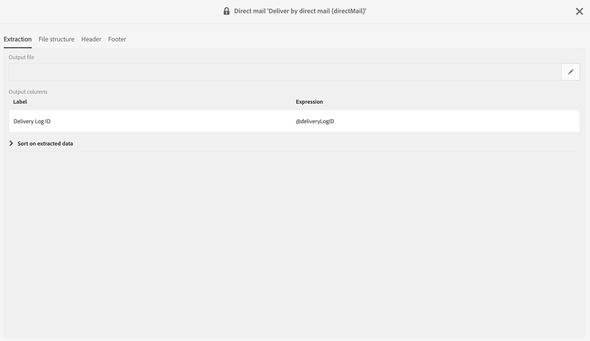

# Devolución al remitente{#return-to-sender}

Se admiten los intercambios de archivos planos con proveedores de correo directo que incorporan información de devolución al remitente. Esto permite excluir las direcciones postales correspondientes de futuras comunicaciones. Esto también le permite recibir una notificación de una dirección incorrecta y contactar con el cliente a través de otros canales o animarle a actualizar su dirección postal.

Por ejemplo, un contacto se ha trasladado a un nuevo lugar y no le ha proporcionado su nueva dirección postal. El proveedor recupera la lista de direcciones erróneas y envía esta información a Adobe Campaign, que las incluye en la lista de bloqueados automáticamente de forma automática.

Para que esta funcionalidad funcione, la plantilla de envíos predeterminada de correo postal incluye, en el contenido, el ID de registro de envíos. Por lo tanto, Adobe Campaign puede sincronizar los datos de perfil y envío con la información devuelta por el proveedor.

Hay disponible una plantilla de importación en **[!UICONTROL Adobe Campaign > Resources > Templates > Import templates > Update Direct Mail quarantines and delivery logs]**. Duplique esta plantilla para crear la suya propia. Para obtener más información sobre cómo usar plantillas de importación, consulte [Usar plantillas de importación](../../automating/using/importing-data-with-import-templates.md#setting-up-import-templates).

Cuando la importación haya finalizado, Adobe Campaign realizará automáticamente las siguientes acciones:

* Las direcciones incorrectas se añaden a la lista de bloqueados de datos en el nivel de perfil de
* Se actualizan los indicadores principales de entrega (KPI)
* Se actualizan los registros de envío
