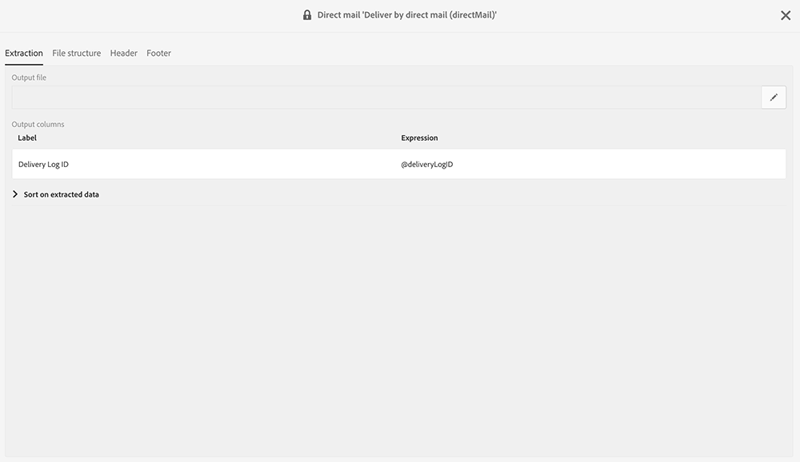

# Devolver al remitente{#return-to-sender}

Se admiten los intercambios de archivos planos con proveedores de Correo postal que incorporan la información de retorno al remitente. Esto permite excluir las direcciones postales correspondientes de futuras comunicaciones. Esto también le permite ser notificado de una dirección incorrecta y ponerse en contacto con el cliente a través de otros canales o alentarlo a actualizar su dirección postal.

Por ejemplo, un contacto se ha trasladado a un nuevo lugar y no le ha proporcionado su nueva dirección postal. El proveedor recupera la lista de direcciones erróneas y envía esta información al Adobe Campaign, que automáticamente agrega a la lista de bloques las direcciones erróneas.

Para que esta funcionalidad funcione, la Plantilla de envíos predeterminada de correo directo incluye, en el contenido, el ID de registro de envío. Por lo tanto, Adobe Campaign podrá sincronizar los datos de perfil y envío con la información devuelta por el proveedor.

En la sección **[!UICONTROL Adobe Campaign > Resources > Templates > Import templates > Update Direct Mail quarantines and delivery logs]** hay una plantilla de importación disponible. Duplicado esta plantilla para crear la suya propia. Para obtener más información sobre el uso de plantillas de importación, consulte [Uso de plantillas de importación](../../automating/using/importing-data-with-import-templates.md#setting-up-import-templates).

Cuando la importación ha finalizado, Adobe Campaign realiza automáticamente las siguientes acciones:

* Se agregan direcciones incorrectas a la lista de bloques a nivel de perfil
* Se actualizan los indicadores principales de envío (KPI)
* Se actualizan los registros de envío

