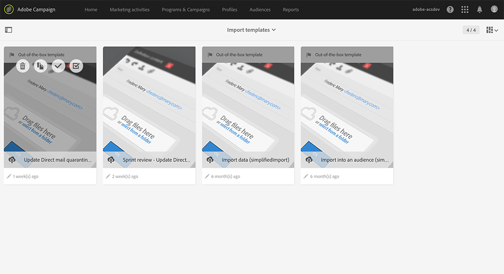

# Return to sender{#return-to-sender}

Se admiten intercambios de archivos planos con proveedores de correo directo que incorporan información de retorno a remitente. Esto permite excluir las direcciones postales correspondientes de futuras comunicaciones. Esto también le permite recibir notificaciones de una dirección incorrecta e interactuar con el cliente a través de otros canales o pedirle que actualice su dirección postal.

Por ejemplo, un contacto se ha trasladado a un nuevo lugar y no le proporcionó su nueva dirección postal. El proveedor recupera la lista de direcciones erróneas y envía esta información a Adobe Campaign, la cual automáticamente muestra las direcciones erróneas.

Para que esta funcionalidad funcione, la plantilla de envío predeterminada de correo directo incluye, en el contenido, el ID de registro de entrega. De este modo, Adobe Campaign podrá sincronizar los datos de entrega y perfil con la información que devuelve el proveedor.

An import template is available under **[!UICONTROL Adobe Campaign > Resources > Templates > Import templates > Update Direct Mail quarantines and delivery logs]**. Duplique esta plantilla para crear los suyos propios. For more on using import templates, refer to [Using import templates](../../automating/using/defining-import-templates.md).

Cuando se realiza la importación, Adobe Campaign realiza automáticamente las siguientes acciones:

* Las direcciones incorrectas están bloqueadas en el nivel de perfil
* Se actualizan los indicadores principales de entrega (KPI)
* Se actualizan los registros de entrega

