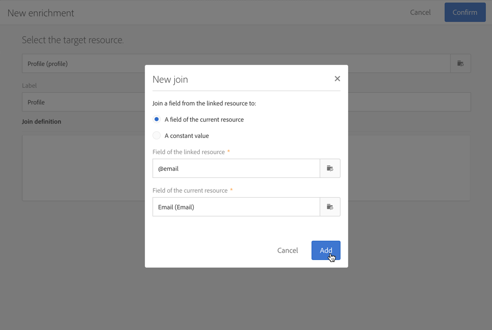

# Configuración de un proceso de inclusión doble{#setting-up-a-double-opt-in-process}

## Acerca de la opción de inclusión doble {#about-double-opt-in}

El mecanismo de inclusión doble es una práctica recomendada al enviar correos electrónicos. Protege la plataforma de direcciones de correo electrónico erróneas o no válidas, bots de spam y evita posibles reclamaciones de spam.

El principio es enviar un correo electrónico para confirmar el acuerdo del visitante antes de almacenarlo como “perfiles” en la base de datos de Campaign: el visitante rellena una página de aterrizaje en línea, luego recibe un correo electrónico y tiene que hacer clic en el enlace de confirmación para finalizar su suscripción.

Para configurarlo, debe:

1. Crear y publicar una página de aterrizaje para que los visitantes puedan registrarse y suscribirse. Esta página de aterrizaje debe estar disponible en un sitio web. Los visitantes que rellenen y envíen esta página de aterrizaje se almacenan en la base de datos, pero se añaden a la lista de bloqueados para no recibir ninguna comunicación antes de la validación final (consulte ). [Administración de la Lista de bloqueados de datos en Campaign](../../audiences/using/about-opt-in-and-opt-out-in-campaign.md)).
1. Cree y envíe automáticamente el correo electrónico de inclusión, con un vínculo de confirmación. Este correo electrónico se envía a quienes hayan enviado la página de aterrizaje. Se basa en una plantilla de correo electrónico que permite dirigirse a perfiles de “exclusión”.
1. Redirija a una página de aterrizaje de confirmación. Esta página de aterrizaje final incluye un botón de confirmación: los visitantes tienen que hacer clic en él. Puede diseñar un mensaje de correo electrónico de bienvenida para que se envíe cuando la confirmación esté completa y, por ejemplo, añadir una oferta especial en el mensaje para nuevos destinatarios.

Estos pasos deben configurarse en Adobe Campaign en un orden específico para que todos los parámetros estén correctamente activados.

## Paso 1: crear la página de aterrizaje de confirmación {#step-1--create-the-confirmation-landing-page}

Proceso para configurar inicios del mecanismo de inclusión doble con la creación de la página de aterrizaje de confirmación: esta página se muestra cuando los visitantes hayan hecho clic en el correo electrónico de confirmación para registrarse.

Para crear y configurar esta página de aterrizaje, debe:

1. Diseñe una [nueva página de aterrizaje](../../channels/using/getting-started-with-landing-pages.md) basada en la plantilla **[!UICONTROL Profile acquisition (acquisition)]**. Introducir la etiqueta “**CONFIRMATION**”.

   Si necesita utilizar [servicios](../../audiences/using/about-subscriptions.md), también puede utilizar la plantilla **[!UICONTROL Subscription (sub)]**.

1. Edite las propiedades de la página de aterrizaje y en la sección **[!UICONTROL Access and loading]**, desactive la opción **[!UICONTROL Authorize unidentified visitors]**, seleccione **[!UICONTROL Preload visitor data]** (esta opción no es obligatoria).

   

1. En la sección **[!UICONTROL Job]** > **[!UICONTROL Additional data]**, haga clic en **[!UICONTROL Add an element]** e introduzca la siguiente ruta de contexto:

   /context/profile/blackList

   Establezca el valor en **false** y haga clic en **[!UICONTROL Add]**.

   

   Este contexto elimina el campo &quot;En la lista de bloqueados de la&quot; para poder enviar correos electrónicos. Más adelante, veremos que la primera página de aterrizaje era establecer este campo en **true** antes de la confirmación, para evitar enviar correos electrónicos a perfiles no confirmados. Para obtener más información, consulte el [paso 3: crear la página de aterrizaje de adquisición](#step-3--create-the-acquisition-landing-page).

1. Personalice el contenido de la página de aterrizaje: puede mostrar datos personalizados y cambiar la etiqueta del botón de confirmación a “Haga clic aquí para confirmar la suscripción”, por ejemplo.

   

1. Adapte el contenido de la página de confirmación para informar a los suscriptores de que ya están registrados.

   

1. [Prueba y publicación](../../channels/using/testing-publishing-landing-page.md) de una página de aterrizaje.

## Paso 2: crear el correo electrónico de confirmación {#step-2--create-the-confirmation-email}

Una vez creada la página de aterrizaje de confirmación, puede diseñar el correo electrónico de confirmación: este correo se envía automáticamente a todos los visitantes que validan la página de aterrizaje de adquisición. Esta validación se considera un evento y el correo electrónico es un mensaje transaccional, vinculado a una regla de tipología específica que permite el envío a poblaciones de exclusión.

A continuación se describen los pasos para crear estos elementos. Debe seguirlos antes de crear la propia página de aterrizaje de adquisición, ya que en ella se hace referencia a esta plantilla de correo electrónico.

### Creación del evento {#create-the-event}

El correo electrónico de confirmación es un [mensaje transaccional](../../channels/using/getting-started-with-transactional-msg.md), ya que reacciona ante un evento: la validación del formulario. Primero debe crear el evento y luego crear la plantilla del mensaje transaccional.

1. En el logotipo de Adobe Campaign, acceda al menú **[!UICONTROL Marketing plans]** > **[!UICONTROL Transactional messages]** > **[!UICONTROL Event configuration]** para crear un evento e introduzca la etiqueta “**CONFIRM**”.
1. Seleccione la dimensión de segmentación **[!UICONTROL Profile]** y haga clic en **[!UICONTROL Create]**.

   

1. En la sección **[!UICONTROL Fields]**, haga clic en **[!UICONTROL Create element]** y añada el elemento **[!UICONTROL email]** en la estructura de datos para habilitar la reconciliación.
1. En la sección **[!UICONTROL Enrichment]**, haga clic en **[!UICONTROL Create element]** y seleccione el recurso de destino **[!UICONTROL Profile]**. A continuación, puede asignar el campo **[!UICONTROL email]** de la sección **[!UICONTROL Join definition]** o cualquier otra clave de reconciliación compuesta, según lo que necesite.

   

   Si necesita utilizar servicios, añada el recurso de destino **[!UICONTROL Service]** y asígnelo en el campo **[!UICONTROL serviceName]**. Para obtener más información, consulte .

1. Seleccione **[!UICONTROL Profile]** como el **[!UICONTROL Targeting enrichment]** en la lista desplegable.
1. Haga clic en **[!UICONTROL Publish]** para publicar el evento.

El evento está listo. Ahora puede diseñar la plantilla de correo electrónico. Esta plantilla debe incluir un vínculo a la página de aterrizaje de **CONFIRMACIÓN** creada anteriormente. Para obtener más información, consulte [Diseño del mensaje de confirmación](#design-the-confirmation-message).

### Creación de la tipología {#create-the-typology-rule}

Debe crear una [tipología](../../sending/using/about-typology-rules.md) específica duplicando una predeterminada. La tipología permite enviar mensajes a perfiles que aún no han confirmado el acuerdo y que aún están en proceso de lista de bloqueados. De forma predeterminada, las tipologías excluyen los perfiles de exclusión (es decir, en la lista de bloqueados de la). Para crear esta tipología, siga estos pasos:

1. En el logotipo de Adobe Campaign, seleccione **[!UICONTROL Administration]** > **[!UICONTROL Channels]** > **[!UICONTROL Typologies]** y haga clic en **[!UICONTROL Typologies]**.
1. Duplique la tipología **[!UICONTROL Transactional message on profile (mcTypologyProfile)]** predeterminada.
1. Una vez confirmada la duplicación, edite la nueva tipología e introduzca la etiqueta **TYPOLOGY_PROFILE**.
1. Retire el **Dirección en la lista de bloqueados de** regla.
1. Haga clic en **[!UICONTROL Save]**.

Esta tipología ahora se puede asociar al correo electrónico de confirmación.

### Diseño del mensaje de confirmación {#design-the-confirmation-message}

El correo electrónico de confirmación es un mensaje transaccional basado en el evento creado anteriormente. Siga los pasos a continuación para crear este mensaje:

1. En el logotipo de Adobe Campaign, seleccione **[!UICONTROL Marketing plans]** > **[!UICONTROL Transactional messages]** y haga clic en **[!UICONTROL Transactional messages]**.
1. Edite la plantilla de correo electrónico **CONFIRM** y personalícela. Puede cargar un contenido existente o utilizar una plantilla predeterminada.
1. Añada un vínculo a la página de aterrizaje de **CONFIRMACIÓN** y haga clic en **[!UICONTROL Confirm]** para guardar las modificaciones.

   

1. Edite las propiedades de la plantilla de correo electrónico. En la sección **[!UICONTROL Advanced parameters]** > **[!UICONTROL Preparation]**, seleccione la tipología **TYPOLOGY_PROFILE** creada anteriormente.
1. Guarde y publique el mensaje transaccional.

## Paso 3: crear la página de aterrizaje de adquisición {#step-3--create-the-acquisition-landing-page}

Debe crear la página de aterrizaje de adquisición inicial: este formulario de inclusión se publica en su sitio web.

Para crear y configurar esta página de aterrizaje, debe:

1. Diseñe una [nueva página de aterrizaje](../../channels/using/getting-started-with-landing-pages.md) basada en la plantilla **[!UICONTROL Profile acquisition (acquisition)]**. Escriba la etiqueta “**ACQUISITION**”.
1. Edite las propiedades de la página de aterrizaje: en la sección **[!UICONTROL Job]** > **[!UICONTROL Additional data]**, haga clic en **[!UICONTROL Add an element]** e introduzca la siguiente ruta de contexto:

   /context/profile/blackList

   y establezca el valor en **true**.

   Esto es obligatorio para forzar la adición a la lista de bloqueados de la y evitar enviar mensajes a los visitantes que no confirmaron su acuerdo. La validación de la página de aterrizaje de CONFIRMACIÓN establece este campo en **false** tras la confirmación. Para obtener más información, consulte el [paso 1: crear la página de aterrizaje de confirmación](#step-1--create-the-confirmation-landing-page).

1. En la sección **[!UICONTROL Job]** > **[!UICONTROL Specific actions]**, seleccione la opción **[!UICONTROL Start sending messages]**.
1. En la lista desplegable asociada, elija la plantilla de mensaje transaccional **CONFIRM** que ha creado.

   

1. Personalice el contenido de la página de aterrizaje en función de su marca y de los datos que necesite adquirir. Puede mostrar datos personalizados y cambiar la etiqueta del botón de confirmación a, por ejemplo, **Confirmar mi suscripción**.

   

1. Personalice la página de confirmación para informar a los nuevos suscriptores de que necesitan validar su suscripción.

   

1. [Prueba y publicación](../../channels/using/testing-publishing-landing-page.md) de una página de aterrizaje.

El mecanismo de inclusión doble ya está configurado. Puede ejecutar y probar el procedimiento de principio a fin, empezando por la dirección URL pública de esta página de aterrizaje **[!UICONTROL ACQUISITION]**. Esta dirección URL se muestra en el panel de página de aterrizaje.
