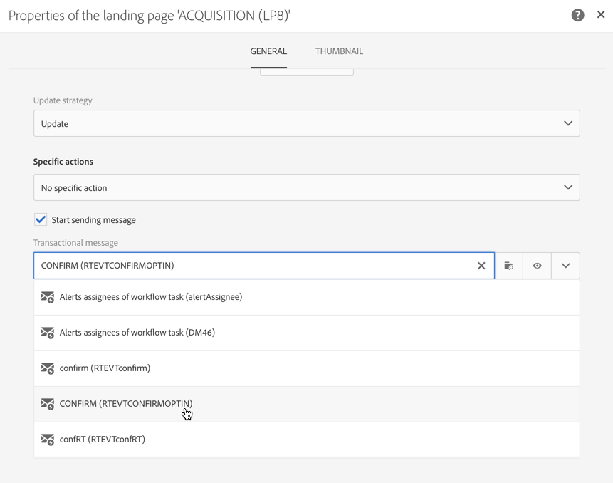

# Configuración de un proceso de inclusión doble{#setting-up-a-double-opt-in-process}

## Acerca de la opción de inclusión en doble {#about-double-opt-in}

El mecanismo de selección de Doble es una práctica recomendada al enviar correos electrónicos. Protege la plataforma de direcciones de correo electrónico equivocadas o no válidas, spambots y evita posibles quejas de spam.

El principio es enviar un correo electrónico para confirmar el acuerdo del visitante antes de almacenarlo como &quot;perfiles&quot; en la base de datos de Campañas: el visitante rellena una página de aterrizaje en línea, luego recibe un correo electrónico y tiene que hacer clic en el vínculo de confirmación para finalizar su suscripción.

Para configurar esto, debe:

1. Cree y publique una página de aterrizaje para que los visitantes puedan registrarse y suscribirse. Esta página de aterrizaje estará disponible en un sitio web. Los Visitantes que rellenen y envíen esta página de aterrizaje se almacenarán en la base de datos, pero &quot;en la lista negra&quot;, para no recibir ninguna comunicación antes de la validación final (consulte [Gestión de la lista negra en Campaña](../../audiences/using/about-opt-in-and-opt-out-in-campaign.md)).
1. Cree y envíe automáticamente el correo electrónico de inclusión, con un vínculo de confirmación. Este correo electrónico destinatario a la población que envió la página de aterrizaje. Se basará en una plantilla de correo electrónico que permite el destinatario de perfiles de &quot;exclusión&quot;.
1. Redirija a una página de aterrizaje de confirmación. Esta página de aterrizaje final propondrá un botón de confirmación: los visitantes tienen que hacer clic en él. Puede diseñar un mensaje de correo electrónico de bienvenida para que se envíe cuando la confirmación esté completa y, por ejemplo, agregar una oferta especial en el mensaje de correo electrónico para nuevos destinatarios.

Estos pasos deben configurarse en Adobe Campaign en un orden específico para que todos los parámetros estén correctamente activados.

## Paso 1: Crear la página de aterrizaje de confirmación {#step-1--create-the-confirmation-landing-page}

El proceso para configurar inicios del mecanismo de selección de dobles con la creación de la página de aterrizaje de confirmación: esta página se mostrará cuando los visitantes hayan hecho clic en el correo electrónico de confirmación para registrarse.

Para crear y configurar esta página de aterrizaje, debe:

1. Diseñe una [nueva página de aterrizaje](../../channels/using/getting-started-with-landing-pages.md) basada en la **[!UICONTROL Profile acquisition (acquisition)]** plantilla. Introduzca la etiqueta &#39;**CONFIRMATION**&#39;.

   Si necesita utilizar [servicios](../../audiences/using/about-subscriptions.md), también puede utilizar la **[!UICONTROL Subscription (sub)]** plantilla.

1. Edite las propiedades de la página de aterrizaje y en la **[!UICONTROL Access and loading]** sección, deseleccione la opción **[!UICONTROL Authorize unidentified visitors]**, seleccione **[!UICONTROL Preload visitor data]** (esta opción no es obligatoria).

   

1. En la sección **[!UICONTROL Job]** > **[!UICONTROL Additional data]** , haga clic en **[!UICONTROL Add an element]** e introduzca la siguiente ruta de contexto:

   /context/perfil/blackList

   Establezca el valor en **false** y haga clic en **[!UICONTROL Add]**.

   

   Este contexto elimina el campo de lista negra para poder enviar correos electrónicos. Más adelante veremos que la primera página de aterrizaje era establecer este campo en **true** antes de la confirmación, para evitar enviar correos electrónicos a perfiles no confirmados. Para obtener más información sobre esto, consulte el [paso 3: Cree la página de aterrizaje](#step-3--create-the-acquisition-landing-page)de adquisición.

1. Personalice el contenido de la página de aterrizaje: puede mostrar datos personalizados y cambiar la etiqueta del botón de confirmación a &quot;Haga clic aquí para confirmar mi suscripción&quot;, por ejemplo.

   

1. Adapte el contenido de la página de confirmación para informar a los suscriptores de que ya están registrados.

   

1. [Pruebe y publique](../../channels/using/testing-publishing-landing-page.md) la página de aterrizaje.

## Paso 2: Crear el correo electrónico de confirmación {#step-2--create-the-confirmation-email}

Una vez creada la página de aterrizaje de confirmación, puede diseñar el correo electrónico de confirmación: este correo electrónico se enviará automáticamente a todos los visitantes que validen la página de aterrizaje de adquisición. Esta validación se considera un evento y el correo electrónico es un mensaje transaccional, vinculado a una reglas de tipología específica que permite el destinatario de poblaciones de exclusión.

A continuación se describen los pasos para crear estos elementos. Debe seguirlos antes de crear la propia página de aterrizaje de adquisición, ya que en ella se hará referencia a esta plantilla de correo electrónico.

### Crear el evento {#create-the-event}

El correo electrónico de confirmación es un [mensaje transaccional](../../channels/using/about-transactional-messaging.md) al reaccionar ante un evento: la validación del formulario. Primero debe crear el evento y luego crear la plantilla del mensaje transaccional.

1. Cree un evento, en el menú **[!UICONTROL Marketing plans]** > **[!UICONTROL Transactional messages]** > **[!UICONTROL Event configuration]** , accesible desde el logotipo de Adobe Campaign e introduzca la etiqueta &#39;**CONFIRM**&#39;.
1. Seleccione la **[!UICONTROL Profile]** dimensión de segmentación y haga clic en **[!UICONTROL Create]**.

   

1. En la **[!UICONTROL Fields]** sección, haga clic en **[!UICONTROL Create element]** y agregue el **[!UICONTROL email]** elemento en la estructura de datos para habilitar la reconciliación.
1. En la **[!UICONTROL Enrichment]** sección, haga clic en **[!UICONTROL Create element]** y seleccione el recurso de **[!UICONTROL Profile]** destinatario. A continuación, puede asignar el **[!UICONTROL email]** campo de la **[!UICONTROL Join definition]** sección o cualquier otra clave de reconciliación compuesta, según sus necesidades.

   

   Si necesita utilizar servicios, agregue el recurso de **[!UICONTROL Service]** destinatario y asigne la asignación en el **[!UICONTROL serviceName]** campo. Para obtener más información, consulte .

1. Seleccione **[!UICONTROL Profile]** como la **[!UICONTROL Targeting enrichment]** en la lista desplegable.
1. Haga clic en **[!UICONTROL Publish]** para publicar el evento.

El evento está listo. Ahora puede diseñar la plantilla de correo electrónico. Esta plantilla debe incluir un vínculo a la página de aterrizaje de **CONFIRMACIÓN** creada anteriormente. Para obtener más información sobre esto, consulte [Diseño del mensaje](#design-the-confirmation-message)de confirmación.

### Crear la tipología {#create-the-typology-rule}

Debe crear una [tipología](../../sending/using/about-typology-rules.md)específica duplicando una lista de elementos predefinidos. La tipología permitirá enviar mensajes a perfiles que aún no han confirmado su acuerdo y que siguen en la lista negra. De forma predeterminada, las tipologías excluyen los perfiles de exclusión (es decir, en la lista negra). Para crear esta tipología, siga estos pasos:

1. En el logotipo de Adobe Campaign, seleccione **[!UICONTROL Administration]** > **[!UICONTROL Channels]** > **[!UICONTROL Typologies]** y haga clic en **[!UICONTROL Typologies]**.
1. Duplicado la tipología lista para usar **[!UICONTROL Transactional message on profile (mcTypologyProfile)]**.
1. Una vez confirmada la duplicación, edite la nueva tipología e introduzca la etiqueta **TYPOLOGY_PERFIL**.
1. Elimine la regla de dirección **** en la lista negra.
1. Haga clic **[!UICONTROL Save]**.

Esta tipología ahora se puede asociar al correo electrónico de confirmación.

### Diseño del mensaje de confirmación {#design-the-confirmation-message}

El correo electrónico de confirmación es un mensaje transaccional basado en el evento creado anteriormente. Siga los pasos a continuación para crear este mensaje:

1. En el logotipo de Adobe Campaign, seleccione **[!UICONTROL Marketing plans]** > **[!UICONTROL Transactional messages]** y haga clic en **[!UICONTROL Transactional messages]**.
1. Edite la plantilla de correo electrónico **CONFIRM** y personalícela. Puede cargar un contenido existente o utilizar una plantilla lista para usar.
1. Añada un vínculo a la página de aterrizaje **CONFIRMACIÓN** y haga clic en **[!UICONTROL Confirm]** para guardar las modificaciones.

   

1. Edite las propiedades de la plantilla de correo electrónico. En la sección **[!UICONTROL Advanced parameters]** > **[!UICONTROL Preparation]** , seleccione la tipología **TYPOLOGY_PERFIL** creada anteriormente.
1. Guarde y publique el mensaje transaccional.

## Paso 3: Crear la página de aterrizaje de adquisición {#step-3--create-the-acquisition-landing-page}

Debe crear la página de aterrizaje de adquisición inicial: este formulario de selección se publicará en su sitio web.

Para crear y configurar esta página de aterrizaje, debe:

1. Diseñe una [nueva página de aterrizaje](../../channels/using/getting-started-with-landing-pages.md) basada en la **[!UICONTROL Profile acquisition (acquisition)]** plantilla. Escriba la etiqueta &#39;**ADQUISICIÓN**&#39;.
1. Edite las propiedades de la página de aterrizaje: en la sección **[!UICONTROL Job]** > **[!UICONTROL Additional data]** , haga clic en **[!UICONTROL Add an element]** e introduzca la siguiente ruta de contexto:

   /context/perfil/blackList

   y establezca el valor en **true**.

   Esto es obligatorio para forzar la lista negra y evitar enviar mensajes a los visitantes que no confirmaron su acuerdo. La validación de la página de aterrizaje CONFIRMATION establecerá este campo en **false** tras la confirmación. Para obtener más información sobre esto, consulte el [Paso 1: Cree la página de aterrizaje](#step-1--create-the-confirmation-landing-page)de confirmación.

1. En la sección **[!UICONTROL Job]** > **[!UICONTROL Specific actions]** , seleccione la opción **[!UICONTROL Start sending messages]**.
1. En la lista desplegable asociada, elija la Plantilla de mensaje transaccional **CONFIRM** que ha creado.

   

1. Personalice el contenido de la página de aterrizaje en función de su marca y de los datos que necesite adquirir. Puede mostrar datos personalizados y cambiar la etiqueta del botón de confirmación para, por ejemplo, **Confirmar mi suscripción** .

   

1. Personalice la página de confirmación para informar al nuevo suscriptor de que necesita validar su suscripción.

   

1. [Pruebe y publique](../../channels/using/testing-publishing-landing-page.md) la página de aterrizaje.

El mecanismo de inclusión de Doble ya está configurado. Puede ejecutar y probar el procedimiento de principio a fin, empezando por la dirección URL pública de esta **[!UICONTROL ACQUISITION]** página de aterrizaje. Esta dirección URL se muestra en el panel de página de aterrizaje.
