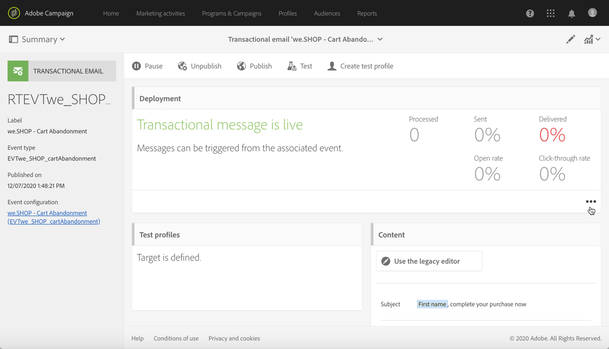
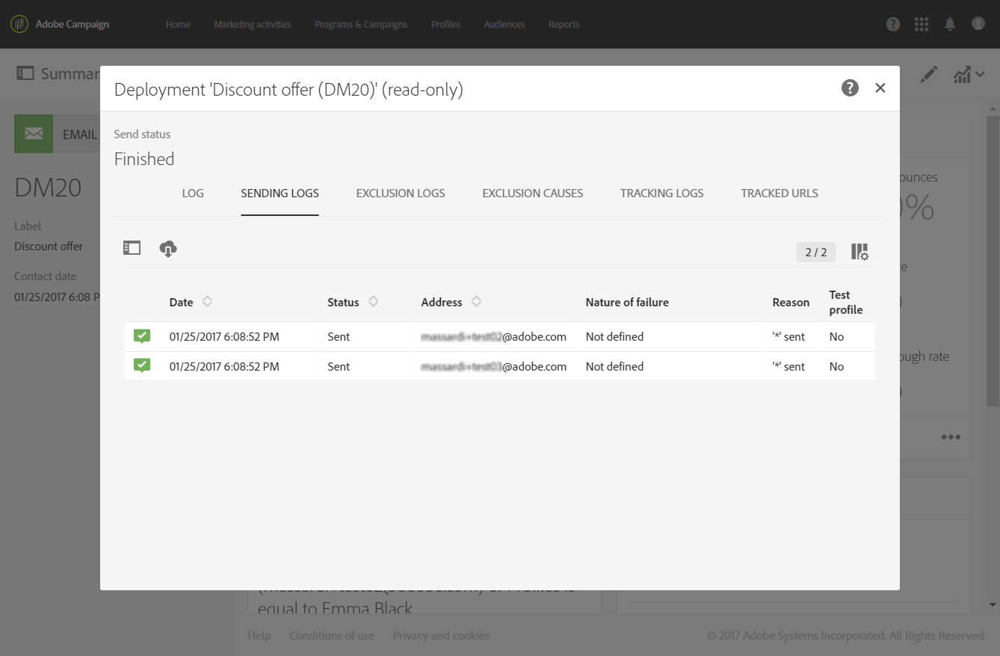

# Ejecución y monitorización de la mensajería transaccional {#transactional-messaging-execution}

## Entrega de ejecución de mensajes transaccionales {#transactional-message-execution-delivery}

Una vez que se publica el mensaje y se completa la integración del sitio, cuando se activa un evento, se asigna a un envío de ejecución.

Un **envío de ejecución** es un mensaje técnico no procesable y no funcional creado una vez al mes para cada mensaje transaccional y cada vez que se edita y publica un mensaje transaccional de nuevo.

**Temas relacionados**:
* [Publicación de un mensaje transaccional](../../channels/using/publishing-transactional-message.md#publishing-a-transactional-message)
* [Integración del activador de eventos](../../channels/using/getting-started-with-transactional-msg.md#integrate-event-trigger)

## Proceso de reintentos de mensajería transaccional {#transactional-message-retry-process}

Un mensaje transaccional no entregado temporalmente está sujeto a reintentos automáticos que se realizan hasta que caduca el envío. Para obtener más información sobre la duración del envío, consulte [Parámetros del periodo de validez](../../administration/using/configuring-email-channel.md#validity-period-parameters).

Cuando no se puede enviar un mensaje transaccional, hay dos sistemas de reintentos:

* En el nivel de mensajería transaccional, un mensaje transaccional puede fallar antes de que el evento se asigne a un envío de ejecución; es decir, entre la recepción del evento y la preparación de este. Consulte [Proceso de reintentos del procesamiento de un evento](#event-processing-retry-process).
* A nivel de proceso de envío, una vez que el evento se ha asignado a un envío de ejecución, el mensaje transaccional puede fallar debido a un error temporal. Consulte [Proceso de reintentos del envío de mensajes](#message-sending-retry-process).

### Proceso de reintentos del procesamiento de un evento {#event-processing-retry-process}

Cuando se activa un evento, se asigna a un envío de ejecución. Si el evento no se puede asignar a un envío de ejecución, se pospone el procesamiento del evento. Los reintentos se realizan hasta que se asignan a un nuevo envío de ejecución.

>[!NOTE]
>
>Un evento pospuesto no aparece en los registros de envío del mensaje transaccional, ya que todavía no está asignado a un envío de ejecución.

Por ejemplo, el evento no se ha podido asignar a un envío de ejecución porque su contenido no era correcto, había un problema con los derechos de acceso o la marca, se detectó un error al aplicar reglas de tipología, etc. En este caso, puede pausar el mensaje, editarlo para solucionar el problema y publicarlo de nuevo. El sistema de reintentos lo asigna a un nuevo envío de ejecución.

### Proceso de reintentos del envío de mensajes {#message-sending-retry-process}

Una vez asignado el evento a un envío de ejecución, el mensaje transaccional puede fallar debido a un error temporal, si el buzón del destinatario está lleno, por ejemplo. Para obtener más información, consulte [Reintentos después de un error temporal de entrega](../../sending/using/understanding-delivery-failures.md#retries-after-a-delivery-temporary-failure).

>[!NOTE]
>
>Cuando se asigna un evento a un envío de ejecución, aparece en los registros de este envío de ejecución y solo en este momento. Los envíos fallidos se muestran en la pestaña **[!UICONTROL Execution list]** de los registros de envío de mensajes transaccionales.

### Limitaciones del proceso de reintento {#limitations}

**Envío de la actualización de registros**

En el proceso de reintentos, los registros de envío del nuevo envío de ejecución no se actualizan inmediatamente (la actualización se realiza mediante un flujo de trabajo programado). Significa que el mensaje podría estar en estado **[!UICONTROL Pending]** aunque el nuevo envío de ejecución haya procesado el evento transaccional.

**Error en el envío de ejecución**

No se puede detener un envío de ejecución. Sin embargo, si falla el envío de ejecución actual, se crea uno nuevo en cuanto se recibe un nuevo evento y todos los eventos nuevos se procesan con este nuevo envío de ejecución. El envío de ejecución con errores no procesa eventos nuevos.

Si algunos eventos ya asignados a un envío de ejecución se han pospuesto como parte del proceso de reintentos y si ese envío de ejecución falla, el sistema de reintentos no asigna los eventos pospuestos al nuevo envío de ejecución, lo que significa que estos eventos se pierden. Compruebe los [delivery logs](#monitoring-transactional-message-delivery) para ver los destinatarios que pueden haber sido afectados.

## Supervisión de mensajes transaccionales {#monitoring-transactional-message-delivery}

Para monitorizar un mensaje transaccional, debe acceder a los [envíos de ejecución](#transactional-message-execution-delivery) correspondientes.

1. Para ver el registro de envíos de mensajes, haga clic en el icono situado en la parte inferior derecha del bloque **[!UICONTROL Deployment]**.

   

1. Seleccione la pestaña **[!UICONTROL Execution list]**.

   

1. Seleccione la entrega de ejecución que desee.

   

1. Haga clic de nuevo en el icono situado en la parte inferior derecha del bloque **[!UICONTROL Deployment]** .

   

   Para cada entrega de ejecución, puede consultar los registros de envío como lo haría para una entrega estándar. Para obtener más información sobre el acceso y el uso de los registros, consulte [Monitorización de un envío](../../sending/using/monitoring-a-delivery.md).

### Características específicas de los mensajes transaccionales basados en perfiles {#profile-transactional-message-monitoring}

Para los mensajes transaccionales basados en perfiles, puede monitorizar la siguiente información de perfil.

Seleccione la pestaña **[!UICONTROL Sending logs]** En la columna **[!UICONTROL Status]**, **[!UICONTROL Sent]** indica que un perfil se ha suscrito.

Seleccione la pestaña **[!UICONTROL Exclusions logs]** para ver los destinatarios que se han excluido del destinatario del mensaje, como las direcciones de lista de bloqueados.

En el caso de cualquier perfil que se haya excluido, la regla de tipología **[!UICONTROL Address on denylist]** excluyó el destinatario correspondiente.

Esta regla forma parte de una tipología específica que se aplica a todos los mensajes transaccionales basados en la tabla **[!UICONTROL Profile]**.

**Temas relacionados**:

* [Acerca de las tipologías y reglas de tipología](../../sending/using/about-typology-rules.md)
* [Seguimiento de una entrega](../../sending/using/monitoring-a-delivery.md)
