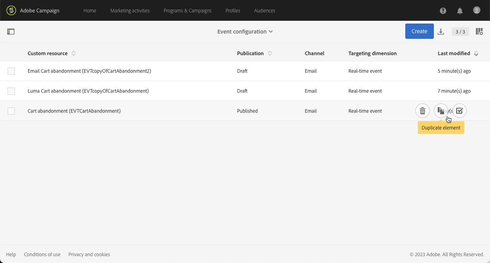

# Mejoras en los eventos transaccionales {#transactional-event-improvements}

>[!AVAILABILITY]
>
>Actualmente, estas funciones solo están disponibles para un conjunto de organizaciones (disponibilidad limitada). Para obtener más información, póngase en contacto con el representante del Adobe.

Actualmente, en Adobe Campaign Standard, los usuarios sin el grupo de seguridad Administrador no pueden acceder, crear ni publicar eventos transaccionales, lo que provoca problemas para los usuarios empresariales que necesitan configurar y publicar eventos pero carecen de derechos de administrador. Además, no es posible duplicar eventos transaccionales.

Hemos implementado las siguientes mejoras en el control de acceso de mensajería transaccional:

* Un nuevo **[!UICONTROL Role]**, llamado **usuario de MC**, se ha agregado para permitir que los usuarios que no son administradores administren la configuración de eventos transaccionales. La variable **usuario de MC** otorga a estos usuarios la capacidad de acceder, crear, publicar y cancelar la publicación de eventos y mensajes transaccionales.

* Los envíos de ejecución (es decir, los mensajes técnicos que se crean cada vez que se edita y publica un mensaje transaccional de nuevo, o una vez al mes de forma predeterminada) ahora se establecen en la variable **[!UICONTROL Organizational unit]** del grupo de seguridad al que pertenece el usuario que crea el evento, en lugar de limitarse al **[!UICONTROL Organizational unit]** del **Agente del centro de mensajes (mcExec)** grupo de seguridad.

* **Administradores** ahora puede duplicar eventos transaccionales publicados, así como usuarios con la variable **usuario de MC** siempre que estén en el mismo **Unidad organizativa** como el usuario que creó el evento.

## Asignar la función de usuario de MC {#assign-role}

Para asignar la variable **usuario de MC** para su grupo de seguridad:

1. Cree una nueva **[!UICONTROL Security group]** o actualizar uno existente. [Más información](../../administration/using/managing-groups-and-users.md).

1. Haga clic en **[!UICONTROL Create element]** para asignar funciones al grupo de seguridad.

   

1. Seleccione el usuario de MC **[!UICONTROL Role]** y haga clic en **[!UICONTROL Confirm]**.

   >[!IMPORTANT]
   >
   > Proceda con precaución al asignar la función de usuario de MC a los operadores, ya que esto les otorga la capacidad de cancelar la publicación de eventos.

   

1. Una vez configurada, haga clic en **[!UICONTROL Save]**.

Usuarios vinculados a esto **[!UICONTROL Security group]** ahora puede acceder, crear y publicar eventos y mensajes transaccionales.

## Asignar el grupo de seguridad de usuario de MC {#assign-group}

1. En el Admin Console, seleccione la opción **Productos** pestaña .

1. Select **Adobe Campaign Standard** a continuación, elija la instancia.

1. En el **Perfiles de producto** seleccione **usuario de MC** grupo.

1. Haga clic en **Agregar usuario** e introduzca el nombre, el grupo de usuarios o la dirección de correo electrónico del perfil que desea agregar a este perfil de producto.

1. Una vez añadido, haga clic en **Guardar**.

Usuarios agregados a esto **[!UICONTROL Security group]** ahora puede acceder, crear y publicar eventos y mensajes transaccionales.

## Duplicar eventos transaccionales {#duplicate-transactional-events}

Un usuario con la variable **Administrador** grupo de seguridad<!--([Functional administrators](../../administration/using/users-management.md#functional-administrators)?)--> ahora puede duplicar una configuración de evento si se ha **publicado**.

Además, los usuarios no administradores con la variable **usuario de MC** ahora puede acceder a las configuraciones de evento, pero su permiso para duplicar lo determina el **Unidad organizativa** pertenecen a. Si el usuario actual y el usuario que creó el evento pertenecen a la misma jerarquía de unidades organizativas, se permite la duplicación.

Por ejemplo, si un usuario que pertenece a la unidad organizativa &quot;Ventas de Francia&quot; crea una configuración de evento:

* Otro usuario cuya unidad organizativa es &quot;Ventas de París&quot; podrá duplicar este evento, porque &quot;Ventas de París&quot; forma parte de la unidad organizativa &quot;Ventas de Francia&quot;.

* Sin embargo, un usuario cuya unidad organizativa es &quot;Ventas de San Francisco&quot; no podrá hacerlo, ya que &quot;Ventas de San Francisco&quot; está en la unidad organizativa &quot;Ventas de EE. UU.&quot;, que está separada de la unidad organizativa &quot;Ventas de Francia&quot;.

Para duplicar una configuración de evento, siga los pasos a continuación.

1. Haga clic en el **Adobe** , en la esquina superior izquierda, seleccione **[!UICONTROL Marketing plans]** > **[!UICONTROL Transactional messages]** > **[!UICONTROL Event configuration]**.

1. Pase el ratón sobre la configuración de evento publicada que desee y seleccione la opción **[!UICONTROL Duplicate element]** botón.

   

   >[!CAUTION]
   >
   >No se puede duplicar una configuración de evento que no se haya publicado. [Más información](publishing-transactional-event.md)

1. El evento duplicado se muestra automáticamente. Contiene la misma configuración que definió para el evento original, pero tiene la variable **[!UICONTROL Draft]** estado.

   

1. El mensaje transaccional correspondiente se crea automáticamente. Para acceder a él, vaya a **[!UICONTROL Transactional messages]** > **[!UICONTROL Transactional messages]**.

   

1. Abra el mensaje recién duplicado. Contiene el mismo diseño que definió para el mensaje original, pero tiene la variable **[!UICONTROL Draft]** , aunque se haya publicado el mensaje transaccional original.

   

1. Ahora puede editar y personalizar este mensaje. Consulte [Edición de mensajes transaccionales](../../channels/using/editing-transactional-message.md).

## Impactos {#impacts}

La tabla siguiente describe el impacto de estas mejoras:

| Objetos | Antes de este cambio | Después de este cambio |
|:-: | :--: | :-:|
| Eventos transaccionales | Solo los usuarios dentro de la variable **Administrador** grupo de seguridad puede crear y publicar eventos. | La variable **usuario de MC** permite a los usuarios crear y publicar eventos. |
| Mensajes transaccionales | Los mensajes transaccionales se establecen en la variable **Unidad organizativa** del **Agente del centro de mensajes (mcExec)** grupo de seguridad. | Los mensajes transaccionales se establecen en la variable **Unidad organizativa** del grupo de seguridad al que pertenece el usuario que crea el evento o mensaje transaccional. |
| Entregas de ejecución | Las entregas de ejecución se establecen en **Unidad organizativa** del **Agente del centro de mensajes (mcExec)** grupo de seguridad. | Las entregas de ejecución se establecen en **Unidad organizativa** del grupo de seguridad al que pertenece el usuario que crea el evento o mensaje transaccional. |
| Eventos transaccionales publicados | La duplicación no es posible para ningún usuario. | <ul><li>Los usuarios con la variable **Administrador** el grupo de seguridad puede duplicar los eventos publicados.</li> <li>Los usuarios con la variable **usuario de MC** puede duplicar eventos publicados siempre que estén en el mismo **Unidad organizativa** como el usuario que creó el evento.</li></ul> |

<!--Transactional Message Templates| Transactional Message templates are set to the Organizational unit **All**. | Transaction Message Template will be set to the **Organizational unit** of the security group to which the user creating the message template belongs.-->