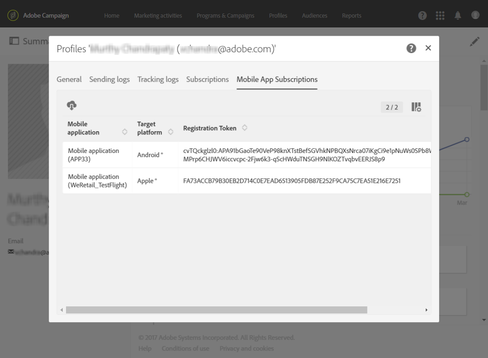
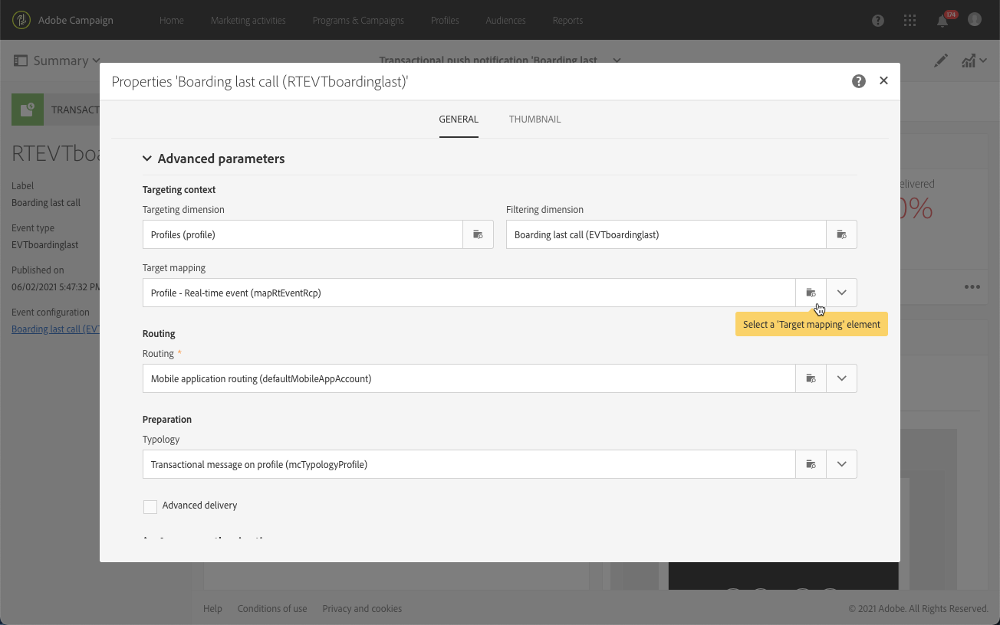

# Notificaciones push transaccionales{#transactional-push-notifications}

Puede utilizar Adobe Campaign para enviar notificaciones push transaccionales a dispositivos móviles iOS y Android. Estos mensajes se reciben en aplicaciones móviles que se configuran en Adobe Campaign mediante el uso del SDK para móviles de Experience Cloud.

>[!NOTE]
>
>El canal push es opcional. Compruebe el acuerdo de licencia. Para obtener más información sobre las notificaciones push estándar, consulte [Acerca de las notificaciones push](../../channels/using/about-push-notifications.md).

Para poder enviar notificaciones push transaccionales, debe configurar Adobe Campaign en consecuencia. Consulte [Configuración de una aplicación móvil](../../administration/using/configuring-a-mobile-application.md).

Puede enviar dos tipos de notificaciones push transaccionales:

* [Notificaciones push transaccionales dirigidas a un evento](#transactional-push-notifications-targeting-an-event)
* [Notificaciones push transaccionales dirigidas a ](#transactional-push-notifications-targeting-a-profile) perfiles de la base de datos de Adobe Campaign

## Notificaciones push transaccionales dirigidas a un evento {#transactional-push-notifications-targeting-an-event}

Puede utilizar Adobe Campaign para enviar **notificaciones push transaccionales anónimas a todos los usuarios** que hayan elegido recibir notificaciones de su aplicación móvil.

En este caso, solo **los datos contenidos en el propio evento se utilizan para definir el destinatario del envío**. No se aprovecha ningún dato de la base de datos de perfiles integrada de Adobe Campaign.

### Configuración de una notificación push transaccional basada en eventos {#configuring-event-based-transactional-push-notification}

Para enviar una notificación push transaccional a todos los usuarios que han elegido recibir notificaciones desde la aplicación móvil, primero debe crear y configurar un evento dirigido a los datos contenidos en el propio evento.

>[!NOTE]
>
>Puede personalizar el contenido de una notificación push transaccional basada en eventos utilizando [atributos de evento](../../channels/using/configuring-transactional-event.md#defining-the-event-attributes) (datos del evento) y [enriquecimiento de evento](../../channels/using/configuring-transactional-event.md#enriching-the-transactional-message-content) (datos de la base de datos de Campaign). Consulte [el ejemplo siguiente](#sending-event-based-transactional-push-notification).

El evento debe contener los tres elementos siguientes:

* Un **token de registro**, que es el ID de usuario para una aplicación móvil y un dispositivo. Puede que no se corresponda con ningún perfil de la base de datos de Adobe Campaign.
* Un **nombre de aplicación móvil** (uno para todos los dispositivos: Android e iOS). Este es el ID de la aplicación móvil configurada en Adobe Campaign que se utiliza para recibir notificaciones push en los dispositivos de los usuarios. Para obtener más información, consulte [Configuración de una aplicación móvil](../../administration/using/configuring-a-mobile-application.md).
* Una **plataforma push** (&quot;gcm&quot; para Android o &quot;apns&quot; para iOS).

Para configurar el evento, siga los pasos a continuación:

1. Al crear la configuración de evento, seleccione el canal **[!UICONTROL Push notification]** y la dimensión de segmentación **[!UICONTROL Real-time event]** (consulte [Creación de un evento](../../channels/using/configuring-transactional-event.md#creating-an-event)).
1. Agregue campos al evento. Esto le permitirá personalizar el mensaje transaccional (consulte [Definición de los atributos de evento](../../channels/using/configuring-transactional-event.md#defining-the-event-attributes)). En este ejemplo, defina los campos &quot;gateNumber&quot;, &quot;lastname&quot; y &quot;firstname&quot;.
1. También puede enriquecer el contenido del mensaje. Para ello, añada campos de la tabla que vinculó a la configuración del evento (consulte [Enriquecimiento del evento](../../channels/using/configuring-transactional-event.md#enriching-the-transactional-message-content)).

   <!--Event-based transactional messaging is supposed to use only the data that are in the sent event to define the recipient and the message content personalization. However, you can enrich the content of your transactional message using information from the Adobe Campaign database.-->

1. [Obtenga una vista previa del evento y publíquelo](../../channels/using/publishing-transactional-event.md#previewing-and-publishing-the-event).

   Al obtener una vista previa del evento, la API de REST contiene los atributos &quot;registrationToken&quot;, &quot;application&quot; y &quot;pushPlatform&quot; que se utilizarán para dirigir la entrega.

   

   Una vez publicado el evento, se crea automáticamente una notificación push transaccional vinculada al nuevo evento. Ahora puede modificar y publicar el mensaje que acaba de crear (consulte [esta sección](#sending-event-based-transactional-push-notification)).

1. Integre el evento en su sitio web (consulte [Integrar el activador de eventos](../../channels/using/getting-started-with-transactional-msg.md#integrate-event-trigger)).

### Envío de una notificación push transaccional basada en eventos {#sending-event-based-transactional-push-notification}

Por ejemplo, una compañía aérea desea invitar a los usuarios de su aplicación móvil a que procedan a la puerta de embarque correspondiente.

La empresa enviará una notificación push transaccional por usuario (identificada con un token de registro), utilizando una aplicación móvil, a través de un solo dispositivo.

1. Vaya al mensaje transaccional que se creó para editarlo. Consulte [Acceso a mensajes transaccionales](../../channels/using/editing-transactional-message.md#accessing-transactional-messages).

   

1. Haga clic en el bloque **[!UICONTROL Content]** para modificar el título y el cuerpo del mensaje.

1. Puede insertar campos de personalización para añadir elementos que definió al crear el evento (consulte [Definición de los atributos de evento](../../channels/using/configuring-transactional-event.md#defining-the-event-attributes)).

   

   Para encontrar estos campos, haga clic en el lápiz situado junto a un elemento, haga clic en **[!UICONTROL Insert personalization field]** y seleccione **[!UICONTROL Context]** > **[!UICONTROL Real-time event]** > **[!UICONTROL Event context]**.

   

   Para obtener más información sobre la edición de contenido de notificaciones push, consulte [Preparación y envío de una notificación push](../../channels/using/preparing-and-sending-a-push-notification.md).

1. También puede enriquecer el contenido de mensajes transaccionales si desea utilizar información adicional de la base de datos de Adobe Campaign (consulte [Enriquecimiento del evento](../../channels/using/configuring-transactional-event.md#enriching-the-transactional-message-content)).

1. Guarde los cambios y publique el mensaje. Consulte [Publicación de un mensaje transaccional](../../channels/using/publishing-transactional-message.md#publishing-a-transactional-message).

1. Mediante la API de REST de Adobe Campaign Standard, envíe un evento a un token de registro (ABCDEF123456789), utilizando una aplicación móvil (WeFlight) en Android (gcm), que contenga los datos de embarque:

   ```
   {
     "registrationToken":"ABCDEF123456789",
     "application":"WeFlight",
     "pushPlatform":"gcm",
     "ctx":
     {
       "gateNumber":"Gate B18",
       "lastname":"Green",
       "firstname":"Jane"
     }
   }
   ```

   Para obtener más información sobre la integración del activador de un evento en un sistema externo, consulte [Integración del activador de eventos](../../channels/using/getting-started-with-transactional-msg.md#integrate-event-trigger).

Si existe el token de registro, el usuario correspondiente recibe una notificación push transaccional que incluye el siguiente contenido:

*&quot;Hola Jane Green, el embarque acaba de empezar! Proceda a la Puerta B18.&quot;*

## Notificaciones push transaccionales dirigidas a un perfil {#transactional-push-notifications-targeting-a-profile}

Puede enviar una notificación push transaccional **a los perfiles de Adobe Campaign que se han suscrito a su aplicación móvil**. Este envío puede contener [campos personalizados](../../designing/using/personalization.md#inserting-a-personalization-field), como el nombre del destinatario, recuperados directamente de la base de datos de Adobe Campaign.

En este caso, el evento debe contener algunos campos **que permitan la reconciliación con un perfil de la base de datos de Adobe Campaign**.

Al segmentar perfiles, se envía una notificación push transaccional por aplicación móvil y por dispositivo. Por ejemplo, si un usuario de Adobe Campaign se ha suscrito a dos aplicaciones, este usuario recibirá dos notificaciones. Si un usuario se ha suscrito a la misma aplicación con dos dispositivos diferentes, este usuario recibirá una notificación en cada dispositivo.

Las aplicaciones móviles a las que se ha suscrito un perfil se enumeran en la pestaña **[!UICONTROL Mobile App Subscriptions]** de este perfil. Para acceder a esta pestaña, seleccione un perfil y haga clic en el botón **[!UICONTROL Edit profile properties]** de la derecha.



Para obtener más información sobre el acceso y la edición de perfiles, consulte [Acerca de los perfiles](../../audiences/using/about-profiles.md).

### Configuración de una notificación push transaccional basada en perfiles {#configuring-profile-based-transactional-push-notification}

Para enviar una notificación push transaccional a los perfiles de Adobe Campaign que se han suscrito a su aplicación móvil, primero debe crear y configurar un evento dirigido a la base de datos de Adobe Campaign.

1. Al crear la configuración de evento, seleccione el canal **[!UICONTROL Push notification]** y la dimensión de segmentación **[!UICONTROL Profile]** (consulte [Creación de un evento](../../channels/using/configuring-transactional-event.md#creating-an-event)).

   De forma predeterminada, la notificación push transaccional se envía a todas las aplicaciones móviles a las que se suscribieron los destinatarios. Para enviar la notificación push a una aplicación móvil específica, selecciónela en la lista. El mensaje identifica las demás aplicaciones móviles, pero se excluyen del envío.

   

1. Agregue campos al evento si desea personalizar el mensaje transaccional (consulte [Definición de los atributos de evento](../../channels/using/configuring-transactional-event.md#defining-the-event-attributes)).

   >[!NOTE]
   >
   >Debe agregar al menos un campo para crear un enriquecimiento. No es necesario crear otros campos como **First name** y **Last name**, ya que podrá utilizar campos de personalización de la base de datos de Adobe Campaign.

1. Cree un enriquecimiento para vincular el evento al recurso **[!UICONTROL Profile]** (consulte [Enriquecimiento del evento](../../channels/using/configuring-transactional-event.md#enriching-the-transactional-message-content)) y seleccione este enriquecimiento como **[!UICONTROL Targeting enrichment]**.

   >[!IMPORTANT]
   >
   >Este paso es obligatorio para los eventos basados en perfiles.

1. [Obtenga una vista previa del evento y publíquelo](../../channels/using/publishing-transactional-event.md#previewing-and-publishing-the-event).

   Al obtener una vista previa del evento, la API de REST no contiene un atributo que especifique el token de registro, el nombre de la aplicación y la plataforma push, ya que se recuperarán del recurso **[!UICONTROL Profile]** .

   Una vez publicado el evento, se crea automáticamente una notificación push transaccional vinculada al nuevo evento. Ahora puede modificar y publicar el mensaje que acaba de crear (consulte [esta sección](#sending-profile-based-transactional-push-notification)).

1. Integre el evento en su sitio web (consulte [Integrar el activador de eventos](../../channels/using/getting-started-with-transactional-msg.md#integrate-event-trigger)).

### Envío de una notificación push transaccional basada en perfiles {#sending-profile-based-transactional-push-notification}

Por ejemplo, una compañía aérea desea enviar una última llamada para embarcar a todos los usuarios de Adobe Campaign que se hayan suscrito a su aplicación móvil.

1. Vaya al mensaje transaccional que se creó para editarlo. Consulte [Acceso a mensajes transaccionales](../../channels/using/editing-transactional-message.md#accessing-transactional-messages).

1. Haga clic en el bloque **[!UICONTROL Content]** para modificar el título y el cuerpo del mensaje.

   A diferencia de las configuraciones basadas en eventos en tiempo real, tiene acceso directo a toda la información de perfil para personalizar su mensaje. Consulte [Inserción de un campo de personalización](../../designing/using/personalization.md#inserting-a-personalization-field).

   Para obtener más información sobre la edición de contenido de notificaciones push, consulte [Preparación y envío de una notificación push](../../channels/using/preparing-and-sending-a-push-notification.md).

1. Guarde los cambios y publique el mensaje. Consulte [Publicación de un mensaje transaccional](../../channels/using/publishing-transactional-message.md#publishing-a-transactional-message).
1. Con la API de REST de Adobe Campaign Standard, envíe un evento a un perfil:

   ```
   {
     "ctx":
     {
       "email":"janegreen@email.com",
       "gateNumber":"D16",
     }
   }
   ```

Para obtener más información sobre la integración del activador de un evento en un sistema externo, consulte [Integración del activador de eventos](../../channels/using/getting-started-with-transactional-msg.md#integrate-event-trigger).

El usuario correspondiente recibe una notificación push transaccional que incluye todos los elementos de personalización recuperados de la base de datos de Adobe Campaign.

>[!NOTE]
>
>No hay campos de token de registro, aplicación y plataforma push. En este ejemplo, la reconciliación se realiza con el campo de correo electrónico.

## Modificación de la asignación de destino en una notificación push transaccional {#change-target-mapping}

Las notificaciones push transaccionales utilizan una [asignación de destino](../../administration/using/target-mappings-in-campaign.md) específica que contiene la configuración técnica necesaria para enviar este tipo de envíos.

Para cambiar esta asignación de destino, siga los pasos a continuación:

1. En la lista de mensajes transaccionales, seleccione una notificación push.

1. En el panel del mensaje, haga clic en el botón **[!UICONTROL Edit properties]**.

   

1. Expanda la sección **[!UICONTROL Advanced parameters]** .

1. Haga clic en **[!UICONTROL Select a 'Target mapping' element]**.

   

1. Seleccione una asignación de destino en la lista.

   >[!NOTE]
   >
   >Para obtener un tiempo y un rendimiento óptimos de preparación del envío al enviar **notificaciones push transaccionales basadas en perfiles**, utilice la asignación de destino **[!UICONTROL Profile - Real-time event for Push (mapRtEventAppSubRcp)]**.

   

1. Confirme el cambio y publique el mensaje. Consulte [Publicación de un mensaje transaccional](../../channels/using/publishing-transactional-message.md#publishing-a-transactional-message).

   >[!IMPORTANT]
   >
   >Debe volver a publicar el mensaje para que el cambio sea efectivo; de lo contrario, se utilizará la asignación de destino anterior.


