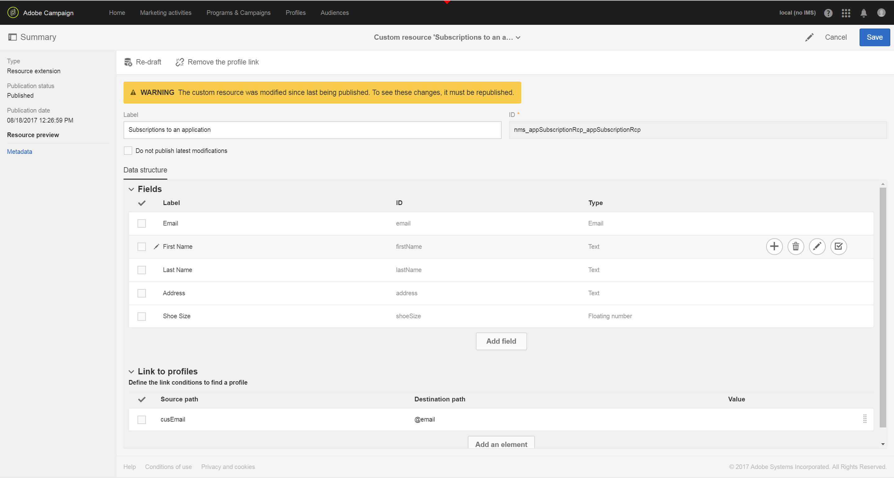
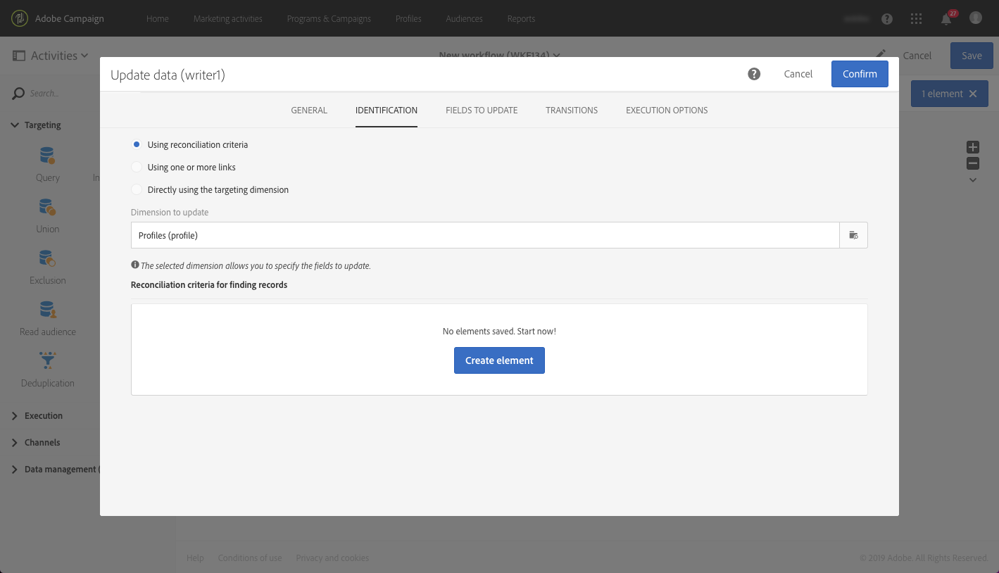

# Creación y actualización de información de perfil basada en datos de aplicaciones móviles

## Información general

En esta página se describen los pasos para desarrollar un flujo de trabajo que cree o actualice datos de perfil después de que una aplicación móvil envíe Recopilar datos PII de forma programada.

* **PII** significa &quot;Información de identificación personal&quot;. Pueden ser cualquier dato, incluida la información que no aparece en la tabla Perfil de la base de datos de Campaign como, por ejemplo, Analytics para dispositivos móviles [Puntos de interés](../../integrating/using/about-campaign-points-of-interest-data-integration.md). El desarrollador de aplicaciones móviles define la PII, normalmente con un experto en marketing.
* **Recopilar PII** es una operación POST de HTTP para una API de REST en Adobe Campaign Standard desde una aplicación móvil.

El objetivo de este caso de uso es crear o actualizar un perfil de Campaign Standard, si los datos PII devueltos por una aplicación móvil contienen datos relacionados con el perfil.

## Requisitos previos

Hay que seguir varios pasos de configuración para habilitar las notificaciones push en Campaign Standard antes de poder crear o actualizar perfiles según los datos de suscripción de aplicaciones móviles:

1. [Crear una aplicación móvil](../../administration/using/configuring-a-mobile-application.md)
1. [Integración del SDK de Adobe Mobile con la aplicación móvil](../../administration/using/supported-mobile-use-cases.md).
1. [Configuración de Adobe Campaign para enviar notificaciones push](../../administration/using/configuring-a-mobile-application.md).

## Paso 1: Ampliación del recurso de perfil para notificaciones push/suscripciones

Para poder crear o actualizar el recurso de perfil con datos PII, primero debe ampliar el recurso de perfil con los campos deseados. Para ello, haga lo siguiente:

* Identifique los campos PII que envía la aplicación móvil.
* Identifique el campo que se utilizará para la reconciliación a fin de asociar los datos PII con los datos del perfil.

En este ejemplo, la variable **[!UICONTROL Fields]** reflejan los datos PII enviados por la aplicación móvil. El **[!UICONTROL Link to profiles]** indica el campo que se utiliza para asociar la PII con los datos del perfil, donde **cusEmail** se asigna a **@email**.

Asignación de datos de perfil al ampliar el **[!UICONTROL Subscriptions to an Application]** El recurso es de solo lectura. Se utiliza para la reconciliación. El perfil debe introducirse en el sistema con los datos necesarios para conciliarlo con los datos PII. En nuestro caso, una dirección de correo electrónico del perfil debe coincidir con un correo electrónico de la PII de recopilación para que se produzca la reconciliación:

* La PII de recopilación se recibe de una aplicación móvil para un usuario cuyo nombre es &quot;Jane&quot;, el apellido es &quot;Doe&quot; y la dirección de correo electrónico es janedoe@doe.com.
* Por separado, los datos de perfil deben existir (por ejemplo, los datos deben introducirse manualmente o ya proceder de algún otro recurso) donde la dirección de correo electrónico del perfil sea janedoe@doe.com.

**Temas relacionados:**

* [Ampliación de las suscripciones a un recurso de aplicación](../../developing/using/extending-the-subscriptions-to-an-application-resource.md).
* [Creación o ampliación de un recurso existente](../../developing/using/key-steps-to-add-a-resource.md).

## Paso 2: Creación del flujo de trabajo

El uso de un flujo de trabajo en Campaign Standard permite a este identificar y sincronizar datos de forma exclusiva entre los datos de suscripción de aplicación (suscriptor) y los datos de perfil o destinatario. Aunque una actualización basada en el flujo de trabajo no sincroniza los datos de perfil en tiempo real, no debería provocar bloqueos o sobrecargas indebidos en la base de datos.

Los pasos principales para crear el flujo de trabajo son estos:

1. Utilice un **[!UICONTROL Query]** o **[!UICONTROL Incremental query]** actividad para obtener una lista de las suscripciones más recientes.
1. Utilice un **[!UICONTROL Reconciliation]** actividad para asignar los datos PII al perfil.
1. Añada algún proceso de verificación.
1. Utilice un **[!UICONTROL Update data]** para actualizar o crear el perfil con los datos PII.

En este flujo de trabajo se asumen los siguientes requisitos:

* Todos los campos que se hayan ampliado deben estar disponibles para crear o actualizar la tabla de perfil.
* La tabla Perfil se puede ampliar para que admita campos que no se admiten de forma nativa (por ejemplo, Tamaño de camiseta).
* Ningún campo de la tabla AppSubscription vacío debe actualizarse en la tabla Perfil.
* Cualquier registro que se haya actualizado en la tabla AppSubscription debe incluirse en la siguiente ejecución del flujo de trabajo.

Para crear el flujo de trabajo, arrastre y suelte las siguientes actividades en el espacio de trabajo y vincúlelas: **[!UICONTROL Start]**, **[!UICONTROL Scheduler]**, **[!UICONTROL Incremental query]**, **[!UICONTROL Update data]**.

A continuación, siga los pasos a continuación para configurar cada actividad.

### Configure las variables **[!UICONTROL Scheduler]** actividad

En el **[!UICONTROL General]** pestaña, configure el **[!UICONTROL Execution frequency]** (por ejemplo, &quot;Diario&quot;), la variable **[!UICONTROL Time]** (por ejemplo, &quot;1:00:00 AM&quot;) y el **[!UICONTROL Start]** (por ejemplo, Fecha de hoy).

### Configure las variables **[!UICONTROL Incremental query]** actividad.

1. En el **[!UICONTROL Properties]** , haga clic en **[!UICONTROL Select an element]** icono de la **[!UICONTROL Resource]** y, a continuación, seleccione el **[!UICONTROL Subscriptions to an application (nms:appSubscriptionRcp:appSubscriptionRcpDetail)]** Elemento.

   

1. En el **[!UICONTROL Target]** pestaña, arrastre el **[!UICONTROL Mobile application]** y, a continuación, seleccione un nombre de aplicación móvil.

   

1. En el **[!UICONTROL Processed data]** pestaña, seleccione **[!UICONTROL Use a date field]** y, a continuación, agregue **[!UICONTROL Last modified (lastModified)]**  campo como **[!UICONTROL Path to the date field]**.

   

### Configure las variables **[!UICONTROL Update data]** actividad.

1. En el **[!UICONTROL Identification]** pestaña, asegúrese de que la variable **[!UICONTROL Dimension to update]** está definido en &quot;Perfiles (perfil)&quot; y, a continuación, haga clic en **[!UICONTROL Create element]** para añadir un campo como criterio de reconciliación.

   

1. En el **[!UICONTROL Source]** , seleccione un campo de la tabla appSubscriptionRcp como campo de reconciliación. Puede ser el correo electrónico del perfil, crmId, marketingCloudId, etc. En este ejemplo, utilice el campo &quot;Correo electrónico (cusEmail)&quot;.

1. En el **[!UICONTROL Destination]** , seleccione un campo de la tabla de perfil para reconciliar los datos de la tabla appSubscriptionRcp. Puede ser el correo electrónico del perfil o cualquier campo ampliado, como crmId, marketingCloudId, etc. En este ejemplo, es necesario seleccionar el campo &quot;Correo electrónico (correo electrónico)&quot; para asignarlo con el campo &quot;Correo electrónico (cusEmail)&quot; de la tabla appSubscriptionRcp.

   

1. En el **[!UICONTROL Fields to update]** , haga clic en **[!UICONTROL Create element]** y luego asigne los campos procedentes de la tabla appSubscriptionRcp (**[!UICONTROL Source]** ) con los campos que desea actualizar en la tabla Perfil (**[!UICONTROL Destination]** field).

1. En el **[!UICONTROL Enabled if]** , agregue una expresión para asegurarse de que el campo correspondiente de la tabla Perfil se actualiza solo si el campo de origen contiene un valor. Para ello, seleccione el campo de la lista y añada el icono &quot;!expresión =&#39;&#39;&quot; (si el campo Origen es `[target/@cusEmail]` en el Editor de expresiones, asegúrese de escribir. `[target/@cusEmail] != ''"`).

   

>[!NOTE]
>
>En este caso, el flujo de trabajo realiza una actualización, pero como se basa en una **[!UICONTROL Incremental query]** solo se insertan los datos de. Cambiar la consulta puede afectar a los datos que se insertan o actualizan.
>Además, la configuración de la pestaña Fields to update determina qué campos se insertan o actualizan bajo condiciones específicas. Esta configuración puede ser única para cada aplicación o cliente.
>Tenga cuidado al configurar estos ajustes, ya que puede haber consecuencias no deseadas, ya que la actualización de registros en el perfil basados en datos de appSubscriptionRcp puede cambiar la información personal de los usuarios sin validación.

Cuando se hayan añadido todos los campos que se van a insertar/actualizar en el perfil, haga clic en **[!UICONTROL Confirm]**.

Guarde el flujo de trabajo y haga clic en **[!UICONTROL Start]** para ejecutar el flujo de trabajo.

