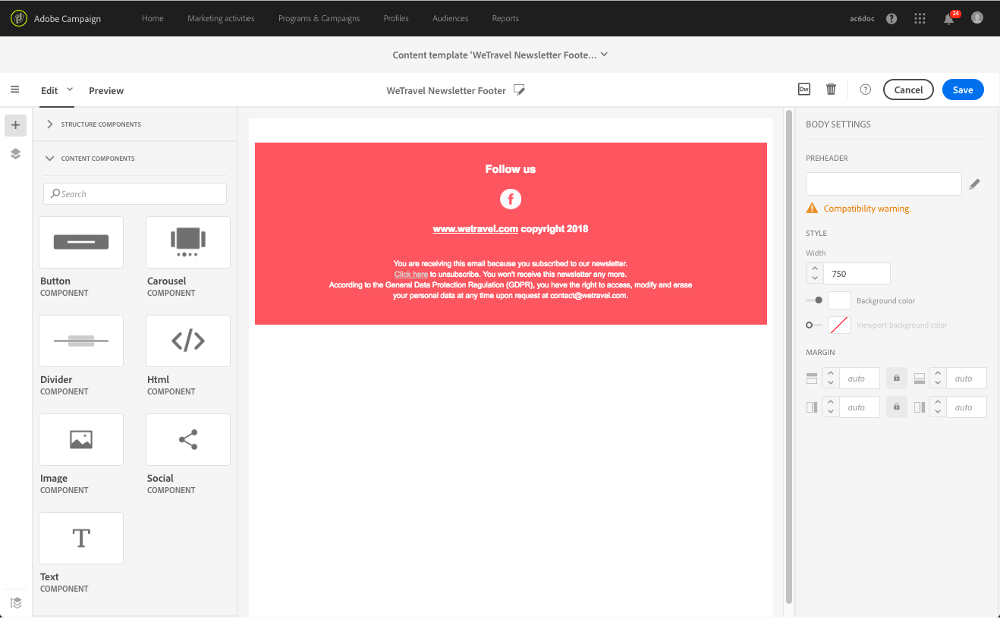

# About email content design{#about-email-content-design}

Utilice la interfaz de arrastrar y soltar de correo electrónico de Designer para crear y modificar el contenido de sus correos electrónicos en Adobe Campaign.

Esta sección describe las especificidades del mensaje de correo electrónico de Designer:

* [Acerca de Email Designer](../../designing/using/about-email-content-design.md#about-the-email-designer)
* [Definición de la estructura de correo electrónico](../../designing/using/defining-the-email-structure.md)
* [Edición de estilos de correo electrónico](../../designing/using/editing-email-styles.md)

Para obtener más información sobre las acciones comunes a una o más actividades de mercadotecnia, consulte las siguientes secciones:

* For more on personalizing an email content, see [Inserting a personalization field](../../designing/using/inserting-a-personalization-field.md) and [Adding a content block](../../designing/using/adding-a-content-block.md).
* For more on importing another email content, see [Selecting an existing content](../../designing/using/selecting-an-existing-content.md).
* For more on defining dynamic content in an email, see [Defining dynamic content in an email](../../designing/using/defining-dynamic-content-in-an-email.md).
* For more on inserting links in an email, see [Inserting a link](../../designing/using/inserting-a-link.md).
* For more on inserting images in an email, see [Inserting images](../../designing/using/inserting-images.md).

Also check the [general best practices for content design](../../designing/using/content-design-best-practices.md).

## About the Email Designer {#about-the-email-designer}

El correo electrónico de Designer permite crear contenido de correo electrónico y plantillas de contenido de correo electrónico. Es compatible con correos electrónicos simples, correos electrónicos transaccionales, correos electrónicos de prueba A/B, correos electrónicos multilingües y correos electrónicos recurrentes.

To get started with the Email Designer, watch this [set of videos](https://helpx.adobe.com/campaign/kt/acs/using/acs-email-designer-tutorial.html#GettingStarted) that explain the general functionality of the Email Designer and how to design an email from scratch or using templates.

### Email Designer home page {#email-designer-home-page}

When [creating an email](../../channels/using/creating-an-email.md), the **[!UICONTROL Email Designer]** home page automatically displays upon selecting the email content.


The **[!UICONTROL Properties]** tab enables you to edit the email details such as the label, the sender's address and name, or the email subject. También puede acceder a esta ficha haciendo clic en la etiqueta de correo electrónico en la parte superior de la pantalla.


The **[!UICONTROL Templates]** tab enables you to choose from the out-of-the-box HTML contents or the templates that you already created to quickly start designing your email. See [Content templates](../../start/using/about-templates.md#content-templates).


The **[!UICONTROL Learn & support]** tab gives you easy access to the related documentation and tutorials.


Si no selecciona una plantilla, la página principal de Designer Designer también le permite elegir cómo desea comenzar a diseñar el contenido:

* Click the **[!UICONTROL Create]** button to start a new content from scratch. See [Designing an email content from scratch](../../designing/using/about-email-content-design.md#designing-an-email-content-from-scratch).
* Click the **[!UICONTROL Upload]** button to upload a file from your computer. See [Importing content from a file](../../designing/using/importing-content-from-a-file.md).
* Click the **[!UICONTROL Import from URL]** button to retrieve existing content form a URL. See [Importing content from a URL](../../designing/using/importing-content-from-a-url.md).

### Email Designer interface {#email-designer-interface}

Designer Designer proporciona muchas opciones que le permiten crear, editar y personalizar todos los aspectos del contenido.

La interfaz consta de varias áreas que ofrecen diferentes funcionalidades:


From the elements available in the **Palette** (1), drag and drop structure components and content fragments into the main **Workspace** (2). Select a component or element in the **Workspace** (2) and customize its main styling and display characteristics from the **Settings** pane (3).

Access more general options and settings from the main **Toolbar** (4).

>[!NOTE]
>
>The **Settings** pane can move to the left according to your screen resolution and display.


The **Contextual toolbar** of the editor interface offers various functionalities depending on the zone selected. Contiene botones de acción y botones que permiten cambiar el estilo del texto. Las modificaciones realizadas siempre se aplican a la zona seleccionada.

### General recommendations for using the Email Designer {#general-recommendations-for-using-the-email-designer}

Para utilizar correctamente el correo electrónico de Designer y crear los mejores correos electrónicos tan solo es posible, recomendamos aplicar los siguientes principios:

* Utilice estilos en línea en lugar de una CSS y CSS independientes en la sección &lt; head &gt; del HTML. Al utilizar estilos en línea, puede optimizar el fragmento de contenido guardado y reutilizado.

   See [Adding inline styling attributes](../../designing/using/editing-email-styles.md#adding-inline-styling-attributes).

* Limpie su marca fácilmente creando y reutilizando fragmentos de contenido para mantener la coherencia en sus campañas de marketing.

   See [Creating a content fragment](../../designing/using/defining-the-email-structure.md#creating-a-content-fragment).

Also check the [general best practices for content design](../../designing/using/content-design-best-practices.md).

### Email Designer compatibility mode {#email-designer-compatibility-mode}

Al cargar un contenido, debe contener etiquetado específico para que sea totalmente compatible y editable con el editor WYSIWYG del correo electrónico de Designer.

Si todo o parte del HTML cargado no es compatible con el etiquetado esperado, el contenido se carga en'modo de compatibilidad ', lo que limita las posibilidades de edición a través de la interfaz de usuario.

Cuando se carga un contenido en modo de compatibilidad, puede seguir realizando las siguientes modificaciones a través de la interfaz (las acciones no disponibles están ocultas):

* Cambio del texto o cambio de una imagen
* Inserción de vínculos y campos de personalización
* Editar algunas opciones de estilo en el bloque HTML seleccionado
* Definición de contenido condicional


Otras modificaciones, como agregar nuevas secciones al correo electrónico o estilo avanzado, deben realizarse directamente en el código fuente del correo electrónico a través del modo HTML.

For more on converting an existing email into an Email Designer-compatible email, see [this section](../../designing/using/about-email-content-design.md#designing-an-email-using-existing-contents).

### Email Designer limitations {#email-designer-limitations}

* No puede utilizar campos de personalización en un fragmento. For more on fragments, see [this section](../../designing/using/defining-the-email-structure.md#about-fragments).
* No puede guardar directamente como fragmento cierto contenido de un correo electrónico que esté editando dentro del correo electrónico de Designer. Debe copiar y pegar el HTML correspondiente a dicho contenido en un nuevo fragmento. For more on this, see [Saving content as a fragment](../../designing/using/defining-the-email-structure.md#saving-content-as-a-fragment).
* Al editar estilos, sólo están disponibles oficialmente las fuentes web oficialmente admitidas por la mayoría de los clientes de correo electrónico.
* Los estilos no se pueden guardar como un tema para volver a utilizarlos. Sin embargo, el estilo CSS se puede guardar en una plantilla de contenido o en un mensaje de correo electrónico. For more on styles, see [this section](../../designing/using/editing-email-styles.md).

## Designing an email content from scratch {#designing-an-email-content-from-scratch}

Estos son los pasos principales para crear y diseñar un contenido de correo electrónico desde cero con el servidor de correo electrónico:

1. Cree un correo electrónico y abra su contenido.
1. Agregue componentes de estructura para formar el correo electrónico. See [Editing the email structure](../../designing/using/defining-the-email-structure.md#editing-the-email-structure).
1. Inserte componentes y fragmentos de contenido en los componentes de estructura. See [Adding fragments and content components](../../designing/using/defining-the-email-structure.md#adding-fragments-and-content-components).
1. Agregue imágenes y edite el texto del correo electrónico. See [Inserting images](../../designing/using/inserting-images.md).
1. Personalice su correo electrónico agregando campos de personalización, vínculos, etc. See [Inserting a personalization field](../../designing/using/inserting-a-personalization-field.md), [Inserting a link](../../designing/using/inserting-a-link.md) and [Defining dynamic content in an email](../../designing/using/defining-dynamic-content-in-an-email.md).
1. Defina la línea de asunto del correo electrónico. See [Personalizing the subject line of an email](../../designing/using/personalizing-the-subject-line-of-an-email.md).
1. Obtenga una vista previa del correo electrónico.
1. Guarde el contenido y continúe con el mensaje después de asegurarse de haber definido una audiencia y programado correctamente el envío.

You can also check out this [introduction video](https://video.tv.adobe.com/v/22771/?autoplay=true&hidetitle=true&captions=spa).

>[!NOTE]
>
>Para evitar el diseño de contenido de correo electrónico desde cero, puede utilizar plantillas de contenido integradas. For more on this, see [Content templates](../../start/using/about-templates.md#content-templates).

**Temas relacionados**:

* [Creación de un mensaje de correo electrónico](../../channels/using/creating-an-email.md)
* [Selección de contenido existente](../../designing/using/selecting-an-existing-content.md)
* [Selección de una audiencia en un mensaje](../../audiences/using/selecting-an-audience-in-a-message.md)
* [Programación de mensajes](../../sending/using/about-scheduling-messages.md)
* [Vista previa de mensajes](../../sending/using/previewing-messages.md)
* [Procesamiento por correo electrónico](../../sending/using/email-rendering.md)

## Designing an email using existing contents {#designing-an-email-using-existing-contents}

En esta sección se explica cómo convertir un correo electrónico existente a un correo electrónico compatible con Designer Designer.

By default, if you just upload any HTML (see [Importing content from a file](../../designing/using/importing-content-from-a-file.md)), the content is loaded in ' [compatibility mode](../../designing/using/about-email-content-design.md#email-designer-compatibility-mode)', which limits the edition possibilities through the UI (only in-place edition, no drag-and-drop).

Sin embargo, si desea crear un marco de plantillas modulares y fragmentos que se pueden combinar para reutilizarlos en varios correos electrónicos, debe convertir su HTML de correo electrónico en una plantilla de correo electrónico de Designer.

Al diseñar contenido con el correo electrónico de Designer, tiene tres opciones:

* [Creación de contenido desde una plantilla lista para usar](../../designing/using/about-email-content-design.md#building-content-from-an-out-of-the-box-template)
* [Uso de fragmentos y componentes](../../designing/using/about-email-content-design.md#using-fragments-and-components), comenzar desde cero y volver a crear un diseño HTML
* [Conversión de un correo electrónico de contenido](../../designing/using/about-email-content-design.md#converting-an-html-content) HTML en un contenido modular de Correo electrónico de Designer

### Building content from an out-of-the-box template {#building-content-from-an-out-of-the-box-template}

1. Cree un correo electrónico y abra su contenido. For more on this, see [Creating an email](../../channels/using/creating-an-email.md).
1. Click the home icon to access the **[!UICONTROL Email Designer]** home page.
1. Click the **[!UICONTROL Templates]** tab.
1. Elija una plantilla HTML predeterminada.

   Las distintas plantillas presentan varias combinaciones de varios tipos de elementos. Por ejemplo, las plantillas «Feather» tienen márgenes mientras que las plantillas «Astro» no tienen ninguno. For more on this, see [Content templates](../../start/using/about-templates.md#content-templates).

1. Puede combinar estos elementos para generar una serie de variantes de correo electrónico. For example, you can duplicate an email section by selecting a structure component and clicking **[!UICONTROL Duplicate]** from the contextual toolbar.
1. Puede mover los elementos alrededor de la flecha azul a la izquierda para arrastrar un componente de estructura por debajo o por encima de otro. For more on this, see [Editing the email structure](../../designing/using/defining-the-email-structure.md#editing-the-email-structure).
1. También puede mover componentes alrededor para cambiar la organización de cada elemento de estructura. For more on this, see [Adding fragments and components](../../designing/using/defining-the-email-structure.md#adding-fragments-and-content-components).
1. Modifique el contenido de cada elemento según sus necesidades: imágenes, texto, vínculos.
1. Adapte las opciones de estilo al contenido, si es necesario. For more on this, see [Editing email styles](../../designing/using/editing-email-styles.md).

### Using fragments and components {#using-fragments-and-components}

Para hacer que un contenido externo sea compatible con el Diseñador de correo electrónico, Adobe recomienda crear un mensaje desde cero y copiar el contenido del correo electrónico existente en fragmentos y componentes.

When you have a content that cannot be recreated, you can copy-paste the HTML code from the original email using the **[!UICONTROL Html]** content component. Asegúrese de estar familiarizado con HTML antes de continuar.

A continuación se muestra un ejemplo completo.

>[!NOTE]
>
>El nuevo contenido no será la copia exacta del correo electrónico original, pero los pasos a continuación le guiarán por la creación de un mensaje que será lo más parecido posible.

Supongamos que desea utilizar una newsletter existente que se creó fuera de Adobe Campaign.

Desea tener el mismo encabezado y pie de página en todos los correos electrónicos que enviará con Adobe Campaign. El cuerpo del correo electrónico cambiará según el contenido que se vaya a mostrar en cada newsletter.

**Requisitos previos**

1. En el correo electrónico original, identifique las secciones reutilizables de las secciones que serán exclusivas de cada correo electrónico que envíe.
1. Guarde todas las imágenes y recursos que desee utilizar.
1. Si está familiarizado con HTML, divida el contenido HTML original en partes diferentes.

**Creación de fragmentos para el contenido reutilizable**

Con el correo electrónico de Designer, cree un fragmento para cada sección reutilizable. En este ejemplo, creará dos fragmentos: uno para el encabezado y uno para el pie de página. A continuación, puede copiar las partes relevantes del contenido existente en estos fragmentos.

Para ello, siga los pasos a continuación:

1. In Adobe Campaign, go to **[!UICONTROL Resources]** &gt; **[!UICONTROL Content templates & fragments]** and create a fragment for your header. For more on this, see [Creating a content fragment](../../designing/using/defining-the-email-structure.md#creating-a-content-fragment).
1. Añada tantos componentes de estructura como necesite para su fragmento.

   

1. Inserte componentes de imagen y texto en su estructura.

   

1. Cargue la imagen correspondiente, introduzca el texto y ajuste la configuración.

   For more on managing style settings and inline attributes, see [Editing email styles](../../designing/using/editing-email-styles.md).

   

1. Guarde el fragmento.
1. Proceda de forma similar para crear el pie de página y guardarlo.

   

   If you are familiar with HTML, you can copy-paste the HTML code from the original footer using the **[!UICONTROL Html]** content component. For more on this, see [About content components](../../designing/using/defining-the-email-structure.md#about-content-components).

   

Los fragmentos están listos para utilizarse en una plantilla.

**Inserción de fragmentos y componentes en la plantilla**

Ahora puede crear una plantilla de correo electrónico con el correo electrónico de Designer. Utilice los componentes de contenido para reflejar las diferentes secciones del correo electrónico y ajustar la configuración para hacerlas lo más próximas posible a la newsletter original. Finalmente, inserte los fragmentos que acaba de crear.

1. Con el correo electrónico de Designer, cree una plantilla. For more on this, see [Content templates](../../start/using/about-templates.md#content-templates).
1. Inserte varios componentes de estructura en la plantilla, correspondientes al encabezado, pie de página y cuerpo del correo electrónico. For more on adding structure components, see [Editing the email structure with the Email Designer](../../designing/using/defining-the-email-structure.md#editing-the-email-structure).
1. Inserte tantos componentes de contenido como sea necesario para crear el cuerpo de la newsletter. Éste será el contenido editable de su correo electrónico que actualizará todos los meses.

   

   If you are familiar with HTML code, Adobe recommends leveraging **[!UICONTROL Html]** components where you can copy-paste the more complex elements of the original email. Use other components such as **[!UICONTROL Button]**, **[!UICONTROL Image]** or **[!UICONTROL Text]** for the rest of the content. For more on this, see [About content components](../../designing/using/defining-the-email-structure.md#about-content-components).

   >[!NOTE]
   >
   >Using the **[!UICONTROL Html]** component results in creating components that are editable with limited options. Asegúrese de que sabe cómo gestionar código HTML antes de seleccionar este componente.

1. Ajuste los componentes de contenido para que coincidan con el correo electrónico original tanto como pueda.

   

   For more on managing style settings and inline attributes, see [Editing email styles](../../designing/using/editing-email-styles.md).

1. Inserte los dos fragmentos (encabezado y pie de página) que creó anteriormente en los componentes de estructura deseados.

   

1. Guarde la plantilla.

Ahora puede administrar completamente esta plantilla dentro del correo electrónico de Designer para crear y actualizar la newsletter que enviará cada mes a sus destinatarios.

Para utilizarlo, cree un correo electrónico y seleccione la plantilla de contenido que acaba de crear.

**Tema relacionado**:

* [Creación de un mensaje de correo electrónico](../../channels/using/creating-an-email.md)
* [Vídeo de introducción al correo electrónico de Designer](https://video.tv.adobe.com/v/22771/?autoplay=true&hidetitle=true&captions=spa)
* [Diseño de contenido de correo electrónico desde cero](../../designing/using/about-email-content-design.md#designing-an-email-content-from-scratch)

### Converting an HTML content {#converting-an-html-content}

Este caso de uso ofrece una forma rápida de convertir un correo electrónico HTML a componentes de Correo electrónico de Designer.

>[!CAUTION]
>
>Esta sección es para usuarios avanzados familiarizados con código HTML.

>[!NOTE]
>
>Al igual que el modo de compatibilidad, un componente HTML se puede editar con opciones limitadas: solo puede realizar la edición in situ.

Fuera de Designer Designer, asegúrese de que el HTML original se divide en secciones reutilizables.

Si no es así, recorte los distintos bloques del HTML. Por ejemplo:

```
<!-- 3 COLUMN w/CTA (SCALED) -->
<table width="100%" align="center" cellspacing="0" cellpadding="0" border="0" role="presentation" style="max-width:680px;">
<tbody>
<tr>
<td class="padh10" align="center" valign="top" style="padding:0 5px 20px 5px;">
<table width="100%" cellspacing="0" cellpadding="0" border="0" role="presentation">
<tbody>
<tr>
...
</tr>
</tbody>
</table>
</td>
</tr>
</tbody>
</table>
<!-- //3 COLUMN w/CTA (SCALED) -->
```

Una vez identificados todos los bloques, en el correo electrónico de Designer, repita el procedimiento siguiente para cada sección del correo electrónico existente:

1. Abra el correo electrónico de Designer para crear un contenido de correo electrónico vacío.
1. Establezca los atributos de nivel de cuerpo: colores de fondo, anchura, etc. For more on this, see [Editing email styles](../../designing/using/editing-email-styles.md).
1. Agregue un componente de estructura. For more on this, see [Editing the email structure](../../designing/using/defining-the-email-structure.md#editing-the-email-structure).
1. Agregue un componente HTML. For more on this, see [Adding fragments and components](../../designing/using/defining-the-email-structure.md#adding-fragments-and-content-components).
1. Copie y pegue el HTML en ese componente.
1. Cambiar a vista móvil. For more on this, see [this section](../../designing/using/about-email-content-design.md#switching-to-mobile-view).

   La vista adaptable está dañada porque falta CSS.

1. Para arreglarlo, cambie al modo de código fuente y copie y pegue la sección de estilo en una nueva sección de estilo. Por ejemplo:

   ```
   <style type="text/css">
   a {text-decoration:none;}
   body {min-width:100% !important; margin:0 auto !important; padding:0 !important;}
   img {line-height:100%; text-decoration:none; -ms-interpolation-mode:bicubic;}
   ...
   </style>
   ```

   >[!NOTE]
   >
   >Do not modify the CSS generated by the Email Designer: `<style acrite-template-css="true">` and `<style acrite-custom-styles="" type="text/css">`. Asegúrese de agregar el estilo después de esto.

1. Regrese a la vista móvil para comprobar que el contenido se muestra correctamente y guarde los cambios.

## Switching to mobile view {#switching-to-mobile-view}

Puede ajustar el diseño interactivo de un mensaje de correo electrónico editando todas las opciones de estilo para la visualización móvil por separado. Por ejemplo, puede adaptar márgenes y relleno, utilizar tamaños de fuente más pequeños o más pequeños, cambiar botones o aplicar distintos colores de fondo que serán específicos de la versión móvil del correo electrónico.

Todas las opciones de estilo están disponibles en la vista móvil. The Email Designer style settings are presented in the [Editing email styles](../../designing/using/editing-email-styles.md) section.

1. Cree un correo electrónico y empiece a editar el contenido. For more on this, see [Designing an email content from scratch](../../designing/using/about-email-content-design.md#designing-an-email-content-from-scratch).
1. To access the dedicated mobile view, select the **[!UICONTROL Switch to mobile view]** button.

   

   Se muestra la versión móvil del correo electrónico. Contiene todos los componentes y estilos definidos en la vista de escritorio.

1. Edite de forma independiente todos los ajustes de estilo, como color de fondo, alineación, margen, margen, familia de fuentes, color del texto, etc.

   

1. Al editar cualquier ajuste de estilo en la vista móvil, las modificaciones se aplican únicamente a la visualización móvil.

   Por ejemplo, reduzca el tamaño de una imagen, agregue un fondo verde y cambie el margen en la vista móvil.

   

1. También puede ocultar un componente. Al marcar esta opción, el componente correspondiente se ocultará cuando se muestre en un dispositivo móvil.

   

1. Click again the **[!UICONTROL Switch to mobile view]** button to go back to the standard desktop view. Los cambios de estilo que acaba de realizar no se reflejan.

   

   >[!NOTE]
   >
   >The only exception is the **[!UICONTROL Style inline]** settings. Cualquier cambio de configuración en línea de estilo se aplica también a la vista de escritorio estándar.

1. Cualquier otro cambio en la estructura o el contenido del correo electrónico, como ediciones textuales, carga de una nueva imagen, adición de un nuevo componente, etc. también se aplica a la vista estándar.

   Por ejemplo, cambie a la vista móvil, edite texto y sustituya una imagen.

   

   Click again the **[!UICONTROL Switch to mobile view]** button to go back to the standard desktop view. Los cambios se reflejan.

   

1. Si elimina un estilo en la vista móvil, volverá al estilo que se aplicó en el modo de escritorio.

   Por ejemplo, en la vista móvil, aplique un color de fondo verde a un botón.

   

1. Cambie a la vista de escritorio y aplique un fondo gris al mismo botón.

   

1. Switch again to mobile view, and now disable the **[!UICONTROL Background color]** setting.

   

   El color de fondo definido en la vista de escritorio ahora se aplica: se vuelve gris (no está en blanco).

   The only exception is the **[!UICONTROL Border color]** setting. Cuando se desactiva en la vista móvil, ya no se aplica ningún borde, incluso si se define un color de borde en la vista de escritorio.

## Plain text and HTML modes {#plain-text-and-html-modes}

### Generating a text version of the email {#generating-a-text-version-of-the-email}

By default, the **[!UICONTROL Plain text]** version of your email is automatically generated and synchronized with the **[!UICONTROL Edit]** version.

Los campos de personalización y los bloques de contenido agregados a la versión HTML también se sincronizan con la versión de texto sin formato.

>[!NOTE]
>
>Para utilizar bloques de contenido en versión de texto sin formato, asegúrese de que no contienen código HTML.

To have a plain text version different from the HTML version, you can disable this synchronization by clicking the **[!UICONTROL Sync with HTML]** switch from the **[!UICONTROL Plain text]** view of your email.


A continuación, puede editar la versión de texto sin formato como desee.

>[!NOTE]
>
>If you edit the **[!UICONTROL Plain text]** version while synchronization is disabled, the next time you enable the **[!UICONTROL Sync with HTML]** option, all the changes you made in the plain text version will be replaced with the HTML version. The changes made in **[!UICONTROL Plain text]** view cannot be reflected in **[!UICONTROL HTML]** view.

### Editing an email content source in HTML {#editing-an-email-content-source-in-html}

Para los usuarios y la depuración más avanzados, puede ver y editar el contenido de correo electrónico directamente en HTML.

Tiene dos formas de editar la versión HTML del correo electrónico:

* Select **[!UICONTROL Edit]** &gt; **[!UICONTROL HTML]** to open the HTML version of the entire email.

   

* From the WYSIWYG interface, select an element and click the **[!UICONTROL Source code]** icon.

   Solo se muestra la fuente del elemento seleccionado. You can edit the source code if the selected element is a **[!UICONTROL HTML]** content component. Otros componentes se encuentran en modo de solo lectura, pero aún se pueden editar en la versión HTML completa del correo electrónico.

   

Si modifica el código HTML, puede dañarse la respuesta del mensaje de correo electrónico. Make sure to test it using the **[!UICONTROL Preview]** button. See [Previewing messages](../../sending/using/previewing-messages.md).

## Design through Adobe Campaign integrations {#design-through-adobe-campaign-integrations}

### Editing content in Dreamweaver {#editing-content-in-dreamweaver}

La integración de Adobe Campaign Standard con Dreamweaver le permite editar el contenido de un correo electrónico en la interfaz de Dreamweaver. Tiene acceso a la poderosa interfaz de Dreamweaver para diseñar y desarrollar contenido de correo electrónico interactivo.

* **Sincronización bidireccional**

   Cada vez que se realiza una edición en un producto, se actualiza en tiempo real en el otro. Si desea cambiar el color del texto en Dreamweaver, en cuanto realice la edición, el color del texto estará activo en Campaign. Además, cuando selecciona código en Dreamweaver o Campaign, ya que los números de línea son los mismos, la selección permanece entre los dos productos, lo que resulta muy útil cuando busca algo específico en el código.

* **Cargar imágenes locales a AC a través de Dreamweaver**

   Al crear o editar un correo electrónico dentro de Dreamweaver, puede seleccionar una imagen de su escritorio o equipo local. Aunque Dreamweaver siempre lo ha permitido, cuando Dreamweaver y Campaign están conectados, el archivo local se carga inmediatamente en el servidor de Adobe Campaign: no es necesario cargar manualmente imágenes a medida que cambia el contenido. Además, garantiza que las últimas imágenes siempre estén activas en Campaign.

* **Agregar personalización de campaña en Dreamweaver**

   For the email developer there is no longer a need to add text like [[FIRSTNAME_PLACEHOLDER]] nor to look up the syntax of your data model’s tables. La barra de herramientas de campaña de Dreamweaver se conecta directamente al modelo de datos de la instancia de campaña. Esto significa que puede obtener cualquier dato que desee personalizar de un nombre como Nombre de usuario a dirección. Si ha creado bloques de contenido en Campaign, también puede arrastrarlos directamente a Dreamweaver.

This capability is detailed in the Dreamweaver Documentation accessible [here](https://helpx.adobe.com/dreamweaver/using/working-with-dreamweaver-and-campaign.html). A demonstration [video](https://helpx.adobe.com/campaign/kt/acs/using/acs-dreamweaver-integration-feature-video-use.html) is also available.

### Editing content in Experience Manager {#editing-content-in-experience-manager}

El contenido de correo electrónico se puede editar en Experience Manager y, a continuación, se utiliza para uno o varios mensajes de correo electrónico en Adobe Campaign Standard. Refer to [this document](../../integrating/using/integrating-with-experience-manager.md).

### Email design options comparison {#email-design-options-comparison}

Adobe Campaign ofrece varias opciones de creación de correo electrónico. La tabla siguiente muestra las principales posibilidades, beneficios y limitaciones de cada uno de ellos.

<table> 
 <thead> 
  <tr> 
   <th> </th> 
   <th> Email Designer<br /> </th> 
   <th> Experience Manager<br /> </th> 
   <th> Dreamweaver<br /> </th> 
  </tr> 
 </thead> 
 <tbody> 
  <tr> 
   <td> <strong>Iniciar correo electrónico en blanco</strong><br /> </td> 
   <td> Supported<br /> </td> 
   <td> Supported<br /> </td> 
   <td> Supported<br /> </td> 
  </tr> 
  <tr> 
   <td> <strong>Escritura de HTML</strong><br /> </td> 
   <td> Supported<br /> </td> 
   <td> Not supported<br /> </td> 
   <td> Supported<br /> </td> 
  </tr> 
  <tr> 
   <td> <strong>Actualizar HTML</strong><br /> </td> 
   <td> Only inside an HTML component<br /> </td> 
   <td> Not supported<br /> </td> 
   <td> Supported<br /> </td> 
  </tr> 
  <tr> 
   <td> <strong>Personalización básica</strong><br /> </td> 
   <td> Supported<br /> </td> 
   <td> Supported<br /> </td> 
   <td> Supported<br /> </td> 
  </tr> 
  <tr> 
   <td> <strong>Personalización avanzada</strong><br /> </td> 
   <td> Supported<br /> </td> 
   <td> Not supported<br /> </td> 
   <td> Not supported<br /> </td> 
  </tr> 
  <tr> 
   <td> <strong>Prueba/Vista previa</strong><br /> </td> 
   <td> Supported<br /> </td> 
   <td> Preview in AEM<br /> Proof in Campaign<br /> </td> 
   <td> Preview and proof in Campaign<br /> </td> 
  </tr> 
  <tr> 
   <td> <strong>Listados de productos</strong><br /> </td> 
   <td> Supported in email transactional messages<br /> </td> 
   <td> Not supported<br /> </td> 
   <td> Not supported<br /> </td> 
  </tr> 
  <tr> 
   <td> <strong>Beneficios</strong><br /> </td> 
   <td> 
     - Easy email building through drag-and-drop experience<br/>
     - Functionalities similar to legacy content editor<br/>
     - Reusable content with fragments
  </td> 
   <td> 
     - Reusing assets from website in emails<br/>
     - Leveraging the power of Experience Manager in email contents
    </td> 
   <td> 
    - Capability for a developer to directly code an email<br/>
    - Bi-directional synchronization<br/>
    - Editing offline in Dreamweaver and synchronizing later<br/>
    - Uploading images to Adobe Campaign through Dreamweaver
  </td> 
  </tr> 
  <tr> 
   <td> <strong>Limitaciones</strong><br /> </td> 
   <td> 
     - No conditional content within fragments<br/>
     - Using Experience Manager fragments not possible
  </td> 
   <td> 
     - Advanced personalization difficult to implement<br/>
     - Need to send tests in Adobe Campaign
  </td> 
   <td> Dynamic content not supported<br /> </td> 
  </tr> 
  <tr> 
   <td> <strong>Audiencia</strong><br /> </td> 
   <td> Marketers who want to keep the flexibility to use HTML components in combination with drag-and-drop features<br /> </td> 
   <td> Marketers already using Experience Manager who want to use standard email templates with little personalization<br /> </td> 
   <td> Developers who want to code email contents and integrate directly with Adobe Campaign<br /> </td> 
  </tr> 
  <tr> 
   <td> <strong>Para obtener más información</strong><br /> </td> 
   <td> See <a href="../../designing/using/about-email-content-design.md#about-the-email-designer">About the Email Designer</a><br /> </td> 
   <td> See <a href="../../integrating/using/integrating-with-experience-manager.md">Integrating with Experience Manager</a><br /> </td> 
   <td> See <a href="https://helpx.adobe.com/dreamweaver/using/working-with-dreamweaver-and-campaign.html">Dreamweaver and Campaign</a> and watch this <a href="https://helpx.adobe.com/campaign/kt/acs/using/acs-dreamweaver-integration-feature-video-use.html">video</a><br /> </td> 
  </tr> 
 </tbody> 
</table>

