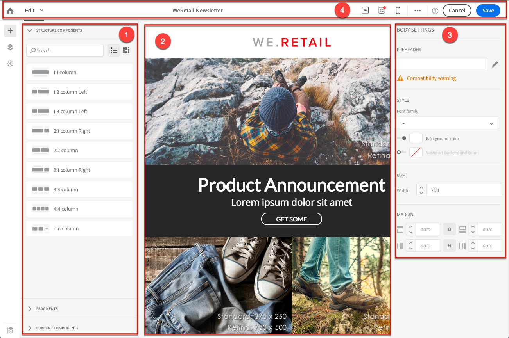
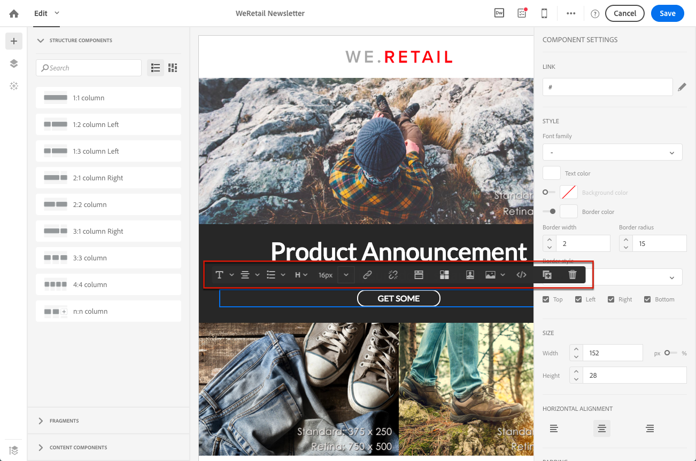
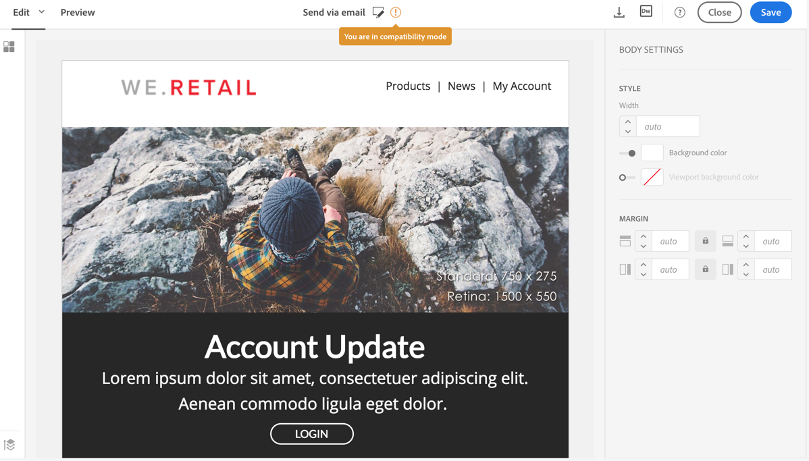

# Acerca del diseño de contenido de correo electrónico{#about-email-content-design}

Utilice la interfaz de arrastrar y soltar de correo electrónico de Designer para crear y modificar el contenido de sus correos electrónicos en Adobe Campaign.

Esta sección describe las especificidades del mensaje de correo electrónico de Designer:

* [Acerca de Email Designer](../../designing/using/about-email-content-design.md#about-the-email-designer)
* [Definición de la estructura de correo electrónico](../../designing/using/defining-the-email-structure.md)
* [Edición de estilos de correo electrónico](../../designing/using/editing-email-styles.md)

Para obtener más información sobre las acciones comunes a una o más actividades de mercadotecnia, consulte las siguientes secciones:

* Para obtener más información sobre cómo personalizar un contenido de correo electrónico, consulte [Inserción de un campo de personalización](../../designing/using/inserting-a-personalization-field.md) y [Adición de un bloque de contenido](../../designing/using/adding-a-content-block.md).
* Para obtener más información sobre la importación de otro contenido de correo electrónico, consulte [Selección de contenido existente](../../designing/using/selecting-an-existing-content.md).
* Para obtener más información sobre la definición de contenido dinámico en un mensaje de correo electrónico, consulte [Definición de contenido dinámico en un mensaje de correo electrónico](../../designing/using/defining-dynamic-content-in-an-email.md).
* Para obtener más información sobre cómo insertar vínculos en un mensaje de correo electrónico, consulte [Inserción de un vínculo](../../designing/using/inserting-a-link.md).
* Para obtener más información sobre la inserción de imágenes en un mensaje de correo electrónico, consulte [Inserción de imágenes](../../designing/using/inserting-images.md).

Compruebe también las prácticas recomendadas [generales para el diseño de contenido](../../designing/using/content-design-best-practices.md).

## Acerca de Email Designer {#about-the-email-designer}

El correo electrónico de Designer permite crear contenido de correo electrónico y plantillas de contenido de correo electrónico. Es compatible con correos electrónicos simples, correos electrónicos transaccionales, correos electrónicos de prueba A/B, correos electrónicos multilingües y correos electrónicos recurrentes.

Para comenzar con el correo electrónico de Designer, vea este [conjunto de vídeos](https://helpx.adobe.com/campaign/kt/acs/using/acs-email-designer-tutorial.html#GettingStarted) que explican la funcionalidad general de Designer Designer y cómo diseñar un correo electrónico desde cero o mediante plantillas.

### Página principal de Designer Designer {#email-designer-home-page}

Al [crear un correo electrónico](../../channels/using/creating-an-email.md), la página **[!UICONTROL Email Designer]** principal se muestra automáticamente al seleccionar el contenido de correo electrónico.


La **[!UICONTROL Properties]** ficha permite editar los detalles del correo electrónico, como la etiqueta, la dirección del remitente y el nombre o el asunto del mensaje. También puede acceder a esta ficha haciendo clic en la etiqueta de correo electrónico en la parte superior de la pantalla.


La **[!UICONTROL Templates]** ficha permite elegir entre el contenido HTML predeterminado o las plantillas que ya creó para empezar a diseñar su correo electrónico rápidamente. Consulte [Plantillas de contenido](../../start/using/about-templates.md#content-templates).


La **[!UICONTROL Learn & support]** ficha permite acceder fácilmente a la documentación y tutoriales relacionados.


Si no selecciona una plantilla, la página principal de Designer Designer también le permite elegir cómo desea comenzar a diseñar el contenido:

* Haga clic en **[!UICONTROL Create]** el botón para iniciar un nuevo contenido desde cero. Consulte [Diseño de contenido de correo electrónico desde cero](../../designing/using/about-email-content-design.md#designing-an-email-content-from-scratch).
* Haga clic en **[!UICONTROL Upload]** el botón para cargar un archivo desde su equipo. Consulte [Importación de contenido desde un archivo](../../designing/using/importing-content-from-a-file.md).
* Haga clic en **[!UICONTROL Import from URL]** el botón para recuperar el contenido existente de una URL. Consulte [Importación de contenido desde una URL](../../designing/using/importing-content-from-a-url.md).

### Interfaz de Designer Designer {#email-designer-interface}

Designer Designer proporciona muchas opciones que le permiten crear, editar y personalizar todos los aspectos del contenido.

La interfaz consta de varias áreas que ofrecen diferentes funcionalidades:



A partir de los elementos disponibles en la **paleta** (1), arrastre y suelte los componentes y fragmentos de contenido en el **espacio de trabajo principal** (2). Seleccione un componente o elemento en **el espacio de trabajo** (2) y personalice su estilo principal y visualice características desde el panel **Configuración** (3).

Acceda a opciones y opciones más generales desde **la barra de herramientas principal** (4).

>[!NOTE]
>
>El **panel Configuración** puede moverse a la izquierda según la resolución de pantalla y la visualización.



La barra **contextual** de la interfaz del editor ofrece diversas funcionalidades según la zona seleccionada. Contiene botones de acción y botones que permiten cambiar el estilo del texto. Las modificaciones realizadas siempre se aplican a la zona seleccionada.

### Recomendaciones generales para utilizar el correo electrónico de Designer {#general-recommendations-for-using-the-email-designer}

Para utilizar correctamente el correo electrónico de Designer y crear los mejores correos electrónicos tan solo es posible, recomendamos aplicar los siguientes principios:

* Utilice estilos en línea en lugar de una CSS y CSS independientes en la sección &lt; head &gt; del HTML. Al utilizar estilos en línea, puede optimizar el fragmento de contenido guardado y reutilizado.

   Consulte [Adición de atributos de estilo en línea](../../designing/using/editing-email-styles.md#adding-inline-styling-attributes).

* Limpie su marca fácilmente creando y reutilizando fragmentos de contenido para mantener la coherencia en sus campañas de marketing.

   Consulte [Creación de un fragmento de contenido](../../designing/using/defining-the-email-structure.md#creating-a-content-fragment).

Compruebe también las prácticas recomendadas [generales para el diseño de contenido](../../designing/using/content-design-best-practices.md).

### Modo de compatibilidad de correo electrónico de Designer {#email-designer-compatibility-mode}

Al cargar un contenido, debe contener etiquetado específico para que sea totalmente compatible y editable con el editor WYSIWYG del correo electrónico de Designer.

Si todo o parte del HTML cargado no es compatible con el etiquetado esperado, el contenido se carga en'modo de compatibilidad ', lo que limita las posibilidades de edición a través de la interfaz de usuario.

Cuando se carga un contenido en modo de compatibilidad, puede seguir realizando las siguientes modificaciones a través de la interfaz (las acciones no disponibles están ocultas):

* Cambio del texto o cambio de una imagen
* Inserción de vínculos y campos de personalización
* Editar algunas opciones de estilo en el bloque HTML seleccionado
* Definición de contenido condicional



Otras modificaciones, como agregar nuevas secciones al correo electrónico o estilo avanzado, deben realizarse directamente en el código fuente del correo electrónico a través del modo HTML.

Para obtener más información sobre la conversión de un correo electrónico existente a un correo electrónico compatible con Designer Designer, consulte [esta sección](../../designing/using/about-email-content-design.md#designing-an-email-using-existing-contents).

### Limitaciones de Email Designer {#email-designer-limitations}

* No puede utilizar campos de personalización en un fragmento. Para obtener más información sobre fragmentos, consulte [esta sección](../../designing/using/defining-the-email-structure.md#about-fragments).
* Al editar estilos, sólo están disponibles oficialmente las fuentes web oficialmente admitidas por la mayoría de los clientes de correo electrónico.
* Los estilos no se pueden guardar como un tema para volver a utilizarlos. Sin embargo, el estilo CSS se puede guardar en una plantilla de contenido o en un mensaje de correo electrónico. Para obtener más información sobre los estilos, consulte [esta sección](../../designing/using/editing-email-styles.md).

### Actualizaciones de Email Designer {#email-designer-updates}

El correo electrónico de correo electrónico se encuentra en una mejora continua. Si creó un contenido de correo electrónico desde cero, desde una plantilla lista para usar o si creó fragmentos, puede que reciba el siguiente mensaje de actualización la próxima vez que abra el contenido:


Adobe recomienda actualizar el contenido a la versión más reciente para evitar problemas como problemas de conflictos CSS. Click **[!UICONTROL Update now]**.

Si se produce un error durante la actualización de contenido, verifique su HTML y arregle la aplicación antes de ejecutar esta actualización de nuevo.

Cuando se trata de fragmentos, tenga en cuenta lo siguiente:

* Si desea agregar un fragmento a un nuevo correo electrónico o una plantilla, y si recibe este mensaje, primero debe actualizar este fragmento.

* Si tiene varios fragmentos, debe actualizar cada fragmento que desee utilizar en un contenido de correo electrónico.

* Para evitar tener impacto en los mensajes de correo electrónico actuales que aún no están preparados, puede elegir no actualizar algunos fragmentos.

* Todavía puede enviar correos electrónicos donde ya se haya utilizado un fragmento que no está actualizado, pero ese fragmento no es editable.

* La actualización de fragmentos utilizados en los correos electrónicos ya preparados no tiene ningún impacto en esos correos electrónicos.

## Diseño de contenido de correo electrónico desde cero {#designing-an-email-content-from-scratch}

Estos son los pasos principales para crear y diseñar un contenido de correo electrónico desde cero con el servidor de correo electrónico:

1. Cree un correo electrónico y abra su contenido.
1. Agregue componentes de estructura para formar el correo electrónico. Consulte [Edición de la estructura de correo electrónico](../../designing/using/defining-the-email-structure.md#editing-the-email-structure).
1. Inserte componentes y fragmentos de contenido en los componentes de estructura. Consulte [Adición de fragmentos y componentes de contenido](../../designing/using/defining-the-email-structure.md#adding-fragments-and-content-components).
1. Agregue imágenes y edite el texto del correo electrónico. Consulte [Inserción de imágenes](../../designing/using/inserting-images.md).
1. Personalice su correo electrónico agregando campos de personalización, vínculos, etc. Consulte [Inserción de un campo de personalización](../../designing/using/inserting-a-personalization-field.md), [Inserción de un vínculo](../../designing/using/inserting-a-link.md) y [Definición del contenido dinámico en un mensaje de correo electrónico](../../designing/using/defining-dynamic-content-in-an-email.md).
1. Defina la línea de asunto del correo electrónico. Consulte [Personalización de la línea de asunto de un correo electrónico](../../designing/using/personalizing-the-subject-line-of-an-email.md).
1. Obtenga una vista previa del correo electrónico.
1. Guarde el contenido y continúe con el mensaje después de asegurarse de haber definido una audiencia y programado correctamente el envío.

También puede consultar este [vídeo de introducción](https://video.tv.adobe.com/v/22771/?autoplay=true&hidetitle=true&captions=spa).

>[!NOTE]
>
>Para evitar el diseño de contenido de correo electrónico desde cero, puede utilizar plantillas de contenido integradas. Para obtener más información sobre esto, consulte [Plantillas de contenido](../../start/using/about-templates.md#content-templates).

**Temas relacionados**:

* [Creación de un mensaje de correo electrónico](../../channels/using/creating-an-email.md)
* [Selección de contenido existente](../../designing/using/selecting-an-existing-content.md)
* [Selección de una audiencia en un mensaje](../../audiences/using/selecting-an-audience-in-a-message.md)
* [Programación de mensajes](../../sending/using/about-scheduling-messages.md)
* [Vista previa de mensajes](../../sending/using/previewing-messages.md)
* [Procesamiento por correo electrónico](../../sending/using/email-rendering.md)
* [Genere correos electrónicos personalizados sin necesidad de HTML](https://helpx.adobe.com/campaign/kb/simplify-campaign-management.html#Createcompellingcontenttailoredtoeveryindividual)

## Diseño de un correo electrónico con contenido existente {#designing-an-email-using-existing-contents}

En esta sección se explica cómo convertir un correo electrónico existente a un correo electrónico compatible con Designer Designer.

De forma predeterminada, si solo se carga cualquier HTML (consulte [Importación de contenido desde un archivo](../../designing/using/importing-content-from-a-file.md)), el contenido se carga en «[modo de compatibilidad](../../designing/using/about-email-content-design.md#email-designer-compatibility-mode)», que limita las posibilidades de edición a través de la interfaz de usuario (solo en la edición in situ, sin arrastrar y soltar).

Sin embargo, si desea crear un marco de plantillas modulares y fragmentos que se pueden combinar para reutilizarlos en varios correos electrónicos, debe convertir su HTML de correo electrónico en una plantilla de correo electrónico de Designer.

Al diseñar contenido con el correo electrónico de Designer, tiene tres opciones:

* [Creación de contenido desde una plantilla lista para usar](../../designing/using/about-email-content-design.md#building-content-from-an-out-of-the-box-template)
* [Uso de fragmentos y componentes](../../designing/using/about-email-content-design.md#using-fragments-and-components), comenzar desde cero y volver a crear un diseño HTML
* [Conversión de un correo electrónico de contenido](../../designing/using/about-email-content-design.md#converting-an-html-content) HTML en un contenido modular de Correo electrónico de Designer

### Creación de contenido desde una plantilla lista para usar {#building-content-from-an-out-of-the-box-template}

1. Cree un correo electrónico y abra su contenido. Para obtener más información sobre esto, consulte [Creación de un correo electrónico](../../channels/using/creating-an-email.md).
1. Haga clic en el icono de inicio para acceder a la página **[!UICONTROL Email Designer]** principal.
1. Haga clic en **[!UICONTROL Templates]** la ficha.
1. Elija una plantilla HTML predeterminada.

   Las distintas plantillas presentan varias combinaciones de varios tipos de elementos. Por ejemplo, las plantillas «Feather» tienen márgenes mientras que las plantillas «Astro» no tienen ninguno. Para obtener más información sobre esto, consulte [Plantillas de contenido](../../start/using/about-templates.md#content-templates).

1. Puede combinar estos elementos para generar una serie de variantes de correo electrónico. Por ejemplo, puede duplicar una sección de correo electrónico seleccionando un componente de estructura y haciendo clic en **[!UICONTROL Duplicate]** la barra contextual.
1. Puede mover los elementos alrededor de la flecha azul a la izquierda para arrastrar un componente de estructura por debajo o por encima de otro. Para obtener más información sobre esto, consulte [Edición de la estructura de correo electrónico](../../designing/using/defining-the-email-structure.md#editing-the-email-structure).
1. También puede mover componentes alrededor para cambiar la organización de cada elemento de estructura. Para obtener más información sobre esto, consulte [Adición de fragmentos y componentes](../../designing/using/defining-the-email-structure.md#adding-fragments-and-content-components).
1. Modifique el contenido de cada elemento según sus necesidades: imágenes, texto, vínculos.
1. Adapte las opciones de estilo al contenido, si es necesario. Para obtener más información sobre esto, consulte [Edición de estilos de correo electrónico](../../designing/using/editing-email-styles.md).

### Uso de fragmentos y componentes {#using-fragments-and-components}

Para hacer que un contenido externo sea compatible con el Diseñador de correo electrónico, Adobe recomienda crear un mensaje desde cero y copiar el contenido del correo electrónico existente en fragmentos y componentes.

Cuando tenga un contenido que no pueda volver a crearse, puede copiar y pegar el código HTML desde el correo electrónico original utilizando el componente **[!UICONTROL Html]** de contenido. Asegúrese de estar familiarizado con HTML antes de continuar.

A continuación se muestra un ejemplo completo.

>[!NOTE]
>
>El nuevo contenido no será la copia exacta del correo electrónico original, pero los pasos a continuación le guiarán por la creación de un mensaje que será lo más parecido posible.

Supongamos que desea utilizar una newsletter existente que se creó fuera de Adobe Campaign.

Desea tener el mismo encabezado y pie de página en todos los correos electrónicos que enviará con Adobe Campaign. El cuerpo del correo electrónico cambiará según el contenido que se vaya a mostrar en cada newsletter.

**Requisitos previos**

1. En el correo electrónico original, identifique las secciones reutilizables de las secciones que serán exclusivas de cada correo electrónico que envíe.
1. Guarde todas las imágenes y recursos que desee utilizar.
1. Si está familiarizado con HTML, divida el contenido HTML original en partes diferentes.

**Creación de fragmentos para el contenido reutilizable**

Con el correo electrónico de Designer, cree un fragmento para cada sección reutilizable. En este ejemplo, creará dos fragmentos: uno para el encabezado y uno para el pie de página. A continuación, puede copiar las partes relevantes del contenido existente en estos fragmentos.

Para ello, siga los pasos a continuación:

1. En Adobe Campaign, vaya a **[!UICONTROL Resources]** &gt; **[!UICONTROL Content templates & fragments]** y cree un fragmento para el encabezado. Para obtener más información sobre esto, consulte [Creación de un fragmento de contenido](../../designing/using/defining-the-email-structure.md#creating-a-content-fragment).
1. Añada tantos componentes de estructura como necesite para su fragmento.

   

1. Inserte componentes de imagen y texto en su estructura.

   

1. Cargue la imagen correspondiente, introduzca el texto y ajuste la configuración.

   Para obtener más información sobre la gestión de los ajustes de estilo y los atributos integrados, consulte [Edición de estilos de correo electrónico](../../designing/using/editing-email-styles.md).

   

1. Guarde el fragmento.
1. Proceda de forma similar para crear el pie de página y guardarlo.

   

   Si está familiarizado con HTML, puede copiar y pegar el código HTML del pie de página original utilizando el componente **[!UICONTROL Html]** de contenido. Para obtener más información sobre esto, consulte [Acerca de los componentes de contenido](../../designing/using/defining-the-email-structure.md#about-content-components).

   

Los fragmentos están listos para utilizarse en una plantilla.

**Inserción de fragmentos y componentes en la plantilla**

Ahora puede crear una plantilla de correo electrónico con el correo electrónico de Designer. Utilice los componentes de contenido para reflejar las diferentes secciones del correo electrónico y ajustar la configuración para hacerlas lo más próximas posible a la newsletter original. Finalmente, inserte los fragmentos que acaba de crear.

1. Con el correo electrónico de Designer, cree una plantilla. Para obtener más información sobre esto, consulte [Plantillas de contenido](../../start/using/about-templates.md#content-templates).
1. Inserte varios componentes de estructura en la plantilla, correspondientes al encabezado, pie de página y cuerpo del correo electrónico. Para obtener más información sobre cómo agregar componentes de estructura, consulte [Edición de la estructura de correo electrónico con el correo electrónico de Designer](../../designing/using/defining-the-email-structure.md#editing-the-email-structure).
1. Inserte tantos componentes de contenido como sea necesario para crear el cuerpo de la newsletter. Éste será el contenido editable de su correo electrónico que actualizará todos los meses.

   

   Si está familiarizado con el código HTML, Adobe recomienda aprovechar **[!UICONTROL Html]** componentes donde puede copiar y pegar los elementos más complejos del correo electrónico original. Utilice otros componentes **[!UICONTROL Button]** como **[!UICONTROL Image]** , o **[!UICONTROL Text]** para el resto del contenido. Para obtener más información sobre esto, consulte [Acerca de los componentes de contenido](../../designing/using/defining-the-email-structure.md#about-content-components).

   >[!NOTE]
   >
   >Al utilizar **[!UICONTROL Html]** el componente, se crean componentes editables con opciones limitadas. Asegúrese de que sabe cómo gestionar código HTML antes de seleccionar este componente.

1. Ajuste los componentes de contenido para que coincidan con el correo electrónico original tanto como pueda.

   

   Para obtener más información sobre la gestión de los ajustes de estilo y los atributos integrados, consulte [Edición de estilos de correo electrónico](../../designing/using/editing-email-styles.md).

1. Inserte los dos fragmentos (encabezado y pie de página) que creó anteriormente en los componentes de estructura deseados.

   

1. Guarde la plantilla.

Ahora puede administrar completamente esta plantilla dentro del correo electrónico de Designer para crear y actualizar la newsletter que enviará cada mes a sus destinatarios.

Para utilizarlo, cree un correo electrónico y seleccione la plantilla de contenido que acaba de crear.

**Tema relacionado**:

* [Creación de un mensaje de correo electrónico](../../channels/using/creating-an-email.md)
* [Vídeo de introducción al correo electrónico de Designer](https://video.tv.adobe.com/v/22771/?autoplay=true&hidetitle=true&captions=spa)
* [Diseño de contenido de correo electrónico desde cero](../../designing/using/about-email-content-design.md#designing-an-email-content-from-scratch)

### Conversión de contenido HTML {#converting-an-html-content}

Este caso de uso ofrece una forma rápida de convertir un correo electrónico HTML a componentes de Correo electrónico de Designer.

>[!CAUTION]
>
>Esta sección es para usuarios avanzados familiarizados con código HTML.

>[!NOTE]
>
>Al igual que el modo de compatibilidad, un componente HTML se puede editar con opciones limitadas: solo puede realizar la edición in situ.

Fuera de Designer Designer, asegúrese de que el HTML original se divide en secciones reutilizables.

Si no es así, recorte los distintos bloques del HTML. Por ejemplo:

```
<!-- 3 COLUMN w/CTA (SCALED) -->
<table width="100%" align="center" cellspacing="0" cellpadding="0" border="0" role="presentation" style="max-width:680px;">
<tbody>
<tr>
<td class="padh10" align="center" valign="top" style="padding:0 5px 20px 5px;">
<table width="100%" cellspacing="0" cellpadding="0" border="0" role="presentation">
<tbody>
<tr>
...
</tr>
</tbody>
</table>
</td>
</tr>
</tbody>
</table>
<!-- //3 COLUMN w/CTA (SCALED) -->
```

Una vez identificados todos los bloques, en el correo electrónico de Designer, repita el procedimiento siguiente para cada sección del correo electrónico existente:

1. Abra el correo electrónico de Designer para crear un contenido de correo electrónico vacío.
1. Establezca los atributos de nivel de cuerpo: colores de fondo, anchura, etc. Para obtener más información sobre esto, consulte [Edición de estilos de correo electrónico](../../designing/using/editing-email-styles.md).
1. Agregue un componente de estructura. Para obtener más información sobre esto, consulte [Edición de la estructura de correo electrónico](../../designing/using/defining-the-email-structure.md#editing-the-email-structure).
1. Agregue un componente HTML. Para obtener más información sobre esto, consulte [Adición de fragmentos y componentes](../../designing/using/defining-the-email-structure.md#adding-fragments-and-content-components).
1. Copie y pegue el HTML en ese componente.
1. Cambiar a vista móvil. Para obtener más información, consulte [esta sección](../../designing/using/about-email-content-design.md#switching-to-mobile-view).

   La vista adaptable está dañada porque falta CSS.

1. Para arreglarlo, cambie al modo de código fuente y copie y pegue la sección de estilo en una nueva sección de estilo. Por ejemplo:

   ```
   <style type="text/css">
   a {text-decoration:none;}
   body {min-width:100% !important; margin:0 auto !important; padding:0 !important;}
   img {line-height:100%; text-decoration:none; -ms-interpolation-mode:bicubic;}
   ...
   </style>
   ```

   >[!NOTE]
   >
   >No modifique la CSS generada por el correo electrónico de Designer: `<style acrite-template-css="true">` y `<style acrite-custom-styles="" type="text/css">`. Asegúrese de agregar el estilo después de esto.

1. Regrese a la vista móvil para comprobar que el contenido se muestra correctamente y guarde los cambios.

## Cambio a la vista móvil {#switching-to-mobile-view}

Puede ajustar el diseño interactivo de un mensaje de correo electrónico editando todas las opciones de estilo para la visualización móvil por separado. Por ejemplo, puede adaptar márgenes y relleno, utilizar tamaños de fuente más pequeños o más pequeños, cambiar botones o aplicar distintos colores de fondo que serán específicos de la versión móvil del correo electrónico.

Todas las opciones de estilo están disponibles en la vista móvil. Los ajustes de estilo de Designer Designer se presentan en la sección [Editar estilos](../../designing/using/editing-email-styles.md) de correo electrónico.

1. Cree un correo electrónico y empiece a editar el contenido. Para obtener más información sobre esto, consulte [Diseño de contenido de correo electrónico desde cero](../../designing/using/about-email-content-design.md#designing-an-email-content-from-scratch).
1. Para acceder a la vista móvil dedicada, seleccione **[!UICONTROL Switch to mobile view]** el botón.

   

   Se muestra la versión móvil del correo electrónico. Contiene todos los componentes y estilos definidos en la vista de escritorio.

1. Edite de forma independiente todos los ajustes de estilo, como color de fondo, alineación, margen, margen, familia de fuentes, color del texto, etc.

   

1. Al editar cualquier ajuste de estilo en la vista móvil, las modificaciones se aplican únicamente a la visualización móvil.

   Por ejemplo, reduzca el tamaño de una imagen, agregue un fondo verde y cambie el margen en la vista móvil.

   

1. Puede ocultar un componente cuando se muestre en un dispositivo móvil. Para hacerlo, seleccione **[!UICONTROL Show only on desktop devices]** entre **[!UICONTROL Display options]**.
También puede optar por ocultar este componente en dispositivos de escritorio, lo que significa que solo se mostrará en dispositivos móviles. Para ello, seleccione **[!UICONTROL Show only on mobile devices]**.
Por ejemplo, esta opción permite mostrar una imagen específica en dispositivos móviles y otra imagen en dispositivos de escritorio.
Puede establecer esta opción desde la vista móvil o de escritorio.

   

1. Vuelva a hacer clic en **[!UICONTROL Switch to mobile view]** el botón para volver a la vista de escritorio estándar. Los cambios de estilo que acaba de realizar no se reflejan.

   

   >[!NOTE]
   >
   >La única excepción es **[!UICONTROL Style inline]** la configuración. Cualquier cambio de configuración en línea de estilo se aplica también a la vista de escritorio estándar.

1. Cualquier otro cambio en la estructura o el contenido del correo electrónico, como ediciones textuales, carga de una nueva imagen, adición de un nuevo componente, etc. también se aplica a la vista estándar.

   Por ejemplo, cambie a la vista móvil, edite texto y sustituya una imagen.

   

   Vuelva a hacer clic en **[!UICONTROL Switch to mobile view]** el botón para volver a la vista de escritorio estándar. Los cambios se reflejan.

   

1. Si elimina un estilo en la vista móvil, volverá al estilo que se aplicó en el modo de escritorio.

   Por ejemplo, en la vista móvil, aplique un color de fondo verde a un botón.

   

1. Cambie a la vista de escritorio y aplique un fondo gris al mismo botón.

   

1. Vuelva a cambiar a la vista móvil y deshabilite **[!UICONTROL Background color]** la configuración.

   

   El color de fondo definido en la vista de escritorio ahora se aplica: se vuelve gris (no está en blanco).

   La única excepción es **[!UICONTROL Border color]** la configuración. Cuando se desactiva en la vista móvil, ya no se aplica ningún borde, incluso si se define un color de borde en la vista de escritorio.

>[!NOTE]
>
>La vista móvil no está disponible en [fragmentos](../../designing/using/defining-the-email-structure.md#about-fragments).

## Texto sin formato y modos HTML {#plain-text-and-html-modes}

### Generación de una versión de texto del correo electrónico {#generating-a-text-version-of-the-email}

De forma predeterminada, la **[!UICONTROL Plain text]** versión de su correo electrónico se genera automáticamente y se sincroniza con la **[!UICONTROL Edit]** versión.

Los campos de personalización y los bloques de contenido agregados a la versión HTML también se sincronizan con la versión de texto sin formato.

>[!NOTE]
>
>Para utilizar bloques de contenido en versión de texto sin formato, asegúrese de que no contienen código HTML.

Para que una versión de texto sin formato difiera de la versión HTML, puede desactivar esta sincronización haciendo clic **[!UICONTROL Sync with HTML]** en el cambio desde **[!UICONTROL Plain text]** la vista de su correo electrónico.


A continuación, puede editar la versión de texto sin formato como desee.

>[!NOTE]
>
>Si edita **[!UICONTROL Plain text]** la versión mientras se desactiva la sincronización, la próxima vez que active **[!UICONTROL Sync with HTML]** la opción, todos los cambios realizados en la versión de texto sin formato serán reemplazados por la versión HTML. Los cambios realizados en **[!UICONTROL Plain text]** la vista no se pueden reflejar **[!UICONTROL HTML]** en la vista.

### Edición de una fuente de contenido de correo electrónico en HTML {#editing-an-email-content-source-in-html}

Para los usuarios y la depuración más avanzados, puede ver y editar el contenido de correo electrónico directamente en HTML.

Tiene dos formas de editar la versión HTML del correo electrónico:

* Seleccione **[!UICONTROL Edit]** &gt; **[!UICONTROL HTML]** para abrir la versión HTML de todo el correo electrónico.

   

* En la interfaz WYSIWYG, seleccione un elemento y haga clic **[!UICONTROL Source code]** en el icono.

   Solo se muestra la fuente del elemento seleccionado. Puede editar el código fuente si el elemento seleccionado es un componente **[!UICONTROL HTML]** de contenido. Otros componentes se encuentran en modo de solo lectura, pero aún se pueden editar en la versión HTML completa del correo electrónico.

   

Si modifica el código HTML, puede dañarse la respuesta del mensaje de correo electrónico. Asegúrese de probarlo usando **[!UICONTROL Preview]** el botón. Consulte [Vista previa de mensajes](../../sending/using/previewing-messages.md).

## Diseño a través de integraciones de Adobe Campaign {#design-through-adobe-campaign-integrations}

### Edición de contenido en Dreamweaver {#editing-content-in-dreamweaver}

La integración de Adobe Campaign Standard con Dreamweaver le permite editar el contenido de un correo electrónico en la interfaz de Dreamweaver. Tiene acceso a la poderosa interfaz de Dreamweaver para diseñar y desarrollar contenido de correo electrónico interactivo.

* **Sincronización bidireccional**

   Cada vez que se realiza una edición en un producto, se actualiza en tiempo real en el otro. Si desea cambiar el color del texto en Dreamweaver, en cuanto realice la edición, el color del texto estará activo en Campaign. Además, cuando selecciona código en Dreamweaver o Campaign, ya que los números de línea son los mismos, la selección permanece entre los dos productos, lo que resulta muy útil cuando busca algo específico en el código.

* **Cargar imágenes locales a AC a través de Dreamweaver**

   Al crear o editar un correo electrónico dentro de Dreamweaver, puede seleccionar una imagen de su escritorio o equipo local. Aunque Dreamweaver siempre lo ha permitido, cuando Dreamweaver y Campaign están conectados, el archivo local se carga inmediatamente en el servidor de Adobe Campaign: no es necesario cargar manualmente imágenes a medida que cambia el contenido. Además, garantiza que las últimas imágenes siempre estén activas en Campaign.

* **Agregar personalización de campaña en Dreamweaver**

   Para el desarrollador de correo electrónico ya no es necesario agregar texto como ```[[FIRSTNAME_PLACEHOLDER]]``` ni buscar la sintaxis de las tablas del modelo de datos. La barra de herramientas de campaña de Dreamweaver se conecta directamente al modelo de datos de la instancia de campaña. Esto significa que puede obtener cualquier dato que desee personalizar de un nombre como Nombre de usuario a dirección. Si ha creado bloques de contenido en Campaign, también puede arrastrarlos directamente a Dreamweaver.

Esta capacidad se detalla en la documentación de Dreamweaver accesible [aquí](https://helpx.adobe.com/dreamweaver/using/working-with-dreamweaver-and-campaign.html). También hay [disponible un vídeo](https://helpx.adobe.com/campaign/kt/acs/using/acs-dreamweaver-integration-feature-video-use.html) de demostración.

### Edición de contenido en Experience Manager {#editing-content-in-experience-manager}

El contenido de correo electrónico se puede editar en Experience Manager y, a continuación, se utiliza para uno o varios mensajes de correo electrónico en Adobe Campaign Standard. Consulte [este documento](../../integrating/using/integrating-with-experience-manager.md).

### Comparación de opciones de diseño de correo electrónico {#email-design-options-comparison}

Adobe Campaign ofrece varias opciones de creación de correo electrónico. La tabla siguiente muestra las principales posibilidades, beneficios y limitaciones de cada uno de ellos.

<table> 
 <thead> 
  <tr> 
   <th> </th> 
   <th> Email Designer<br /> </th> 
   <th> Experience Manager<br /> </th> 
   <th> Dreamweaver<br /> </th> 
  </tr> 
 </thead> 
 <tbody> 
  <tr> 
   <td> <strong>Iniciar correo electrónico en blanco</strong><br /> </td> 
   <td> Admitido<br /> </td> 
   <td> Admitido<br /> </td> 
   <td> Admitido<br /> </td> 
  </tr> 
  <tr> 
   <td> <strong>Escritura de HTML</strong><br /> </td> 
   <td> Admitido<br /> </td> 
   <td> No admitido<br /> </td> 
   <td> Admitido<br /> </td> 
  </tr> 
  <tr> 
   <td> <strong>Actualizar HTML</strong><br /> </td> 
   <td> Solo dentro de un componente HTML<br /> </td> 
   <td> No admitido<br /> </td> 
   <td> Admitido<br /> </td> 
  </tr> 
  <tr> 
   <td> <strong>Personalización básica</strong><br /> </td> 
   <td> Admitido<br /> </td> 
   <td> Admitido<br /> </td> 
   <td> Admitido<br /> </td> 
  </tr> 
  <tr> 
   <td> <strong>Personalización avanzada</strong><br /> </td> 
   <td> Admitido<br /> </td> 
   <td> No admitido<br /> </td> 
   <td> No admitido<br /> </td> 
  </tr> 
  <tr> 
   <td> <strong>Prueba/Vista previa</strong><br /> </td> 
   <td> Admitido<br /> </td> 
   <td> Vista previa en<br /> la prueba AEM en Campaign<br /> </td> 
   <td> Vista previa y prueba en Campaign<br /> </td> 
  </tr> 
  <tr> 
   <td> <strong>Listados de productos</strong><br /> </td> 
   <td> Compatible con mensajes transaccionales de correo electrónico<br /> </td> 
   <td> No admitido<br /> </td> 
   <td> No admitido<br /> </td> 
  </tr> 
  <tr> 
   <td> <strong>Beneficios</strong><br /> </td> 
   <td> 
     - Fácil generación de correo electrónico mediante la función<br/>
 de arrastrar y soltar: funcionalidades similares al editor<br/>
 de contenido heredado: contenido reutilizable con fragmentos
  </td> 
   <td> 
     - Reutilización de recursos del sitio web en correos electrónicos<br/>:
 Aprovechamiento de la potencia de Experience Manager en contenido de correo electrónico
    </td> 
   <td> 
    - Capacidad para que un desarrollador codifique directamente un correo electrónico<br/>
 - Sincronización<br/>
 bidireccional - Editar sin conexión en Dreamweaver y sincronizar posteriormente<br/>:
 Cargar imágenes a Adobe Campaign a través de Dreamweaver
  </td> 
  </tr> 
  <tr> 
   <td> <strong>Limitaciones</strong><br /> </td> 
   <td> 
     - No hay contenido condicional dentro de fragmentos<br/>
 - Uso de fragmentos de Experience Manager no posible
  </td> 
   <td> 
     - Es difícil implementar
 la personalización avanzada<br/>- Necesita enviar pruebas en Adobe Campaign
  </td> 
   <td> Contenido dinámico no admitido<br /> </td> 
  </tr> 
  <tr> 
   <td> <strong>Audiencia</strong><br /> </td> 
   <td> Especialistas en marketing que deseen mantener la flexibilidad de utilizar componentes HTML junto con funciones de arrastrar y soltar<br /> </td> 
   <td> Los especialistas en marketing que ya usan Experience Manager y desean utilizar plantillas de correo electrónico estándar con poca personalización<br /> </td> 
   <td> Desarrolladores que deseen codificar el contenido del correo electrónico e integrarlo directamente con Adobe Campaign<br /> </td> 
  </tr> 
  <tr> 
   <td> <strong>Para obtener más información</strong><br /> </td> 
   <td> Consulte <a href="../../designing/using/about-email-content-design.md#about-the-email-designer">Acerca de Designer Designer</a><br /> </td> 
   <td> Consulte <a href="../../integrating/using/integrating-with-experience-manager.md">Integración con Experience Manager</a><br /> </td> 
   <td> Consulte <a href="https://helpx.adobe.com/dreamweaver/using/working-with-dreamweaver-and-campaign.html">Dreamweaver y Campaign</a> y vea este <a href="https://helpx.adobe.com/campaign/kt/acs/using/acs-dreamweaver-integration-feature-video-use.html">vídeo</a><br /> </td> 
  </tr> 
 </tbody> 
</table>

