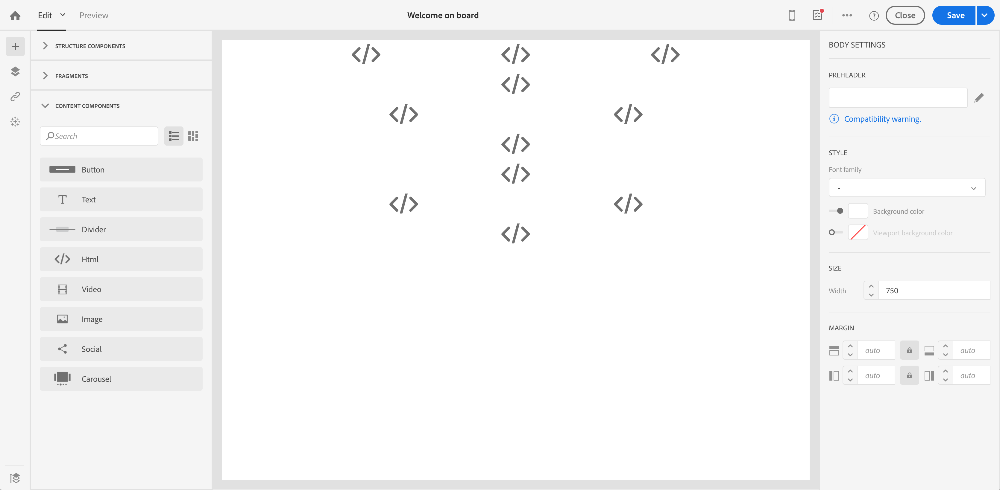

# Conversión del contenido de correo electrónico del editor heredado {#converting-an-html-content}

Empiece a trabajar con el Diseñador de correo electrónico y cree plantillas y fragmentos reutilizables a partir del HTML de correo electrónico creado en el Editor heredado.

Este caso de uso le permite crear una plantilla de Diseñador de correo electrónico utilizando un correo electrónico HTML y dividiéndola en componentes HTML en el Diseñador de correo electrónico.

>[!NOTE]
>
>Al igual que el modo de compatibilidad, un componente HTML es editable con opciones limitadas: solo puede realizar la edición in situ.

>[!IMPORTANT]
>
>Esta sección está dirigida a usuarios avanzados familiarizados con el código HTML.

## Preparación del contenido del correo electrónico

1. Seleccione un correo electrónico HTML.
1. Identifique secciones para dividir el correo electrónico HTML.
1. Elimine los diferentes bloques del HTML.

## Cree su estructura de correo electrónico

1. Abra **[!UICONTROL Email Designer]** para crear un contenido de correo electrónico vacío.
1. Establezca los atributos de nivel de cuerpo: colores de fondo, anchura, etc. Para obtener más información, consulte [Edición de estilos de correo electrónico](../../designing/using/styles.md).
1. Añada tantos componentes de estructura como secciones. Para obtener más información, consulte [Edición de la estructura de correo electrónico](../../designing/using/designing-from-scratch.md#defining-the-email-structure).

## Añadir contenido HTML

1. Añada un componente HTML a cada componente de estructura. Para obtener más información, consulte [Añadir fragmentos y componentes](../../designing/using/designing-from-scratch.md#defining-the-email-structure).
1. Copie y pegue su HTML en cada componente.

## Administrar el estilo del correo electrónico {#manage-the-style-of-your-email}

1. Cambie a **[!UICONTROL Mobile view]**. Para obtener más información, consulte [esta sección](../../designing/using/plain-text-html-modes.md#switching-to-mobile-view).

1. Para solucionarlo, cambie al modo de código fuente y copie y pegue la sección de estilos en una nueva sección de estilos. Por ejemplo:

   ```
   <style type="text/css">
   a {text-decoration:none;}
   body {min-width:100% !important; margin:0 auto !important; padding:0 !important;}
   img {line-height:100%; text-decoration:none; -ms-interpolation-mode:bicubic;}
   ...
   </style>
   ```

   >[!NOTE]
   >
   >Asegúrese de agregar el estilo después de esto en otra etiqueta de estilo personalizada.
   >
   >No modifique la CSS generada por el Diseñador de correo electrónico:
   >
   >* `<style data-name="default" type="text/css">(##)</style>`
   >* `<style data-name="supportIOS10" type="text/css">(##)</style>`
   >* `<style data-name="mediaIOS8" type="text/css">(##)</style>`
   >* `<style data-name="media-default-max-width-500px" type="text/css">(##)</style>`
   >* `<style data-name="media-default--webkit-min-device-pixel-ratio-0" type="text/css">(##)</style>`


1. Vuelva a la vista móvil para comprobar que el contenido se muestra correctamente y guardar los cambios.

## Caso de uso

Intentemos convertir este correo electrónico, creado en el editor heredado, en una plantilla **[!UICONTROL Email Designer]**.

### Identifique la sección del correo electrónico

Podemos identificar 11 secciones en este correo electrónico.


Para identificar qué elemento es qué sección del HTML, puede seleccionarlo.


Para ver la versión HTML del correo electrónico, haga clic en **[!UICONTROL Show source]**.

### Creación de la plantilla de correo electrónico y su estructura

1. Arrastre y suelte **[!UICONTROL Structure components]** reflejando el diseño de nuestro correo electrónico.

1. Repita tantas veces como sea necesario. Necesitamos crear 11 componentes de estructura.

   

### Inserción de componentes de contenido HTML

1. Inserte un **[!UICONTROL HTML component]** en cada **[!UICONTROL Structure component]** .

   

1. Para cada sección, haga clic en **[!UICONTROL Show source code]** .

   

1. Inserte la sección HTML.

1. Haga clic en **[!UICONTROL Save]**.

Ahora puede comprobar la renderización del correo electrónico.


### Administración de estilos para ajustarse a la vista móvil

1. Inserte elementos CSS para garantizar que el correo electrónico sea adecuado para la vista móvil.

1. Cambie al código fuente y copie y pegue la sección de estilos en una nueva sección de estilos.

Para obtener más información, consulte [Administrar el estilo de su correo electrónico](#manage-the-style-of-your-email).

El correo electrónico heredado ya está disponible en el Diseñador de correo electrónico.
