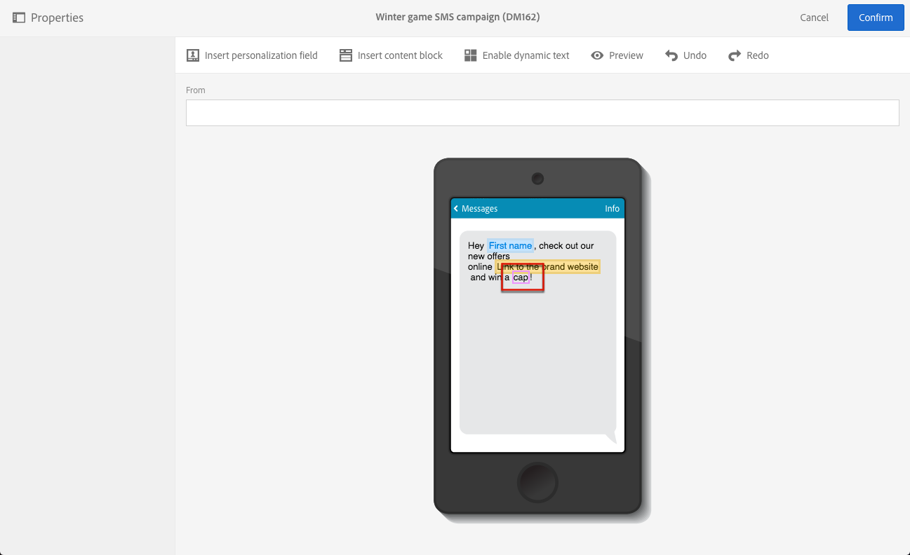

# Defining dynamic text{#defining-dynamic-text}

El texto dinámico se define de la misma manera que el contenido dinámico. Refer to the [Definig dynamic content](../../designing/using/defining-dynamic-content-in-an-email.md) section.

>[!NOTE]
>
>Para SMS y push, solo puede definir texto dinámico. Puede definir tanto el contenido dinámico como el texto en una página de aterrizaje. If you want to define dynamic text with the [Email Designer](../../designing/using/about-email-content-design.md#about-the-email-designer), see [Defining dynamic content in an email](../../designing/using/defining-dynamic-content-in-an-email.md).

El ejemplo siguiente muestra cómo definir texto dinámico en un mensaje SMS.

1. Seleccione texto en el cuerpo de su mensaje o página de aterrizaje.
1. Click **[!UICONTROL Enable dynamic text]**.

   

   The **[!UICONTROL Dynamic text]** option displays in the palette. Se configura de la misma manera que el contenido dinámico.

1. Seleccione una variante.

   

1. Defina una condición para esta variante.

   

Cuando se define una condición para al menos una variante, se muestra un marco púrpura alrededor del texto dinámico.

