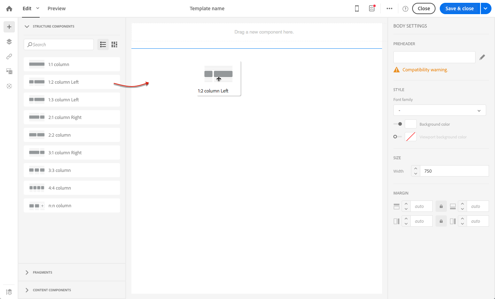

# Diseño de correos electrónicos desde cero {#designing-an-email-content-from-scratch}

Obtenga información sobre cómo dominar la edición de contenido de correo electrónico. Con Email Designer, puede crear correos electrónicos y plantillas que comiencen por su propio contenido predefinido o no.

Estos son los pasos principales para crear y diseñar un contenido de correo electrónico desde cero con Email Designer:

1. Cree un correo electrónico y abra su contenido.
1. Añadir componentes de estructura para dar forma al correo electrónico. Consulte [Edición de la estructura de correo electrónico](#defining-the-email-structure).
1. Inserte componentes de contenido y fragmentos en los componentes de estructura. Consulte [Agregar fragmentos y componentes de contenido](#defining-the-email-structure).
1. Añada imágenes y edite el texto del correo electrónico. Consulte [Inserción de imágenes](../../designing/using/images.md#inserting-images).
1. Personalice su correo electrónico añadiendo campos de personalización, vínculos, etc. Ver [Inserción de un campo personalizado](../../designing/using/personalization.md#inserting-a-personalization-field), [Inserción de un vínculo](../../designing/using/links.md#inserting-a-link) y [Definición de contenido dinámico en un mensaje de correo electrónico](../../designing/using/personalization.md#defining-dynamic-content-in-an-email).
1. Defina la línea de asunto del correo electrónico. Ver [Personalización de la línea de asunto de un correo electrónico](../../designing/using/subject-line.md#defining-the-subject-line-of-an-email).
1. Previsualice el correo electrónico.
1. Guarde el contenido y continúe con el mensaje después de asegurarse de haber definido una audiencia y de haber programado correctamente el envío.

También puedes ver este [vídeo de introducción](https://video.tv.adobe.com/v/330103/?autoplay=true&hidetitle=true&captions=spa).

>[!NOTE]
>
>Para evitar diseñar el contenido del correo electrónico desde cero, puede utilizar plantillas de contenido predeterminadas. Para obtener más información, consulte [Plantillas de contenido](../../designing/using/using-reusable-content.md#content-templates).

## Definición de estructura de correo electrónico {#defining-the-email-structure}

>[!CONTEXTUALHELP]
>id="ac_structure_components"
>title="Acerca de los componentes de estructura"
>abstract="Los componentes de estructura definen el diseño del correo electrónico."

>[!CONTEXTUALHELP]
>id="ac_edition_columns"
>title="Definición de columnas de correo electrónico"
>abstract="El diseñador de correo electrónico permite definir fácilmente el diseño del correo electrónico mediante la definición de la estructura de columnas."

El Diseñador de correo electrónico le permite definir fácilmente la estructura del correo electrónico. Al agregar y mover elementos estructurales con sencillas acciones de arrastrar y soltar, puede diseñar la forma del correo electrónico en cuestión de segundos.

Para editar la estructura de un correo electrónico:

1. Abra un contenido existente o cree un nuevo contenido de correo electrónico.
1. Para acceder a **[!UICONTROL Structure components]**, seleccione el icono **+** de la izquierda.

   

1. Arrastre y suelte los componentes de estructura que necesita para dar forma al correo electrónico.

   

   Una línea azul materializa la ubicación exacta de los componentes de la estructura antes de soltarla. Puede soltarlo encima, entre o debajo de cualquier otro componente, pero no dentro.

   >[!NOTE]
   >
   >Tenga en cuenta que la pila de columnas no es compatible con todos los programas de correo electrónico. Cuando no se admite, las columnas no se apilan.
   >
   >Una vez colocados en el correo electrónico, no puede mover ni quitar los componentes a menos que ya haya un componente de contenido o un fragmento colocado dentro.

1. Hay disponibles varios componentes de estructura compuestos de una o más columnas.

   Seleccione el componente **[!UICONTROL n:n column]** para definir el número de columnas que desee (entre 3 y 10). También puede definir la anchura de cada columna moviendo las flechas en la parte inferior de cada columna.

   

   >[!NOTE]
   >
   >Cada tamaño de columna no puede ser inferior al 10 % de la anchura total del componente de la estructura. No se puede quitar una columna que no esté vacía.

Una vez definida la estructura, puede añadir fragmentos de contenido y componentes al correo electrónico.

## Uso de un preencabezado {#preheader}

>[!CONTEXTUALHELP]
>id="ac_edition_preheader"
>title="Uso de un preencabezado"
>abstract="El preencabezado permite configurar un breve texto de resumen que ofrece una mayor tasa de apertura para su correo electrónico."

Un preencabezado es un breve texto de resumen que sigue a la línea de asunto cuando se visualiza un correo electrónico desde la bandeja de entrada. El preencabezado ofrece una mayor tasa de apertura.

Seleccione el cuadro de edición **[!UICONTROL Preheader]** y complete el contenido.

Puede agregar **[!UICONTROL Content block]**, **[!UICONTROL Dynamic content]** o **[!UICONTROL Personalization fields]** al contenido del encabezado previo.

>[!NOTE]
>
>Tenga en cuenta que el preencabezado no es compatible con todos los programas de correo electrónico. Cuando no se admite, no se muestra.

## Uso de componentes de contenido {#about-content-components}

>[!CONTEXTUALHELP]
>id="ac_content_components"
>title="Acerca de los componentes de contenido"
>abstract="Los componentes de contenido son marcadores de posición de contenido vacíos que se pueden editar para crear un correo electrónico."

Los componentes de contenido son componentes sin procesar y vacíos que se pueden editar una vez colocados en un correo electrónico.

Puede añadir tantos componentes de contenido como desee en un componente de estructura. También puede moverlos dentro del componente de estructura o a otro componente de estructura.

Esta es la lista de los componentes disponibles en el Designer de correo electrónico:

### **[!UICONTROL Button]**

Si necesita utilizar varios botones, en lugar de editar cada botón desde cero, puede duplicar el componente **[!UICONTROL Button]** mediante la barra de herramientas contextual.

También puede guardar botones en fragmentos que se pueden reutilizar. Para obtener más información sobre esto, consulte [Creación de un fragmento de contenido](../../designing/using/using-reusable-content.md#creating-a-content-fragment) y [Guardar contenido como un fragmento](../../designing/using/using-reusable-content.md#saving-content-as-a-fragment).

Seleccione **[!UICONTROL Fallback view]** para mostrar la imagen de reserva en el Designer de correo electrónico.

### **[!UICONTROL Text]**

Utilice este componente para insertar texto en el correo electrónico. Puede ajustar el color, estilo y tamaño del texto en **[!UICONTROL Component Settings]**.

### **[!UICONTROL Divider]**

Utilice este componente para insertar una línea divisoria en el correo electrónico. Puede seleccionar el color, el estilo y el tamaño de la línea de separación en **[!UICONTROL Component Settings]**.

### **[!UICONTROL HTML]**

Utilice este componente para copiar y pegar las diferentes partes del HTML existente. Esto le permite crear componentes modulares de HTML gratuitos.

>[!NOTE]
>
>Un componente HTML gratuito es editable con opciones limitadas. Si no todos los estilos están insertados, asegúrese de agregar el CSS adecuado en la sección **head** del código HTML; de lo contrario, el correo electrónico no responderá. Utilice el botón **[!UICONTROL Preview]** para probar la capacidad de respuesta del contenido (consulte [Vista previa de mensajes](../../sending/using/previewing-messages.md)).

Para que un contenido externo sea compatible con Email Designer, Adobe recomienda crear un mensaje desde cero y copiar el contenido del correo electrónico existente en fragmentos y componentes.

Si tiene contenido que no se puede volver a crear, puede copiar y pegar el código HTML del correo electrónico original mediante el componente de contenido **[!UICONTROL Html]**. Asegúrese de estar familiarizado con HTML antes de continuar.

>[!NOTE]
>
>El nuevo contenido no será la copia exacta de su correo electrónico original, pero los pasos a continuación le guiarán a través de la creación de un mensaje que sea lo más parecido posible.

**Antes de copiar el contenido**

1. En el correo electrónico original, identifique las secciones reutilizables de las secciones que serán únicas para cada correo electrónico que envíe.
1. Guarde todas las imágenes y recursos que desee utilizar.
1. Si está familiarizado con HTML, divida el contenido original de HTML en diferentes partes.

### Vídeo {#video-settings}

>[!CONTEXTUALHELP]
>id="ac_edition_video"
>title="Configuración de vídeo"
>abstract="Utilice este componente para insertar un vídeo en el correo electrónico. Tenga en cuenta que los vídeos no funcionan en todos los clientes de correo electrónico. Se recomienda configurar una imagen de reserva."

Inserte el componente de vídeo en un componente de estructura del correo electrónico e introduzca el vínculo de vídeo en **[!UICONTROL Component Settings]**.

>[!NOTE]
>
>Tenga en cuenta que el vídeo no es compatible con todos los programas de correo electrónico. Cuando no se admite, se muestra la reserva.

### Imagen

Utilice este componente para insertar una imagen en el correo electrónico.

Inserte el componente de imagen en un componente de estructura y haga clic en Examinar para cargar un archivo de imagen desde el equipo.

### **[!UICONTROL Social]**

Utilice este componente para insertar vínculos a páginas de medios sociales en el correo electrónico. Puede seleccionar los vínculos que desea mostrar y el tamaño de su icono en **[!UICONTROL Component Settings]**.

### Carrusel {#carousel-settings}

>[!CONTEXTUALHELP]
>id="ac_edition_carousel"
>title="Configuración de carrusel"
>abstract="Obtenga información sobre cómo insertar y configurar un carrusel en el contenido. Tenga en cuenta que el carrusel no funciona en todos los clientes de correo electrónico y que la imagen de reserva se mostrará en caso de que no sea compatible."

1. Arrastre y suelte el componente **[!UICONTROL Carousel]** dentro de un componente de estructura.
1. Examine para seleccionar imágenes del equipo.

   

1. En el panel **[!UICONTROL Settings]**, defina el número de miniaturas que desee en el carrusel.
1. Seleccione una imagen de reserva del equipo.

   

El componente de carrusel no es compatible con todos los programas de correo electrónico. Cargue una reserva para mostrar una imagen en su lugar cuando el carrusel no sea compatible con el correo electrónico.

>[!NOTE]
>
>El componente de carrusel es compatible con las siguientes plataformas de correo electrónico: Apple Mail 7, Apple Mail 8, Outlook 2011 para Mac, Outlook 2016 para Mac, Mozilla Thunderbird, iPad y iPad mini iOS, iPhone iOS, Android, AOL (Chrome, Firefox y Safari).

**Temas relacionados**:

- [Creación de un correo electrónico](../../channels/using/creating-an-email.md)
- [Selección de una audiencia en un mensaje](../../audiences/using/selecting-an-audience-in-a-message.md)
- [Programación de mensajes](../../sending/using/about-scheduling-messages.md)
- [Previsualización de mensajes](../../sending/using/previewing-messages.md)
- [Procesamiento de correo electrónico](../../sending/using/email-rendering.md)
