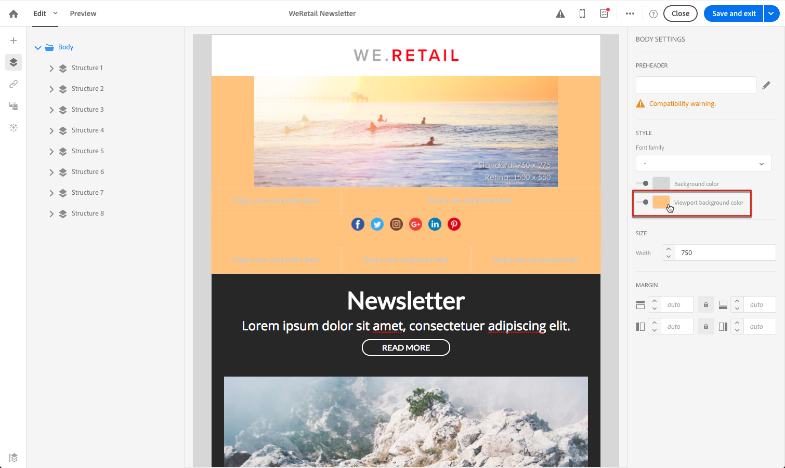

# Editing email styles{#editing-email-styles}

## Editing an element {#editing-an-element}

In the Email Designer, when selecting an element, several options specific to the type of content selected are displayed in the **[!UICONTROL Settings]** pane. Puede utilizar estas opciones para cambiar fácilmente el estilo de su correo electrónico.

### Selecting an element {#selecting-an-element}

Para seleccionar un elemento en la interfaz de Designer Designer, puede realizar una de las acciones siguientes:

* haga clic directamente en el correo electrónico,
* or browse the structure tree available from the options located in the left **Palette**.

Explorar el árbol de estructura permite realizar una selección más precisa. Puede seleccionar:

* todo el componente estructura,
* una de las columnas que componen el componente de estructura,
* o solo un componente que se encuentra dentro de una columna.

Para seleccionar una columna, también puede hacer lo siguiente:

1. Select a structure component (directly in the email or using the structure tree available from the left **Palette**).
1. From the **contextual toolbar**, click **[!UICONTROL Select a column]** to choose the desired column.

See an example in [this section](../../designing/using/editing-email-styles.md#example--adjusting-vertical-alignment-and-padding).

### Adjusting style settings {#adjusting-style-settings}

1. Seleccione un elemento en su correo electrónico. For more on this, see [Selecting an element](../../designing/using/editing-email-styles.md#selecting-an-element).
1. Ajuste la configuración según sus necesidades. Cada elemento seleccionado ofrece un conjunto diferente de ajustes.

   You can insert backgrounds, change sizes, modify horizontal or vertical alignment, manage colors, add [padding or margin](../../designing/using/editing-email-styles.md#about-padding-and-margin), and so on.

   To do this, use the options displayed in the **[!UICONTROL Settings]** pane or [add inline styling attributes](../../designing/using/editing-email-styles.md#adding-inline-styling-attributes).

   

1. Guarde el contenido.

### About padding and margin {#about-padding-and-margin}

La interfaz de Email Designer permite ajustar rápidamente los ajustes de margen y margen.

**[!UICONTROL Padding]**: esta configuración permite administrar el espacio que se encuentra dentro del borde de un elemento.

Por ejemplo:

* Utilice margen para definir márgenes en los lados izquierdo y derecho de una imagen.
* Use top and bottom padding to add more spacing to a **[!UICONTROL Text]** or a **[!UICONTROL Divider]** component.
* Para definir bordes entre columnas dentro de un elemento de estructura, defina el margen para cada columna.

**[!UICONTROL Margin]**: Esta configuración permite administrar el espacio entre el borde del elemento y el siguiente elemento.

>[!NOTE]
>
>Según la selección (componente de estructura, columna o componente de contenido), el resultado no será el mismo. Adobe recommends setting the **[!UICONTROL Padding]** and **[!UICONTROL Margin]** parameters at the column level.

For both **[!UICONTROL Padding]** and **[!UICONTROL Margin]**, click the lock icon to break synchronization between top and bottom or right and left parameters. Esto permite ajustar cada parámetro por separado.

### About alignment {#about-alignment}

* **Alineación de texto**: coloque el cursor del ratón sobre un texto y utilice la barra contextual para alinearla.

   

* **La alineación horizontal** se puede aplicar a texto, imágenes y botones, no a los componentes **[!UICONTROL Divider]** y **[!UICONTROL Social]** a los componentes.

   

* To set **vertical alignment**, select a column inside a structure component and choose an option from the Settings pane.

   

### About backgrounds {#about-backgrounds}

Cuando se trata de configurar fondos con el Diseñador de correo electrónico, Adobe recomienda lo siguiente:

1. Aplique un color de fondo al cuerpo del correo electrónico, si lo requiere el diseño.
1. En la mayoría de los casos, establezca colores de fondo en el nivel de columna.
1. Intente no utilizar colores de fondo en componentes de imagen o texto ya que son difíciles de administrar.

A continuación se muestran los ajustes de fondo disponibles.

* Set a **[!UICONTROL Background color]** for the whole email. Asegúrese de seleccionar la configuración body en el árbol de navegación accesible desde la paleta izquierda.

   

* Set the same background color for all structure components by selecting **[!UICONTROL Viewport background color]**. Esta opción permite seleccionar una configuración diferente del color de fondo.

   

* Defina un color de fondo diferente para cada componente de estructura. Seleccione una estructura del árbol de navegación accesible desde la paleta izquierda para aplicar un color de fondo específico solo a esa estructura.

   

   Asegúrese de no establecer un color de fondo de ventanilla móvil, ya que puede ocultar los colores de fondo de la estructura.

* Set a **[!UICONTROL Background image]** for the content of a structure component.

   

   >[!NOTE]
   >
   >Algunos programas de correo electrónico no admiten imágenes de fondo. Asegúrese de seleccionar un color de fondo de reserva adecuado en caso de que no se pueda mostrar la imagen.

* Defina un color de fondo en el nivel de columna.

   

   >[!NOTE]
   >
   >Este es el caso de uso más común. Adobe recomienda configurar colores de fondo a nivel de columna, ya que esto permite una mayor flexibilidad al editar todo el contenido de correo electrónico.

   También puede definir una imagen de fondo en el nivel de columna, pero esto no se suele utilizar.

### Example: adjusting vertical alignment and padding {#example--adjusting-vertical-alignment-and-padding}

Desea ajustar el relleno y la alineación vertical dentro de un componente de estructura compuesto de tres columnas. Para ello, siga los pasos a continuación:

1. Select the structure component directly in the email or using the structure tree available from the left **Palette**.
1. From the **contextual toolbar**, click **[!UICONTROL Select a column]** and choose the one that you want to edit. También puede seleccionarlo en el árbol de estructura.

   

   The editable parameters for that column are displayed in the **[!UICONTROL Settings]** pane on the right.

1. Under **[!UICONTROL Vertical alignment]**, select **[!UICONTROL Up]**.

   

   El componente de contenido aparece encima de la columna.

1. Under **[!UICONTROL Padding]**, define the top padding inside the column. Haga clic en el icono de candado para dividir la sincronización con el margen inferior.

   Defina el margen izquierdo y derecho para esa columna.

   

1. Proceda de forma similar para ajustar la alineación y el margen de otras columnas.

   

1. Guarde los cambios.

## Adding inline styling attributes {#adding-inline-styling-attributes}

En la interfaz de Correo electrónico, cuando selecciona un elemento y muestra su configuración en el panel lateral, puede personalizar los atributos en línea y su valor para ese elemento específico.

1. Seleccione un elemento del contenido.
1. On the side panel, look for the **[!UICONTROL Styles Inline]** settings.

   

1. Modify the values of the existing attributes, or add new ones using the **+** button. Puede agregar cualquier atributo y valor que sea compatible con CSS.

El estilo se aplica al elemento seleccionado. Si los elementos secundarios no tienen atributos de estilo específicos definidos, se heredará el estilo del elemento principal.
