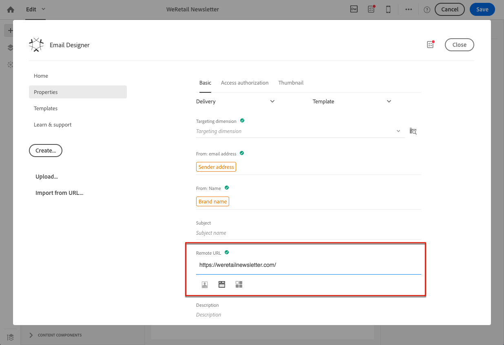

# Importing content from a URL{#importing-content-from-a-url}

Antes de importar contenido desde una URL, asegúrese de que sigue los requisitos siguientes:

* El contenido debe estar disponible públicamente a través de esta URL.
* For security reasons, only URLs beginning with **[!UICONTROL https]** are allowed.
* Asegúrese de que todos los recursos (imágenes, CSS) estén configurados en vínculos absolutos y en HTTPS. De lo contrario, después de enviar el correo electrónico, la página reflejada se mostrará sin sus recursos. Este es un ejemplo de definición absoluta de vínculo:

   ```
   <a href="https://www.mywebsite.com/images/myimage.png">
   ```

>[!NOTE]
>
>La carga de contenido desde una URL solo está disponible para el canal de correo electrónico.

Para recuperar el contenido existente de una dirección URL, siga los pasos a continuación:

1. From the Email Designer home page, select the **[!UICONTROL Import from URL]** button.

   

1. Defina la URL desde la que se recuperará el contenido.
1. Click **[!UICONTROL Confirm]**.

**Tema relacionado:**

[Importación de contenido desde](https://helpx.adobe.com/campaign/kt/acs/using/acs-email-designer-tutorial.html#Workingwithexistingcontent) un vídeo de URL

## Retrieving content from a URL automatically at preparation time {#retrieving-content-from-a-url-automatically-at-preparation-time}

La importación de contenido desde una URL durante la preparación de los mensajes le permite recuperar el contenido HTML más reciente cada vez que se prepare el correo electrónico. De este modo, el contenido de los correos electrónicos recurrentes siempre estará actualizado al momento de su envío. Esta función también permite crear un mensaje programado en una fecha específica aunque el contenido aún no esté listo.

Para recuperar contenido al momento de la preparación, siga los pasos a continuación:

1. Select the **[!UICONTROL Content imported during preparation]** option.

   

1. El contenido URL se muestra en el editor como solo lectura.

   >[!CAUTION]
   >
   >En este paso, no se debe tener en cuenta la visualización HTML en el editor de contenido. Se recuperará en la fase de preparación.

1. To preview the URL content that has been retrieved, open the message once it is created then click the **[!UICONTROL Preview]** button.

Es posible personalizar la URL remota desde la que se recuperará el contenido. Para ello, siga los pasos a continuación:

1. Click the email label on top of the screen to acces the Email Designer **[!UICONTROL Properties]** tab.
1. Find the **[!UICONTROL Remote URL]** field.

   

1. Inserte el campo de personalización, el bloque de contenido o el texto dinámico que desee.

   The **[!UICONTROL Current date - YYYYMMDD]** content block, for example, enables you to insert the date of the day.

   >[!NOTE]
   >
   >The available personalization fields are linked to **Delivery** attributes only (email creation date, status, campaign label...).

