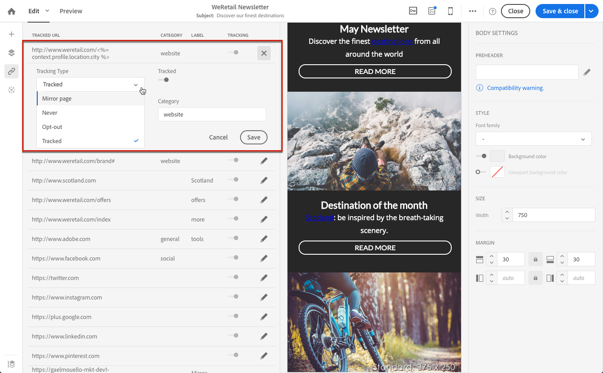

# Adición de vínculos {#links}

## Inserción de un enlace {#inserting-a-link}

El editor permite personalizar un correo electrónico o una página de aterrizaje insertando vínculos en los elementos de contenido del HTML.

Puede insertar un vínculo en cualquier elemento de página: imagen, palabra, grupo de palabras, bloque de texto, etc.

>[!NOTE]
>
>Las siguientes imágenes muestran cómo insertar un vínculo con el [correo electrónico Designer](../../designing/using/designing-content-in-adobe-campaign.md) en un mensaje de correo electrónico.

1. Seleccione un elemento y haga clic en **[!UICONTROL Insert link]** en la barra de herramientas contextual.

   

1. Elija el tipo de vínculo que desea crear:

   * **Vínculo externo**: inserte un vínculo a una dirección URL externa.

     Puede definir la personalización de las direcciones URL. Ver [Personalización de direcciones URL](personalization.md#personalizing-urls).

   * **Página de aterrizaje**: dé acceso a una página de aterrizaje de Adobe Campaign.
   * **Vínculo de suscripción**: inserte un vínculo para suscribirse a un servicio de Adobe Campaign.
   * **Vínculo de baja**: inserte un vínculo para cancelar la suscripción a un servicio de Adobe Campaign.
   * **Vínculo que define una acción**: defina una acción cuando se haga clic en un elemento de la página de aterrizaje.

     >[!NOTE]
     >
     >Este tipo de vínculo solo está disponible para páginas de aterrizaje.

1. Se puede modificar el texto mostrado al destinatario.
1. Puede establecer el comportamiento del explorador cuando el usuario haga clic en el vínculo (por ejemplo, para abrir una nueva ventana).

   >[!NOTE]
   >
   >La definición del comportamiento del explorador solo se aplica a las páginas de aterrizaje.

1. Guarde los cambios.

Una vez creado el vínculo, aún puede modificarlo desde el panel Configuración. Haga clic en el icono de lápiz para editar sus parámetros.

Al editar un correo electrónico con [Email Designer](../../designing/using/designing-content-in-adobe-campaign.md), puede acceder fácilmente a los vínculos que creó a partir de la tabla que enumera todas las direcciones URL incluidas en el correo electrónico y modificarlos. Esta lista le permite tener una vista centralizada y localizar cada dirección URL en el contenido del correo electrónico. Para obtener acceso a él, consulte [Acerca de las direcciones URL rastreadas](#about-tracked-urls).

>[!NOTE]
>
>Las direcciones URL personalizadas, como **URL de la página espejo** o el vínculo **Baja**, no se pueden modificar desde esta lista. El resto de vínculos se pueden editar.

**Temas relacionados**:

* [Inserción de un campo de personalización.](../../designing/using/personalization.md#inserting-a-personalization-field)
* [Adición de bloques de contenido](../../designing/using/personalization.md#adding-a-content-block)
* [Definición del contenido dinámico](../../designing/using/personalization.md#defining-dynamic-content-in-an-email)

## Acerca de las URL rastreadas {#about-tracked-urls}

Adobe Campaign permite rastrear el comportamiento de los destinatarios cuando hacen clic en una dirección URL incluida en un correo electrónico. Para obtener más información de seguimiento, consulte [esta sección](../../sending/using/tracking-messages.md#about-tracking).

El icono **[!UICONTROL Links]** de la barra de acciones muestra automáticamente la lista de todas las direcciones URL del contenido de las que se realizará un seguimiento.

>[!NOTE]
>
>El seguimiento está activado de forma predeterminada. Esta funcionalidad solo está disponible para correos electrónicos si el seguimiento se ha activado en Adobe Campaign. Para obtener más información sobre los parámetros de seguimiento, consulte [esta sección](../../administration/using/configuring-email-channel.md#tracking-parameters).

La dirección URL, la categoría, la etiqueta y el tipo de seguimiento de cada vínculo se pueden modificar desde esta lista. Para editar un vínculo, haga clic en el icono de lápiz correspondiente.

Para cada URL rastreada, puede establecer el modo de seguimiento en uno de estos valores:

* **Rastreado**: activa el seguimiento en esta dirección URL.
* **Página espejo**: considera esta URL como una URL de página espejo.
* **Nunca**: nunca activa el seguimiento de esta dirección URL. Esta información se guarda: si la dirección URL aparece de nuevo en un mensaje futuro, su seguimiento se desactiva automáticamente.
* **Exclusión**: considera esta URL como una URL de exclusión o de baja.

También puede desactivar o activar el seguimiento para cada dirección URL.

>[!NOTE]
>
>De forma predeterminada en Adobe Campaign, se hace un seguimiento de todas las direcciones URL de contenido, excepto **URL de la página espejo** y el vínculo **Baja**.

Puede reagrupar las direcciones URL editando el campo **[!UICONTROL Category]**, según las direcciones URL utilizadas en el mensaje. Estas categorías pueden mostrarse en los informes, como en [URL y flujos de clics](../../reporting/using/urls-and-click-streams.md).

Al crear un informe, en la ficha **[!UICONTROL Components]**, seleccione **[!UICONTROL Dimension]** y desplácese hacia abajo por la lista para acceder a los componentes de seguimiento. Por ejemplo, arrastre y suelte **[!UICONTROL Tracking URL Category]** en el área de trabajo para mostrar los resultados según la categoría de seguimiento de cada dirección URL en la que se hizo clic.

Para obtener más información sobre la generación de informes personalizados, consulte [esta sección](../../reporting/using/about-dynamic-reports.md).
