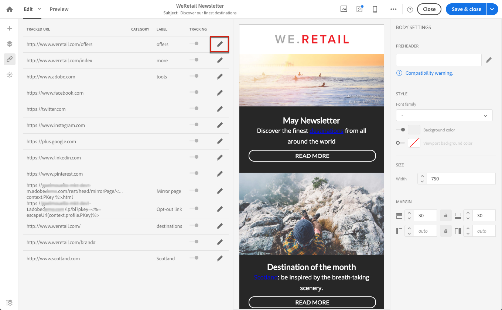
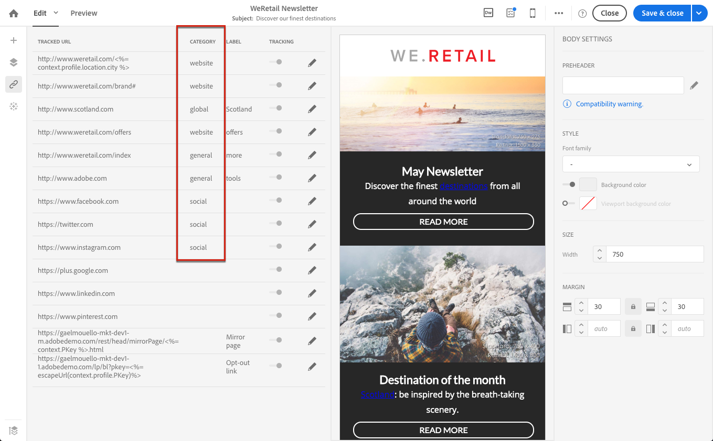

# Añadir vínculos {#links}

## Inserción de un vínculo {#inserting-a-link}

El editor le permite personalizar un correo electrónico o una página de aterrizaje mediante la inserción de vínculos en los elementos de contenido HTML.

Puede insertar un vínculo en cualquier elemento de página: imagen, palabra, grupo de palabras, bloque de texto, etc.

>[!NOTE]
>
>Las siguientes imágenes muestran cómo insertar un vínculo mediante el Diseñador de [correo electrónico](../../designing/using/designing-content-in-adobe-campaign.md) en un mensaje de correo electrónico.

1. Seleccione un elemento y haga clic en **[!UICONTROL Insert link]** en la barra de herramientas contextual.

   

1. Elija el tipo de vínculo que desea crear:

   * **Vínculo** externo: inserte un vínculo a una URL externa.

      Puede definir la personalización de las direcciones URL. Consulte [Personalización de direcciones URL](../../designing/using/using-reusable-content.md#creating-a-content-fragment).

   * **Página de aterrizaje**: dar acceso a una página de aterrizaje de Adobe Campaign.
   * **Vínculo** de suscripción: inserte un vínculo para suscribirse a un servicio de Adobe Campaign.
   * **Vínculo** baja: inserte un vínculo para cancelar la suscripción a un servicio de Adobe Campaign.
   * **Vínculo que define una acción**: define una acción cuando se hace clic en un elemento de la página de aterrizaje.

      >[!NOTE]
      >
      >Este tipo de vínculo solo está disponible para páginas de aterrizaje.

1. Puede modificar el texto mostrado en el destinatario.
1. Puede establecer el comportamiento del explorador cuando el usuario haga clic en el vínculo (por ejemplo, abra una ventana nueva).

   >[!NOTE]
   >
   >La definición del comportamiento del navegador solo se aplica a páginas de aterrizaje.

1. Guarde los cambios.

Una vez creado el vínculo, puede modificarlo desde el panel Configuración. Haga clic en el icono del lápiz para editar sus parámetros.

Al editar un correo electrónico con el Diseñador [de](../../designing/using/designing-content-in-adobe-campaign.md)correo electrónico, puede acceder y modificar fácilmente los vínculos que ha creado a partir de la tabla que enumera todas las direcciones URL incluidas en el correo electrónico. Esta lista le permite tener una vista centralizada y localizar cada URL en el contenido del correo electrónico. Para acceder a él, consulte [Acerca de las direcciones URL](#about-tracked-urls)rastreadas.

>[!NOTE]
>
>Las direcciones URL personalizadas, como URL **de** Página espejo o vínculo **Baja** , no se pueden modificar desde esta lista. Todos los demás vínculos son editables.

**Temas relacionados**:

* [Inserción de un campo de personalización](../../designing/using/personalization.md#inserting-a-personalization-field).
* [Añadir bloques de contenido](../../designing/using/personalization.md#adding-a-content-block)
* [Definición de contenido dinámico](../../designing/using/personalization.md#defining-dynamic-content-in-an-email)

## Acerca de las direcciones URL rastreadas {#about-tracked-urls}

Adobe Campaign le permite rastrear el comportamiento de sus destinatarios cuando hacen clic en una URL incluida en un mensaje de correo electrónico. For more on tracking, see [this section](../../sending/using/tracking-messages.md#about-tracking).

El **[!UICONTROL Links]** icono de la barra de acciones muestra automáticamente la lista de todas las direcciones URL del contenido que se rastreará.

>[!NOTE]
>
>El seguimiento está activado de forma predeterminada. Esta funcionalidad solo está disponible para correos electrónicos, si el seguimiento se ha activado en Adobe Campaign. For more on the tracking parameters, refer to [this section](../../administration/using/configuring-email-channel.md#tracking-parameters).

La dirección URL, la categoría, la etiqueta y el tipo de seguimiento de cada vínculo se pueden modificar desde esta lista. Para editar un vínculo, haga clic en el icono de lápiz correspondiente.

Para cada URL rastreada, puede establecer el modo de seguimiento en uno de estos valores:

* **Seguimiento**: activa el seguimiento en esta dirección URL.
* **Mirror page**: considera esta URL como una URL de página espejo.
* **Never**: nunca activa el seguimiento de esta dirección URL. Esta información se guarda: si la dirección URL vuelve a aparecer en un mensaje futuro, su seguimiento se desactiva automáticamente.
* **Opt-out**: considera esta URL como una URL de exclusión o de baja.

También puede desactivar o activar el seguimiento de cada URL.

>[!NOTE]
>
>De forma predeterminada en Adobe Campaign, se realiza un seguimiento de todas las direcciones URL de contenido, excepto de la URL **de** Página espejo y del vínculo **Baja** .

Puede reagrupar las direcciones URL editando el **[!UICONTROL Category]** campo, según las direcciones URL utilizadas en el mensaje. These categories can be displayed reports, as for example in [URLs and click streams](../../reporting/using/urls-and-click-streams.md).

Al crear un informe, desde la **[!UICONTROL Components]** ficha, seleccione **[!UICONTROL Dimension]** y desplácese hacia abajo en la lista para acceder a los componentes de seguimiento. Por ejemplo, arrastre y suelte **[!UICONTROL Tracking URL Category]** en el espacio de trabajo para mostrar los resultados según la categoría de seguimiento de cada URL en la que se hizo clic.

Para obtener más información sobre la creación de informes personalizados, consulte [esta sección](../../reporting/using/about-dynamic-reports.md).
