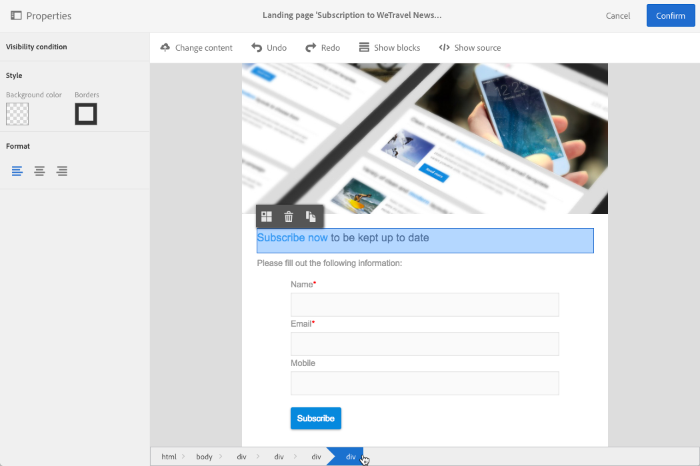

# Managing landing page structure and style{#managing-landing-page-structure-and-style}

## Managing blocks in the content editor {#managing-blocks-in-the-content-editor}

The different HTML content elements are displayed in the landing page as blocks, corresponding to the **&lt;div&gt;** **&lt;/div&gt;** tag.

Seleccione un bloque para interactuar con él. Luego estará rodeado por un cuadro azul.

Si se selecciona un bloque, los objetos principales del elemento HTML correspondiente se mostrarán en una ruta de navegación situada en la parte inferior de la zona de edición.

Cuando el ratón pasa el ratón sobre uno de los elementos de la ruta, se resaltará el elemento relacionado. Por lo tanto, puede navegar fácilmente entre los diferentes bloques y seleccionar exactamente el elemento HTML que desee modificar.

Utilice las opciones de la paleta y la barra de herramientas contextual para modificar, eliminar o duplicar el bloque.

Para los bloques que contengan texto, vuelva a hacer clic en el bloque para habilitar el modo de edición de texto. El marco alrededor del bloque se vuelve verde. A continuación, puede seleccionar o escribir texto. Utilice las opciones de la paleta y la barra contextual para agregar un vínculo o modificar el formato de texto.

Los parámetros definidos para un elemento en un bloque (vínculos, campos de personalización, bloques de contenido, etc.) puede modificarse en cualquier momento desde la paleta.

## Adding a border and a background in the content editor {#adding-a-border-and-a-background-in-the-content-editor}

You can also define a **background color** by selecting a color from the chart. Este color se aplica al bloque seleccionado.

You can add a **border** to the selected block.

## Changing the text style in the content editor {#changing-the-text-style-in-the-content-editor}

Para cambiar el estilo del texto, debe hacer clic dentro de un bloque de texto.

Para cambiar la alineación de texto, seleccione uno de los tres iconos siguientes en la paleta de la izquierda:

* **Alinear a la izquierda**: alinea el texto a la izquierda del bloque seleccionado (agrega style = "text-align: left; ").
* **Centro**: centra el texto del bloque seleccionado (agrega style = "text-align: center; ").
* **Alinear a la derecha**: alinea el texto a la derecha del bloque seleccionado (agrega style = "text-align: right; ").

También puede utilizar la barra de herramientas para cambiar los atributos de fuente: adaptar el tamaño de fuente, convertir el texto en negrita o cursiva, subrayado o cambiar el color del texto. Refer to [this section](../../designing/using/landing-page-content-editor-interface.md#landing-page-editor-toolbar).
