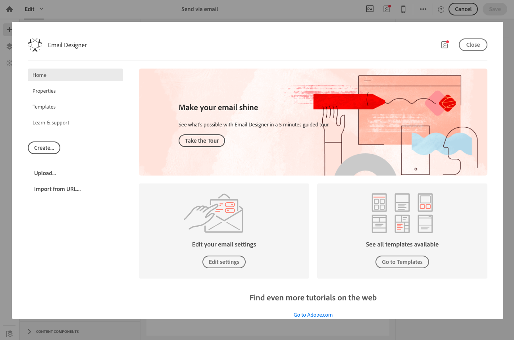

# Uso del diseñador de correo electrónico {#email-designer}

## Introducción a Email Designer {#about-the-email-designer}

El Diseñador de correo electrónico permite crear plantillas de contenido de correo electrónico y contenido de correo electrónico. Es compatible con correos electrónicos simples, correos electrónicos transaccionales, correos electrónicos de prueba A/B, correos electrónicos multilingües y correos electrónicos recurrentes.

Para empezar a usar el Diseñador de correo electrónico, vea este [conjunto de vídeos](https://helpx.adobe.com/campaign/kt/acs/using/acs-email-designer-tutorial.html#GettingStarted) que explican la funcionalidad general del Diseñador de correo electrónico y cómo diseñar un correo electrónico desde cero o mediante plantillas.

### Página de inicio de Email Designer {#email-designer-home-page}

Al [crear un mensaje de correo electrónico](../../channels/using/creating-an-email.md), la página **[!UICONTROL Email Designer]** principal se muestra automáticamente al seleccionar el contenido del mensaje.

La **[!UICONTROL Properties]** ficha permite editar los detalles del correo electrónico, como la etiqueta, la dirección y el nombre del remitente o el asunto del correo electrónico. También puede acceder a esta ficha haciendo clic en la etiqueta de correo electrónico en la parte superior de la pantalla.

La **[!UICONTROL Templates]** ficha le permite elegir entre el contenido HTML predeterminado o las plantillas que ya ha creado para empezar a diseñar el correo electrónico rápidamente. Consulte Plantillas [de contenido](../../designing/using/using-reusable-content.md#content-templates).

La ficha **[!UICONTROL Learn & support]** le permite acceder fácilmente a la documentación y los tutoriales relacionados.

Si no selecciona una plantilla, la página de inicio de Email Designer también le permite elegir cómo desea empezar a diseñar el contenido:

* Haga clic en el **[!UICONTROL Create]** botón para iniciar un nuevo contenido desde cero. Consulte [Diseño de contenido de correo electrónico desde cero](../../designing/using/designing-from-scratch.md#designing-an-email-content-from-scratch).
* Haga clic en el **[!UICONTROL Upload]** botón para cargar un archivo del equipo. Consulte [Importación de contenido desde un archivo](../../designing/using/using-existing-content.md#importing-content-from-a-file).
* Haga clic en el **[!UICONTROL Import from URL]** botón para recuperar el contenido existente de una URL. Consulte [Importación de contenido desde una dirección URL](../../designing/using/using-existing-content.md#importing-content-from-a-url).

### Interfaz de Email Designer {#email-designer-interface}

El Diseñador de correo electrónico proporciona muchas opciones que le permiten crear, editar y personalizar todos los aspectos del contenido.

La interfaz se compone de varias áreas que ofrecen diferentes funcionalidades:

Desde los elementos disponibles en la **paleta** (1), arrastre y suelte los componentes de estructura y los fragmentos de contenido en el **espacio de trabajo** principal (2). Seleccione un componente o elemento en el **espacio de trabajo** (2) y personalice su estilo principal y sus características de visualización en el panel **Configuración** (3).

Acceda a opciones y configuraciones más generales desde la **barra de herramientas** principal (4).

>[!NOTE]
>
>El panel **Configuración** puede moverse a la izquierda según la resolución de pantalla y la visualización.

La barra de **herramientas** contextual de la interfaz del editor ofrece diversas funcionalidades en función de la zona seleccionada. Contiene botones de acción y botones que le permiten cambiar el estilo del texto. Las modificaciones realizadas se aplican siempre a la zona seleccionada.

### Terminología {#terminology}

**Plantillas**: Las plantillas son estructuras de correo electrónico que se pueden crear y reutilizar para varias entregas.

**Fragmentos**: Un fragmento es un componente reutilizable al que se puede hacer referencia en uno o varios correos electrónicos.

**Componentes** de estructura: Elementos estructurales que definen el diseño del correo electrónico

**Componentes** de contenido: Los componentes de contenido son componentes sin procesar y vacíos que se pueden editar una vez colocados en un mensaje de correo electrónico.

### Prácticas recomendadas para el diseño de contenido {#content-design-best-practices}

Para utilizar correctamente el Diseñador de correo electrónico y crear los mejores correos electrónicos de la manera más sencilla posible, se recomienda aplicar los siguientes principios:

* Utilice estilos en línea en lugar de CSS y CSS independientes en la sección &lt;head&gt; del HTML. Al utilizar el estilo en línea, puede optimizar el almacenamiento y la reutilización de fragmentos de contenido.

   Consulte [Adición de atributos](../../designing/using/styles.md#adding-inline-styling-attributes)de estilo en línea.

* Si importa archivos ZIP con contenido HTML, utilice CSS normal. No se admiten las hojas de estilo SCSS.

* Configure la marca fácilmente mediante la creación y reutilización de fragmentos de contenido para mantener la coherencia en las campañas de marketing.

   Consulte [Creación de un fragmento](../../designing/using/using-reusable-content.md#creating-a-content-fragment)de contenido.

* Al editar el contenido **del** correo electrónico:

   Previsualice los mensajes antes de enviarlos. Adobe Campaign ofrece una forma de probar el procesamiento por correo electrónico con Litmus. Para obtener más información sobre este tema, consulte Representación por correo electrónico.

En la siguiente guía paso a paso de Adobe Campaign se ofrecen más prácticas recomendadas generales y de diseño sobre los mensajes: Prácticas recomendadas [de entrega con Adobe Campaign](https://docs.campaign.adobe.com/doc/standard/getting_started/en/ACS_DeliveryBestPractices.html).

### Limitaciones de Email Designer {#email-designer-limitations}

* No se pueden usar campos de personalización en un fragmento. Para obtener más información sobre los fragmentos, consulte [esta sección](../../designing/using/using-reusable-content.md#about-fragments).
<!--* You cannot save directly as a fragment some content of an email that you are editing within the Email Designer. You need to copy-paste the HTML corresponding to that content into a new fragment. For more on this, see [Saving content as a fragment](../../designing/using/using-reusable-content.md#saving-content-as-a-fragment).-->
* Al editar estilos, solo están disponibles las fuentes web oficialmente admitidas por la mayoría de los clientes de correo electrónico.
* Los estilos no se pueden guardar como un tema para su reutilización futura. Sin embargo, el estilo CSS se puede guardar en una plantilla de contenido o en un correo electrónico. Para obtener más información sobre los estilos, consulte [esta sección](../../designing/using/styles.md).

### Actualización de fragmentos {#email-designer-updates}

El Diseñador de correo electrónico está en constante mejora. Si ha creado un contenido de correo electrónico desde cero, a partir de una plantilla lista para usar o si ha creado fragmentos, puede recibir el siguiente mensaje de actualización la próxima vez que abra el contenido:

Adobe recomienda actualizar el contenido a la versión más reciente para evitar problemas como problemas de colisión con CSS. Click **[!UICONTROL Update now]**.

Si se produce un error durante la actualización de contenido, compruebe el HTML y corríjalo antes de volver a ejecutar esta actualización.

Cuando se trata de fragmentos, tenga en cuenta lo siguiente:

* Si desea agregar un fragmento a un nuevo correo electrónico o plantilla y recibe este mensaje, primero debe actualizar este fragmento.

* Si tiene varios fragmentos, debe actualizar cada fragmento que desee utilizar en un contenido de correo electrónico.

* Para evitar el impacto en los mensajes de correo electrónico actuales que aún no están preparados, puede optar por no actualizar algunos fragmentos.

* Aún puede enviar correos electrónicos cuando ya se esté utilizando un fragmento que no se haya actualizado, pero ese fragmento no se pueda editar.

* La actualización de fragmentos utilizados en correos electrónicos que ya están preparados no afecta a esos mensajes.