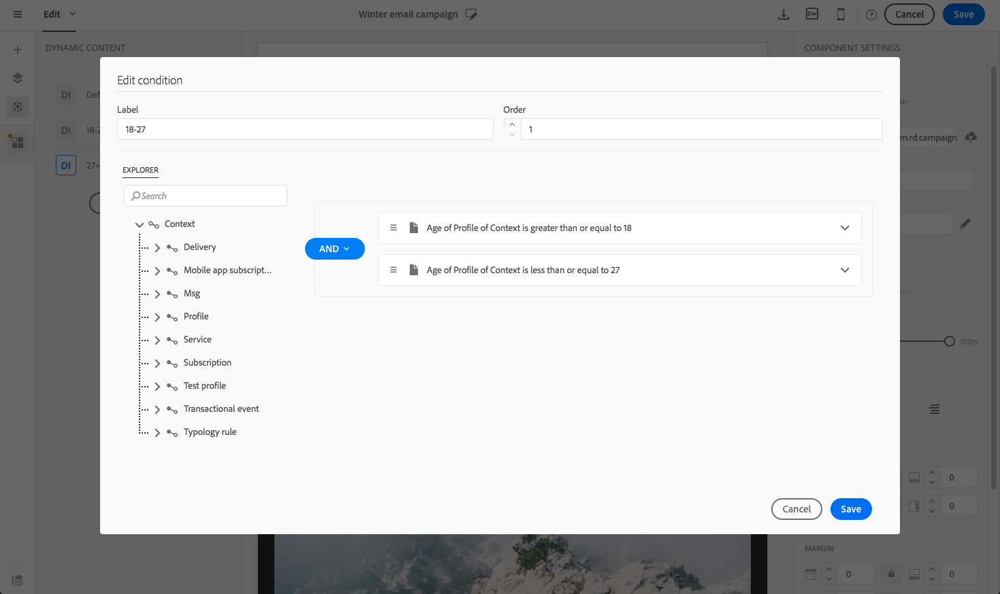

# Personalización del contenido del correo electrónico {#personalization}

El contenido y la visualización de los mensajes enviados por Adobe Campaign se pueden personalizar de varias formas diferentes. Estas formas se pueden combinar de acuerdo con criterios según los perfiles. En general, Adobe Campaign le permite:

* Insertar campos de personalización dinámicos. Consulte [Inserción de un campo de personalización](#inserting-a-personalization-field).
* Insertar bloques de personalización predefinidos. Consulte [Adición de un bloque de contenido](#adding-a-content-block).
* Personalice el remitente de un correo electrónico. Consulte [Personalización del remitente](#personalizing-the-sender).
* Personalice el asunto de un correo electrónico. Consulte [Personalización de la línea de asunto de un correo electrónico](../../designing/using/subject-line.md#subject-line).
* Cree contenido condicional. Consulte [Definición del contenido dinámico en un correo electrónico](#defining-dynamic-content-in-an-email).

## Personalización del remitente {#personalizing-the-sender}

Para definir el nombre del remitente que aparece en el encabezado de los mensajes enviados, vaya a **[!UICONTROL Properties]** de la página de inicio del Diseñador de correo electrónico (accesible a través del icono de inicio). Para obtener más información, consulte [Definición del remitente de un correo electrónico](../../designing/using/subject-line.md#email-sender).

Puede cambiar el nombre del remitente haciendo clic en el icono **Nombre del remitente** Bloque. A continuación, el campo se vuelve editable y puede introducir el nombre que desee utilizar.

Este campo se puede personalizar. Para ello, puede añadir campos de personalización, bloques de contenido y contenido dinámico haciendo clic en los iconos debajo del nombre del remitente.

>[!NOTE]
>
>Los parámetros de encabezado no deben estar vacíos. La dirección del remitente es obligatoria para permitir que se envíe un mensaje de correo electrónico (estándar RFC). Adobe Campaign comprueba la sintaxis de las direcciones de correo electrónico introducidas.

## Personalización de direcciones URL{#personalizing-urls}

Adobe Campaign permite personalizar una o varias direcciones URL en el mensaje añadiendo campos de personalización, bloques de contenido o contenido dinámico. Para ello, haga lo siguiente:

1. Inserte una dirección URL externa y especifique sus parámetros. Consulte [Inserción de un vínculo](../../designing/using/links.md#inserting-a-link).
1. Si no se muestra, haga clic en el lápiz situado junto a la dirección URL seleccionada en el panel Configuración para acceder a las opciones de personalización.
1. Añada los campos de personalización, los bloques de contenido y el contenido dinámico que desee utilizar.

   

1. Guarde los cambios.

>[!NOTE]
>
>Cuando el mecanismo de firma de URL para el seguimiento de vínculos está desactivado, la personalización de direcciones URL no se puede aplicar al nombre de dominio ni a la extensión de URL. Se mostrará un mensaje de error durante el análisis del mensaje si la personalización es incorrecta.
>
>Al seleccionar un bloque de contenido, no se le permite seleccionar elementos como **Vínculo a página espejo**. Este tipo de bloques está prohibido dentro de un vínculo.

## Inserción de un campo de personalización.{#inserting-a-personalization-field}

Adobe Campaign le permite insertar un campo de la base de datos en la página, como el nombre del perfil.

>[!NOTE]
>
>Las siguientes imágenes muestran cómo insertar un campo de personalización utilizando la variable [Diseñador de correo electrónico](../../designing/using/designing-content-in-adobe-campaign.md) para un correo electrónico.

Para añadir un campo de personalización al contenido:

1. Haga clic dentro de un bloque de texto y luego en **[!UICONTROL Personalize]** en la barra de herramientas contextual y seleccione **[!UICONTROL Insert personalization field]**. Para obtener más información sobre la interfaz del Diseñador de correo electrónico, consulte [esta sección](../../designing/using/designing-content-in-adobe-campaign.md#email-designer-interface).

   

1. Seleccione el campo que desea insertar en el contenido de la página.

   

1. Haga clic en **[!UICONTROL Confirm]**.

El nombre del campo aparece en el editor y se resalta.

Una vez generada la personalización (al previsualizar y preparar el correo electrónico, por ejemplo), este campo se sustituye por el valor correspondiente al perfil de destino.

>[!NOTE]
>
>Si el correo electrónico se crea a partir de un flujo de trabajo, los datos adicionales calculados en el flujo de trabajo también están disponibles en los campos personalizados. Para obtener más información sobre cómo añadir datos adicionales desde un flujo de trabajo, consulte la [Enriquecimiento de datos](../../automating/using/about-targeting-activities.md#enriching-data) sección.

## Añadir un bloque de contenido{#adding-a-content-block}

Adobe Campaign ofrece una lista de bloques de contenido preconfigurados. Estos bloques de contenido son dinámicos, personalizados y tienen una renderización específica. Por ejemplo, puede agregar un saludo o un vínculo a la página espejo.

>[!NOTE]
>
>Las siguientes imágenes muestran cómo insertar un bloque de contenido utilizando [Diseñador de correo electrónico](../../designing/using/designing-content-in-adobe-campaign.md) para un correo electrónico.

Para añadir un bloque de contenido:

1. Haga clic dentro de un bloque de texto y luego en **[!UICONTROL Personalize]** en la barra de herramientas contextual y seleccione **[!UICONTROL Insert content block]**. Para obtener más información sobre la interfaz del Diseñador de correo electrónico, consulte [esta sección](../../designing/using/designing-content-in-adobe-campaign.md#email-designer-interface).

   

1. Seleccione el bloque de contenido que desea insertar. Los bloques disponibles varían según el contexto (correo electrónico o página de aterrizaje).

   

1. Haga clic en **[!UICONTROL Save]**.

El nombre del bloque de contenido aparece en el editor y se resalta en amarillo. Se adaptará automáticamente al perfil cuando se genere la personalización.

Los bloques de contenido listos para usar son los siguientes:

* **[!UICONTROL Database URL in emails (EmailUrlBase)]**: este bloque de contenido solo se puede utilizar en un **envío**.
* **[!UICONTROL Mirror page URL (MirrorPageUrl)]**: este bloque de contenido solo se puede utilizar en un **envío**.
* **[!UICONTROL Link to mirror page (MirrorPage)]**: este bloque de contenido solo se puede utilizar en un **envío**.
* **[!UICONTROL Greetings (Greetings)]**
* **[!UICONTROL Unsubscription link (UnsubscriptionLink)]**: este bloque de contenido solo se puede utilizar en un **envío**.
* **[!UICONTROL Social network sharing links (LandingPageViralLinks)]**: este bloque de contenido solo se puede utilizar en un **página de aterrizaje**.
* **[!UICONTROL Default sender name (DefaultSenderName)]**: este bloque de contenido solo se puede utilizar en un **envío**.
* **[!UICONTROL Name of default reply-to email address (DefaultReplyName)]**: este bloque de contenido solo se puede utilizar en un **envío**.
* **[!UICONTROL Email address of default sender (DefaultSenderAddress)]**: este bloque de contenido solo se puede utilizar en un **envío**.
* **[!UICONTROL Default error email address (DefaultErrorAddress)]**: este bloque de contenido solo se puede utilizar en un **envío**.
* **[!UICONTROL Default reply-to email address (DefaultReplyAddress)]**: este bloque de contenido solo se puede utilizar en un **envío**.
* **[!UICONTROL Brand name (BrandingUsualName)]**
* **[!UICONTROL Link to the brand website (BrandingWebSiteLink)]**
* **[!UICONTROL Brand logo (BrandingLogo)]**
* **[!UICONTROL Notification style (notificationStyle)]**

### Creación de bloques de contenido personalizados {#creating-custom-content-blocks}

Puede definir nuevos bloques de contenido que se insertan en un mensaje o en una página de aterrizaje.

Para crear un bloque de contenido, siga estos pasos:

1. Clic **[!UICONTROL Resources > Content blocks]** desde el menú avanzado para acceder a la lista de bloques de contenido.
1. Haga clic en **[!UICONTROL Create]** o duplique un bloque de contenido preexistente.

   

1. Introduzca una etiqueta.
1. Seleccione el del bloque **[!UICONTROL Content type]**. Hay tres opciones disponibles:

   * **[!UICONTROL Shared]**: el bloque de contenido se puede utilizar en una entrega o en una página de aterrizaje.
   * **[!UICONTROL Delivery]**: el bloque de contenido solo se puede utilizar en una entrega.
   * **[!UICONTROL Landing page]**: el bloque de contenido solo se puede utilizar en una página de aterrizaje.

   

1. Puede seleccionar una **[!UICONTROL Targeting dimension]**. Para obtener más información, consulte [Acerca de la dimensión objetivo](#about-targeting-dimension).

   

1. Puede seleccionar el **[!UICONTROL Depends on format]** opción para definir dos bloques diferentes: uno para los correos electrónicos del HTML y otro para los correos electrónicos en formato de texto. A continuación, se muestran dos pestañas en el editor (HTML y Texto) para definir los contenidos correspondientes.

   

1. Introduzca el contenido de los bloques de contenido y haga clic en **[!UICONTROL Create]** botón.

El bloque de contenido ahora se puede utilizar en el editor de contenido de un mensaje o de una página de aterrizaje.

>[!CAUTION]
>
>Al editar el contenido de un bloque, asegúrese de que no haya espacios en blanco adicionales entre el principio y el final de su *if* extractos. En HTML, los espacios en blanco se muestran en pantalla y, por lo tanto, afectan al diseño del contenido.

### Acerca de la dimensión objetivo {#about-targeting-dimension}

La dimensión de segmentación le permite definir en qué tipo de mensaje puede utilizar el bloque de contenido. Esto sirve para evitar el uso de bloques inadecuados en un mensaje, lo que puede provocar errores.

De hecho, al editar un mensaje, solo puede seleccionar bloques de contenido con una dimensión de segmentación compatible con la dimensión de segmentación de ese mensaje.

Por ejemplo, la variable **[!UICONTROL Unsubscription link]** la dimensión de segmentación del bloque es **[!UICONTROL Profiles]** porque contiene campos de personalización específicos de **[!UICONTROL Profiles]** recurso. Por lo tanto, no puede utilizar un **[!UICONTROL Unsubscription link]** bloquear en un [mensaje transaccional de evento](../../channels/using/getting-started-with-transactional-msg.md#transactional-message-types), porque la dimensión de segmentación de ese tipo de mensaje es **[!UICONTROL Real-time events]**. Sin embargo, puede utilizar el complemento **Vínculo de baja** bloquear en a [mensaje transaccional de perfil](../../channels/using/getting-started-with-transactional-msg.md#transactional-message-types), porque la dimensión de segmentación de ese tipo de mensaje es **Perfiles**. Por último, el **[!UICONTROL Link to mirror page]** El bloque de no tiene una dimensión de segmentación, por lo que puede utilizarlo en cualquier mensaje.

Si deja este campo vacío, el bloque de contenido es compatible con todos los mensajes, independientemente de la dimensión de segmentación. Si establece una dimensión de segmentación, ese bloque solo será compatible con los mensajes que tengan la misma dimensión de segmentación.

Para obtener más información sobre esto, consulte [Dimensiones de segmentación y recursos](../../automating/using/query.md#targeting-dimensions-and-resources).

**Temas relacionados:**

* [Inserción de un campo de personalización.](#inserting-a-personalization-field)
* [Añadir un bloque de contenido](#adding-a-content-block)
* [Definición del contenido dinámico en un correo electrónico](#defining-dynamic-content-in-an-email)

## Personalización de una fuente de imagen{#personalizing-an-image-source}

Adobe Campaign permite personalizar una o varias imágenes del mensaje según un criterio determinado o utilizar el seguimiento. Para ello, inserte campos de personalización, bloques de contenido o contenido dinámico en el origen de la imagen. Para ello, haga lo siguiente:

1. Inserte una imagen en el contenido del mensaje o seleccione una imagen que ya esté presente.
1. En la paleta de propiedades de la imagen, marque **[!UICONTROL Enable personalization]** opción.

   

   El **[!UICONTROL Source]** El campo se muestra y la imagen seleccionada se muestra como **personalizado** en el editor.

1. Haga clic en el lápiz situado junto al **[!UICONTROL Source]** botón de campo para acceder a las opciones de personalización.
1. Después de haber agregado el origen de la imagen, agregue los campos de personalización, los bloques de contenido y el contenido dinámico que desee.

   

   >[!NOTE]
   >
   >El nombre de dominio (http://mydomain.com) no se puede personalizar, debe introducirse manualmente. El resto de la dirección URL se puede personalizar. Por ejemplo: http://mydomain.com/ `[Gender]` .jpg

1. Confirme los cambios.

## Contenido condicional {#conditional-content}

### Definición de una condición de visibilidad{#defining-a-visibility-condition}

Puede especificar una condición de visibilidad en cualquier elemento. Solo será visible si se respeta la condición.

Para añadir una condición de visibilidad, seleccione un bloque e introduzca la condición que se respetará en la **[!UICONTROL Visibility condition]** de su configuración.

Esta opción solo está disponible para los siguientes elementos: ADDRESS, BLOCKQUOTE, CENTER, DIR, DIV, DL, FIELDSET, FORM, H1, H2, H3, H4, H5, H6, NOSCRIPT, OL, P, PRE, UL, TR, TD.

El editor de expresiones se presenta en la variable [Edición avanzada de expresiones](../../automating/using/editing-queries.md#about-query-editor) sección.

Estas condiciones adoptan la sintaxis de la expresión XTK (p. ej. **context.profile.email !=&#39;&#39;** o **context.profile.status=&#39;0&#39;**). De forma predeterminada, todos los campos son visibles.

>[!NOTE]
>
>No se puede definir una condición para un bloque que ya contenga un subelemento con contenido dinámico o un bloque que ya conforme un contenido dinámico. Los bloques dinámicos no visibles como las listas desplegables no se pueden editar.

### Definición del contenido dinámico en un correo electrónico{#defining-dynamic-content-in-an-email}

>[!CONTEXTUALHELP]
>id="ac_dynamic_content"
>title="Definición del contenido dinámico"
>abstract="Defina diferentes contenidos que se mostrarán a algunos perfiles solo según las condiciones que defina."

En un mensaje de correo electrónico, puede definir diferentes contenidos que se muestran dinámicamente a los destinatarios según las condiciones definidas mediante el editor de expresiones. Por ejemplo, desde el mismo correo electrónico, puede asegurarse de que cada perfil reciba un mensaje diferente según su intervalo de edad.

La definición de contenido dinámico es diferente de [definición de condiciones de visibilidad](#defining-a-visibility-condition).

1. Seleccione un fragmento, un componente o un elemento. En este ejemplo, seleccione una imagen.
1. Haga clic en **[!UICONTROL Dynamic content]** de la barra de herramientas contextual.

   

   El **[!UICONTROL Dynamic content]** aparece en la paleta de la izquierda.

   

   De forma predeterminada, esta sección contiene dos elementos: la variante predeterminada y una nueva.

   >[!NOTE]
   >
   >El contenido siempre debe tener una variante predeterminada. No puede eliminarlo.

1. Haga clic en **[!UICONTROL Edit]** para definir las condiciones de visualización de la primera variante alternativa.

   

1. Especifique una etiqueta y seleccione los campos que desea establecer como condiciones. Por ejemplo, desde el **[!UICONTROL General]** , seleccione el **[!UICONTROL Age]** campo

   

1. Defina las condiciones de filtrado. Por ejemplo, desea que se muestre un contenido diferente a las personas de entre 18 y 25 años.

   

1. Una vez establecidas todas las condiciones, defina el orden de prioridad en el que se aplicará la condición y guarde los cambios.

   

   El contenido se muestra en la paleta en orden de prioridad, de arriba a abajo. Para obtener más información sobre prioridades, consulte [esta sección](#defining-dynamic-content-in-an-email).

1. Cargue una nueva imagen para la variante que acaba de definir.

   

   Los destinatarios de entre 18 y 25 años verán la nueva imagen.

   

1. Clic **[!UICONTROL Add a condition]** para añadir un nuevo contenido y su regla vinculada.

   

   Por ejemplo, puede agregar una imagen diferente para mostrarla a las personas de entre 26 y 35 años.

1. Continúe de forma similar para cualquier otro elemento del correo electrónico que desee que se muestre dinámicamente. Puede ser texto, botón, fragmento, etc. Guarde los cambios.

>[!CAUTION]
>
>Una vez que haya preparado el mensaje y antes de enviarlo, pruébelo con una prueba. Si no lo hace, es posible que algunos errores no se detecten y que no se envíe el correo electrónico.

**Temas relacionados:**

* [Envío de pruebas](../../sending/using/sending-proofs.md)
* [Edición avanzada de expresiones](../../automating/using/editing-queries.md#about-query-editor)

### Orden de prioridad {#order-of-priority}

En el editor de expresiones, cuando se define un contenido dinámico, el orden de prioridad es el siguiente.

1. Puede definir dos contenidos dinámicos diferentes con **dos condiciones diferentes**, por ejemplo:

   **Condición 1:** el sexo del perfil es masculino,

   **Condición 2:** el perfil tiene entre 20 y 30 años.

   

   Algunos perfiles de la base de datos corresponden a las dos condiciones, pero solo se puede enviar un correo electrónico con un contenido dinámico.

1. Por lo tanto, debe definir la prioridad del contenido dinámico. Una condición con un orden de prioridad de **1** (y, por lo tanto, el contenido dinámico correspondiente) se enviará a un perfil aunque se cumpla otra condición cuyo orden de prioridad sea **2** o **3** también se cumple con este perfil.

   

Solo puede definir un orden de prioridad por contenido dinámico.

## Ejemplo: Personalización de correo electrónico{#example-email-personalization}

En este ejemplo, un miembro del equipo de servicio de marketing ha creado un correo electrónico para informar a algunos de sus clientes de que hay una oferta especial solo para ellos. El miembro del equipo decidió personalizar el correo electrónico según las edades respectivas de los clientes. Los clientes de entre 18 y 27 años recibirán un correo electrónico con una imagen y un eslogan diferentes a los que recibirán los clientes mayores de 27 años.

El correo electrónico se crea de la siguiente manera:

* El contenido dinámico se aplica a la imagen y este contenido dinámico se configura según el intervalo de edad.

   

   La adición y configuración de contenido dinámico se detallan en [Definición del contenido dinámico en un correo electrónico](#defining-dynamic-content-in-an-email) sección.

* Los campos de personalización y el contenido dinámico se aplican al texto. Según el intervalo de edad del perfil, el correo electrónico comienza con el nombre del perfil o el título y apellidos del perfil.

   

   La adición y configuración de los campos personalizados se detalla en la [Inserción de un campo personalizado](#inserting-a-personalization-field) sección.

### Configuración de imágenes {#configuring-images}

>[!CONTEXTUALHELP]
>id="ac_dynamic_image"
>title="Administración de imágenes dinámicas"
>abstract="Personalice el correo electrónico con imágenes dinámicas según las condiciones que defina."

En este ejemplo, el contenido dinámico aplicado a las imágenes se configura de la siguiente manera:

**Para dirigirse a jóvenes de 18 a 27 años:**

1. Seleccione el contenido dinámico en la **[!UICONTROL Properties]** y haga clic en la **[!UICONTROL Edit]** botón.

   

1. Edite la etiqueta y seleccione la **[!UICONTROL Age]** del campo **[!UICONTROL Profile]** nodo.

   

1. Seleccione el **Bueno que o igual a** operador y luego entrar **18** para crear el **mayor de 18 años** expresión.

   

1. Añadir un nuevo **[!UICONTROL Age]** condición.

   Seleccione el **Menor o igual que** seguido de 27 en el campo value para crear el **menor de 27 años** expresión.

   

1. Confirme los cambios.

**Para segmentar perfiles de 27 años o más:**

1. Seleccione el contenido dinámico de la paleta y edítelo.
1. Edite la etiqueta y seleccione la **[!UICONTROL Age]** del campo **[!UICONTROL Profile]** nodo.
1. Añada el **Bueno que** seguido de 27 en el campo value para crear el **mayor de 27 años** expresión.

   

1. Confirme los cambios.

El contenido dinámico está configurado correctamente.

### Configuración de texto {#configuring-text}

En este ejemplo, los contenidos dinámicos aplicados a los textos se configuran de la siguiente manera:

**Para segmentar perfiles de entre 18 y 27 años:**

1. Seleccione el componente de estructura que desee y añada un contenido dinámico.
1. Edite el contenido dinámico y configure las expresiones de segmentación. Consulte [Configuración de imágenes](#configuring-images).
1. En el componente de estructura, en la posición deseada, haga clic en **[!UICONTROL Personalize]** en la barra de herramientas contextual y seleccione **[!UICONTROL Insert personalization field]**.

   

1. En la lista que aparece, seleccione la **[!UICONTROL First name]** y confirme.

   

1. A continuación, el campo de personalización se inserta perfectamente en el contenido dinámico seleccionado.

**Para segmentar perfiles de 27 años o más:**

1. Seleccione el componente de estructura que desee y añada un contenido dinámico.
1. Edite el contenido dinámico y configure las expresiones de segmentación. Consulte [Configuración de imágenes](#configuring-images).
1. En el componente de estructura, en la posición deseada, haga clic en **[!UICONTROL Personalize]** en la barra de herramientas contextual y seleccione **[!UICONTROL Insert personalization field]**.
1. Seleccionar **[!UICONTROL Title]** en la lista desplegable.
1. Continúe de forma similar para agregar **[!UICONTROL Last name]** field.

   

Los campos de personalización ahora deben insertarse perfectamente en el contenido dinámico elegido.

### Previsualización de correos electrónicos {#previewing-emails}

La vista previa permite comprobar que los campos de personalización y el contenido dinámico están correctamente configurados antes de enviar el **[!UICONTROL Proofs]**. Durante la vista previa, puede seleccionar diferentes perfiles de prueba correspondientes a los destinatarios del correo electrónico.

Sin perfiles de prueba, el correo electrónico que aparece de forma predeterminada es:

El correo electrónico no tiene campos de personalización en el eslogan y se utiliza la imagen predeterminada.

El primer perfil de prueba corresponde a un cliente de entre 18 y 27 años. Al seleccionar este perfil, aparece el siguiente correo electrónico:

El campo de personalización que corresponde a la expresión de entre 18 y 27 años, específicamente el nombre del perfil, está configurado correctamente y la imagen también ha cambiado según el perfil.

El segundo perfil corresponde a un cliente mayor de 27 años y genera el siguiente correo electrónico:

La imagen ha cambiado gracias al contenido dinámico, y el eslogan que aparece es el eslogan más formal definido para este público objetivo.

**Temas relacionados:**

* [Creación de audiencias](../../audiences/using/creating-audiences.md)
* [Preparación del envío](../../sending/using/preparing-the-send.md)
