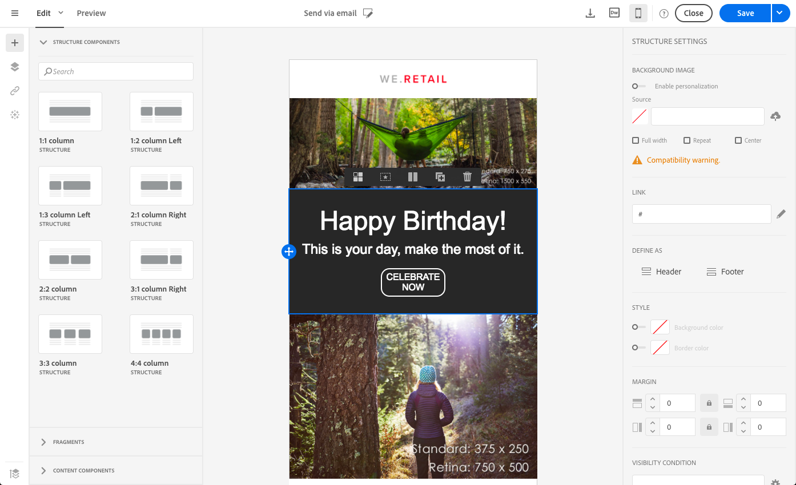
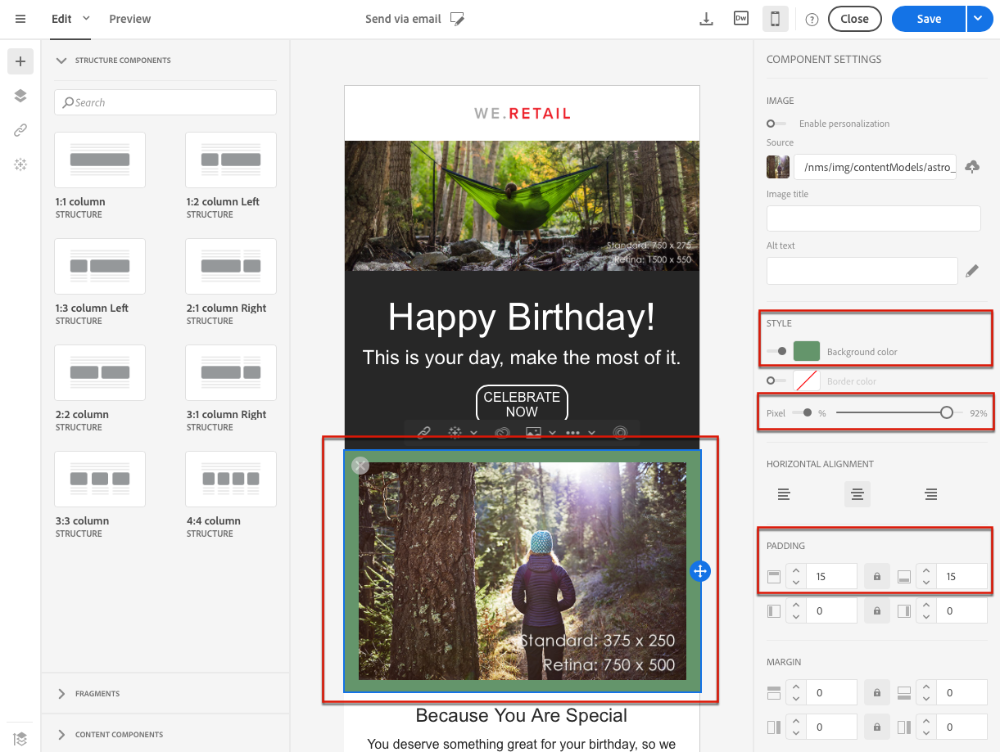
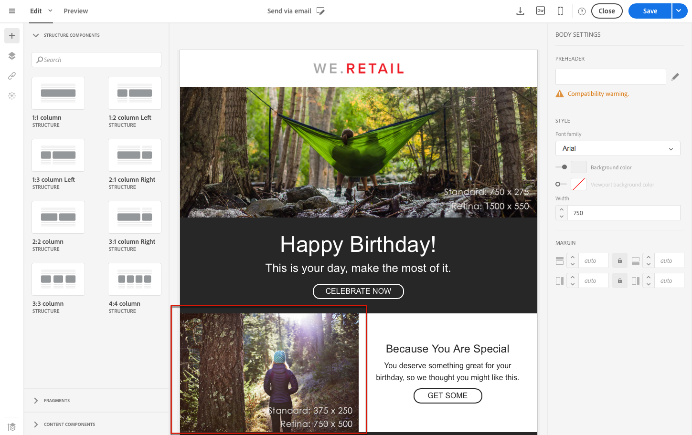
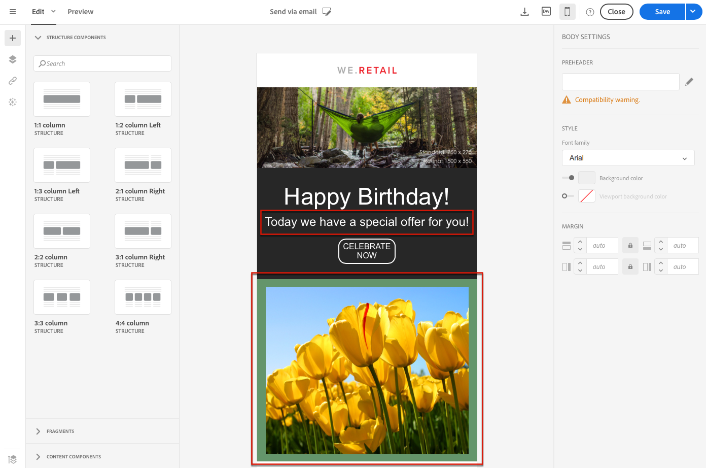
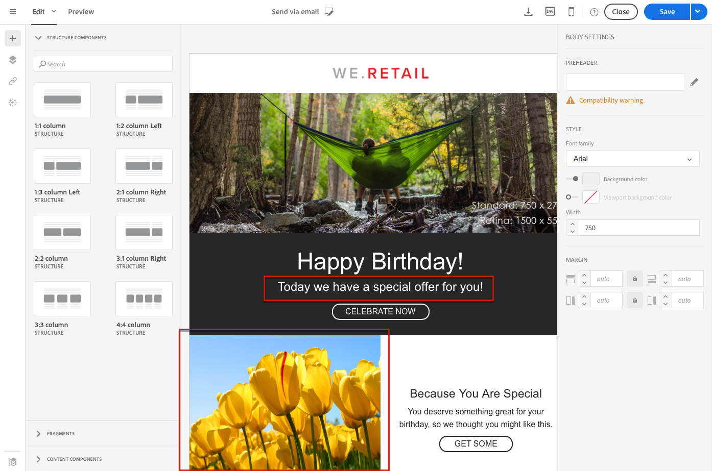

# Edición de formatos de texto sin formato, HTML y correo electrónico móvil {#plain-text-and-html-modes}

El Designer de correo electrónico permite editar varios procesamientos de correos electrónicos. Puede generar una versión de texto del correo electrónico, editar el origen de HTML de un correo electrónico y diseñar correos electrónicos para la vista móvil.

## Generación de una versión de texto del correo electrónico {#generating-a-text-version-of-the-email}

De manera predeterminada, la versión **[!UICONTROL Plain text]** de su correo electrónico se genera automáticamente y se sincroniza con la versión **[!UICONTROL Edit]**.

Los campos personalizados y los bloques de contenido añadidos a la versión de HTML también se sincronizan con la versión de texto sin formato.

>[!NOTE]
>
>Para utilizar bloques de contenido en versión de texto sin formato, asegúrese de que no contengan código HTML.

Para tener una versión de texto sin formato diferente a la versión de HTML, puede deshabilitar esta sincronización haciendo clic en el modificador **[!UICONTROL Sync with HTML]** desde la vista **[!UICONTROL Plain text]** de su correo electrónico.

A continuación, puede editar la versión de texto sin formato como desee.

>[!NOTE]
>
>Si edita la versión de **[!UICONTROL Plain text]** mientras está deshabilitada la sincronización, la próxima vez que habilite la opción **[!UICONTROL Sync with HTML]**, todos los cambios realizados en la versión de texto sin formato se reemplazarán con la versión de HTML. Los cambios realizados en la vista **[!UICONTROL Plain text]** no se pueden reflejar en la vista **[!UICONTROL HTML]**.

## Edición de un origen de contenido de correo electrónico en HTML {#editing-an-email-content-source-in-html}

Para los usuarios y la depuración más avanzados, puede ver y editar el contenido del correo electrónico directamente en HTML.

Tiene dos formas de editar la versión de HTML del correo electrónico:

* Seleccione **[!UICONTROL Edit]** > **[!UICONTROL HTML]** para abrir la versión de HTML de todo el correo electrónico.

  

* En la interfaz de WYSIWYG, seleccione un elemento y haga clic en el icono **[!UICONTROL Source code]**.

  Solo se muestra el origen del elemento seleccionado. Puede editar el código fuente si el elemento seleccionado es un componente de contenido de **[!UICONTROL HTML]**. Otros componentes están en modo de solo lectura, pero se pueden editar en la versión completa de HTML del correo electrónico.

  

Si modifica el HTML y el código, es posible que se rompa la capacidad de respuesta del correo electrónico. Asegúrese de probarlo con el botón **[!UICONTROL Preview]**. Consulte [Vista previa de mensajes](../../sending/using/previewing-messages.md).

## Diseño de correos electrónicos para procesamiento móvil {#switching-to-mobile-view}

Puede ajustar el diseño interactivo de un correo electrónico editando por separado todas las opciones de estilo de la pantalla móvil. Por ejemplo, puede adaptar los márgenes y el relleno, utilizar tamaños de fuente más pequeños o grandes, cambiar botones o aplicar diferentes colores de fondo que serán específicos de la versión móvil del correo electrónico.

Todas las opciones de estilo están disponibles en la vista móvil. La configuración de estilo de Designer de correo electrónico se presentó anteriormente en esta página.

1. Cree un correo electrónico y empiece a editar el contenido. Para obtener más información, consulte [Diseño del contenido de un correo electrónico desde cero](../../designing/using/designing-from-scratch.md#designing-an-email-content-from-scratch).
1. Para acceder a la vista móvil dedicada, seleccione el botón **[!UICONTROL Switch to mobile view]**.

   

   Se muestra la versión móvil del correo electrónico. Contiene todos los componentes y estilos definidos en la vista de escritorio.

1. Edite de forma independiente todos los ajustes de estilo, como el color de fondo, la alineación, el relleno, el margen, la familia de fuentes, el color del texto, etc.

   

1. Al editar cualquier configuración de estilo en la vista móvil, las modificaciones solo se aplican a la pantalla móvil.

   Por ejemplo, reduzca el tamaño de una imagen, añada un fondo verde y cambie el relleno en la vista móvil.

   

1. Puede ocultar un componente cuando se muestre en un dispositivo móvil. Para ello, seleccione **[!UICONTROL Show only on desktop devices]** de **[!UICONTROL Display options]**.

   También puede ocultar este componente en dispositivos de escritorio, lo que significa que solo se mostrará en dispositivos móviles. Para ello, seleccione **[!UICONTROL Show only on mobile devices]**.

   Por ejemplo, esta opción le permite mostrar una imagen específica en dispositivos móviles y otra imagen en dispositivos de escritorio.

   Puede establecer esta opción desde la vista móvil o de escritorio.

   

1. Vuelva a hacer clic en el botón **[!UICONTROL Switch to mobile view]** para volver a la vista de escritorio estándar. Los cambios de estilo que acaba de realizar no se reflejan.

   

   >[!NOTE]
   >
   >La única excepción es la configuración de **[!UICONTROL Style inline]**. Cualquier cambio en la configuración de estilo en línea también se aplica a la vista de escritorio estándar.

1. Cualquier otro cambio en la estructura o el contenido del correo electrónico, como ediciones de texto, carga de una nueva imagen, adición de un nuevo componente, etc., también se aplica a la vista estándar.

   Por ejemplo, vuelva a la vista móvil, edite texto y reemplace una imagen.

   

1. Vuelva a hacer clic en el botón **[!UICONTROL Switch to mobile view]** para volver a la vista de escritorio estándar. Los cambios se reflejan.

   

1. Al quitar un estilo en la vista móvil, se vuelve al estilo que se aplicó en el modo de escritorio.

   Por ejemplo, en la vista móvil, aplique un color de fondo verde a un botón.

   

1. Cambie a la vista de escritorio y aplique un fondo gris al mismo botón.

   

1. Cambie de nuevo a la vista móvil y, a continuación, deshabilite la configuración **[!UICONTROL Background color]**.

   

   El color de fondo definido en la vista de escritorio ahora se aplica: se vuelve gris (no en blanco).

   La única excepción es la configuración de **[!UICONTROL Border color]**. Cuando se deshabilita en la vista móvil, ya no se aplica ningún borde, aunque se defina un color de borde en la vista de escritorio.

>[!NOTE]
>
>La vista móvil no está disponible en [fragmentos](../../designing/using/using-reusable-content.md#about-fragments).
