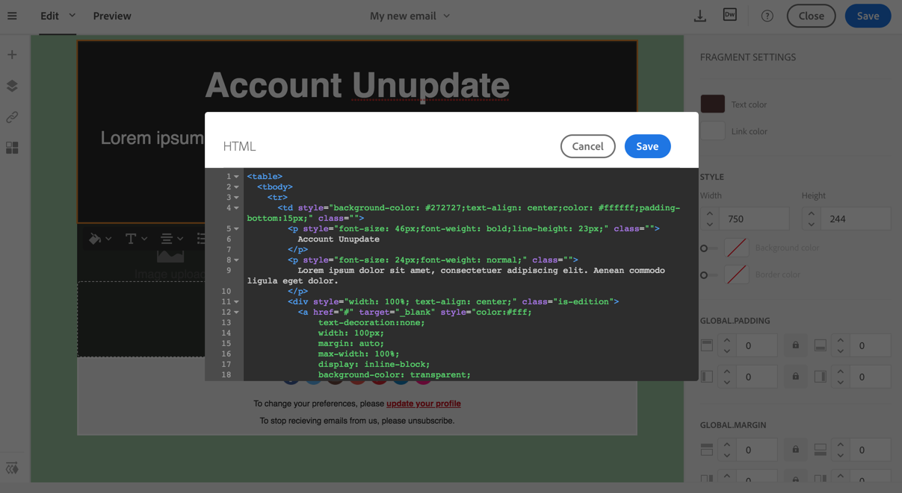

# Edición de formatos de correo electrónico de texto sin formato, HTML y móvil {#plain-text-and-html-modes}

El Diseñador de correo electrónico permite editar varias representaciones de los correos electrónicos. Puede generar una versión de texto del correo electrónico, editar la fuente del HTML de un correo electrónico y diseñar correos electrónicos para la vista móvil.

## Generación de una versión de texto del correo electrónico {#generating-a-text-version-of-the-email}

De forma predeterminada, la variable **[!UICONTROL Plain text]** la versión del correo electrónico se genera automáticamente y se sincroniza con el **[!UICONTROL Edit]** versión.

Los campos de personalización y los bloques de contenido añadidos a la versión del HTML también se sincronizan con la versión de texto sin formato.

>[!NOTE]
>
>Para utilizar bloques de contenido en versión de texto sin formato, asegúrese de que no contengan código de HTML.

Para tener una versión de texto sin formato diferente de la versión del HTML, puede deshabilitar esta sincronización haciendo clic en el botón **[!UICONTROL Sync with HTML]** desde la **[!UICONTROL Plain text]** vista del correo electrónico.

A continuación, puede editar la versión de texto sin formato como desee.

>[!NOTE]
>
>Si edita la variable **[!UICONTROL Plain text]** mientras la sincronización está deshabilitada, la próxima vez que habilite la función **[!UICONTROL Sync with HTML]** , todos los cambios realizados en la versión de texto sin formato se sustituirán por la versión de HTML. Los cambios realizados en **[!UICONTROL Plain text]** la vista no se puede reflejar en **[!UICONTROL HTML]** vista.

## Edición de una fuente de contenido de correo electrónico en el HTML {#editing-an-email-content-source-in-html}

Para los usuarios y las depuraciones más avanzados, puede ver y editar el contenido del correo electrónico directamente en HTML.

Tiene dos formas de editar la versión del HTML del correo electrónico:

* Select **[!UICONTROL Edit]** > **[!UICONTROL HTML]** para abrir la versión del HTML de todo el correo electrónico.

   

* En la interfaz WYSIWYG, seleccione un elemento y haga clic en el **[!UICONTROL Source code]** icono.

   Solo se muestra el origen del elemento seleccionado. Puede editar el código fuente si el elemento seleccionado es un **[!UICONTROL HTML]** componente de contenido. Otros componentes están en modo de solo lectura, pero se pueden editar en la versión completa del HTML del correo electrónico.

   

Si modifica el HTML del código, se podría romper la capacidad de respuesta del correo electrónico. Asegúrese de probarlo con el **[!UICONTROL Preview]** botón. Consulte [Vista previa de mensajes](../../sending/using/previewing-messages.md).

## Diseño de correos electrónicos para procesamiento móvil {#switching-to-mobile-view}

Puede ajustar el diseño interactivo de un correo electrónico editando por separado todas las opciones de estilo para la visualización móvil. Por ejemplo, puede adaptar los márgenes y el relleno, utilizar tamaños de fuente más pequeños o grandes, cambiar los botones o aplicar colores de fondo diferentes que sean específicos de la versión móvil del correo electrónico.

Todas las opciones de estilo están disponibles en la vista móvil. La configuración de estilo del Diseñador de correo electrónico se muestra anteriormente en esta página.

1. Cree un correo electrónico y empiece a editar el contenido. Para obtener más información, consulte [Diseño del contenido de un correo electrónico desde cero](../../designing/using/designing-from-scratch.md#designing-an-email-content-from-scratch).
1. Para acceder a la vista móvil dedicada, seleccione la opción **[!UICONTROL Switch to mobile view]** botón.

   

   Se muestra la versión móvil del correo electrónico. Contiene todos los componentes y estilos definidos en la vista de escritorio.

1. Edite de forma independiente todos los ajustes de estilo, como el color de fondo, la alineación, el relleno, el margen, la familia de fuentes, el color del texto, etc.

   

1. Al editar cualquier configuración de estilo en la vista móvil, las modificaciones solo se aplican a la visualización móvil.

   Por ejemplo, reduzca el tamaño de una imagen, añada un fondo verde y cambie el relleno en la vista móvil.

   

1. Puede ocultar un componente cuando se muestre en un dispositivo móvil. Para ello, seleccione **[!UICONTROL Show only on desktop devices]** de la variable **[!UICONTROL Display options]**.

   También puede elegir ocultar este componente en dispositivos de escritorio, lo que significa que solo se mostrará en dispositivos móviles. Para ello, seleccione **[!UICONTROL Show only on mobile devices]**.

   Por ejemplo, esta opción le permite mostrar una imagen específica en dispositivos móviles y otra imagen en dispositivos de escritorio.

   Puede establecer esta opción desde la vista móvil o de escritorio.

   

1. Haga clic de nuevo en el botón **[!UICONTROL Switch to mobile view]** para volver a la vista de escritorio estándar. Los cambios de estilo que acaba de realizar no se reflejan.

   

   >[!NOTE]
   >
   >La única excepción es la **[!UICONTROL Style inline]** configuración. Cualquier cambio de configuración en línea de estilo también se aplica a la vista de escritorio estándar.

1. Cualquier otro cambio en la estructura o el contenido del correo electrónico, como ediciones de texto, carga de una nueva imagen, adición de un componente nuevo, etc. también se aplica a la vista estándar.

   Por ejemplo, vuelva a la vista móvil, edite texto y reemplace una imagen.

   

1. Haga clic de nuevo en el botón **[!UICONTROL Switch to mobile view]** para volver a la vista de escritorio estándar. Los cambios se reflejan.

   

1. Al eliminar un estilo en la vista móvil, vuelve al estilo que se aplicó en el modo de escritorio.

   Por ejemplo, en la vista móvil, aplique un color de fondo verde a un botón.

   

1. Cambie a la vista de escritorio y aplique un fondo gris al mismo botón.

   

1. Cambie de nuevo a la vista móvil y, ahora, deshabilite el **[!UICONTROL Background color]** configuración.

   

   Ahora se aplica el color de fondo definido en la vista de escritorio: se vuelve gris (no en blanco).

   La única excepción es la **[!UICONTROL Border color]** configuración. Cuando está desactivado en la vista móvil, ya no se aplica ningún borde, aunque el color del borde esté definido en la vista de escritorio.

>[!NOTE]
>
>La vista móvil no está disponible en [fragmentos](../../designing/using/using-reusable-content.md#about-fragments).
