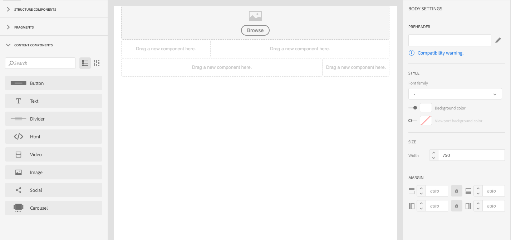

# Introducción al Diseñador de correo electrónico {#quick-start}

El Diseñador de correo electrónico proporciona cuatro formas de crear correos electrónicos.

Puede crear un mensaje de correo electrónico [empezando por nuevo en Email Designer](#without-existing-content):

1. Puede **crear un correo electrónico desde un lienzo** en blanco agregando fácilmente componentes de estructura y contenido y personalizando su contenido para enviar un envío rápidamente. También puede administrar completamente los elementos de estilo. Para obtener más información, [comience rápidamente](#from-scratch-email) o consulte la documentación completa.

1. Puede **crear un correo electrónico a partir de una plantilla** lista para usar seleccionando una plantilla y generando el nuevo contenido de correo electrónico desde aquí. [Más información](#building-content-from-an-out-of-the-box-template)

También puede crear un correo electrónico [con contenido](#with-existing-content)existente:

1. Puede **convertir un contenido** HTML existente (creado externamente o en el editor heredado). [Más información](#converting-an-html-content)
1. You can **import an existing HTML content** straight away in compatibility mode. [Más información](#compatibility-mode)

| Sin contenido | Con contenido |
|---|---|
| [Creación de un correo electrónico desde cero](#from-scratch-email) | [Conversión de un contenido HTML existente](#converting-an-html-content) |
| [Creación de contenido a partir de una plantilla lista para usar](#building-content-from-an-out-of-the-box-template) | [Importing an existing HTML](#compatibility-mode) |

## Designing emails with the editor {#without-existing-content}

>[!NOTE]
>
>In both creation strategy, it is crucial to fill in the subject line before sending your email. Learn how to [Add a subject line](#add-a-subject-line).

### Creating an email from scratch {#from-scratch-email}

You can create an email easily, add components and personalize their content to send a delivery quickly. You can adapt the styling options to your content if needed. Para obtener más información sobre la administración de ajustes de estilo y atributos integrados, consulte [Edición de estilos](../../designing/using/styles.md)de correo electrónico.

1. Create an email.
1. Close homepage.

### Adding a subject line {#add-a-subject-line}

Las líneas de asunto son obligatorias al enviar un correo electrónico. Para obtener más información, consulte [Definición de la línea de asunto de un correo electrónico](../../designing/using/subject-line.md).

1. Vaya a la **[!UICONTROL Properties]** ficha de la página de inicio de Email Designer (a la que se puede acceder mediante el icono de inicio) y rellene la **[!UICONTROL Subject]** sección.

### Añadir componentes de estructura {#add-structure-components}

Los componentes de estructura definirán el diseño del correo electrónico. Para obtener más información, consulte [Definición de la estructura de un correo electrónico](../../designing/using/designing-from-scratch.md#defining-the-email-structure).

En Componentes de estructura, arrastre y suelte los componentes del diseño que desee utilizar.

>[!NOTE]
>
>Puede seleccionar diferentes diseños de contenido que se añadirán a su correo electrónico.

### Añadir componentes de contenido {#add-content-components}

Puede agregar varios componentes de contenido al correo electrónico, como imágenes, texto y botones. Para obtener más información, consulte Componentes [de contenido](../../designing/using/designing-from-scratch.md#about-content-components).

* **Imagen**

1. En Componentes **** de contenido, arrastre y suelte la imagen en uno de los componentes de estructura.
1. Haga clic en **Examinar**.
1. Seleccione el archivo de imagen del equipo.

* **Texto con personalización**

1. En Componentes **** de contenido, arrastre y suelte el texto en uno de los componentes de estructura.
1. Click on the component and enter your text.
1. To add a personalization field, click **Insert personalization field** in the toolbar.
1. Select the field you need, such as First Name.

* **HTML**

1. In **Content Components**, drag and drop HTML into one of your structure components.
1. Click **Show the source code**.
1. Enter your HTML content.
1. Haga clic en **Save**.

Si está familiarizado con HTML, puede copiar y pegar el código HTML del pie de página original mediante el componente de **[!UICONTROL Html]** contenido. For more on this, see [About content components](../../designing/using/designing-from-scratch.md#about-content-components).

### Estilo del componente de correo electrónico

Puede ajustar el estilo del correo electrónico, por ejemplo, cambiando el relleno de un componente. Para obtener más información sobre la administración de ajustes de estilo y atributos integrados, consulte [Edición de estilos](../../designing/using/styles.md)de correo electrónico.

1. Haga clic en el componente **** Texto.
1. A la derecha, en la paleta, vaya a **Relleno**.
1. Haga clic en el icono de bloqueo para romper la sincronización entre los parámetros superior e inferior o derecho e izquierdo.
1. Adjust **Padding** as you need.
1. Haga clic en **Save**.

Ahora puede guardar y enviar su correo electrónico.

### Building content from an out-of-the-box template {#building-content-from-an-out-of-the-box-template}

Puede crear un correo electrónico a partir de plantillas integradas, como mensajes de bienvenida de clientes, newsletters y correos electrónicos de recontratación, y personalizarlos.

1. Cree un correo electrónico y abra su contenido. For more on this, see [Creating an email](../../channels/using/creating-an-email.md).
1. Click the home icon to access the **[!UICONTROL Email Designer]** home page.
1. Click the **[!UICONTROL Templates]** tab.
1. Elija una plantilla HTML lista para usar.
The different templates present various combinations of several types of elements. For example, &#39;Feather&#39; templates have margins while &#39;Astro&#39; templates do not have ones. For more on this, see [Content templates](../../designing/using/using-reusable-content.md#content-templates).
1. Vaya a la **[!UICONTROL Properties]** ficha de la página de inicio de Email Designer (a la que se puede acceder mediante el icono de inicio) y rellene la **[!UICONTROL Subject]** sección.
1. Puede combinar estos elementos para crear una serie de variantes de correo electrónico. For example, you can duplicate an email section by selecting a structure component and clicking **[!UICONTROL Duplicate]** from the contextual toolbar.
1. You can move the elements around using the blue arrow on the left to drag a structure component below or above another. Para obtener más información sobre esto, consulte [Edición de la estructura](../../designing/using/designing-from-scratch.md#defining-the-email-structure)de correo electrónico.
1. You can also move components around to change the organization of each structure element. Para obtener más información sobre esto, consulte [Añadir fragmentos y componentes](../../designing/using/designing-from-scratch.md#defining-the-email-structure).
1. Modify the content of each element according to your needs: images, text, links.
1. Adapt the styling options to your content if needed. Para obtener más información sobre esto, consulte [Edición de estilos](../../designing/using/styles.md)de correo electrónico.

## Using an existing email content {#with-existing-content}

If you want to build a framework of modular templates and fragments that can be combined to reuse in multiple emails, you should consider converting your email HTML into an Email Designer template.

### Converting HTML content {#converting-an-html-content}

This use case offers a quick way to convert HTML email into Email Designer components. For more on this topic, see [Converting HTML content](../../designing/using/using-existing-content.md#converting-an-html-content).

>[!CAUTION]
>
>This section is for users who are familiar with HTML code.

>[!NOTE]
>
>Al igual que el modo de compatibilidad, un componente HTML es editable con opciones limitadas: solo puede realizar una edición in-situ.

### Importing and editing an HTML email {#compatibility-mode}

Al cargar un contenido, debe contener etiquetas específicas para que sea totalmente compatible y editable con el editor WYSIWYG del Diseñador de correo electrónico.

Para obtener más información sobre la conversión de un correo electrónico existente en un correo electrónico compatible con el Diseñador de correo electrónico, consulte [esta sección](../../designing/using/using-existing-content.md#compatibility-mode).
