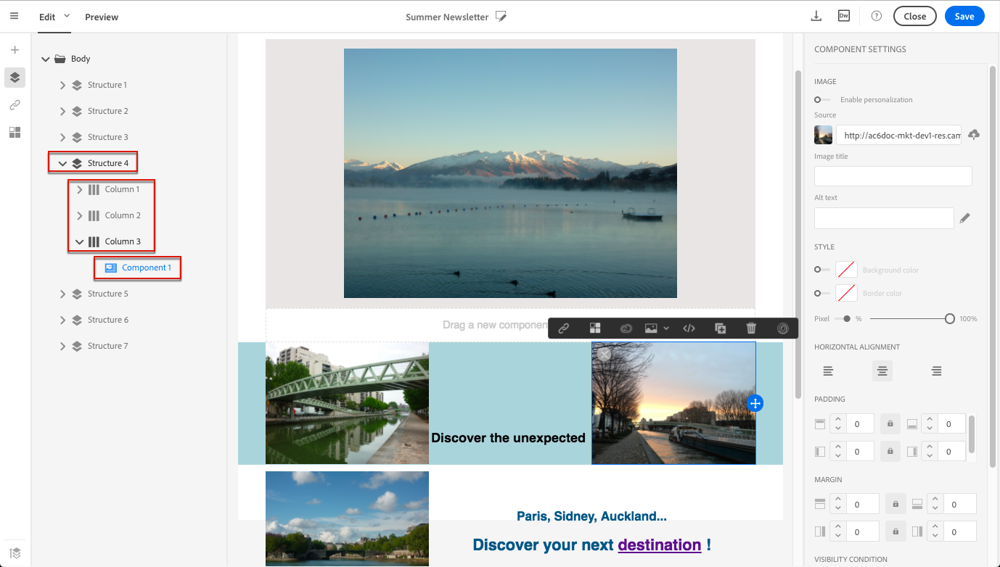
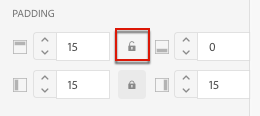
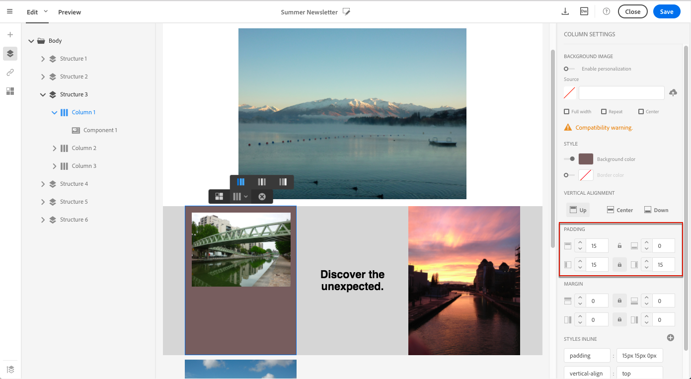

# Administración de estilos de correo electrónico {#managing-styles}

En el Diseñador de correo electrónico, al seleccionar un elemento, se muestran varias opciones específicas del tipo de contenido seleccionado en la **[!UICONTROL Settings]** panel. Puede utilizar estas opciones para cambiar fácilmente el estilo del correo electrónico.

## Selección de un elemento {#selecting-an-element}

Para seleccionar un elemento en la interfaz del Diseñador de correo electrónico, puede:

* haga clic directamente en el correo electrónico,
* o examine el árbol de estructura disponible en las opciones ubicadas en la parte izquierda **Paleta**.

La exploración del árbol de estructura permite realizar una selección más precisa. Puede seleccionar cualquiera de estas opciones:

* todo el componente de estructura,
* una de las columnas que componen el componente de estructura,
* o solo un componente que se encuentra dentro de una columna.

Para seleccionar una columna, también puede hacer lo siguiente:

1. Seleccione un componente de estructura (directamente en el correo electrónico o mediante el árbol de estructura disponible en la parte izquierda) **Paleta**).
1. Desde el **barra de herramientas contextual**, haga clic en **[!UICONTROL Select a column]** para elegir la columna deseada.

Vea un ejemplo en [esta sección](#example--adjusting-vertical-alignment-and-padding).

## Ajuste de la configuración de estilo {#adjusting-style-settings}

1. Seleccione un elemento en el correo electrónico. Para obtener más información, consulte [Selección de un elemento](#selecting-an-element).
1. Ajuste la configuración según sus necesidades. Cada elemento seleccionado ofrece un conjunto diferente de configuraciones.

   Puede insertar fondos, cambiar tamaños, modificar la alineación horizontal o vertical, administrar colores y agregar [relleno o margen](#selecting-an-element), etc.

   Para ello, utilice las opciones que se muestran en la **[!UICONTROL Settings]** panel o [añadir atributos de estilo en línea](#adding-inline-styling-attributes).

   

1. Guarde el contenido.

## Ajuste del relleno y el margen {#about-padding-and-margin}

La interfaz del Diseñador de correo electrónico permite ajustar rápidamente el relleno y la configuración de los márgenes.

**[!UICONTROL Padding]**: esta configuración permite administrar el espacio ubicado dentro del borde de un elemento.

Por ejemplo:

* Utilice el relleno para establecer los márgenes en los lados izquierdo y derecho de una imagen.
* Utilice el relleno superior e inferior para añadir más espacio a una **[!UICONTROL Text]** o una **[!UICONTROL Divider]** componente.
* Para definir los bordes entre columnas dentro de un elemento de estructura, defina el relleno para cada columna.

**[!UICONTROL Margin]**: esta configuración permite administrar el espacio entre el borde del elemento y el elemento siguiente.

>[!NOTE]
>
>Según la selección (componente de estructura, columna o componente de contenido), el resultado no será el mismo. El Adobe recomienda configurar la variable **[!UICONTROL Padding]** y **[!UICONTROL Margin]** parámetros en el nivel de columna.

Para ambos **[!UICONTROL Padding]** y **[!UICONTROL Margin]**, haga clic en el icono de bloqueo para interrumpir la sincronización entre los parámetros superior e inferior o derecho e izquierdo. Esto permite ajustar cada parámetro por separado.

## Alineación de estilo {#about-alignment}

* **Alineación de texto**: coloque el cursor del ratón sobre un texto y utilice la barra de herramientas contextual para alinearlo.

  

* **Alineación horizontal** se puede aplicar a texto, imágenes y botones, actualmente no a **[!UICONTROL Divider]** y **[!UICONTROL Social]** componentes.

  

* Para establecer **alineación vertical**, seleccione una columna dentro de un componente de estructura y elija una opción en el panel Configuración.

  

## Estableciendo fondos {#about-backgrounds}

>[!CONTEXTUALHELP]
>id="ac_edition_backgroundimage"
>title="Configuración de fondo"
>abstract="El diseñador de correo electrónico permite personalizar el color o la imagen de fondo del contenido. Tenga en cuenta que los clientes de correo electrónico no admiten la imagen de fondo."

En cuanto a la configuración de fondos con el Diseñador de correo electrónico, Adobe recomienda lo siguiente:

1. Aplique un color de fondo al cuerpo del correo electrónico si lo requiere el diseño.
1. En la mayoría de los casos, establezca los colores de fondo en el nivel de columna.
1. Intente no utilizar colores de fondo en componentes de imagen o texto, ya que son difíciles de administrar.

A continuación se muestran los ajustes de fondo disponibles que puede utilizar.

* Establezca un **[!UICONTROL Background color]** para todo el correo electrónico. Asegúrese de seleccionar la configuración del cuerpo en el árbol de navegación accesible desde la paleta izquierda.

  

* Defina el mismo color de fondo para todos los componentes de la estructura seleccionando **[!UICONTROL Viewport background color]**. Esta opción le permite seleccionar una configuración diferente del color de fondo.

  

* Defina un color de fondo diferente para cada componente de estructura. Seleccione una estructura en el árbol de navegación accesible desde la paleta izquierda para aplicar un color de fondo específico únicamente a esa estructura.

  

  Asegúrese de no establecer un color de fondo de ventanilla, ya que podría ocultar los colores de fondo de la estructura.

* Establezca un **[!UICONTROL Background image]** para el contenido de un componente de estructura.

  

  >[!NOTE]
  >
  >Algunos programas de correo electrónico no admiten imágenes de fondo. Si no se admite, se utilizará en su lugar el color de fondo de la fila. Asegúrese de seleccionar un color de fondo alternativo adecuado en caso de que la imagen no se pueda mostrar.

* Establezca un color de fondo en el nivel de columna.

  

  >[!NOTE]
  >
  >Este es el caso de uso más común. Adobe recomienda configurar los colores de fondo en el nivel de columna, ya que esto permite una mayor flexibilidad al editar todo el contenido del correo electrónico.

  También puede establecer una imagen de fondo en el nivel de columna, pero esto no se suele utilizar.

### Ejemplo: ajuste de alineación vertical y relleno {#example--adjusting-vertical-alignment-and-padding}

Desea ajustar el relleno y la alineación vertical dentro de un componente de estructura compuesto por tres columnas. Para realizar esto, siga los pasos a continuación:

1. Seleccione el componente de estructura directamente en el correo electrónico o mediante el árbol de estructura disponible en la parte izquierda **Paleta**.
1. Desde el **barra de herramientas contextual**, haga clic en **[!UICONTROL Select a column]** y elija el que desee editar. También puede seleccionarlo en el árbol de estructura.

   

   Los parámetros editables para esa columna se muestran en la variable **[!UICONTROL Settings]** panel de la derecha.

1. En **[!UICONTROL Vertical alignment]**, seleccione **[!UICONTROL Up]**.

   

   El componente de contenido se muestra sobre la columna.

1. En **[!UICONTROL Padding]**, defina el relleno superior dentro de la columna. Haga clic en el icono de bloqueo para interrumpir la sincronización con el relleno inferior.

   Defina el relleno izquierdo y derecho de esa columna.

   

1. Proceda de forma similar para ajustar la alineación y el relleno de las demás columnas.

   

1. Guarde los cambios.

## Estilo de vínculos {#about-styling-links}

Puede subrayar un vínculo y seleccionar su color y destino en el Diseñador de correo electrónico.

1. En un componente en el que se inserte un vínculo, seleccione el texto de etiqueta del vínculo.

1. En la configuración del componente, marque **[!UICONTROL Underline link]** para subrayar el texto de la etiqueta del vínculo.

   

1. Para seleccionar en qué contexto de navegación se abrirá el vínculo, seleccione una **[!UICONTROL Target]**.

   

1. Para cambiar el color del vínculo, haga clic en **[!UICONTROL Link color]**.

   

1. Elige el color que necesitas.

   

1. Guarde los cambios.

## Adición de atributos de estilo en línea {#adding-inline-styling-attributes}

En la interfaz del Diseñador de correo electrónico, al seleccionar un elemento y mostrar su configuración en el panel lateral, puede personalizar los atributos en línea y su valor para ese elemento específico.

1. Seleccione un elemento en el contenido.
1. En el panel lateral, busque el **[!UICONTROL Styles Inline]** configuración.

   

1. Modifique los valores de los atributos existentes o agregue nuevos mediante la variable **+** botón. Puede añadir cualquier atributo y valor que sea compatible con CSS.

A continuación, se aplica el estilo al elemento seleccionado. Si los elementos secundarios no tienen atributos de estilo específicos definidos, se hereda el estilo del elemento principal.
