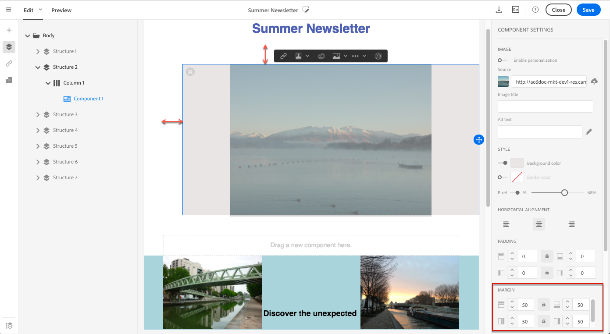
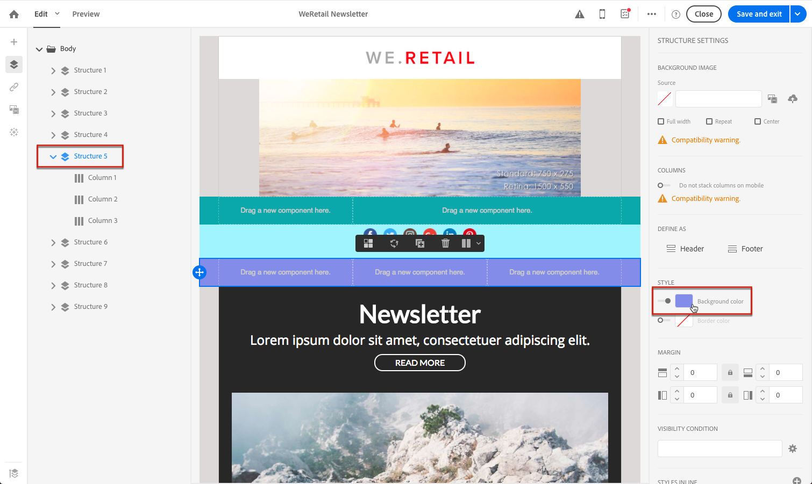
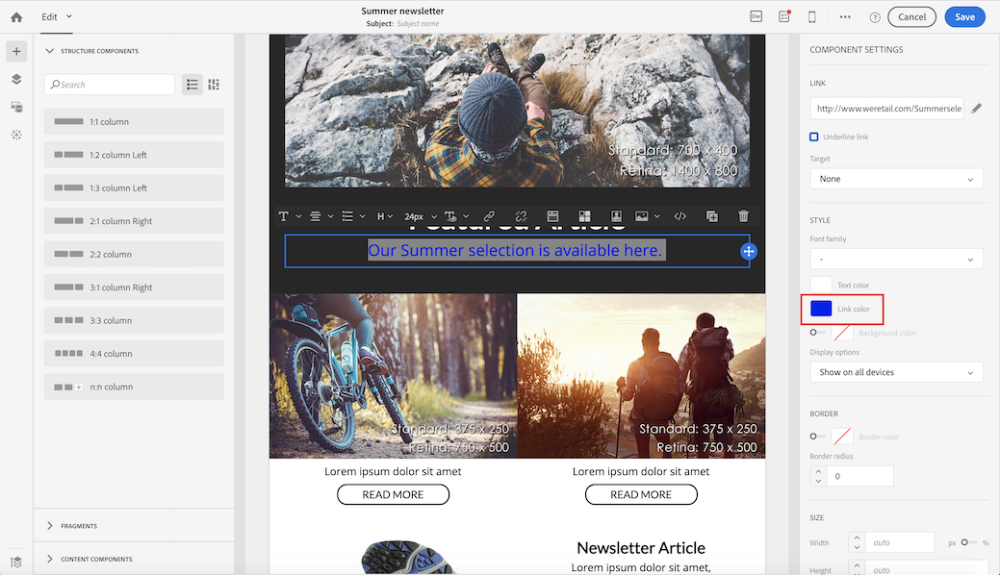

# Administración de estilos de correo electrónico {#managing-styles}

En el Diseñador de correo electrónico, al seleccionar un elemento, se muestran en el **[!UICONTROL Settings]** panel varias opciones específicas del tipo de contenido seleccionado. Puede utilizar estas opciones para cambiar fácilmente el estilo del correo electrónico.

## Selección de un elemento {#selecting-an-element}

Para seleccionar un elemento en la interfaz de Email Designer, puede:

* haga clic directamente en el correo electrónico,
* o examine el árbol de estructura disponible desde las opciones situadas en la **paleta** izquierda.

Al examinar el árbol de estructura, podrá realizar una selección más precisa. Puede seleccionar una de las opciones siguientes:

* todo el componente de estructura,
* una de las columnas que componen el componente de estructura,
* o solo un componente que se encuentra dentro de una columna.

Para seleccionar una columna, también puede hacer lo siguiente:

1. Seleccione un componente de estructura (directamente en el correo electrónico o mediante el árbol de estructura disponible en la **paleta** izquierda).
1. En la barra de herramientas **contextual, haga clic en****[!UICONTROL Select a column]** para elegir la columna deseada.

Vea un ejemplo en [esta sección](#example--adjusting-vertical-alignment-and-padding).

## Ajuste de la configuración de estilo {#adjusting-style-settings}

1. Seleccione un elemento en el correo electrónico. For more on this, see [Selecting an element](#selecting-an-element).
1. Ajuste la configuración según sus necesidades. Cada elemento seleccionado oferta un conjunto diferente de configuraciones.

   Puede insertar fondos, cambiar el tamaño, modificar la alineación horizontal o vertical, administrar colores, agregar [relleno o margen](#selecting-an-element), etc.

   Para ello, utilice las opciones que se muestran en el **[!UICONTROL Settings]** panel o [agregue atributos](#adding-inline-styling-attributes)de estilo en línea.

   

1. Guarde el contenido.

## Ajuste del margen y el margen {#about-padding-and-margin}

La interfaz de Email Designer permite ajustar rápidamente los ajustes de margen y relleno.

**[!UICONTROL Padding]**:: esta configuración permite administrar el espacio que se encuentra dentro del borde de un elemento.

Por ejemplo:

* Utilice el relleno para definir los márgenes en los lados izquierdo y derecho de una imagen.
* Utilice el relleno superior e inferior para añadir más espacio a un **[!UICONTROL Text]** componente o a un **[!UICONTROL Divider]** componente.
* Para definir bordes entre columnas dentro de un elemento de estructura, defina el relleno para cada columna.

**[!UICONTROL Margin]**:: esta configuración permite administrar el espacio entre el borde del elemento y el siguiente elemento.

>[!NOTE]
>
>Según la selección (componente de estructura, columna o componente de contenido), el resultado no será el mismo. Adobe recomienda configurar los parámetros **[!UICONTROL Padding]** y **[!UICONTROL Margin]** en el nivel de columna.

Para ambos **[!UICONTROL Padding]** y **[!UICONTROL Margin]**, haga clic en el icono de bloqueo para romper la sincronización entre los parámetros superior e inferior o derecho e izquierdo. Esto le permite ajustar cada parámetro por separado.

## Alineación de estilo {#about-alignment}

* **Alineación** de texto: coloque el cursor del ratón sobre algún texto y utilice la barra de herramientas contextual para alinearlo.

   

* **La alineación** horizontal se puede aplicar al texto, las imágenes y los botones, no a los **[!UICONTROL Divider]** componentes y **[!UICONTROL Social]** .

   

* Para definir la alineación **** vertical, seleccione una columna dentro de un componente de estructura y elija una opción en el panel Configuración.

   

## Configuración de fondos {#about-backgrounds}

>[!CONTEXTUALHELP]
>id="ac_edition_backgroundimage"
>title="Ajustes de fondo"
>abstract="El Diseñador de correo electrónico permite personalizar el color de fondo o la imagen de fondo del contenido."

En cuanto a la configuración de fondos con el Diseñador de correo electrónico, Adobe recomienda lo siguiente:

1. Aplique un color de fondo al cuerpo del mensaje de correo electrónico si lo requiere el diseño.
1. En la mayoría de los casos, defina los colores de fondo en el nivel de columna.
1. Intente no utilizar colores de fondo en componentes de imagen o texto, ya que son difíciles de administrar.

A continuación se muestran los ajustes de fondo disponibles que puede utilizar.

* Configure un **[!UICONTROL Background color]** para todo el correo electrónico. Asegúrese de seleccionar la configuración del cuerpo en el árbol de navegación al que se puede acceder desde la paleta izquierda.

   

* Para definir el mismo color de fondo para todos los componentes de estructura, seleccione **[!UICONTROL Viewport background color]**. Esta opción le permite seleccionar un ajuste diferente del color de fondo.

   

* Defina un color de fondo diferente para cada componente de estructura. Seleccione una estructura del árbol de navegación a la que se pueda acceder desde la paleta izquierda para aplicar un color de fondo específico solo a esa estructura.

   

   Asegúrese de que no establece un color de fondo de ventanilla porque puede ocultar los colores de fondo de la estructura.

* Configure un **[!UICONTROL Background image]** para el contenido de un componente de estructura.

   

   >[!NOTE]
   >
   >Algunos programas de correo electrónico no admiten imágenes de fondo. Cuando no se admite, se utilizará el color de fondo de fila. Asegúrese de seleccionar un color de fondo de reserva adecuado en caso de que no se pueda mostrar la imagen.

* Configure un color de fondo en el nivel de columna.

   

   >[!NOTE]
   >
   >Este es el caso de uso más común. Adobe recomienda configurar los colores de fondo en el nivel de columna, ya que esto permite una mayor flexibilidad al editar todo el contenido del correo electrónico.

   También puede establecer una imagen de fondo en el nivel de columna, pero esto no se suele utilizar.

### Ejemplo: ajuste de alineación vertical y relleno {#example--adjusting-vertical-alignment-and-padding}

Desea ajustar el margen y la alineación vertical dentro de un componente de estructura compuesto por tres columnas. Para realizar esto, siga los pasos a continuación:

1. Seleccione el componente de estructura directamente en el correo electrónico o mediante el árbol de estructura disponible en la **paleta** izquierda.
1. En la barra de herramientas **contextual, haga clic en****[!UICONTROL Select a column]** y elija la que desee editar. También puede seleccionarlo en el árbol de estructura.

   

   Los parámetros editables de esa columna se muestran en el **[!UICONTROL Settings]** panel de la derecha.

1. En **[!UICONTROL Vertical alignment]**, seleccione **[!UICONTROL Up]**.

   

   El componente de contenido se muestra en la parte superior de la columna.

1. En **[!UICONTROL Padding]**, defina el margen superior dentro de la columna. Haga clic en el icono de candado para romper la sincronización con el relleno inferior.

   Defina el margen izquierdo y derecho de esa columna.

   

1. Proceda de forma similar para ajustar la alineación y el relleno de las demás columnas.

   

1. Guarde los cambios.

## Estilo de los vínculos {#about-styling-links}

Puede subrayar un vínculo y seleccionar su color y destinatario en el Diseñador de correo electrónico.

1. En un componente en el que se inserta un vínculo, seleccione el texto de la etiqueta del vínculo.

1. En la configuración del componente, marque **[!UICONTROL Underline link]** para subrayar el texto de la etiqueta del vínculo.

   

1. Para seleccionar en qué contexto de exploración se abrirá el vínculo, seleccione un **[!UICONTROL Target]**.

   

1. Para cambiar el color del vínculo, haga clic en **[!UICONTROL Link color]**.

   

1. Elija el color que necesita.

   

1. Guarde los cambios.

## Añadir atributos de estilo en línea {#adding-inline-styling-attributes}

En la interfaz de Email Designer, al seleccionar un elemento y mostrar su configuración en el panel lateral, puede personalizar los atributos en línea y su valor para ese elemento específico.

1. Seleccione un elemento en el contenido.
1. En el panel lateral, busque los **[!UICONTROL Styles Inline]** ajustes.

   

1. Modifique los valores de los atributos existentes o agregue otros nuevos con el botón **+** . Puede agregar cualquier atributo y valor que sea compatible con CSS.

A continuación, el estilo se aplica al elemento seleccionado. Si los elementos secundarios no tienen atributos de estilo específicos definidos, se hereda el estilo del elemento principal.
