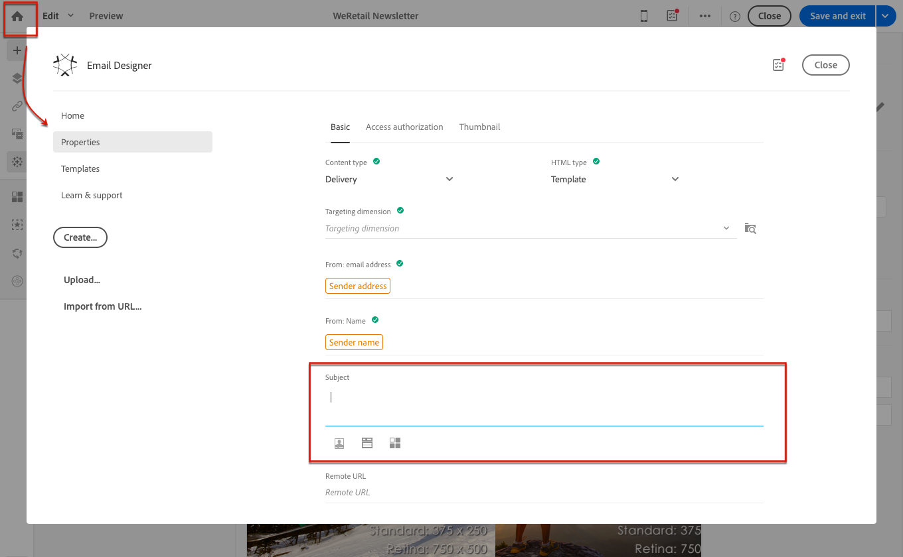

# Definición del asunto y del remitente de un correo electrónico{#defining-the-subject-line-of-an-email}

## Definición de la línea de asunto de un correo electrónico {#subject-line}

El asunto del mensaje es obligatorio para preparar y enviar el mensaje.

>[!NOTE]
>
>Si la línea de asunto está vacía, se muestra una advertencia en el panel de mensajes y en el Designer de correo electrónico.

1. Cree un correo electrónico.
1. Vaya a la pestaña **[!UICONTROL Properties]** de la página de inicio de Designer de correo electrónico (accesible a través del icono de inicio).
1. Rellene la sección **[!UICONTROL Subject]**.

   

1. También puede añadir campos de personalización, bloques de contenido y contenido dinámico a la línea de asunto haciendo clic en los iconos correspondientes. Para obtener más información, consulte [Personalization](../../designing/using/personalization.md).

## Definición del remitente del correo electrónico de un correo electrónico {#email-sender}

Para definir el nombre del remitente que aparecerá en el encabezado de los mensajes enviados, vaya a la pestaña **[!UICONTROL Properties]** de la página de inicio de Email Designer (a la que se puede acceder mediante el icono de inicio).

* El campo **[!UICONTROL From: name]** le permite introducir el nombre del remitente. De manera predeterminada, el bloque predeterminado **Nombre del remitente** se introduce automáticamente en el campo. La dirección de correo electrónico y el nombre de remitente predeterminados se definen en **[!UICONTROL Brands]**, a los que se puede acceder mediante el logotipo de Adobe Campaign en el menú avanzado **[!UICONTROL Administration > Instance settings > Brand configuration]**

  Puede cambiar el nombre del remitente haciendo clic en el bloque **Nombre del remitente**. A continuación, el campo se vuelve editable y puede introducir el nombre que desee utilizar.

  Este campo se puede personalizar. Para ello, puede añadir campos de personalización, bloques de contenido y contenido dinámico haciendo clic en los iconos debajo del nombre del remitente. Para obtener más información, consulte [Personalization](../../designing/using/personalization.md).

* El campo **[!UICONTROL From: email address]** no se puede editar desde esta sección. Puede cambiarlo editando las propiedades del correo electrónico desde su panel. Para obtener más información, consulte [Lista de parámetros avanzados de correo electrónico](../../administration/using/configuring-email-channel.md#advanced-parameters).

>[!NOTE]
>
>Los parámetros de encabezado no deben estar vacíos. La dirección del remitente es obligatoria para permitir que se envíe un correo electrónico (estándar RFC). Adobe Campaign comprueba la sintaxis de las direcciones de correo electrónico introducidas.

**Temas relacionados:**

* [Inserción de un campo de personalización.](../../designing/using/personalization.md#inserting-a-personalization-field)
* [Añadir un bloque de contenido](../../designing/using/personalization.md#adding-a-content-block)
* [Definición del contenido dinámico en un correo electrónico](../../designing/using/personalization.md#defining-dynamic-content-in-an-email)
