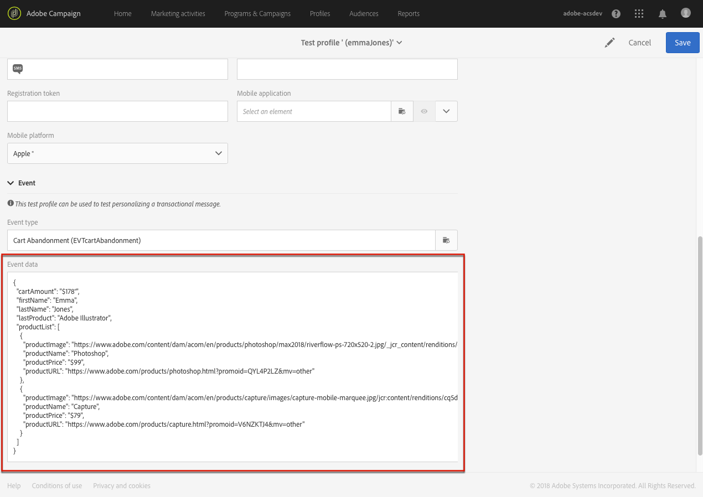

# Uso de listas de productos en un mensaje transaccional {#using-product-listings}

>[!IMPORTANT]
>
>Las listas de productos solo están disponibles para **mensajes de correo electrónico transaccionales** a través de la interfaz [Email Designer](../../designing/using/designing-content-in-adobe-campaign.md#email-designer-interface).

Al editar el contenido de un correo electrónico transaccional, puede crear listas de productos que hagan referencia a una o más colecciones de datos. Por ejemplo: en un correo electrónico de abandono del carro de compras, puede incluir una lista de todos los productos que estaban en el carro de compras de los usuarios cuando salieron del sitio web, con una imagen, el precio y un vínculo a cada producto.

Para añadir una lista de productos abandonados en un mensaje transaccional, siga los pasos a continuación.

También puede ver [este conjunto de vídeos](https://experienceleague.adobe.com/docs/campaign-standard-learn/tutorials/designing-content/product-listings-in-transactional-email.html?lang=en#configure-product-listings-in-transactional-emails) en los que se explican los pasos necesarios para configurar las listas de productos en un correo electrónico transaccional.

>[!NOTE]
>
>Adobe Campaign no admite listas de productos anidadas, lo que significa que no puede incluir una lista de productos dentro de otra.

## Definición de una lista de productos {#defining-a-product-listing}

Antes de poder usar una lista de productos en un mensaje transaccional, debe definir a nivel de evento la lista de productos y los campos de cada producto de la lista que desee mostrar. Para obtener más información, consulte [Definición de colecciones de datos](../../channels/using/configuring-transactional-event.md#defining-data-collections).

1. En el mensaje transaccional, haga clic en el bloque **[!UICONTROL Content]** para modificar el contenido del correo electrónico.
1. Arrastre y suelte un componente de estructura en el espacio de trabajo. Para obtener más información, consulte [Definición de la estructura de correo electrónico](../../designing/using/designing-from-scratch.md#defining-the-email-structure).

   Por ejemplo, seleccione un componente de estructura de una columna y añada un componente de texto, un componente de imagen y un componente de botón. Para obtener más información, consulte [Uso de componentes de contenido](../../designing/using/designing-from-scratch.md#about-content-components).

1. Seleccione el componente de estructura que acaba de crear y haga clic en el icono **[!UICONTROL Enable product listing]** de la barra de herramientas contextual.

   

   El componente de estructura se resalta con un marco naranja y los ajustes de **[!UICONTROL Product listing]** se muestran en la paleta izquierda. 

   

1. Seleccione cómo se mostrarán los elementos de la recopilación:

   * **[!UICONTROL Row]**: horizontalmente; es decir, cada elemento de una fila debajo de la otra.
   * **[!UICONTROL Column]**: verticalmente; es decir, cada elemento está junto al otro en la misma fila.

   >[!NOTE]
   >
   >La opción **[!UICONTROL Column]** solo está disponible cuando se utiliza un componente de estructura de varias columnas (**[!UICONTROL 2:2 column]**, **[!UICONTROL 3:3 column]** y **[!UICONTROL 4:4 column]**). Al editar la lista de productos, rellene solo la primera columna: las demás columnas no se tendrán en cuenta. Para obtener más información sobre la selección de componentes de estructura, consulte [Definición de la estructura de correo electrónico](../../designing/using/designing-from-scratch.md#defining-the-email-structure).

1. Seleccione la recopilación de datos que ha creado al configurar el evento relacionado con el mensaje transaccional. Puede encontrarlo en el nodo **[!UICONTROL Context]** > **[!UICONTROL Real-time event]** > **[!UICONTROL Event context]**.

   

   Para obtener más información sobre la configuración del evento, consulte [Definición de colecciones de datos](../../channels/using/configuring-transactional-event.md#defining-data-collections).

1. Utilice la lista desplegable **[!UICONTROL First item]** para seleccionar qué elemento será el inicio de la lista mostrada en el correo electrónico.

   Por ejemplo, si selecciona 2, el primer elemento de la recopilación no se muestra en el mensaje de correo electrónico. La lista de productos comienza con el segundo artículo.

1. Seleccione el número máximo de elementos que se mostrarán en la lista.

   >[!NOTE]
   >
   >Si desea que los elementos de la lista se muestren verticalmente (**[!UICONTROL Column]**), el número máximo de elementos queda limitado según el componente de estructura seleccionado (2, 3 o 4 columnas). Para obtener más información sobre la selección de componentes de estructura, consulte [Edición de la estructura de correo electrónico](../../designing/using/designing-from-scratch.md#defining-the-email-structure).

## Rellenar el listado de productos {#populating-the-product-listing}

Para mostrar una lista de productos procedentes del evento vinculado al correo electrónico de transacción, siga los pasos a continuación.

Para obtener más información sobre la creación de una recopilación y los campos relacionados al configurar el evento, consulte [Definición de colecciones de datos](../../channels/using/configuring-transactional-event.md#defining-data-collections).

1. Seleccione el componente de imagen que ha insertado, seleccione **[!UICONTROL Enable personalization]** y haga clic en el lápiz en el panel Configuración.

   

1. Seleccione **[!UICONTROL Add personalization field]** en la ventana **[!UICONTROL Image source URL]** que se abrirá.

   En el nodo **[!UICONTROL Context]** > **[!UICONTROL Real-time event]** > **[!UICONTROL Event context]**, abra el nodo correspondiente a la recopilación que ha creado (aquí **[!UICONTROL Product list]**) y seleccione el campo de imagen que ha definido (aquí **[!UICONTROL Product image]**). Haga clic en **[!UICONTROL Save]**.

   

   El campo de personalización que ha seleccionado ahora se muestra en el panel Configuración.

1. En la posición deseada, seleccione **[!UICONTROL Insert personalization field]** en la barra de herramientas contextual.

   

1. En el nodo **[!UICONTROL Context]** > **[!UICONTROL Real-time event]** > **[!UICONTROL Event context]**, abra el nodo correspondiente a la recopilación que ha creado (aquí **[!UICONTROL Product list]**) y seleccione el campo que ha creado (aquí **[!UICONTROL Product name]**). Haga clic en **[!UICONTROL Confirm]**.

   

   El campo de personalización que ha seleccionado ahora se muestra en la posición deseada en el contenido del correo electrónico.

1. Proceda de forma similar para insertar el precio.
1. Seleccione texto y haga clic en **[!UICONTROL Insert link]** en la barra de herramientas contextual.

   

1. Seleccione **[!UICONTROL Add personalization field]** en la ventana **[!UICONTROL Insert link]** que se abrirá.

   En el nodo **[!UICONTROL Context]** > **[!UICONTROL Real-time event]** > **[!UICONTROL Event context]**, abra el nodo correspondiente a la recopilación que ha creado (aquí **[!UICONTROL Product list]**) y seleccione el campo URL que ha creado (aquí **[!UICONTROL Product URL]**). Haga clic en **[!UICONTROL Save]**.

   >[!IMPORTANT]
   >
   >Por motivos de seguridad, asegúrese de insertar el campo de personalización dentro de un vínculo que comience por un nombre de dominio estático adecuado.

   

   El campo de personalización que ha seleccionado ahora se muestra en el panel Configuración.

1. Seleccione el componente de estructura en el que se aplica la lista de productos y seleccione **[!UICONTROL Show fallback]** para definir un contenido predeterminado.

   

1. Arrastre uno o varios componentes de contenido y edítelos según sea necesario.

   

   El contenido de reserva se muestra si la recopilación está vacía cuando se activa el evento, por ejemplo, si un cliente no tiene nada en el carro de compras.

1. En el panel Configuración, edite los estilos de la lista de productos. Para obtener más información, consulte [Administración de estilos de correo electrónico](../../designing/using/styles.md).
1. Vista previa del correo electrónico mediante un perfil de prueba vinculado al evento transaccional relevante y para el que se han definido datos de recopilación. Por ejemplo, añada la siguiente información en la sección **[!UICONTROL Event data]** del perfil de prueba que desee utilizar:

   

   Para obtener más información sobre la definición de un perfil de prueba en un mensaje transaccional, consulte [esta sección](../../channels/using/testing-transactional-message.md#defining-specific-test-profile).
