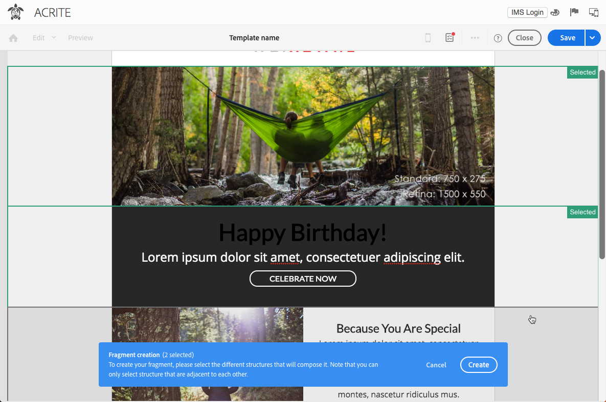

# Creación y uso de contenido reutilizable {#using-reusable-content}

Obtenga información sobre cómo dominar la edición de contenido de correo electrónico. Con el Diseñador de correo electrónico, puede crear plantillas y fragmentos con su propio contenido predefinido y reutilizarlos para las siguientes entregas.

## Diseño de correos electrónicos con plantillas {#designing-templates}

>[!NOTE]
>
> En Adobe Campaign Standard, puede crear diferentes tipos de plantillas a las que se puede acceder desde el **Recursos** > **Plantillas** menú. Las plantillas utilizadas en el Diseñador de correo electrónico son plantillas de contenido. Para obtener más información, consulte [Acerca de las plantillas](../../start/using/marketing-activity-templates.md).

 [Descubra cómo crear plantillas en vídeo](#video)

### Acerca de las plantillas de contenido {#content-templates}

Puede administrar el contenido del HTML que se ofrece en **[!UICONTROL Templates]** de la pestaña [Diseñador de correo electrónico](../../designing/using/designing-content-in-adobe-campaign.md) página principal.

Las plantillas de contenido de correo electrónico listas para usar incluyen dieciocho diseños optimizados para móviles y cuatro plantillas adaptables de primera categoría diseñadas por artistas de Behance. Se corresponden con los usos más actuales, como mensajes de bienvenida de clientes, boletines informativos y correos electrónicos de participación, entre otros. Se pueden personalizar fácilmente con el contenido de sus marcas para facilitar el proceso de diseñar correos electrónicos desde cero.

Se puede acceder a las plantillas de contenido de HTML desde el **[!UICONTROL Resources]** > **[!UICONTROL Content templates & fragments]** pantalla del [Menú avanzado](../../start/using/interface-description.md#advanced-menu). Desde allí, puede administrar plantillas de contenido de páginas de aterrizaje, plantillas de contenido de correo electrónico y también fragmentos.

Las plantillas de contenido listas para usar son de solo lectura. Para editar una de ellas, primero debe duplicar la plantilla deseada.

Puede crear nuevas plantillas o fragmentos y definir su propio contenido. Para obtener más información, consulte [Creación de una plantilla de contenido](#creating-a-content-template) y [Creación de un fragmento de contenido](#creating-a-content-fragment).

Al editar contenido con el Diseñador de correo electrónico, también puede crear plantillas de contenido guardando el contenido como fragmento o plantilla. Para obtener más información, consulte [Guardar contenido como plantilla](#saving-content-as-template) y [Guardar contenido como fragmento](../../designing/using/using-reusable-content.md#saving-content-as-a-fragment).

**Temas relacionados:**

* Para obtener más información sobre la edición de contenido, consulte [Acerca del diseño de contenido de correo electrónico](../../designing/using/designing-content-in-adobe-campaign.md).

### Creación de una plantilla de contenido {#creating-a-content-template}

Puede crear sus propias plantillas de contenido para utilizarlas tantas veces como sea necesario.

El siguiente ejemplo muestra cómo crear una plantilla de contenido de correo electrónico.

1. Ir a **[!UICONTROL Resources]** > **[!UICONTROL Content templates & fragments]** y haga clic en **[!UICONTROL Create]**.
1. Haga clic en la etiqueta de correo electrónico para acceder a **[!UICONTROL Properties]** del Diseñador de correo electrónico.
1. Especifique una etiqueta reconocible y seleccione los siguientes parámetros para poder utilizar esta plantilla en los correos electrónicos:

   * Seleccionar **[!UICONTROL Shared]** o **[!UICONTROL Delivery]** desde el **[!UICONTROL Content type]** lista desplegable.
   * Seleccionar **[!UICONTROL Template]** desde el **[!UICONTROL HTML type]** lista desplegable.

   

1. Si es necesario, puede establecer una imagen que se utilizará como miniatura para la plantilla. Selecciónelo en la lista **[!UICONTROL Thumbnail]** de las propiedades de la plantilla.

   

   Esta miniatura se mostrará en la **[!UICONTROL Templates]** de la pestaña [Diseñador de correo electrónico](../../designing/using/designing-content-in-adobe-campaign.md) página principal.

1. Cierre el **[!UICONTROL Properties]** para volver al espacio de trabajo principal.
1. Añada componentes de estructura y componentes de contenido que puede personalizar según sea necesario.
   >[!NOTE]
   >
   > No se pueden insertar campos de personalización o contenido condicional dentro de una plantilla de contenido.
1. Una vez editada, guarde la plantilla.

Esta plantilla ahora se puede utilizar en cualquier correo electrónico creado con el Diseñador de correo electrónico. Selecciónelo en la lista **[!UICONTROL Templates]** de la pestaña [Diseñador de correo electrónico](../../designing/using/designing-content-in-adobe-campaign.md) página principal.

### Guardar contenido como plantilla {#saving-content-as-template}

Al editar un correo electrónico con el Diseñador de correo electrónico, puede guardar directamente el contenido de ese correo electrónico como una plantilla.

<!--[!CAUTION]
>
>You cannot save as template a structure containing personalization fields or dynamic content.-->

1. Seleccionar **[!UICONTROL Save as template]** en la barra de herramientas principal del Diseñador de correo electrónico.

   

1. Añada una etiqueta y una descripción si es necesario y haga clic en **[!UICONTROL Save]**.

   

1. Para buscar la plantilla que acaba de crear, vaya a **[!UICONTROL Resources]** > **[!UICONTROL Content templates & fragments]**.

1. Para utilizar la nueva plantilla, selecciónela en el **[!UICONTROL Templates]** de la pestaña [Diseñador de correo electrónico](../../designing/using/designing-content-in-adobe-campaign.md) página principal.

   

### Creación de una plantilla con fragmentos y componentes {#template-fragments-components}

Ahora puede crear una plantilla de correo electrónico con el Diseñador de correo electrónico. Utilice los componentes de contenido para reflejar las diferentes secciones del correo electrónico y ajustar la configuración para que sean lo más parecidas posible al boletín informativo original. Finalmente, inserte los fragmentos que acaba de crear.

1. Con el Diseñador de correo electrónico, cree una plantilla. Para obtener más información, consulte [Plantillas de contenido](#content-templates).
1. Inserte varios componentes de estructura en la plantilla, correspondientes al encabezado, pie de página y cuerpo del correo electrónico. Para obtener más información sobre la adición de componentes de estructura, consulte [Edición de la estructura de correo electrónico con el Diseñador de correo electrónico](../../designing/using/designing-from-scratch.md#defining-the-email-structure).
1. Inserte tantos componentes de contenido como sea necesario para crear el cuerpo del boletín informativo. Este será el contenido editable del correo electrónico que actualizará cada mes.

   

   Si está familiarizado con el código del HTML, Adobe recomienda aprovechar **[!UICONTROL Html]** componentes en los que puede copiar y pegar los elementos más complejos del correo electrónico original. Utilice otros componentes, como **[!UICONTROL Button]**, **[!UICONTROL Image]** o **[!UICONTROL Text]** para el resto del contenido. Para obtener más información, consulte [Acerca de los componentes de contenido](../../designing/using/designing-from-scratch.md#about-content-components).

   >[!NOTE]
   >
   >Uso del **[!UICONTROL Html]** Los resultados de los componentes son la creación de componentes editables con opciones limitadas. Asegúrese de saber cómo gestionar el código de HTML antes de seleccionar este componente.

1. Ajuste al máximo los componentes de contenido para que coincidan con el correo electrónico original.

   

   Para obtener más información sobre la administración de la configuración de estilos y atributos en línea, consulte [Edición de estilos de correo electrónico](../../designing/using/styles.md).

1. Inserte los dos fragmentos (encabezado y pie de página) que creó anteriormente en los componentes de estructura deseados.

   

1. Guarde la plantilla.

Ahora puede administrar completamente esta plantilla dentro del Diseñador de correo electrónico para crear y actualizar el boletín informativo que enviará cada mes a los destinatarios.

Para usarlo, cree un correo electrónico y seleccione la plantilla de contenido que acaba de crear.

**Temas relacionados**:

* [Creación de un correo electrónico](../../channels/using/creating-an-email.md)
* [Vídeo de introducción al Diseñador de correo electrónico](../../designing/using/designing-content-in-adobe-campaign.md#video)
* [Diseño del contenido de un correo electrónico desde cero](../../designing/using/designing-from-scratch.md#designing-an-email-content-from-scratch)

### Tutorial en vídeo {#video}

Este vídeo muestra cómo crear su propia plantilla.

>[!VIDEO](https://video.tv.adobe.com/v/23106?quality=12)

Hay disponibles más vídeos de procedimientos para el Campaign Standard [aquí](https://experienceleague.adobe.com/docs/campaign-standard-learn/tutorials/overview.html?lang=es).

## Acerca de los fragmentos {#about-fragments}

>[!CONTEXTUALHELP]
>id="ac_fragments"
>title="Acerca de los fragmentos"
>abstract="Un fragmento es un bloque de contenido reutilizable al que se puede hacer referencia en uno o varios correos electrónicos."

Un fragmento es un componente reutilizable al que se puede hacer referencia en uno o varios correos electrónicos.
Se pueden encontrar en la interfaz debajo de **Recursos** > **Fragmentos de contenido y plantillas**.

Para aprovechar al máximo los fragmentos en el Diseñador de correo electrónico:

* Cree sus propios fragmentos. Consulte [Creación de un fragmento de contenido](#creating-a-content-fragment) y [Guardar contenido como fragmento](#saving-content-as-a-fragment).
* Utilícelos tantas veces como sea necesario en sus correos electrónicos. Consulte [Inserción de elementos en un correo electrónico](#inserting-elements-into-an-email).
* Al editar un fragmento, los cambios se sincronizan: se propagan automáticamente a todos los correos electrónicos (siempre que no se hayan preparado ni enviado aún) que contengan ese fragmento.

Cuando se añaden a un correo electrónico, los fragmentos se bloquean de forma predeterminada. Si desea modificar un fragmento para un correo electrónico específico, puede romper la sincronización con el fragmento original desbloqueándolo en el correo electrónico en el que se utiliza. Los cambios ya no se sincronizarán.

Para desbloquear un fragmento dentro de un correo electrónico, selecciónelo y haga clic en el icono de bloqueo de la barra de herramientas contextual.

Ese fragmento se convierte en un componente independiente que ya no está vinculado al fragmento original. Luego se puede editar como cualquier otro componente de contenido. Consulte [Acerca de los componentes de contenido](../../designing/using/designing-from-scratch.md#about-content-components).

### Inserción de fragmentos en un correo electrónico {#inserting-elements-into-an-email}

Para definir el contenido del correo electrónico, puede añadir elementos de contenido en los componentes de estructura que ha colocado previamente. Consulte [Edición de la estructura de correo electrónico](../../designing/using/designing-from-scratch.md#defining-the-email-structure).

1. Acceda a los elementos de contenido seleccionando la variable **+** en la parte izquierda. Seleccionar [Fragmentos](#about-fragments) o [Componentes de contenido](../../designing/using/designing-from-scratch.md#about-content-components).
1. Si ya conoce la etiqueta o parte de la etiqueta del fragmento que desea agregar, puede buscarla.

   

1. Arrastre y suelte un fragmento o componente de contenido de la paleta en un componente de estructura del correo electrónico.

   

   Una vez agregado un elemento al correo electrónico, se puede mover dentro del componente de estructura o a otro componente de estructura en el correo electrónico.

   

1. Edite el elemento para que coincida con las necesidades exactas de este correo electrónico. Puede agregar texto, vínculos, imágenes, etc.

   >[!NOTE]
   >
   >Los fragmentos están bloqueados de forma predeterminada cuando se añaden a un correo electrónico. Puede interrumpir la sincronización con el fragmento original si desea modificar el fragmento para un correo electrónico específico o realizar el cambio directamente en el fragmento. Consulte [Acerca de los fragmentos](#about-fragments).

1. Repita este procedimiento para todos los elementos que tenga que agregar al correo electrónico.
1. Guarde el correo electrónico.

Ahora que la estructura de correo electrónico está rellenada, puede editar el estilo de cada elemento de contenido. Consulte [Edición de un elemento](../../designing/using/styles.md).

>[!NOTE]
>
>Si se modifica un fragmento, los cambios se propagan automáticamente en los correos electrónicos donde se utiliza. Para obtener más información, consulte [Acerca de los fragmentos](#about-fragments).

### Creación de un fragmento de contenido {#creating-a-content-fragment}

Puede crear sus propios fragmentos de contenido para utilizarlos según sea necesario en uno o varios correos electrónicos.

1. Ir a **[!UICONTROL Resources]** > **[!UICONTROL Content templates & fragments]** y haga clic en **[!UICONTROL Create]**.
1. Haga clic en la etiqueta de correo electrónico para acceder a **[!UICONTROL Properties]** del Diseñador de correo electrónico.
1. Especifique una etiqueta reconocible y seleccione los siguientes parámetros para buscar el fragmento al editar el contenido del correo electrónico:

   * Como los fragmentos solo son compatibles con los correos electrónicos, seleccione **[!UICONTROL Delivery]** desde el **[!UICONTROL Content type]** lista desplegable.
   * Seleccionar **[!UICONTROL Fragment]** desde el **[!UICONTROL HTML type]** lista desplegable para poder utilizar este contenido como un fragmento.

   

1. Si es necesario, puede establecer una imagen que se utilizará como miniatura para el fragmento. Selecciónelo en la lista **[!UICONTROL Thumbnail]** de las propiedades de la plantilla.

   

   Esta miniatura se mostrará junto a la etiqueta del fragmento al editar un correo electrónico.

1. Cierre el **[!UICONTROL Properties]** para volver al espacio de trabajo principal.
1. Añada componentes de estructura y componentes de contenido que puede personalizar según sea necesario.

   >[!CAUTION]
   >
   >Los fragmentos no pueden incluir campos de personalización, contenido dinámico u otro fragmento.
   >
   >Evite guardar como contenido de fragmento con componentes de estructura vacíos. Una vez insertado el >fragmento, no se podrán editar.
   >
   >El [vista móvil](../../designing/using/plain-text-html-modes.md#switching-to-mobile-view) no está disponible en fragmentos.

1. Una vez editado, guarde el fragmento.

Este fragmento ahora se puede utilizar en cualquier correo electrónico creado con el Diseñador de correo electrónico. Aparece bajo la etiqueta **[!UICONTROL Fragments]** de la Paleta.

>[!NOTE]
>
>No puede insertar campos de personalización dentro de un fragmento a menos que se utilice en un correo electrónico y esté desbloqueado. Consulte [Acerca de los fragmentos](#about-fragments).

### Guardar contenido como fragmento {#saving-content-as-a-fragment}

Al editar un correo electrónico con el Diseñador de correo electrónico, puede guardar directamente parte de ese correo electrónico como un fragmento.

* No se puede guardar como fragmento una estructura que contenga campos de personalización, contenido dinámico u otro fragmento.
* Solo puede seleccionar estructuras adyacentes entre sí.
  <!-- - You cannot select an empty structure.-->

1. Al editar un correo electrónico en el Diseñador de correo electrónico, seleccione **[!UICONTROL Save as fragment]** en la barra de herramientas principal.

   

1. En el espacio de trabajo, seleccione las estructuras que compondrán el fragmento.

   

   >[!NOTE]
   >
   >Asegúrese de seleccionar estructuras adyacentes entre sí y que no incluyan campos de personalización, contenido dinámico u otro fragmento.
   <!--You cannot select an empty structure.-->

1. Haga clic en **[!UICONTROL Create]**.

1. Añada una etiqueta y una descripción si es necesario y haga clic en **[!UICONTROL Save]**.

   

1. Para encontrar el fragmento que acaba de crear, vaya a **[!UICONTROL Resources]** > **[!UICONTROL Content templates & fragments]**.

   

1. Para utilizar el nuevo fragmento, abra cualquier contenido de correo electrónico y selecciónelo en la lista de fragmentos.

>[!NOTE]
>El [vista móvil](../../designing/using/plain-text-html-modes.md#switching-to-mobile-view) no está disponible en fragmentos. Si desea editar una vista móvil de correo electrónico, hágalo antes de guardar el contenido como un fragmento.

<!--You need to copy-paste the HTML corresponding to the section that you want to save into a new fragment.

>[!NOTE]
>
>To do this, you need to be familiar with HTML code.

To save as a fragment some email content that you created, follow the steps below.

1. When editing an email in the Email Designer, select **[!UICONTROL Edit]** > **[!UICONTROL HTML]** to open the HTML version of that email.
1. Select and copy the HTML corresponding to the part that you want to save.
1. Go to **[!UICONTROL Resources]** > **[!UICONTROL Content templates & fragments]** and click **[!UICONTROL Create]**.
1. Click the email label to access the **[!UICONTROL Properties]** tab of the Email Designer and select **[!UICONTROL Fragment]** from the **[!UICONTROL HTML type]** drop-down list.
1. Select **[!UICONTROL Edit]** > **[!UICONTROL HTML]** to open the HTML version of the fragment.
1. Paste the HTML that you copied where appropriate.
1. Switch back to the **[!UICONTROL Edit]** view to check the result and save the new fragment.-->

## Crear encabezados y pies de página reutilizables mediante fragmentos {#header-footer-fragments}

Con el Diseñador de correo electrónico, cree un fragmento para cada sección reutilizable. En este ejemplo, creará dos fragmentos: uno para el encabezado y otro para el pie de página. A continuación, puede copiar las partes relevantes del contenido existente en estos fragmentos.

Para realizar esto, siga los pasos a continuación:

1. En Adobe Campaign, vaya a **[!UICONTROL Resources]** > **[!UICONTROL Content templates & fragments]** y cree un fragmento para el encabezado. Para obtener más información, consulte [Creación de un fragmento de contenido](#creating-a-content-fragment).
1. Añada tantos componentes de estructura como necesite al fragmento.

   

1. Inserte componentes de imagen y texto en la estructura.

   

1. Cargue la imagen correspondiente, introduzca el texto y ajuste la configuración.

   

1. Guarde el fragmento.
1. Continúe de forma similar para crear el pie de página y guardarlo.

   

Los fragmentos ya están listos para utilizarse en una plantilla.
