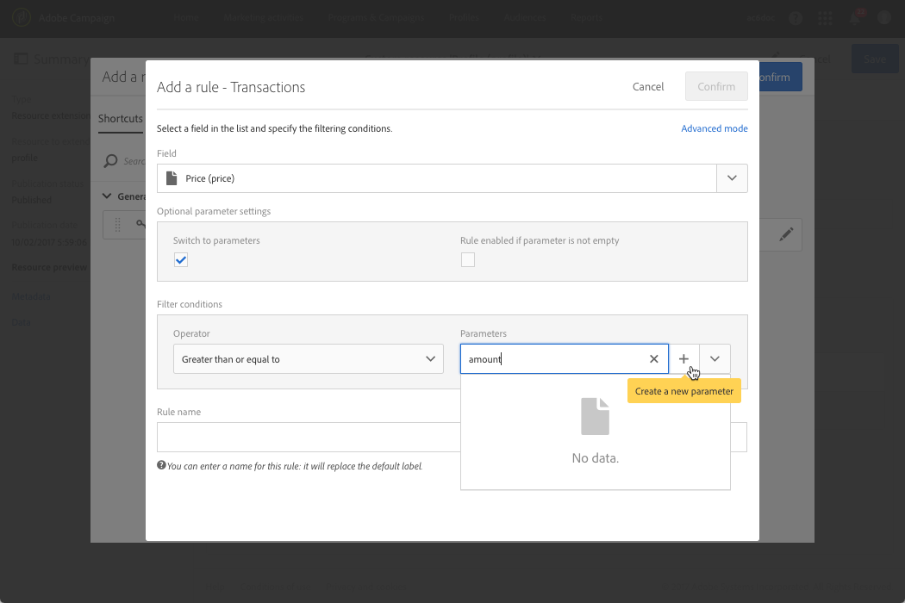

# Configuración de la definición del filtro{#configuring-filter-definition}

En la pestaña **[!UICONTROL Filter definition]**, puede crear filtros avanzados a los que los usuarios pueden acceder directamente al crear consultas complejas, como cuando se define una audiencia.

Este paso no es obligatorio, ya que aún puede rellenar el recurso y acceder a sus datos a través de flujos de trabajo, audiencias y API de REST.

Estos filtros se utilizan en el editor de consultas en forma de reglas preconfiguradas. Permiten limitar el número de pasos necesarios para obtener la configuración deseada, lo que puede resultar especialmente beneficioso para las segmentaciones repetitivas.

Por ejemplo, puede crear un filtro que permita seleccionar todas las transacciones buenas que no sean una determinada cantidad en los últimos tres meses.

Para ello, debe ampliar el recurso **[!UICONTROL Profiles]** y definir un filtro que vincule a una tabla de transacciones (que ha creado anteriormente) con una regla que indique que el precio de transacción debe ser bueno o igual a un parámetro determinado y que la fecha de transacción debe estar dentro de un rango correspondiente a los últimos tres meses.

1. Asegúrese de crear y publicar una tabla de transacciones. Consulte [Creación o ampliación del recurso](../../developing/using/creating-or-extending-the-resource.md).

   >[!NOTE]
   >
   >Este procedimiento utiliza el ejemplo de una tabla de transacciones personalizada. Para su caso, ajústelo a sus necesidades empresariales.

1. Antes de definir un filtro relacionado con la tabla de transacciones del recurso **[!UICONTROL Profiles]**, asegúrese de definir el vínculo a esta tabla y publicar los cambios. Consulte [Definición de vínculos con otros recursos](../../developing/using/configuring-the-resource-s-data-structure.md#defining-links-with-other-resources) y [Actualización de la estructura de la base de datos](../../developing/using/updating-the-database-structure.md).
1. En la pestaña **[!UICONTROL Definition]** de la pantalla de definición del nuevo filtro, seleccione la tabla de transacciones.

   

1. En la ventana **[!UICONTROL Add a rule - Profiles/Transactions]**, arrastre y suelte la tabla de transacciones en el espacio de trabajo. En la siguiente ventana que se muestra, seleccione el campo que desee utilizar.

   

1. En **[!UICONTROL Optional parameter settings]** de la ventana **[!UICONTROL Add a rule - Transactions]**, marque la casilla **[!UICONTROL Switch to parameters]**.

   En **[!UICONTROL Filter conditions]**, seleccione el operador **[!UICONTROL Greater than or equal to]**. En el campo **[!UICONTROL Parameters]**, introduzca un nombre y haga clic en el signo más para crear el nuevo parámetro.

   

1. Confirme los cambios. Esta definición corresponde a un campo configurable que el usuario debe rellenar más tarde para ejecutar la consulta.

   

1. Combine esta regla con otra regla que especifique que la fecha de transacción debe estar dentro de un intervalo correspondiente a los últimos tres meses.

   

1. Elija la categoría en la que se mostrará el filtro.

   

1. En la pestaña **[!UICONTROL Parameters]** de la pantalla de definición del filtro, modifique la descripción y la etiqueta para indicar claramente el asunto del filtro a los usuarios. Esta información aparecerá en el editor de consultas.

   

   Si define varios campos configurables, puede modificar el orden en que aparecen en la interfaz.

1. Guarde los cambios y publique los recursos. Para obtener más información, consulte la sección [Actualización de la estructura de la base de datos](../../developing/using/updating-the-database-structure.md).

Una vez publicada la extensión del recurso **[!UICONTROL Profiles]**, los usuarios verán este filtro en la pestaña de métodos abreviados de la interfaz del [editor de consultas &#x200B;](../../automating/using/editing-queries.md).

Esto permitirá al usuario definir fácilmente su audiencia al crear un correo electrónico para enviarlo a todos los clientes que gastaron más de una determinada cantidad en los últimos tres meses.

En lugar de hacerlo ellos mismos, simplemente tienen que poner la cantidad deseada en el cuadro de diálogo que aparece.

Una vez configurado un filtro, puede utilizarlo desde las API de Campaign Standard con esta sintaxis:

`GET https://mc.adobe.io/<ORGANIZATION>/campaign/profileAndServicesExt/<resourceName>/by<customFilterName>?<customFilterparam>=<customFilterValue>`

Para obtener más información, consulte la [documentación de API de Campaign Standard](../../api/using/filtering.md#custom-filters).
