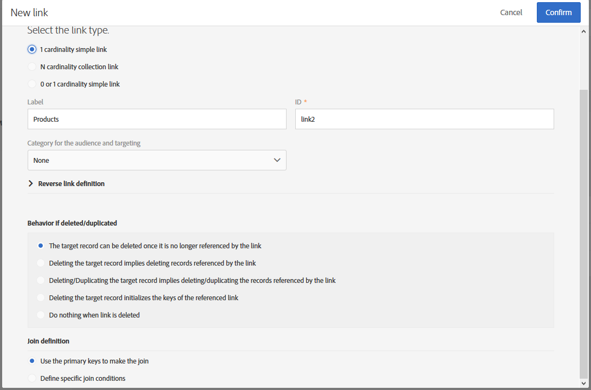
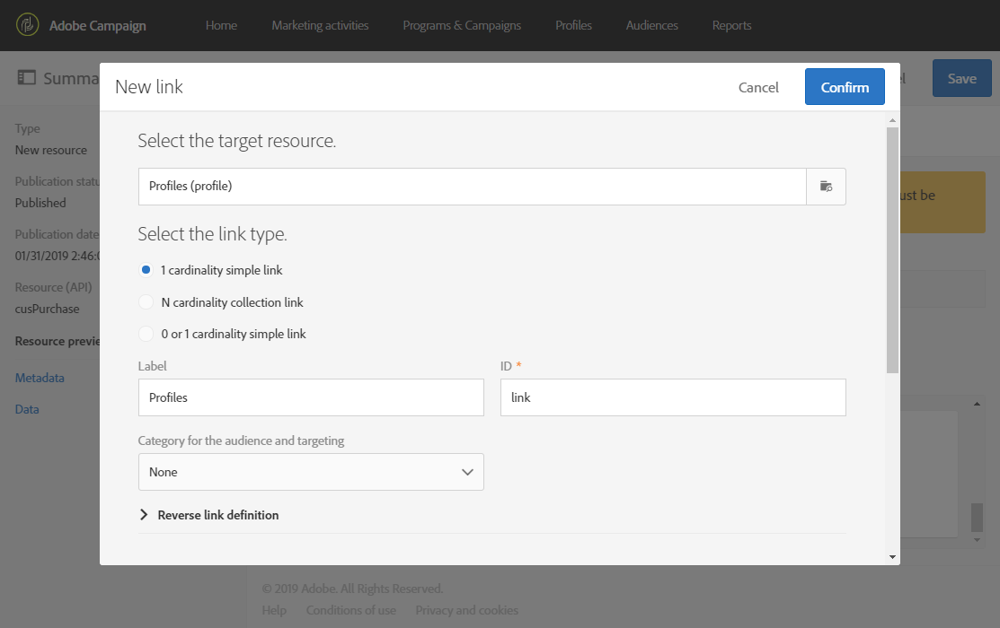
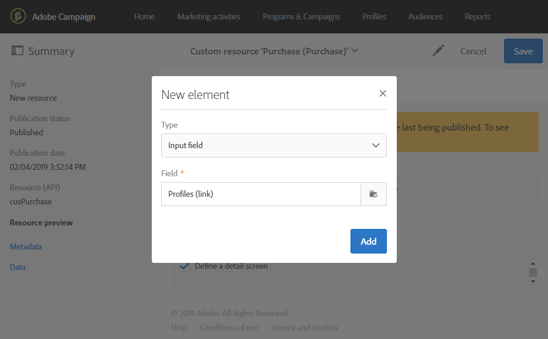
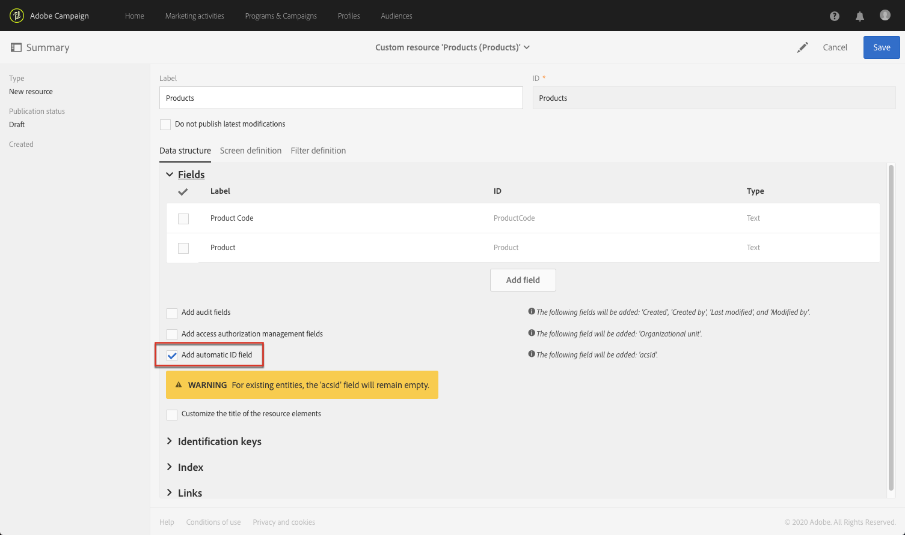

# Configuración de la estructura de datos del recurso{#configuring-the-resource-s-data-structure}

Después de crear un nuevo recurso personalizado, debe configurar la estructura de datos.

Al editar el recurso, en la pestaña **[!UICONTROL Data structure]**, puede añadir:

* [Campos](#adding-fields-to-a-resource)
* [Claves de identificación](#defining-identification-keys)
* [Índices](#defining-indexes)
* [Vínculos](#defining-links-with-other-resources)
* [Envío de registros](#defining-sending-logs-extension)

## Adición de campos a un recurso {#adding-fields-to-a-resource}

Puede añadir nuevos campos a un recurso para almacenar datos que no forman parte del modelo de datos predeterminado.

1. Utilice el botón **[!UICONTROL Create element]** para crear un campo.
1. Especifique una etiqueta, un ID, un tipo de campo y defina la longitud máxima autorizada para este campo.

   El campo **[!UICONTROL ID]** es obligatorio y debe ser único para cada campo añadido.

   >[!NOTE]
   >
   >Utilice un máximo de 30 caracteres.

   

1. Para modificar uno de los campos, marque la opción **[!UICONTROL Edit Properties]**.

   

1. En la pantalla **[!UICONTROL Field definition]**, puede definir una categoría que se utiliza para la audiencia y la segmentación, o incluso añadir una descripción.

   

1. Seleccione la opción **[!UICONTROL Specify a list of authorized values]** si necesita definir los valores que se ofrecen al usuario (valores de lista desglosada).

   A continuación, haga clic en **[!UICONTROL Create element]** y especifique un **[!UICONTROL Label]** y **[!UICONTROL Value]**. Añada tantos valores como sea necesario.

1. Una vez añadidos los campos, marque la casilla **[!UICONTROL Add audit fields]** para incluir campos que detallen la fecha de creación, el usuario que ha creado el recurso, la fecha y el autor de la última modificación.
1. Marque la casilla **[!UICONTROL Add access authorization management fields]** para incluir los campos que indican quién tiene derechos de acceso a ese recurso en particular.

   Estos campos aparecen en los datos y metadatos que se pueden mostrar una vez que se ha realizado la actualización de la base de datos. Para obtener más información, consulte la sección [Actualización de la estructura de la base de datos](../../developing/using/updating-the-database-structure.md).

1. Marque el campo **[!UICONTROL Add automatic ID]** para generar automáticamente un ID. Tenga en cuenta que las entidades existentes permanecerán vacías. Para obtener más información, consulte [Generación de un ID único para perfiles y recursos personalizados](../../developing/using/configuring-the-resource-s-data-structure.md#generating-a-unique-id-for-profiles-and-custom-resources).
1. Para modificar la forma en que aparece el nombre de los elementos de recurso en los pasos de listas y creación, marque la casilla **[!UICONTROL Customize the title of the resource elements]**. Seleccione un campo entre los que ha creado para este recurso.

   

   >[!NOTE]
   >
   >Si no marca esta opción, se utilizará la clave primaria automática (que se crea automáticamente cada vez que se añade una entidad a la tabla) cuando se enumeran todas las entidades de esta tabla.

Los campos del recurso ahora están definidos.

## Definición de claves de identificación {#defining-identification-keys}

Cada recurso debe tener al menos una clave única. Por ejemplo, puede especificar una clave para que dos productos no tengan el mismo ID en una tabla de compra.

1. Especifique el tamaño del almacenamiento en la sección **[!UICONTROL Automatic primary key]** si desea que una clave técnica se genere de forma automática e incremental.

   

1. Utilice el botón **[!UICONTROL Create element]** para crear una clave.

   Los campos **[!UICONTROL Label]** y **[!UICONTROL ID]** se completan de forma predeterminada, pero se pueden editar.

   >[!NOTE]
   >
   >Utilice un máximo de 30 caracteres.

1. Para definir los elementos que componen esta clave, haga clic en **[!UICONTROL Create element]** y seleccione los campos que ha creado para este recurso.

   

   Las claves creadas se muestran en la sección **[!UICONTROL Custom keys]**.

Se han creado las claves de identificación del recurso.

>[!NOTE]
>
>Para conocer las prácticas recomendadas al crear claves de identificación, consulte esta [sección](../../developing/using/data-model-best-practices.md#keys).

## Definición de índices {#defining-indexes}

Un índice puede hacer referencia a uno o varios campos de recursos. Los índices permiten que la base de datos ordene registros para recuperarlos más fácilmente. Optimizan el rendimiento de las consultas SQL.

Se recomienda definir índices, pero no es obligatorio.

1. Utilice el botón **[!UICONTROL Create element]** para crear un índice.

   

1. Los campos **[!UICONTROL Label]** y **[!UICONTROL ID]** se completan de forma predeterminada, pero se pueden editar.

   >[!NOTE]
   >
   >Utilice un máximo de 30 caracteres.

1. Para definir los elementos que componen este índice, seleccione los campos de los que ha creado para este recurso.

   

1. Haga clic en **[!UICONTROL Confirm]**.

Los índices que se han creado aparecen en la lista de la sección **[!UICONTROL Index]**.

>[!NOTE]
>
>Para conocer las prácticas recomendadas al crear índices, consulte esta [sección](../../developing/using/data-model-best-practices.md#indexes).

## Definición de vínculos con otros recursos {#defining-links-with-other-resources}

Un vínculo detalla la asociación que una tabla tiene con otras tablas.

1. Utilice el botón **[!UICONTROL Create element]** para crear un vínculo a un recurso de destino.
1. Haga clic en **[!UICONTROL Select a target resource]**.

   

1. Los recursos se muestran en orden alfabético y se pueden filtrar por nombre. Su nombre técnico se muestra entre corchetes.

   Seleccione un elemento de la lista y haga clic en **[!UICONTROL Confirm]**.

   

1. Seleccione el **[!UICONTROL Link type]** según la cardinalidad. Según el tipo de cardinalidad seleccionado, puede variar el comportamiento si se eliminan o duplican los registros.

   Los distintos tipos de vínculos son los siguientes:

   * **[!UICONTROL 1 cardinality simple link]**: una incidencia de la tabla de origen puede tener como máximo una incidencia correspondiente de la tabla de destino.
   * **[!UICONTROL N cardinality collection link]**: una incidencia de la tabla de origen puede tener varias incidencias correspondientes de la tabla de destino, pero una incidencia de la tabla de destino puede tener como máximo una incidencia correspondiente de la tabla de origen.
   * **[!UICONTROL 0 or 1 cardinality simple link]**: una incidencia de la tabla de origen puede tener como máximo una incidencia correspondiente de la tabla de destino o ninguna. Tenga en cuenta que este tipo de **[!UICONTROL Link type]** puede provocar problemas de rendimiento.

   

1. En la pantalla **[!UICONTROL New link]**, los campos **[!UICONTROL Label]** y **[!UICONTROL ID]** se completan de forma predeterminada, pero puede editarlos.

   >[!NOTE]
   >
   >Utilice un máximo de 30 caracteres.
   >
   >No es posible cambiar el nombre de un vínculo después de crearlo. Para cambiar el nombre de un vínculo, debe eliminarlo y crearlo de nuevo.

1. La lista **[!UICONTROL Category for the audience and targeting]** le permite asignar este vínculo a una categoría para que sea más visible en la herramienta de edición de consultas.
1. Si es necesario, la sección **[!UICONTROL Reverse link definition]** le permite mostrar la etiqueta y el ID del recurso en el recurso de destino.
1. Defina el comportamiento de los registros a los que hace referencia el vínculo en la sección **[!UICONTROL Behavior if deleted/duplicated]**.

   De forma predeterminada, el registro de destino se elimina una vez que el vínculo ya no haga referencia a él.

   

1. En la sección **[!UICONTROL Join definition]**, se selecciona la opción predeterminada **[!UICONTROL Use the primary keys to make the join]**, pero puede elegir entre dos opciones:

   * **[!UICONTROL Use the primary key to make the join]**: esta definición de combinación le permite utilizar la clave primaria de perfiles para reconciliarse con la clave primaria de las compras.
   * **[!UICONTROL Define specific join conditions]**: esta definición de combinación le permite seleccionar manualmente los campos que se unen a ambos recursos. Tenga en cuenta que si los datos no están correctamente configurados, el registro de **compra** no estará visible.

   

Los vínculos creados se muestran en la lista de la sección **[!UICONTROL Links]**.

>[!NOTE]
>
>Para conocer las prácticas recomendadas al crear índices, consulte esta [sección](../../developing/using/data-model-best-practices.md#links).

**Ejemplo: vincular un recurso creado con el recurso “Perfiles”**

En este ejemplo, queremos vincular una nueva **compra** de recursos con el recurso personalizado de **perfiles**:

1. Cree el nuevo recurso de **compra**.
1. Para vincularlo con el recurso personalizado de **perfiles**, despliegue la sección **[!UICONTROL Links]** en la pestaña **[!UICONTROL Data structure]** y haga clic en **[!UICONTROL Create element]**.
1. Seleccione el recurso de destino, aquí **[!UICONTROL Profiles (profile)]**.
1. En este ejemplo, mantenga seleccionado el tipo de vínculo **[!UICONTROL 1 cardinality simple link]** predeterminado.

   

1. Elija una definición de combinación, aquí mantenga el valor predeterminado **[!UICONTROL Use the primary key to make the join]**.

   

1. Si es necesario, puede definir una pantalla de detalles para poder editar la **compra** y vincularla a un perfil.

   Despliegue la sección **[!UICONTROL Detail screen configuration]** y marque la casilla de verificación **[!UICONTROL Define a detail screen]** para configurar la pantalla que corresponde a cada elemento del recurso. Si no marca esta casilla, no se podrá acceder a la vista detallada de los elementos de este recurso.

1. Haga clic en **[!UICONTROL Create element]**.
1. Seleccione el recurso vinculado y haga clic en **[!UICONTROL Add]**.

   El nuevo recurso está ahora disponible en el menú avanzado seleccionando **[!UICONTROL Client data]** > **[!UICONTROL Purchase]**.

   

1. Una vez que haya terminado la configuración, haga clic en **[!UICONTROL Confirm]**.

   Ahora puede publicar el nuevo recurso.

Al añadir este vínculo, se añade una pestaña de **compra** en la pantalla de detalles de perfiles del menú **[!UICONTROL Profiles & audiences]** > **[!UICONTROL Profiles]**. Tenga en cuenta que es algo específico del recurso **[!UICONTROL Profile]**.

## Definición de extensiones de registros de envío {#defining-sending-logs-extension}

La extensión de registros de envío le permite:

* ampliar las funciones de los informes dinámicos **añadiendo campos personalizados de perfil**
* ampliar los datos de registros de envío con **datos de código de segmento y perfil**

**Ampliar con un código de segmento**

El usuario puede ampliar los registros con el código de segmento procedente del motor de flujos de trabajo.

El código de segmento debe definirse en el flujo de trabajo.

Para activar esta extensión, marque la opción **[!UICONTROL Add segment code]**.

Para obtener más información sobre el código de segmento, consulte la sección [Segmentación](../../automating/using/segmentation.md).

**Ampliar con un campo de perfil**

>[!NOTE]
>
>El administrador debería haber ampliado el recurso de perfil con un campo personalizado.

Haga clic en **[!UICONTROL Add field]** y seleccione cualquier campo personalizado del recurso de perfil.

Para generar una nueva subdimensión vinculada a la dimensión del perfil, marque la opción **[!UICONTROL Add this field in Dynamic reporting as a new dimension]**.

Desde el sistema de informes dinámico, puede arrastrar y soltar la dimensión de campo personalizada en una tabla improvisada.

Para obtener más información sobre el sistema de informes dinámico, consulte la [Lista de componentes](../../reporting/using/list-of-components-.md).

>[!IMPORTANT]
>
>El número de campos que se pueden enviar al sistema de informes dinámico está limitado a 20.

## Edición de propiedades de recursos {#editing-resource-properties}

En la pantalla de recursos personalizados, el panel **[!UICONTROL Summary]** indica el estado del recurso recién creado. Puede administrar su acceso y sus propiedades generales.

1. Haga clic en el botón **[!UICONTROL Edit properties]** para añadir una descripción.

   

1. Si es necesario, modifique la etiqueta y el ID del recurso.

   >[!NOTE]
   >
   >Utilice un máximo de 30 caracteres.

1. Si necesita restringir el acceso a este recurso a ciertas unidades organizativas, especifíquelas aquí. Solo los usuarios de unidades autorizadas podrán trabajar con este recurso en la aplicación.
1. Guarde las modificaciones.

Se han guardado las modificaciones. Debe volver a publicar el recurso para aplicarlo.

## Generación de un ID único para perfiles y recursos personalizados {#generating-a-unique-id-for-profiles-and-custom-resources}

De forma predeterminada, los perfiles y los recursos personalizados no tienen un ID empresarial cuando se crean. Puede activar una opción que genere automáticamente un ID único cuando se crean los elementos. Este ID se puede utilizar para:

* Identificar fácilmente los registros exportados en una herramienta externa.
* Reconciliar registros al importar datos actualizados procesados en otra aplicación.

Solo se puede habilitar para perfiles y recursos personalizados.

1. Cree una extensión al recurso de perfiles o cree un nuevo recurso.
1. En la definición de la estructura de datos, marque la opción **[!UICONTROL Add automatic ID field]**, en la sección **[!UICONTROL Fields]**.

   

   >[!NOTE]
   >
   >Solo los registros nuevos tendrán un ID de ACS. El campo **[!UICONTROL ACS ID]** permanece vacío para perfiles o elementos creados antes de activar esta opción.

1. Guarde y publique la modificación realizada en el recurso. Si desea que este mecanismo se aplique a los elementos creados mediante la API, marque la opción para ampliar la API.

El campo **[!UICONTROL ACS ID]** ahora está disponible y se rellena automáticamente cuando se crean nuevos elementos manualmente, desde la API o insertándolos desde un flujo de trabajo de importación. El campo ID de ACS es un campo de ID de usuario único (UUID) y está indexado.

Al exportar perfiles o recursos personalizados, ahora puede añadir la columna **[!UICONTROL ACS ID]** si se ha habilitado para ese recurso. Puede reutilizar este ID en las herramientas externas para identificar registros.

Al volver a importar datos que se han procesado o actualizado en otra aplicación (por ejemplo, un CRM), puede reconciliarlos fácilmente con este ID único.

>[!NOTE]
>
>El campo **[!UICONTROL ACS ID]** no se actualiza para perfiles o elementos creados antes de activar la opción. Solo los registros nuevos tendrán un ID de ACS.
>
>Este campo está en modo de solo lectura. No se puede modificar.
