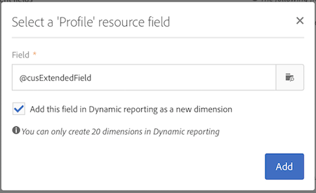

# Configuración de la estructura de datos del recurso{#configuring-the-resource-s-data-structure}

Después de crear un nuevo recurso personalizado, debe configurar la estructura de datos.

Al editar el recurso, en la **[!UICONTROL Data structure]** ficha, puede agregar:

* [Campos](#adding-fields-to-a-resource)
* [Claves de identificación](#defining-identification-keys)
* [Índices](#defining-indexes)
* [Vínculos](#defining-links-with-other-resources)
* [Envío de registros](#defining-sending-logs-extension)

## Adición de campos a un recurso {#adding-fields-to-a-resource}

Puede agregar nuevos campos a un recurso para almacenar datos que no forman parte del modelo de datos predeterminado.

1. Utilice el **[!UICONTROL Create element]** botón para crear un campo.
1. Especifique una etiqueta, un ID, un tipo de campo y defina la longitud máxima autorizada para este campo.

   El **[!UICONTROL ID]** campo es obligatorio y debe ser único para cada campo agregado.

   >[!NOTE]
   >
   >Si deja el **[!UICONTROL Label]** campo vacío, se completará automáticamente a partir del ID.
   >Se recomienda utilizar un máximo de 30 caracteres.

   

1. Para modificar uno de los campos, marque el **[!UICONTROL Edit Properties]** botón.

   

1. En la **[!UICONTROL Field definition]** pantalla, puede definir una categoría que se utilizará para la audiencia y el objetivo, o incluso agregar una descripción.

   

1. Seleccione la **[!UICONTROL Specify a list of authorized values]** opción si necesita definir los valores que se ofrecerán al usuario (valores de enumeración).

   A continuación, haga clic en **[!UICONTROL Create element]** y especifique un **[!UICONTROL Label]** y **[!UICONTROL Value]**. Agregue tantos valores como sea necesario.

1. Una vez agregados los campos, marque la **[!UICONTROL Add audit fields]** casilla para incluir campos que detallen la fecha de creación, el usuario que creó el recurso, la fecha y el autor de la última modificación.
1. Marque la **[!UICONTROL Add access authorization management fields]** casilla para incluir los campos que indican quién tiene derechos de acceso a ese recurso en particular.

   Estos campos aparecen en los datos y metadatos que se pueden mostrar una vez que se ha realizado la actualización de la base de datos. Para obtener más información sobre esto, consulte la sección [Actualización de la estructura](../../developing/using/updating-the-database-structure.md) de la base de datos.

1. Marque el **[!UICONTROL Add automatic ID]** campo para generar automáticamente un ID. Tenga en cuenta que las entidades existentes permanecerán vacías.
1. Para modificar la forma en que el nombre de los elementos de recursos aparecerá en las listas y en los pasos de creación, marque la **[!UICONTROL Personalize the resource title]** casilla. Seleccione un campo entre los que ha creado para este recurso.

   

Los campos del recurso ahora están definidos.

## Definición de claves de identificación {#defining-identification-keys}

Cada recurso debe tener al menos una clave única. Por ejemplo, puede especificar una clave para que dos productos no tengan la misma ID en una tabla de compra.

1. Especifique el tamaño del almacenamiento en la **[!UICONTROL Automatic primary key]** sección si desea que una clave técnica se genere de forma automática e incremental.

   

1. Utilice el **[!UICONTROL Create element]** botón para crear una tecla.

   Los campos **[!UICONTROL Label]** y **[!UICONTROL ID]** se completan de forma predeterminada, pero se pueden editar.

   >[!NOTE]
   >
   >Se recomienda utilizar un máximo de 30 caracteres.

1. Para definir los elementos que componen esta clave, haga clic en **[!UICONTROL Create element]** y seleccione los campos que ha creado para este recurso.

   

   Las claves creadas se muestran en la **[!UICONTROL Custom keys]** sección .

Se han creado las claves de identificación del recurso.

## Definición de índices {#defining-indexes}

Un índice puede hacer referencia a uno o varios campos de recursos. Los índices permiten que la base de datos ordene registros para recuperarlos más fácilmente. Optimizan el rendimiento de las consultas SQL.

Se recomienda definir índices, pero no es obligatorio.

1. Utilice el **[!UICONTROL Create element]** botón para crear un índice.

   

1. Los campos **[!UICONTROL Label]** y **[!UICONTROL ID]** se completan de forma predeterminada, pero se pueden editar.

   >[!NOTE]
   >
   >Se recomienda utilizar un máximo de 30 caracteres.

1. Para definir los elementos que componen este índice, seleccione los campos de los que ha creado para este recurso.

   

1. Click **[!UICONTROL Confirm]**.

Los índices que se crearon aparecen en la lista de la **[!UICONTROL Index]** sección.

## Definición de vínculos con otros recursos {#defining-links-with-other-resources}

Un vínculo detalla la asociación que una tabla tiene con otras tablas.

1. Utilice el **[!UICONTROL Create element]** botón para crear un vínculo a un recurso de destino.
1. Click **[!UICONTROL Select a target resource]**.

   

1. Los recursos se muestran en orden alfabético y se pueden filtrar por nombre. Su nombre técnico aparece entre paréntesis.

   Seleccione un elemento de la lista y haga clic en **[!UICONTROL Confirm]**.

   

1. Seleccione el **[!UICONTROL Link type]** según la cardinalidad. Según el tipo de cardinalidad seleccionado, el comportamiento si se eliminan o duplican los registros puede variar.

   Los distintos tipos de vínculos son los siguientes:

   * **[!UICONTROL 1 cardinality simple link]**:: una incidencia de la tabla de origen puede tener como máximo una incidencia correspondiente de la tabla de destino.
   * **[!UICONTROL N cardinality collection link]**:: una incidencia de la tabla de origen puede tener varias incidencias correspondientes de la tabla de destino, pero una incidencia de la tabla de destino puede tener como máximo una incidencia correspondiente de la tabla de origen.
   * **[!UICONTROL 0 or 1 cardinality simple link]**:: una incidencia de la tabla de origen puede tener como máximo una incidencia correspondiente de la tabla de destino o ninguna. Tenga en cuenta que este tipo de **[!UICONTROL Link type]** problema puede provocar problemas de rendimiento.
   

1. En la **[!UICONTROL New link]** pantalla, los campos **[!UICONTROL Label]** y **[!UICONTROL ID]** se completan de forma predeterminada, pero puede editarlos.

   >[!NOTE]
   >
   >Se recomienda utilizar un máximo de 30 caracteres.

   >[!CAUTION]
   >
   >No es posible cambiar el nombre de un vínculo después de crearlo. Para cambiar el nombre de un vínculo, debe eliminarlo y crearlo de nuevo.

1. La **[!UICONTROL Category for the audience and targeting]** lista permite asignar este vínculo a una categoría para que sea más visible en la herramienta de edición de consultas.
1. Si es necesario, la **[!UICONTROL Reverse link definition]** sección le permite mostrar la etiqueta y la ID del recurso en el recurso de destino.
1. Defina el comportamiento de los registros a los que hace referencia el vínculo en la **[!UICONTROL Behavior if deleted/duplicated]** sección.

   De forma predeterminada, el registro de destino se eliminará una vez que el vínculo ya no haga referencia a él.

   

1. En la **[!UICONTROL Join definition]** sección, se selecciona la **[!UICONTROL Use the primary keys to make the join]** opción predeterminada, pero puede elegir entre dos opciones:

   * **[!UICONTROL Use the primary key to make the join]**:: Esta definición de combinación le permite utilizar la clave principal de perfiles para reconciliarse con la clave principal de las compras.
   * **[!UICONTROL Define specific join conditions]**:: Esta definición de combinación le permite seleccionar manualmente los campos que se unirán a ambos recursos. Tenga en cuenta que si los datos no están correctamente configurados, el registro de **compra** no estará visible.
   

Los vínculos creados se muestran en la lista de la **[!UICONTROL Links]** sección.

**Ejemplo: Vincular un recurso creado con el recurso 'Perfiles'**

En este ejemplo, queremos vincular una nueva **compra** de recursos con el recurso personalizado **Perfiles** :

1. Cree el nuevo recurso **de compra** .
1. Para vincularlo con el recurso personalizado **Perfiles** , despliegue la **[!UICONTROL Links]** sección en la **[!UICONTROL Data structure]** ficha y haga clic en **[!UICONTROL Create element]**.
1. Seleccione el recurso de destino aquí **[!UICONTROL Profiles (profile)]**.
1. En este ejemplo, mantenga seleccionado el tipo de **[!UICONTROL 1 cardinality simple link]** vínculo predeterminado.

   

1. Elija una definición de combinación, aquí mantenga el valor predeterminado **[!UICONTROL Use the primary key to make the join]**.

   

1. Si es necesario, puede definir una pantalla de detalles para poder editar la **compra** y vincularla a un perfil.

   Despliegue la **[!UICONTROL Detail screen configuration]** sección y marque la casilla de verificación **[!UICONTROL Define a detail screen]** para configurar la pantalla que corresponde a cada elemento del recurso. Si no marca esta casilla, no se podrá acceder a la vista de detalles de los elementos de este recurso.

1. Click **[!UICONTROL Create element]**.
1. Seleccione el recurso vinculado y haga clic en **[!UICONTROL Add]**.

   El nuevo recurso estará disponible en el menú avanzado seleccionando **[!UICONTROL Client data]** &gt; **[!UICONTROL Purchase]**.

   

1. Una vez que haya terminado la configuración, haga clic en **[!UICONTROL Confirm]**.

   Ahora puede publicar su nuevo recurso.

Al agregar este vínculo, se agrega una ficha **Compra** a la pantalla de detalles del perfil en el menú **[!UICONTROL Profiles & audiences]** &gt; **[!UICONTROL Profiles]** . Tenga en cuenta que esto es específico del **[!UICONTROL Profile]** recurso.

## Definición de la extensión de registros de envío {#defining-sending-logs-extension}

La extensión de registro de envío permite:

* ampliar las capacidades de los informes dinámicos **agregando campos personalizados de perfil**
* para ampliar los datos de registro de envío con el código de **segmento y los datos de perfil**

**Ampliar con un código de segmento**

El usuario puede ampliar los registros con el código de segmento proveniente del motor de flujo de trabajo.

El código de segmento debe definirse en el flujo de trabajo.

Para activar esta extensión, marque la opción **[!UICONTROL Add segment code]**.

Para obtener más información sobre el código de segmento, consulte la sección [Segmentación](../../automating/using/segmentation.md) .

**Ampliar con un campo de perfil**

>[!NOTE]
>
>El administrador debería haber ampliado el recurso Perfil con un campo personalizado.

Haga clic **[!UICONTROL Add field]** y seleccione cualquier campo personalizado del recurso de perfil.

Para generar una nueva subdimensión vinculada a la dimensión Perfil, marque la **[!UICONTROL Add this field in Dynamic reporting as a new dimension]** opción.

En Informes dinámicos, puede arrastrar y soltar la dimensión de campo personalizado en una tabla improvisada.

Para obtener más información sobre los informes dinámicos, consulte la [Lista de componentes](../../reporting/using/list-of-components-.md).

>[!CAUTION]
>
>El número de campos enviados a Informes dinámicos está limitado a 20.

## Edición de propiedades de recursos {#editing-resource-properties}

En la pantalla de recursos personalizados, el **[!UICONTROL Summary]** panel indica el estado del recurso recién creado. Puede administrar su acceso y sus propiedades generales.

1. Haga clic en el **[!UICONTROL Edit properties]** botón para agregar una descripción.

   

1. Si es necesario, modifique la etiqueta y la ID del recurso.

   >[!NOTE]
   >
   >Se recomienda utilizar un máximo de 30 caracteres.

1. Si necesita restringir el acceso a este recurso a ciertas unidades organizativas, especifíquelas aquí. Solo los usuarios de unidades autorizadas podrán trabajar con este recurso en la aplicación.
1. Guarde las modificaciones.

Se guardarán las modificaciones. Debe volver a publicar el recurso para aplicarlo.

## Generación de un ID único para perfiles y recursos personalizados {#generating-a-unique-id-for-profiles-and-custom-resources}

De forma predeterminada, los perfiles y los recursos personalizados no tienen un ID de negocio cuando se crean. Puede activar una opción que genere automáticamente un ID único cuando se crean los elementos. Esta ID se puede utilizar para:

* Identifique fácilmente los registros exportados en una herramienta externa.
* Reconciliar registros al importar datos actualizados procesados en otra aplicación.

Solo se puede habilitar para perfiles y recursos personalizados.

1. Cree una extensión al recurso de perfiles o cree un nuevo recurso.
1. En la definición de la estructura de datos, marque la **[!UICONTROL Add automatic ID field]** opción, en la **[!UICONTROL Fields]** sección .
1. Guarde y publique la modificación realizada en el recurso. Si desea que este mecanismo se aplique a elementos creados mediante la API, marque la opción para ampliar la API.

El **[!UICONTROL ACS ID]** campo ahora está disponible y se rellena automáticamente cuando se crean nuevos elementos manualmente, desde la API o se insertan desde un flujo de trabajo de importación. El campo ACS ID es un campo UUID y está indizado.

Al exportar perfiles o recursos personalizados, ahora puede agregar la **[!UICONTROL ACS ID]** columna si se ha habilitado para ese recurso. Puede reutilizar este ID en las herramientas externas para identificar registros.

Al volver a importar datos que se han procesado o actualizado en otra aplicación (por ejemplo, un CRM), puede conciliarlos fácilmente con este ID único.

>[!NOTE]
>
>El **[!UICONTROL ACS ID]** campo no se actualiza para perfiles o elementos creados antes de activar la opción. Sólo los registros nuevos tendrán un ID de ACS. Este campo está en modo de solo lectura. No se puede modificar.

