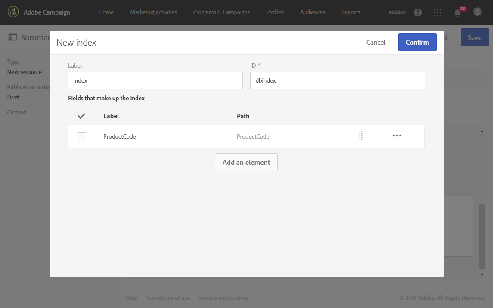
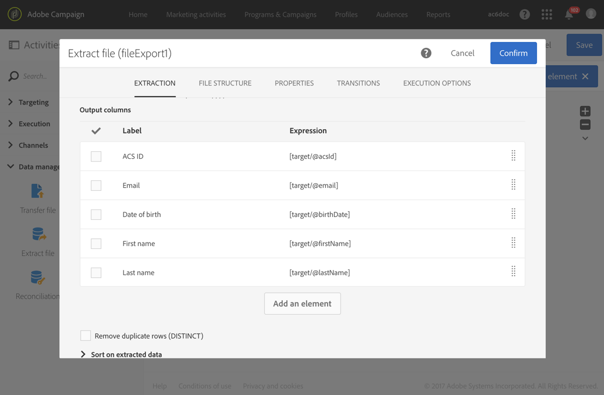

# Configuring the resource's data structure{#configuring-the-resource-s-data-structure}

Después de crear un nuevo recurso personalizado, debe configurar la estructura de datos.

When editing the resource, in the **[!UICONTROL Data structure]** tab, you can add:

* [Campos](../../developing/using/configuring-the-resource-s-data-structure.md#adding-fields-to-a-resource)
* [Claves de identificación](../../developing/using/configuring-the-resource-s-data-structure.md#defining-identification-keys)
* [Índices](../../developing/using/configuring-the-resource-s-data-structure.md#defining-indexes)
* [Vínculos](../../developing/using/configuring-the-resource-s-data-structure.md#defining-links-with-other-resources)
* [Envío de registros](../../developing/using/configuring-the-resource-s-data-structure.md#defining-sending-logs-extension)

## Adding fields to a resource {#adding-fields-to-a-resource}

Puede agregar campos nuevos a un recurso para almacenar datos que no forman parte del modelo de datos de cuadro.

1. Use the **[!UICONTROL Create element]** button to create a field.
1. Especifique una etiqueta, un ID, un tipo de campo y defina la longitud máxima autorizada para este campo.

   **[!UICONTROL ID]** El campo es obligatorio y debe ser único para cada campo agregado.

   >[!NOTE]
   >
   >If you leave the **[!UICONTROL Label]** field empty, it will automatically be completed from the ID.

   

1. To modify one of the fields, check the **[!UICONTROL Edit Properties]** button.

   

1. In the **[!UICONTROL Field definition]** screen, you can define a category that will be used for the audience and targeting, or even add a description.

   

1. Check the **[!UICONTROL Specify a list of authorized values]** option if you need to define values that will be offered to the user (enumeration values).

   Then, click **[!UICONTROL Create element]** and specify a **[!UICONTROL Label]** and **[!UICONTROL Value]**. Añada tantos valores como sea necesario.

1. Once you have added your fields, check the **[!UICONTROL Add audit fields]** box to include fields detailing the creation date, the user that created the resource, the date, and the author of the last modification.
1. Check the **[!UICONTROL Add access authorization management fields]** box to include the fields stating who has access rights to that particular resource.

   Estos campos aparecen en los datos y los metadatos que se pueden mostrar una vez completada la actualización de la base de datos. For more on this, refer to the [Updating the database structure](../../developing/using/updating-the-database-structure.md) section.

1. Check the **[!UICONTROL Add automatic ID]** field to automatically generate an ID. Tenga en cuenta que las entidades existentes permanecerán vacías.
1. To modify the way in which the name of the resource elements will appear in the lists and creation steps, check the **[!UICONTROL Personalize the resource title]** box. Seleccione un campo de los que ha creado para este recurso.

   

Ahora se definen los campos de su recurso.

## Defining identification keys {#defining-identification-keys}

Cada recurso debe tener al menos una clave única. Por ejemplo, puede especificar una clave para que dos productos no puedan tener el mismo ID en una tabla de compra.

1. Specify it in the **[!UICONTROL Automatic primary key]** section the size for the storage if you would like to have a technical key automatically and incrementally generated.

   

1. Use the **[!UICONTROL Create element]** button to create a key.

   The **[!UICONTROL Label]** and **[!UICONTROL ID]** fields are completed by default, but you can be edited.

1. To define the elements making up this key, click **[!UICONTROL Create element]** and select the fields that you created for this resource.

   

   Created keys are displayed in the **[!UICONTROL Custom keys]** section.

Ahora se crean las claves de identificación para el recurso.

## Defining indexes {#defining-indexes}

Un índice puede hacer referencia a uno o varios campos de recurso. Los índices permiten que la base de datos ordene los registros para recuperarlos más fácilmente. Optimizan el rendimiento de las consultas SQL.

Se recomienda definir índices, pero no es obligatorio.

1. Use the **[!UICONTROL Create element]** button to create an index.

   

1. The **[!UICONTROL Label]** and **[!UICONTROL ID]** fields are completed by default, but you can edit them.
1. Para definir los elementos que conforman este índice, seleccione los campos de los que haya creado para este recurso.

   

1. Click **[!UICONTROL Confirm]**.

The indexes that were created appear in the list in the **[!UICONTROL Index]** section.

## Defining links with other resources {#defining-links-with-other-resources}

Un vínculo detalla la asociación que una tabla tiene con otras tablas.

1. Use the **[!UICONTROL Create element]** button to create a link to a target resource.
1. Click **[!UICONTROL Select a target resource]**.

   

1. Los recursos se muestran en orden alfabético y se pueden filtrar por nombre. Su nombre técnico se muestra entre corchetes.

   Select an element from the list and click **[!UICONTROL Confirm]**.

   

1. Select the **[!UICONTROL Link type]** according to cardinality. Según el tipo de cardinalidad seleccionado, el comportamiento si los registros se eliminan o se duplican pueden variar.

   Los diversos tipos de vínculos son los siguientes:

   * **[!UICONTROL 1 cardinality simple link]**: una incidencia de la tabla de origen puede tener como máximo una incidencia correspondiente de la tabla de destino.
   * **[!UICONTROL N cardinality collection link]**: una incidencia de la tabla de origen puede tener varias incidencias correspondientes de la tabla de destino, pero una incidencia de la tabla de destino puede tener como máximo una incidencia correspondiente de la tabla de origen.
   * **[!UICONTROL 0 or 1 cardinality simple link]**: una incidencia de la tabla de origen puede tener como máximo una incidencia correspondiente de la tabla de destino o ninguno. Note that this kind of **[!UICONTROL Link type]** can cause performance issue.
   

1. In the **[!UICONTROL New link]** screen, the **[!UICONTROL Label]** and **[!UICONTROL ID]** fields are completed by default, but you can edit them.

   >[!CAUTION]
   >
   >No es posible cambiar el nombre de un vínculo después de crearlo. Para cambiar el nombre de un vínculo, debe eliminarlo y crearlo de nuevo.

1. The **[!UICONTROL Category for the audience and targeting]** list allows you to assign this link to a category making it more visible in the query editor tool.
1. If needed, the **[!UICONTROL Reverse link definition]** section allows you to display the label and ID of the resource in the targeted resource.
1. Define the behavior of the records referenced by the link in the **[!UICONTROL Behavior if deleted/duplicated]** section.

   De forma predeterminada, el registro de destino se eliminará una vez que el vínculo deje de hacer referencia a él.

   

1. In the **[!UICONTROL Join definition]** section, the default **[!UICONTROL Use the primary keys to make the join]** option is selected but you can choose between two options:

   * **[!UICONTROL Use the primary key to make the join]**: Esta definición de unión permite utilizar la clave principal de perfiles para reconciliarla con la clave principal de las compras.
   * **[!UICONTROL Define specific join conditions]**: Esta definición de unión permite seleccionar manualmente los campos que se unirán a ambos recursos. Please note that if data are not correctly configured, the **Purchase** record will not be visible.
   

The links created are displayed in the list in the **[!UICONTROL Links]** section.

**Ejemplo: Vinculación de un recurso creado con el recurso'Perfiles '**

In this example, we want to link a new resource **Purchase** with the **Profiles **custom resource:

1. Create your new **Purchase** resource.
1. To link it with the **Profiles** custom resource, unfold the **[!UICONTROL Links]** section in the **[!UICONTROL Data structure]** tab and click **[!UICONTROL Create element]**.
1. Select the target resource, here **[!UICONTROL Profiles (profile)]**.
1. In this example, keep the default **[!UICONTROL 1 cardinality simple link]** Link type selected.

   

1. Choose a join definition, here keep the default **[!UICONTROL Use the primary key to make the join]**.

   

1. If needed, you can define a detail screen to be able to edit **Purchase** and link it to a profile.

   Unfold the **[!UICONTROL Detail screen configuration]** section and check the **[!UICONTROL Define a detail screen]** to configure the screen that corresponds to each element of the resource. Si no marca esta casilla, la vista de detalles de los elementos de este recurso no será accesible.

1. Click **[!UICONTROL Create element]**.
1. Select your linked resource and click **[!UICONTROL Add]**.

   Your new resource will then be available in the advanced menu by selecting **[!UICONTROL Client data]** &gt; **[!UICONTROL Purchase]**.

   

1. Once your configuration is done, click **[!UICONTROL Confirm]**.

   Ahora puede publicar su nuevo recurso.

By adding this link, a **Purchase** tab is added to the profiles detail screen from the **[!UICONTROL Profiles & audiences]** &gt; **[!UICONTROL Profiles]** menu. Please note that this is specific to the **[!UICONTROL Profile]** resource.

## Defining sending logs extension {#defining-sending-logs-extension}

La extensión de registro que envía le permite:

* to extend dynamic report capabilities by **adding profile custom fields**
* to extend the sending logs data with **segment code and profile data**

**Extender con un código de segmento**

El usuario puede ampliar los registros con el código de segmento procedente del motor de flujo de trabajo.

El código de segmento debe definirse en el flujo de trabajo.

To activate this extension, check the option **[!UICONTROL Add segment code]**.

For more information on segment code, refer to the [Segmentation](../../automating/using/segmentation.md) section.

**Ampliar con un campo de perfil**

>[!NOTE]
>
>El administrador debería haber ampliado el recurso de perfil con un campo personalizado.

Click **[!UICONTROL Add field]** and select any custom field from the profile resource.

In order to generate a new sub-dimension linked to the Profile dimension, check the **[!UICONTROL Add this field in Dynamic reporting as a new dimension]** option.

En Informes dinámicos, puede arrastrar y soltar la dimensión del campo personalizado en una tabla improvisada.

For more information on Dynamic Reporting, refer to the [List of components](../../reporting/using/list-of-components-.md).

>[!CAUTION]
>
>El número de campos enviados a Informes dinámicos está limitado a 20.

## Editing resource properties {#editing-resource-properties}

In the custom resource screen, the **[!UICONTROL Summary]** pane indicates the status of the newly created resource. Puede administrar su acceso y sus propiedades generales.

1. Click the **[!UICONTROL Edit properties]** button to add a description.

   

1. Si es necesario, modifique la etiqueta y el ID del recurso.
1. Si necesita restringir el acceso a este recurso a ciertas unidades de organización, indíquelas aquí. Solo los usuarios de las unidades autorizadas podrán trabajar con este recurso en la aplicación.
1. Guarde las modificaciones.

Se guardarán las modificaciones. Debe publicar el recurso de nuevo para aplicarlo.

## Generating a unique ID for profiles and custom resources {#generating-a-unique-id-for-profiles-and-custom-resources}

De forma predeterminada, los perfiles y recursos personalizados no tienen ID de empresa cuando se crean. Puede habilitar una opción que genere automáticamente un ID único cuando se crean elementos. Este ID se puede utilizar para:

* Identifique los registros exportados fácilmente en una herramienta externa.
* Concilie los registros al importar datos actualizados procesados en otra aplicación.

Solo se puede habilitar para perfiles y recursos personalizados.

1. Cree una extensión al recurso de perfiles o cree un nuevo recurso.
1. In the data structure definition, check the **[!UICONTROL Add automatic ID field]** option, under the **[!UICONTROL Fields]** section.
1. Guarde y publique la modificación realizada en el recurso. Si desea que este mecanismo se aplique a los elementos creados mediante la API, marque la opción para ampliar la API.

**[!UICONTROL ACS ID]** El campo ya está disponible y se llena automáticamente cuando se crean nuevos elementos manualmente, desde la API o insertados desde un flujo de trabajo de importación. El campo ID de ACS es un campo UUID y se indexa.

When exporting profiles or custom resources, you can now add the **[!UICONTROL ACS ID]** column if it has been enabled for that resource. Puede reutilizar este ID en las herramientas externas para identificar registros.

Al volver a importar los datos procesados/actualizados en otra aplicación (por ejemplo, CRM), puede conciliarlos fácilmente con este ID exclusivo.

>[!NOTE]
>
>The **[!UICONTROL ACS ID]** field is not updated for profiles or elements created before activating the option. Solo los registros nuevos tendrán un ID ACS. Este campo se encuentra en modo de solo lectura. No se puede modificar.

